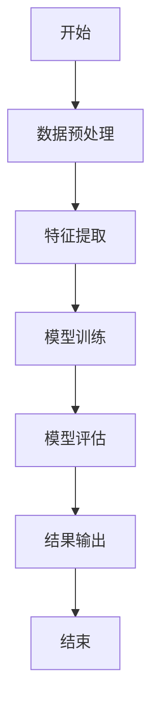

                 


# AI 代理辅助价值投资者解读复杂的财务脚注

## 关键词：AI代理，价值投资，财务脚注，自然语言处理，机器学习

## 摘要：本文探讨了如何利用AI代理辅助价值投资者解读复杂的财务脚注。文章首先介绍了价值投资和AI代理的基本概念，分析了AI代理在价值投资中的应用前景。随后，深入讲解了AI代理的核心原理，包括机器学习算法、自然语言处理技术等。接着，详细探讨了财务报表与脚注的分析，以及AI代理在解析这些复杂数据中的优势和挑战。最后，通过实际案例展示了AI代理在价值投资中的应用，帮助投资者更高效地解读财务信息。

---

# 第1章: AI 代理与价值投资的背景

## 1.1 价值投资的基本概念

### 1.1.1 价值投资的定义与核心理念
价值投资是一种投资策略，强调以低于其内在价值的价格购买优质资产。其核心理念是寻找市场低估的公司，并长期持有这些资产，等待其价值回归。这一策略强调对公司基本面的深入分析，包括财务报表、行业地位、竞争优势等。

### 1.1.2 价值投资的核心要素
- **财务报表分析**：通过分析资产负债表、利润表和现金流量表，评估公司的财务健康状况。
- **竞争优势分析**：识别公司在行业中的竞争优势，如成本优势、品牌影响力等。
- **管理层能力**：评估公司管理层的诚信和能力，确保其能够有效管理和发展公司。

### 1.1.3 价值投资的边界与外延
价值投资不仅仅关注财务数据，还涉及对公司战略、行业趋势和宏观经济环境的分析。其外延包括风险控制、投资组合管理和长期价值创造。

## 1.2 AI 代理的基本概念

### 1.2.1 AI 代理的定义与特点
AI代理（Artificial Intelligence Agent）是指具有感知环境、做出决策并采取行动的智能实体。其特点包括自主性、反应性、目标导向和学习能力。

### 1.2.2 AI 代理的核心要素
- **感知能力**：通过传感器或数据输入，感知外部环境。
- **决策能力**：基于感知的信息，利用算法做出决策。
- **行动能力**：根据决策结果，采取相应的行动。
- **学习能力**：通过反馈不断优化自身的决策和行为。

### 1.2.3 AI 代理与传统数据分析的区别
AI代理不仅仅是数据分析工具，它能够自主决策、学习和适应环境。与传统数据分析相比，AI代理更加智能化和自动化，能够在复杂环境中处理不确定性和模糊信息。

## 1.3 AI 代理在价值投资中的应用前景

### 1.3.1 价值投资中的数据处理需求
价值投资需要处理大量非结构化数据，如财务报告、新闻文章、行业报告等。这些数据往往复杂且分散，传统的数据分析方法难以高效处理。

### 1.3.2 AI 代理在数据解读中的优势
AI代理能够快速处理大量非结构化数据，通过自然语言处理技术提取关键信息，帮助投资者识别潜在的价值机会。

### 1.3.3 AI 代理在价值投资中的潜在挑战
AI代理依赖于数据质量和算法的准确性。如果数据不完整或算法存在偏差，可能导致错误的决策。

## 1.4 本章小结
本章介绍了价值投资和AI代理的基本概念，并分析了AI代理在价值投资中的应用前景。通过对比传统数据分析和AI代理的优势与挑战，为后续章节奠定了基础。

---

# 第2章: AI 代理的核心原理

## 2.1 AI 代理的核心算法

### 2.1.1 机器学习算法概述
机器学习算法是AI代理的核心，包括监督学习、无监督学习和强化学习。监督学习通过标记数据进行训练，无监督学习通过发现数据中的模式，强化学习通过与环境互动进行学习。

### 2.1.2 自然语言处理算法
自然语言处理（NLP）算法用于处理文本数据，包括分词、句法分析、实体识别和文本摘要。这些技术帮助AI代理从财务报告中提取关键信息。

### 2.1.3 强化学习算法
强化学习算法通过试错机制优化决策，适用于动态环境中的复杂问题。在价值投资中，强化学习可用于优化投资组合和风险控制。

## 2.2 AI 代理的模型构建

### 2.2.1 数据预处理与特征提取
数据预处理包括清洗、转换和标准化。特征提取是从数据中提取关键特征，如财务比率、行业趋势等。

### 2.2.2 模型训练与优化
使用训练数据训练模型，通过交叉验证和超参数调优优化模型性能。

### 2.2.3 模型评估与调优
通过测试数据评估模型的准确性和鲁棒性，进一步优化模型结构和参数。

## 2.3 AI 代理的自然语言处理技术

### 2.3.1 分词与句法分析
分词将文本分割成词语，句法分析确定词语之间的关系。

### 2.3.2 实体识别与关系抽取
实体识别识别文本中的关键实体，关系抽取确定实体之间的关系。

### 2.3.3 文本摘要与关键词提取
文本摘要生成文本的简要总结，关键词提取识别文本中的关键信息。

## 2.4 本章小结
本章详细介绍了AI代理的核心算法和自然语言处理技术，为后续章节的系统设计和应用打下了理论基础。

---

# 第3章: 财务报表与脚注分析

## 3.1 财务报表的基本结构

### 3.1.1 资产负债表
资产负债表反映公司在某一特定时点的财务状况，包括资产、负债和所有者权益。

### 3.1.2 利润表
利润表反映公司在一定会计期间的经营成果，包括收入、成本和利润。

### 3.1.3 现金流量表
现金流量表反映公司在一定会计期间的现金流入和流出情况，包括经营活动、投资活动和筹资活动。

## 3.2 财务脚注的核心内容

### 3.2.1 会计政策与估计
会计政策是指公司在会计处理中采用的政策和方法，会计估计是对未来事项的估计。

### 3.2.2 或有事项与承诺
或有事项是指可能影响公司财务状况的事项，承诺是指公司未来可能履行的义务。

### 3.2.3 关联方交易与重大事项
关联方交易是指公司与关联方之间的交易，重大事项是指可能对公司的财务状况产生重大影响的事件。

## 3.3 财务脚注的复杂性与挑战

### 3.3.1 财务术语的复杂性
财务术语往往具有专业性和复杂性，需要投资者具备一定的财务知识。

### 3.3.2 数据的不完整与不确定性
财务数据可能存在不完整或不确定的情况，影响分析结果。

### 3.3.3 跨领域知识的综合运用
财务分析需要综合运用会计、法律、经济等多领域的知识。

## 3.4 本章小结
本章介绍了财务报表的基本结构和脚注的核心内容，分析了财务脚注的复杂性与挑战，为后续章节的系统设计和应用提供了背景信息。

---

# 第4章: AI 代理辅助财务脚注分析的系统设计

## 4.1 系统功能需求分析

### 4.1.1 数据采集模块
数据采集模块负责从多种来源采集财务数据，包括公司财报、新闻等。

### 4.1.2 数据处理模块
数据处理模块对采集的数据进行清洗、转换和标准化，提取关键特征。

### 4.1.3 数据分析模块
数据分析模块利用机器学习算法和自然语言处理技术，对数据进行分析和解读。

## 4.2 系统架构设计

### 4.2.1 分层架构设计
系统分为数据层、业务逻辑层和用户界面层，各层之间通过接口进行交互。

### 4.2.2 模块化设计
系统分为多个模块，如数据采集、处理、分析和展示，各模块相对独立且相互协作。

### 4.2.3 高可用性设计
系统设计考虑高可用性，确保在部分模块故障时，系统仍能正常运行。

## 4.3 系统接口设计

### 4.3.1 数据接口
数据接口用于与其他系统的数据交互，如与财务数据库的接口。

### 4.3.2 用户接口
用户接口是用户与系统的交互界面，提供数据输入和结果显示功能。

### 4.3.3 API 接口
API接口允许其他系统调用本系统的功能，如提供数据分析服务。

## 4.4 本章小结
本章详细设计了AI代理辅助财务脚注分析的系统架构，为后续章节的实现提供了系统支持。

---

# 第5章: AI 代理辅助财务脚注分析的算法实现

## 5.1 算法选择与实现

### 5.1.1 机器学习算法的选择
根据具体需求选择合适的机器学习算法，如随机森林、支持向量机等。

### 5.1.2 自然语言处理算法的实现
使用自然语言处理技术对财务文本进行分词、实体识别和关键词提取。

### 5.1.3 模型训练与优化
通过交叉验证和超参数调优优化模型性能，确保模型具有良好的泛化能力。

## 5.2 算法流程图



## 5.3 核心代码实现

```python
import pandas as pd
from sklearn.ensemble import RandomForestClassifier
from sklearn.metrics import accuracy_score

# 数据加载
data = pd.read_csv('financial_data.csv')

# 特征提取
features = data.drop('label', axis=1)
label = data['label']

# 模型训练
model = RandomForestClassifier()
model.fit(features, label)

# 模型预测
predictions = model.predict(features)

# 模型评估
accuracy = accuracy_score(label, predictions)
print(f'模型准确率: {accuracy}')
```

## 5.4 本章小结
本章详细讲解了AI代理辅助财务脚注分析的算法实现，包括算法选择、流程设计和代码实现。

---

# 第6章: 项目实战

## 6.1 环境搭建

### 6.1.1 安装必要的库
安装Python、Pandas、Scikit-learn、NLTK等库。

### 6.1.2 数据集准备
准备财务报表和脚注数据，清洗和预处理数据。

## 6.2 系统核心实现

### 6.2.1 数据预处理
清洗数据，处理缺失值和异常值。

### 6.2.2 特征提取
从文本数据中提取关键词和实体。

### 6.2.3 模型训练
使用机器学习算法训练模型，进行分类或回归分析。

## 6.3 案例分析

### 6.3.1 案例选择
选择一家公司，分析其财务报表和脚注。

### 6.3.2 分析过程
使用AI代理分析公司的财务数据，识别潜在的投资机会。

### 6.3.3 分析结果
展示分析结果，解释AI代理在解读财务脚注中的作用。

## 6.4 本章小结
本章通过实际项目展示了AI代理在价值投资中的应用，帮助投资者更好地解读财务信息。

---

# 第7章: 最佳实践与小结

## 7.1 最佳实践 tips
- 确保数据质量，清洗和预处理数据。
- 选择合适的算法，优化模型性能。
- 结合多领域知识，全面分析公司价值。

## 7.2 总结
AI代理在价值投资中的应用前景广阔，能够帮助投资者高效解读复杂的财务信息。通过AI代理，投资者可以更准确地评估公司价值，识别投资机会。

## 7.3 注意事项
- 数据质量和算法准确性是关键。
- 需要结合多领域知识进行分析。
- 风险控制是投资的重要部分。

## 7.4 拓展阅读
推荐相关书籍和论文，进一步学习AI代理和价值投资的知识。

---

# 作者：AI天才研究院/AI Genius Institute & 禅与计算机程序设计艺术 /Zen And The Art of Computer Programming

---

以上是文章的详细目录和部分内容，涵盖了AI代理辅助价值投资者解读复杂财务脚注的各个方面。通过理论与实践相结合，文章详细讲解了AI代理的核心原理、系统设计和实际应用，帮助读者全面理解这一领域的知识。

