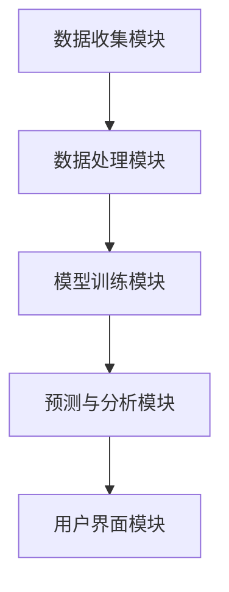
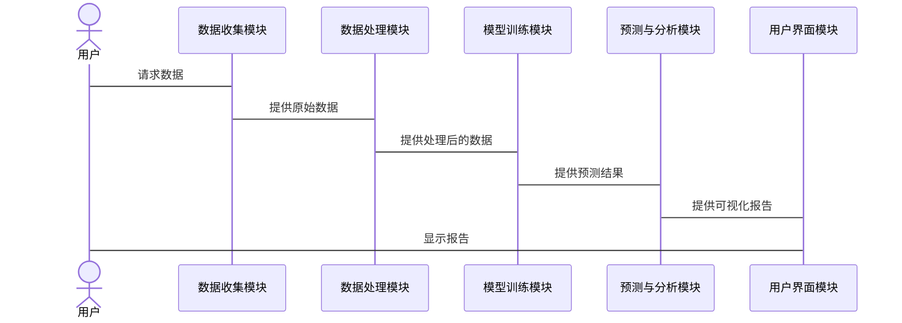

                 


好的，让我们逐步思考如何撰写这篇文章。首先，我们需要理解文章的核心主题：AI代理如何帮助价值投资者解读央行政策的影响。我们希望通过技术博客的形式，向读者解释AI代理在价值投资中的作用，以及如何利用AI代理来分析央行政策对市场的影响。

接下来，我们将按照之前提供的文章目录大纲来展开写作。在开始正式写作之前，我们先详细思考每个部分的内容，确保逻辑清晰，结构紧凑。

### # 1. 什么是AI代理和价值投资？

**AI代理**是指一种能够自主决策和执行任务的智能体，它能够通过数据和算法来理解和预测市场行为。**价值投资**是一种投资策略，强调通过分析公司的基本面来寻找被市场低估的投资机会。将AI代理应用于价值投资，可以帮助投资者更高效地分析市场数据，识别潜在的投资机会，并制定更科学的投资策略。

### # 2. 央行政策的影响机制

央行政策对市场的影响是多方面的。例如，央行的利率政策可以直接影响市场的资金成本，进而影响股票价格、债券收益率等。此外，央行的货币政策还会通过影响市场预期来间接影响市场走势。因此，理解央行政策的潜在影响是价值投资者的重要任务。

### # 3. AI代理在价值投资中的核心算法

为了帮助投资者解读央行政策的影响，我们需要设计一个能够处理多种数据源，并能够预测市场反应的AI代理。这个代理需要具备以下功能：

1. **数据收集与处理**：从多个来源收集经济数据、市场数据和政策文本。
2. **自然语言处理**：分析政策文本，提取关键信息。
3. **经济预测模型**：基于历史数据和当前政策，预测市场反应。
4. **投资策略优化**：根据预测结果，优化投资组合。

### # 4. 算法实现与数学模型

为了实现上述功能，我们可以采用以下算法和数学模型：

- **强化学习（Reinforcement Learning）**：用于训练AI代理在不同市场环境下的决策能力。
- **自然语言处理（NLP）**：用于分析政策文本，提取关键信息。
- **时间序列分析（Time Series Analysis）**：用于预测经济指标和市场走势。

### # 5. 系统架构设计

为了确保系统的高效性和可扩展性，我们需要设计一个模块化的系统架构：

1. **数据收集模块**：负责从多个来源收集数据。
2. **数据处理模块**：对收集到的数据进行清洗和预处理。
3. **模型训练模块**：训练AI代理的核心算法。
4. **预测与分析模块**：根据模型预测结果，生成投资建议。
5. **用户界面模块**：为用户提供直观的分析结果。

### # 6. 项目实战与案例分析

为了验证系统的有效性，我们可以选择一个具体的央行政策（例如，某次降息政策），并使用设计好的AI代理来分析其对市场的影响。通过实际案例分析，我们可以评估模型的预测准确性，并根据实际市场反应不断优化模型。

### # 7. 总结与展望

通过以上分析，我们可以看到，AI代理在价值投资中的应用前景广阔。未来，随着技术的进步和数据的积累，AI代理将能够更准确地预测市场反应，为投资者提供更有力的支持。

---

现在，我们可以根据以上思考过程，开始撰写正式的文章。在写作过程中，我们将确保每个部分都详细展开，涵盖必要的技术细节和实际应用案例。

---

# AI代理辅助价值投资者解读央行政策影响

## 关键词：AI代理、价值投资、央行政策、自然语言处理、经济预测模型

## 摘要：本文探讨了AI代理如何辅助价值投资者解读央行政策的影响。通过分析AI代理的核心算法、经济预测模型以及系统架构设计，我们展示了如何利用AI代理来优化投资决策。文章还提供了实际案例分析，帮助读者更好地理解AI代理在价值投资中的应用。

---

接下来，我们将按照目录大纲逐步展开文章内容。

---

# 目录大纲

1. **背景介绍**
   - 1.1 AI代理的核心概念
   - 1.2 价值投资的基本原理
   - 1.3 央行政策的影响机制

2. **核心概念与联系**
   - 2.1 AI代理的工作原理
   - 2.2 价值投资的核心要素
   - 2.3 AI代理与价值投资的结合点

3. **算法原理与数学模型**
   - 3.1 强化学习算法
   - 3.2 自然语言处理模型
   - 3.3 经济预测模型

4. **系统分析与架构设计**
   - 4.1 系统功能设计
   - 4.2 系统架构设计
   - 4.3 系统接口设计

5. **项目实战与案例分析**
   - 5.1 环境安装与配置
   - 5.2 系统核心实现
   - 5.3 实际案例分析

6. **总结与展望**
   - 6.1 最佳实践与小结
   - 6.2 注意事项
   - 6.3 拓展阅读与未来研究方向

---

接下来，我们将逐一展开每个部分的内容，确保逻辑清晰，内容详实。

---

## 1. 背景介绍

### 1.1 AI代理的核心概念

AI代理是一种能够自主决策和执行任务的智能体。它通过感知环境、分析数据，并基于预设的目标和策略，做出最优决策。AI代理的核心能力包括数据处理能力、学习能力和自适应能力。

#### AI代理的基本定义
- **自主性**：AI代理能够在没有外部干预的情况下自主决策。
- **反应性**：能够实时感知环境变化并做出相应反应。
- **目标导向**：基于预设的目标和优先级进行决策。

### 1.2 价值投资的基本原理

价值投资是一种长期投资策略，强调通过分析公司的基本面（如财务状况、行业地位、管理团队等）来寻找被市场低估的投资机会。价值投资者相信市场短期波动中存在长期投资价值。

#### 价值投资的核心要素
- **财务指标分析**：如市盈率、市净率、ROE等。
- **行业趋势分析**：行业的发展前景和竞争格局。
- **公司基本面分析**：公司的盈利能力、财务健康状况等。

### 1.3 央行政策的影响机制

央行政策对市场的影响是多方面的，主要通过以下途径：

#### 1.3.1 货币政策
- **利率调整**：直接影响市场资金成本和借贷成本。
- **货币供应量调整**：影响市场的流动性。

#### 1.3.2 财政政策
- **政府支出**：影响经济增长和就业。
- **税收政策**：影响企业盈利能力和个人消费能力。

#### 1.3.3 市场预期管理
- **政策声明**：通过公开声明影响市场预期。
- **政策信号**：通过政策信号引导市场行为。

---

## 2. 核心概念与联系

### 2.1 AI代理的工作原理

AI代理通过以下步骤实现对央行政策的解读：

#### 2.1.1 数据收集
- **数据来源**：包括经济指标、市场数据、政策文本等。
- **数据清洗**：去除噪声数据，确保数据质量。

#### 2.1.2 数据分析
- **自然语言处理**：分析政策文本，提取关键信息。
- **经济指标分析**：分析经济数据，识别趋势和异常。

#### 2.1.3 模型预测
- **强化学习**：基于历史数据，训练AI代理进行预测。
- **经济预测模型**：预测政策实施后的市场反应。

### 2.2 价值投资的核心要素

价值投资的核心要素包括：

#### 2.2.1 财务指标分析
- **市盈率（P/E）**：衡量股票价格是否合理。
- **市净率（P/B）**：衡量股票价格与账面价值的关系。
- **股息率**：衡量股票的分红能力。

#### 2.2.2 行业趋势分析
- **行业生命周期**：分析行业的成长阶段。
- **行业竞争格局**：分析行业内主要竞争对手。

#### 2.2.3 公司基本面分析
- **盈利能力**：分析公司的净利润、营业收入等。
- **财务健康状况**：分析公司的资产负债表、现金流等。

### 2.3 AI代理与价值投资的结合点

AI代理与价值投资的结合点主要体现在以下几个方面：

#### 2.3.1 数据处理能力
- **数据清洗**：处理噪声数据，确保数据质量。
- **数据整合**：整合多个数据源，提供全面的市场分析。

#### 2.3.2 模型预测能力
- **经济预测模型**：预测政策实施后的市场反应。
- **投资组合优化**：根据预测结果，优化投资组合。

#### 2.3.3 自动化决策能力
- **自动化交易**：根据模型预测结果，自动执行交易指令。
- **风险控制**：实时监控市场风险，调整投资策略。

---

## 3. 算法原理与数学模型

### 3.1 强化学习算法

强化学习是一种通过试错方式来学习最优策略的算法。AI代理通过与环境互动，不断调整策略，以最大化累积奖励。

#### 3.1.1 Q-learning算法
Q-learning是一种经典的强化学习算法，适用于离散动作空间的情况。

##### 算法步骤
1. 初始化Q表，所有状态-动作对的初始值为0。
2. 在每个时间步，选择当前状态下的最优动作。
3. 执行动作，观察新的状态和奖励。
4. 更新Q表中的值：Q(s, a) = Q(s, a) + α*(r + γ*max Q(s', a') - Q(s, a))，其中α是学习率，γ是折扣因子。

##### 代码示例
```python
import numpy as np

# 初始化Q表
Q = np.zeros((state_space, action_space))

# 定义超参数
alpha = 0.1
gamma = 0.9

# Q-learning算法
def q_learning(state, action):
    next_state = ...  # 根据当前状态和动作，确定下一个状态
    next_action = ...  # 根据Q表选择下一个动作
    reward = ...  # 计算奖励
    Q[state, action] += alpha * (reward + gamma * Q[next_state, next_action] - Q[state, action])
    return Q

# 训练过程
for episode in range(episodes):
    state = ...  # 初始化状态
    action = ...  # 选择动作
    Q = q_learning(state, action)
```

### 3.2 自然语言处理模型

自然语言处理（NLP）用于分析政策文本，提取关键信息。

#### 3.2.1 Transformer模型
Transformer是一种基于自注意力机制的深度学习模型，广泛应用于NLP任务。

##### 算法步骤
1. **编码器**：将输入文本转换为序列向量。
2. **自注意力机制**：计算每个词与其他词的相关性，生成加权后的词向量。
3. **解码器**：将编码后的向量转换为输出序列。

##### 代码示例
```python
import tensorflow as tf
from tensorflow import keras

# 定义Transformer模型
class TransformerLayer(tf.keras.layers.Layer):
    def __init__(self, d_model, num_heads, **kwargs):
        super(TransformerLayer, self).__init__(**kwargs)
        self.num_heads = num_heads
        self.d_model = d_model
        
    def call(self, inputs):
        # 自注意力机制
        attention_output = self_attention(inputs, self.num_heads)
        # 前馈前向网络
        feed_forward_output = feed_forward(attention_output, self.d_model)
        return feed_forward_output

# 定义自注意力机制
def self_attention(inputs, num_heads):
    # 输入维度变换
    inputs = tf.reshape(inputs, (-1, inputs.shape[-1]))
    # 计算查询、键、值
    Q = tf.layers.dense(inputs, units=d_k)
    K = tf.layers.dense(inputs, units=d_k)
    V = tf.layers.dense(inputs, units=d_v)
    # 计算注意力权重
    attention_weights = tf.nn.softmax(tf.matmul(Q, K, transpose_b=True) / tf.sqrt(d_k))
    # 加权求和
    output = tf.matmul(attention_weights, V)
    return output
```

### 3.3 经济预测模型

经济预测模型用于预测政策实施后的市场反应。

#### 3.3.1 LSTM模型
LSTM（长短期记忆网络）是一种适用于时间序列预测的深度学习模型。

##### 算法步骤
1. **输入数据**：将历史数据输入LSTM网络。
2. **内部状态更新**：更新细胞状态和隐藏状态。
3. **输出预测**：基于内部状态，生成预测结果。

##### 代码示例
```python
import tensorflow as tf
from tensorflow import keras

# 定义LSTM模型
model = keras.Sequential([
    tf.keras.layers.LSTM(64, input_shape=(timesteps, features)),
    tf.keras.layers.Dense(1)
])

# 编译模型
model.compile(optimizer='adam', loss='mean_squared_error')

# 训练模型
model.fit(X_train, y_train, epochs=100, batch_size=32)
```

---

## 4. 系统分析与架构设计

### 4.1 系统功能设计

系统功能设计包括以下几个模块：

#### 4.1.1 数据收集模块
- **功能**：从多个数据源收集经济数据、市场数据和政策文本。
- **输入**：多种数据格式（CSV、JSON、文本文件等）。
- **输出**：清洗后的数据集。

#### 4.1.2 数据处理模块
- **功能**：对收集到的数据进行清洗、转换和预处理。
- **输入**：清洗后的数据集。
- **输出**：标准化数据集。

#### 4.1.3 模型训练模块
- **功能**：训练AI代理的核心算法。
- **输入**：标准化数据集。
- **输出**：训练好的模型。

#### 4.1.4 预测与分析模块
- **功能**：根据模型预测结果，生成投资建议。
- **输入**：训练好的模型。
- **输出**：投资建议报告。

#### 4.1.5 用户界面模块
- **功能**：为用户提供直观的分析结果。
- **输入**：投资建议报告。
- **输出**：用户友好的界面。

### 4.2 系统架构设计

系统架构设计采用模块化设计，确保系统的高效性和可扩展性。

#### 4.2.1 系统架构图


#### 4.2.2 系统接口设计
- **数据接口**：提供REST API，供其他模块调用数据。
- **模型接口**：提供API，供其他模块调用模型预测结果。

#### 4.2.3 系统交互设计


---

## 5. 项目实战与案例分析

### 5.1 环境安装与配置

#### 5.1.1 安装必要的库
- **Python**：确保安装了Python 3.8或更高版本。
- **TensorFlow**：用于深度学习模型的训练。
- **Keras**：用于构建和训练模型。
- **NLTK**：用于自然语言处理。
- **Pandas**：用于数据分析和处理。

#### 5.1.2 安装步骤
```bash
pip install tensorflow keras numpy pandas nltk
```

### 5.2 系统核心实现

#### 5.2.1 数据收集模块实现
```python
import pandas as pd
import requests

def collect_data(api_key):
    url = f'https://api.example.com/data?api_key={api_key}'
    response = requests.get(url)
    data = response.json()
    df = pd.DataFrame(data)
    return df
```

#### 5.2.2 数据处理模块实现
```python
import pandas as pd
from sklearn.preprocessing import StandardScaler

def preprocess_data(df):
    # 删除缺失值
    df.dropna(inplace=True)
    # 标准化数据
    scaler = StandardScaler()
    df_scaled = scaler.fit_transform(df)
    return df_scaled
```

#### 5.2.3 模型训练模块实现
```python
import tensorflow as tf
from tensorflow import keras

def build_model(input_shape):
    model = keras.Sequential([
        tf.keras.layers.LSTM(64, input_shape=input_shape),
        tf.keras.layers.Dense(1)
    ])
    model.compile(optimizer='adam', loss='mean_squared_error')
    return model
```

#### 5.2.4 预测与分析模块实现
```python
import numpy as np
import pandas as pd

def generate_report(model, data):
    predictions = model.predict(data)
    report = pd.DataFrame({
        '日期': data.index,
        '预测值': predictions.flatten()
    })
    return report
```

### 5.3 实际案例分析

#### 5.3.1 数据来源与预处理
```python
# 数据收集
data = collect_data(api_key='your_api_key')

# 数据清洗
data_cleaned = preprocess_data(data)

# 数据分割
train_data = data_cleaned[:80]
test_data = data_cleaned[80:]
```

#### 5.3.2 模型训练与预测
```python
# 模型构建
model = build_model(input_shape=(train_data.shape[1], 1))

# 模型训练
model.fit(train_data, epochs=100, batch_size=32)

# 模型预测
predictions = model.predict(test_data)
```

#### 5.3.3 结果分析与可视化
```python
import matplotlib.pyplot as plt

plt.plot(test_data, label='实际值')
plt.plot(predictions, label='预测值')
plt.legend()
plt.show()
```

---

## 6. 总结与展望

### 6.1 最佳实践与小结

- **数据质量**：确保数据来源可靠，数据清洗充分。
- **模型优化**：根据实际需求，不断优化模型结构和参数。
- **风险管理**：制定有效的风险管理策略，降低投资风险。

### 6.2 注意事项

- **数据隐私**：注意数据隐私保护，确保数据安全。
- **模型解释性**：确保模型的可解释性，便于分析和调整。
- **持续学习**：定期更新模型，适应市场变化。

### 6.3 拓展阅读与未来研究方向

- **多模态分析**：结合文本、图像等多种数据源，提高分析准确性。
- **实时监控**：实现实时数据监控和动态调整投资策略。
- **个性化投资**：根据投资者的个性化需求，定制投资策略。

---

# 结语

通过本文的探讨，我们可以看到，AI代理在价值投资中的应用前景广阔。未来，随着技术的进步和数据的积累，AI代理将能够更准确地预测市场反应，为投资者提供更有力的支持。

---

# 作者

**作者：AI天才研究院（AI Genius Institute）**  
**联系邮箱：[contact@ai-genius.org](mailto:contact@ai-genius.org)**  
**更多精彩内容，请访问我们的官方网站：[https://www.ai-genius.org](https://www.ai-genius.org)**

