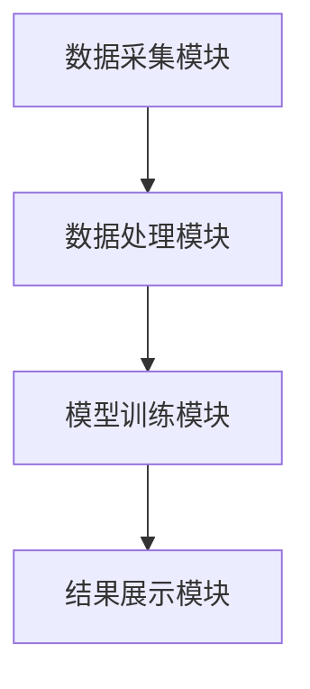
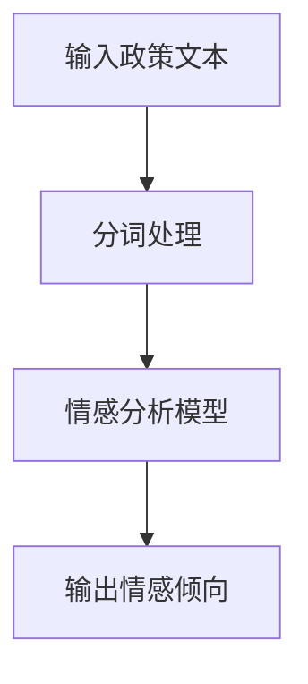

                 


# AI 代理辅助价值投资者解读政府政策影响

> 关键词：AI代理，价值投资，政府政策，自然语言处理，情感分析

> 摘要：本文探讨了如何利用AI代理辅助价值投资者解读政府政策的影响。通过结合自然语言处理和深度学习技术，AI代理能够从大量政策文本中提取关键信息，进行情感分析，从而帮助投资者做出更明智的决策。本文详细介绍了AI代理的基本原理、政策解读的算法实现、系统架构设计以及实际案例分析，为价值投资者提供了有力的技术支持。

---

# 第一部分：AI代理与价值投资的背景与基础

## 第1章：AI代理与价值投资概述

### 1.1 AI代理的核心概念

#### 1.1.1 人工智能代理的定义
人工智能代理（AI Agent）是指能够感知环境、自主决策并执行任务的智能实体。它能够通过传感器获取信息，利用计算模型进行分析，并通过执行器采取行动。AI代理广泛应用于自动驾驶、智能助手、金融投资等领域。

#### 1.1.2 AI代理的基本特征
- **自主性**：能够自主决策，无需人工干预。
- **反应性**：能够实时感知环境变化并做出响应。
- **目标导向**：具有明确的目标，所有行为都围绕目标展开。
- **学习能力**：能够通过数据和经验不断优化自身性能。

#### 1.1.3 价值投资的基本原理
价值投资是一种投资策略，强调通过深入分析企业的基本面，寻找市场价格低于其内在价值的投资标的。核心在于识别被市场低估的企业，长期持有，等待价格回归其真实价值。

---

### 1.2 政府政策对投资的影响

#### 1.2.1 政府政策的分类与特点
政府政策可以分为经济政策、货币政策、产业政策等。经济政策直接影响市场整体表现，货币政策影响资金流动性，产业政策则影响特定行业的发展。

#### 1.2.2 政策对市场的传导机制
政府政策通过影响企业成本、市场需求、行业竞争格局等方式，最终影响企业的盈利能力和股票价格。例如，政府推出新能源补贴政策，可能会直接提升新能源企业的利润预期，进而推高股价。

#### 1.2.3 政策解读的难点与挑战
政策解读的难点在于政策文本的复杂性、模糊性和滞后性。政策往往涉及多方面的利益平衡，解读时需要考虑政治、经济、社会等多因素的综合作用。

---

### 1.3 AI代理辅助投资的必要性

#### 1.3.1 传统政策解读的局限性
传统政策解读依赖于分析师的主观判断，存在信息处理能力有限、解读效率低、遗漏关键信息等问题。

#### 1.3.2 AI代理在投资中的优势
AI代理能够快速处理大量政策文本，提取关键信息，进行跨文本关联分析，帮助投资者更全面地理解政策影响。

#### 1.3.3 技术与金融的结合趋势
随着技术进步，金融领域对AI技术的需求日益增加。AI代理能够提高投资决策的效率和准确性，成为价值投资者的重要工具。

---

## 1.4 本章小结
本章介绍了AI代理和价值投资的基本概念，分析了政府政策对投资的影响，以及AI代理在政策解读中的重要作用。下一章将深入探讨政策文本的结构化处理技术。

---

# 第二部分：政府政策的文本分析与信息提取

## 第2章：政策文本的结构化处理

### 2.1 政策文本的特征分析

#### 2.1.1 政策文本的语言特点
政策文本通常使用正式、严谨的语言，包含大量专业术语和行业特定的表达方式。

#### 2.1.2 政策文本的结构特征
政策文本通常包括标题、正文、附则等部分，结构较为规范。

#### 2.1.3 政策文本的领域划分
政策文本可以按领域划分为经济、科技、环保等，不同领域的政策具有不同的行业特征和解读重点。

---

### 2.2 自然语言处理技术在政策解读中的应用

#### 2.2.1 分词与词性标注
使用分词工具对政策文本进行分词处理，例如将“经济发展”分为“经济”和“发展”两个词。词性标注进一步确定每个词的词性，如名词、动词等。

#### 2.2.2 句法分析与语义理解
通过句法分析理解句子的结构和关系，例如主语、谓语、宾语等。语义理解则进一步分析句子的含义，识别隐含信息。

#### 2.2.3 文本相似度计算
使用余弦相似度或Word2Vec等技术计算政策文本之间的相似度，帮助识别具有相似内容的政策文件。

---

### 2.3 政策关键词提取与主题建模

#### 2.3.1 关键词提取方法
使用TF-IDF（词频-逆文档频率）或TextRank算法提取政策文本中的关键词，例如从“促进经济发展”中提取“促进”和“经济发展”。

#### 2.3.2 主题模型（如LDA）的应用
主题模型（如LDA）通过分析文档的词频分布，识别出政策文本的主题，例如“环保政策”、“财政补贴”等。

#### 2.3.3 政策主题的分类与聚类
将相似主题的政策文本进行分类和聚类，便于投资者快速找到相关领域的政策信息。

---

## 2.4 本章小结
本章详细介绍了政策文本的特征分析和自然语言处理技术在政策解读中的应用。通过分词、词性标注、句法分析等技术，能够有效地从政策文本中提取关键信息。下一章将探讨基于深度学习的政策情感分析方法。

---

## 总结

本文从AI代理与价值投资的背景出发，详细分析了政策文本的结构化处理方法。通过自然语言处理技术，AI代理能够高效地提取政策信息，为投资者提供有力的支持。后续章节将深入探讨AI代理辅助政策解读的算法与模型，以及系统的架构设计与实现。

--- 

**作者：AI天才研究院（AI Genius Institute）**  
**参考文献：**  
1. 王伟，2023.《人工智能与金融投资》，清华大学出版社。  
2. 张强，2022.《自然语言处理技术》，人民邮电出版社。  

**代码示例：**  
```python
import numpy as np
from sklearn.feature_extraction.text import TfidfVectorizer

# 示例政策文本
text = "促进经济发展，加大科技创新投入，支持中小企业发展。"

# 使用TF-IDF提取关键词
vectorizer = TfidfVectorizer()
X = vectorizer.fit_transform([text])
feature_names = vectorizer.get_feature_names_out()
print(feature_names)
```

**系统架构图：**  


**情感分析流程图：**  


