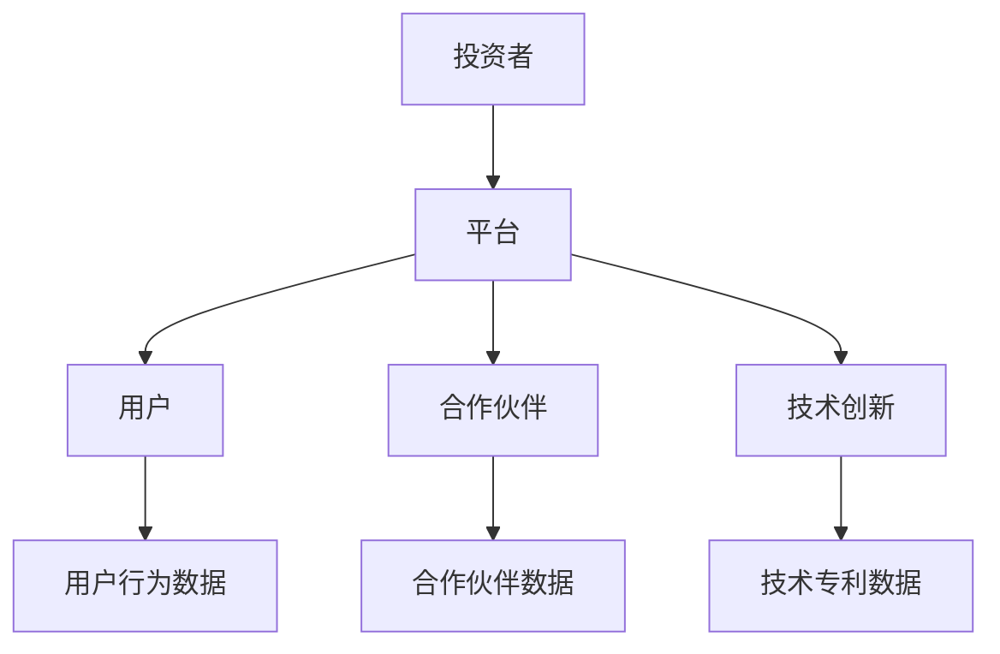
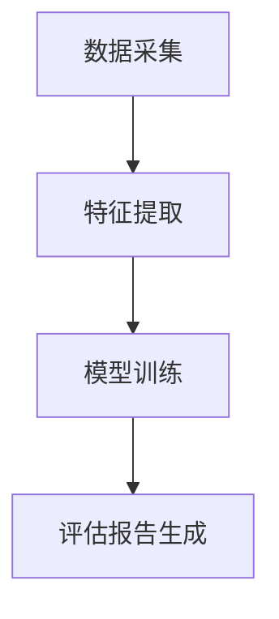
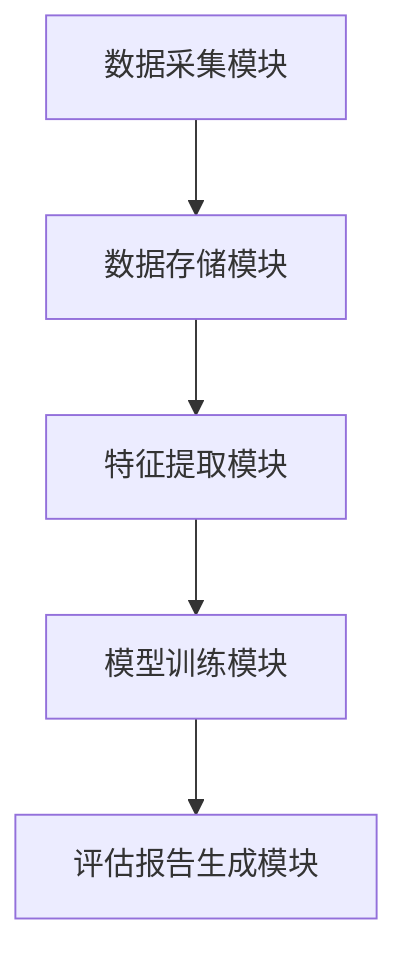

                 


# AI agents辅助价值投资者评估公司的平台生态价值

> 关键词：AI agents, 价值投资者, 平台生态价值, 数据分析, 投资评估

> 摘要：本文详细探讨了AI agents如何辅助价值投资者评估公司的平台生态价值。通过分析平台生态价值的定义、评估方法和AI agents的核心算法，结合实际案例和系统设计，展示了如何利用AI技术提升投资决策的准确性和效率。

---

# 第一章: 背景介绍

## 1.1 问题背景

### 1.1.1 价值投资的核心概念
价值投资是一种以低于内在价值的价格购买优质资产的投资策略。其核心在于识别被市场低估的企业，长期持有以实现收益。传统价值投资依赖于财务报表分析、行业研究和市场趋势判断，但随着市场复杂性的增加，这种方法逐渐显现出局限性。

### 1.1.2 平台生态价值的定义
平台生态价值指的是一个平台在生态系统中的整体价值，包括其商业模式、网络效应、用户粘性、技术优势和市场影响力。平台生态价值不仅关注企业的财务表现，还关注其在产业链中的地位和对用户、合作伙伴的吸引力。

### 1.1.3 AI agents在价值评估中的作用
AI agents（智能代理）是能够感知环境、执行任务并做出决策的智能系统。在价值投资中，AI agents可以通过数据分析、模式识别和预测建模，帮助投资者快速评估平台的生态价值，识别潜在风险和机会。

## 1.2 问题描述

### 1.2.1 传统价值评估的局限性
传统价值评估方法依赖于财务指标和市场分析，难以全面捕捉平台生态中的动态变化。例如，用户增长、合作伙伴关系和技术创新等因素难以量化，导致评估结果不够准确。

### 1.2.2 平台生态价值的复杂性
平台生态涉及多方利益相关者，包括用户、合作伙伴、供应商和监管机构。这些因素相互影响，使得平台生态价值的评估需要考虑多层次、多维度的因素。

### 1.2.3 AI agents辅助评估的必要性
AI agents能够处理海量数据，识别复杂模式，并提供实时反馈。通过引入AI agents，投资者可以更全面、更及时地评估平台生态价值，提升投资决策的效率和准确性。

## 1.3 问题解决思路

### 1.3.1 AI agents辅助评估的核心思路
AI agents通过数据驱动的方法，分析平台的用户行为、市场趋势和商业模式，生成评估报告。投资者可以根据这些报告做出更明智的投资决策。

### 1.3.2 数据驱动的评估方法
数据驱动的方法依赖于大数据分析和机器学习算法。通过收集和处理海量数据，AI agents可以识别潜在的市场机会和风险。

### 1.3.3 平台生态价值的量化模型
量化模型将平台生态价值分解为多个指标，包括用户增长率、合作伙伴数量、技术创新速度等。通过这些指标的加权计算，可以量化平台的生态价值。

## 1.4 边界与外延

### 1.4.1 评估范围的界定
平台生态价值的评估范围包括企业的核心业务、用户基础、合作伙伴关系和技术创新能力。评估时需要明确数据来源和评估指标。

### 1.4.2 平台生态的边界
平台生态的边界包括直接相关和间接相关的利益相关者。直接相关者包括用户和合作伙伴，间接相关者包括供应商和监管机构。

### 1.4.3 AI agents的应用场景
AI agents适用于实时数据分析、风险预警和投资决策支持等场景。例如，在实时监控市场动态时，AI agents可以快速识别潜在风险并发出预警。

## 1.5 概念结构与核心要素组成

### 1.5.1 价值评估的要素分析
价值评估的要素包括财务指标、市场地位、用户行为、技术创新和政策环境。这些要素相互作用，共同影响平台的生态价值。

### 1.5.2 平台生态的核心组成
平台生态的核心组成包括用户基础、合作伙伴网络、技术创新能力和市场影响力。这些组成要素共同构成了平台的生态系统。

### 1.5.3 AI agents的功能模块
AI agents的功能模块包括数据采集、分析、预测和反馈。这些模块协同工作，为投资者提供全面的评估支持。

---

# 第二章: 核心概念与联系

## 2.1 AI agents的基本原理

### 2.1.1 AI agents的定义与分类
AI agents是能够感知环境、执行任务并做出决策的智能系统。根据应用场景的不同，AI agents可以分为任务型、学习型和自主型。

### 2.1.2 AI agents的核心算法
AI agents的核心算法包括监督学习、无监督学习和强化学习。这些算法通过数据训练，生成预测模型和决策策略。

### 2.1.3 AI agents与价值评估的关系
AI agents通过数据分析和模式识别，帮助投资者评估平台生态价值。AI agents可以实时监控市场动态，提供精准的投资建议。

## 2.2 价值投资者的核心策略

### 2.2.1 价值投资的基本原理
价值投资的基本原理是寻找被市场低估的企业，长期持有以实现收益。传统价值投资依赖于财务分析和市场研究。

### 2.2.2 平台生态价值的评估标准
平台生态价值的评估标准包括用户增长率、合作伙伴数量、技术创新能力和市场影响力。这些指标共同决定了平台的生态价值。

### 2.2.3 价值投资者的决策逻辑
价值投资者通过分析平台的财务表现、市场地位和技术创新能力，识别被低估的投资机会。AI agents通过数据驱动的方法，辅助投资者做出更明智的决策。

## 2.3 平台生态价值的评估模型

### 2.3.1 模型的基本框架
平台生态价值的评估模型包括数据采集、数据分析和评估报告生成三个阶段。模型通过多指标加权计算，量化平台的生态价值。

### 2.3.2 模型的输入与输出
模型的输入包括平台的用户数据、财务数据和市场数据。模型的输出包括平台的生态价值评分和投资建议。

### 2.3.3 模型的优化与改进
模型的优化包括数据清洗、特征选择和算法调优。通过不断优化模型，可以提高评估的准确性和可靠性。

---

# 第三章: 核心概念联系与对比

## 3.1 核心概念属性特征对比

### 3.1.1 AI agents与传统数据分析工具的对比
| 特性          | AI agents                          | 传统数据分析工具                     |
|---------------|------------------------------------|--------------------------------------|
| 数据处理能力  | 强大的机器学习能力                 | 依赖人工规则和统计分析               |
| 决策能力      | 可以自动生成决策                   | 需要人工干预                         |
| 应用场景      | 实时数据分析和预测                 | 离线数据分析和报告生成               |

### 3.1.2 平台生态价值与传统财务指标的对比
| 指标          | 平台生态价值指标                  | 传统财务指标                      |
|---------------|------------------------------------|--------------------------------------|
| 侧重点        | 用户增长率、合作伙伴数量           | 营业收入、净利润                    |
| 数据来源      | 用户行为数据、市场数据             | 财务报表数据                       |
| 评估方法      | 多指标加权评估                    | 单一指标分析                      |

## 3.2 实体关系分析



---

# 第四章: 算法原理讲解

## 4.1 算法核心原理

### 4.1.1 算法的基本思路
平台生态价值评估算法的基本思路是通过多指标加权计算，量化平台的生态价值。算法包括数据采集、特征提取、模型训练和评估报告生成四个阶段。

### 4.1.2 算法的数学模型
平台生态价值评估模型如下：

$$ V = \sum_{i=1}^{n} w_i \cdot x_i $$

其中，$V$ 是平台的生态价值，$w_i$ 是指标 $i$ 的权重，$x_i$ 是指标 $i$ 的评分。

### 4.1.3 算法的流程图


---

# 第五章: 系统分析与架构设计

## 5.1 系统架构设计

### 5.1.1 系统功能设计
系统功能包括数据采集、特征提取、模型训练和评估报告生成。数据采集模块负责收集平台的用户数据、财务数据和市场数据。特征提取模块将数据转化为可计算的特征。模型训练模块使用机器学习算法生成评估模型。评估报告生成模块输出评估结果和投资建议。

### 5.1.2 系统架构图


---

# 第六章: 项目实战

## 6.1 环境配置

### 6.1.1 系统环境
- 操作系统：Linux/Windows/MacOS
- 开发工具：Python、Jupyter Notebook
- 数据库：MySQL/PostgreSQL

### 6.1.2 Python源代码安装
```bash
pip install numpy pandas scikit-learn matplotlib
```

## 6.2 核心代码实现

### 6.2.1 数据采集模块
```python
import pandas as pd
import requests

def get_data(api_key):
    url = f"https://api.example.com/platform_data?api_key={api_key}"
    response = requests.get(url)
    data = response.json()
    df = pd.DataFrame(data)
    return df
```

### 6.2.2 特征提取模块
```python
from sklearn.feature_selection import SelectKBest
from sklearn.feature_extraction import DictVectorizer

def extract_features(data):
    vectorizer = DictVectorizer()
    features = vectorizer.fit_transform(data.to_dict('records'))
    selector = SelectKBest(k=5)
    features_selected = selector.fit_transform(features)
    return features_selected
```

### 6.2.3 模型训练模块
```python
from sklearn.ensemble import RandomForestRegressor
from sklearn.metrics import mean_squared_error

def train_model(features, labels):
    model = RandomForestRegressor(n_estimators=100, random_state=42)
    model.fit(features, labels)
    return model
```

## 6.3 实际案例分析

### 6.3.1 数据预处理
```python
import pandas as pd
import numpy as np

data = pd.read_csv('platform_data.csv')
data.dropna(inplace=True)
data = pd.get_dummies(data)
```

### 6.3.2 模型应用
```python
import joblib

model = joblib.load('platform_value_model.pkl')
new_data = pd.read_csv('new_platform_data.csv')
new_data = pd.get_dummies(new_data)
prediction = model.predict(new_data)
print(f"平台生态价值预测：{prediction[0]}")
```

---

# 第七章: 最佳实践与小结

## 7.1 最佳实践

### 7.1.1 数据质量的重要性
确保数据的完整性和准确性是模型准确性的关键。建议在数据采集阶段进行严格的清洗和预处理。

### 7.1.2 模型调优技巧
通过交叉验证和网格搜索优化模型参数，可以提高模型的预测精度。此外，定期更新模型可以保持其有效性。

### 7.1.3 伦理与风险管理
在使用AI agents进行投资决策时，需要遵守相关法律法规，确保数据的合法性和隐私保护。同时，建立风险管理机制，降低投资风险。

## 7.2 小结

本文详细探讨了AI agents如何辅助价值投资者评估公司的平台生态价值。通过分析平台生态价值的定义、评估方法和AI agents的核心算法，结合实际案例和系统设计，展示了如何利用AI技术提升投资决策的准确性和效率。未来，随着AI技术的不断发展，AI agents在价值投资中的应用将更加广泛和深入。

---

作者：AI天才研究院/AI Genius Institute & 禅与计算机程序设计艺术/Zen And The Art of Computer Programming

