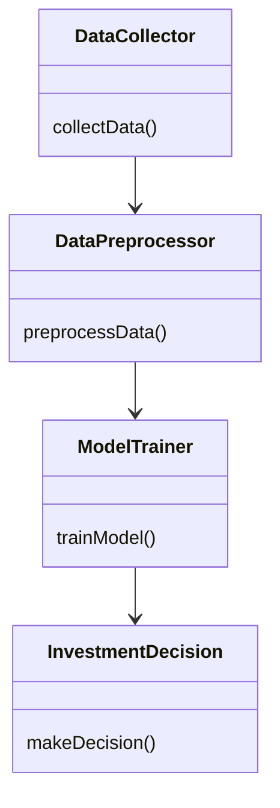
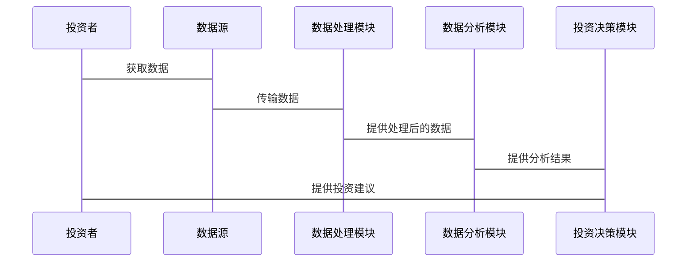

                 


# AI agents辅助价值投资者评估公司的数据变现能力

> 关键词：AI agents，价值投资，数据变现，机器学习，自然语言处理，投资分析

> 摘要：本文将探讨AI agents如何辅助价值投资者评估公司的数据变现能力。通过分析数据驱动决策的核心要素、AI agents在数据处理中的优势以及具体算法的实现，本文为价值投资者提供了一种全新的视角和工具，以更高效地评估企业的数据变现能力，从而做出更明智的投资决策。

---

# 第一部分: 引言

## 第1章: 价值投资与AI agents的结合

### 1.1 价值投资的基本概念

#### 1.1.1 价值投资的定义与核心理念
价值投资是一种投资策略，强调以低于内在价值的价格购买优质资产。其核心理念在于寻找市场上的“价值洼地”，即市场价格低于其真实价值的公司或资产。这种策略要求投资者深入分析企业的基本面，包括财务状况、行业地位、盈利能力等。

#### 1.1.2 价值投资在现代金融中的地位
随着金融市场的复杂化和信息量的爆炸式增长，传统价值投资方法在面对海量数据和瞬息万变的市场环境时显得力不从心。现代投资者需要借助技术手段来提高分析效率和准确性，AI agents作为一种新兴的技术工具，为价值投资提供了新的可能性。

#### 1.1.3 数据驱动决策的重要性
数据驱动决策是现代投资的核心，通过对海量数据的分析，投资者可以发现潜在的投资机会和风险。数据驱动决策不仅依赖于数据的准确性，还依赖于分析工具的有效性。AI agents通过自动化数据处理和分析，能够帮助投资者快速提取有价值的信息。

---

### 1.2 AI agents在投资分析中的作用

#### 1.2.1 AI agents的定义与特点
AI agents是具有目标导向行为能力的智能体，能够在特定环境下自主执行任务。其特点是能够通过学习和优化不断提升自身的决策能力。在投资分析中，AI agents可以用于数据处理、市场预测、风险评估等多个环节。

#### 1.2.2 AI agents在价值投资中的应用场景
AI agents可以帮助投资者进行以下工作：
- **数据清洗与特征提取**：处理非结构化数据，提取关键特征。
- **市场预测**：基于历史数据预测市场趋势。
- **风险评估**：识别潜在风险，评估投资组合的稳定性。
- **动态调整**：根据市场变化实时调整投资策略。

#### 1.2.3 数据变现能力的核心要素
数据变现能力是指企业通过数据资产创造经济价值的能力。其核心要素包括：
- 数据质量：数据的完整性、准确性、及时性。
- 数据分析能力：企业对数据的处理和分析能力。
- 数据应用场景：数据如何为企业创造价值。

---

### 1.3 本书的核心目标与结构安排

#### 1.3.1 本书的核心目标
本书旨在探讨AI agents如何辅助价值投资者评估公司的数据变现能力，通过理论分析和实践案例，帮助读者理解AI技术在投资分析中的应用。

#### 1.3.2 本书的章节安排
- 第1章：引言，介绍价值投资和AI agents的基本概念。
- 第2章：AI agents与数据变现能力的核心概念。
- 第3章：AI agents的算法基础，介绍机器学习和自然语言处理技术。
- 第4章：系统架构设计，展示AI agents在投资分析中的系统架构。
- 第5章：项目实战，提供具体的AI agents实现案例。
- 第6章：总结与展望，总结本书内容并展望未来发展方向。

#### 1.3.3 本书的阅读方法
读者可以通过以下方式阅读本书：
- 从基础概念入手，逐步深入理解AI agents的核心原理。
- 结合实际案例，理解AI技术在投资分析中的具体应用。
- 通过代码实现，掌握AI agents的实践技能。

---

# 第二部分: AI agents辅助价值投资的核心概念

## 第2章: AI agents与数据变现能力

### 2.1 数据变现能力的定义与评估标准

#### 2.1.1 数据变现能力的定义
数据变现能力是指企业通过数据资产创造经济价值的能力。企业可以通过数据分析、数据产品化等方式实现数据变现。

#### 2.1.2 数据变现能力的评估指标
评估数据变现能力的关键指标包括：
- 数据资产的价值：数据的稀缺性和独特性。
- 数据处理能力：企业对数据的处理和分析能力。
- 数据应用场景：数据如何为企业创造价值。

#### 2.1.3 数据质量与变现能力的关系
数据质量是数据变现的基础。高质量的数据能够提高分析结果的准确性，从而增强数据变现能力。

---

### 2.2 AI agents在数据处理中的优势

#### 2.2.1 自然语言处理在文本数据中的应用
自然语言处理技术可以帮助投资者分析新闻、财报等文本数据，提取关键信息。

#### 2.2.2 数据清洗与特征提取的技术
AI agents可以通过机器学习算法自动清洗数据，提取特征，降低人为误差。

#### 2.2.3 数据建模与预测的优势
AI agents可以通过数据建模和预测，帮助投资者发现潜在的投资机会和风险。

---

### 2.3 数据驱动决策的数学模型

#### 2.3.1 数据驱动决策的基本原理
数据驱动决策是基于数据的分析结果进行决策。其核心是通过数据分析发现数据中的规律和趋势。

#### 2.3.2 数据驱动决策的数学模型
以下是常见的数据驱动决策模型：
- 线性回归模型：用于预测连续型变量。
- 逻辑回归模型：用于分类问题。
- 支持向量机（SVM）：用于分类和回归问题。
- 决策树：用于分类和回归问题。

#### 2.3.3 数据驱动决策的案例分析
以下是一个简单的线性回归模型案例：
$$ y = \beta_0 + \beta_1 x + \epsilon $$
其中，$y$ 是目标变量，$x$ 是自变量，$\beta_0$ 和 $\beta_1$ 是回归系数，$\epsilon$ 是误差项。

---

# 第三部分: AI agents的算法原理与实现

## 第3章: AI agents的算法基础

### 3.1 机器学习算法在AI agents中的应用

#### 3.1.1 监督学习与非监督学习的区别
- **监督学习**：基于标注数据进行学习。
- **非监督学习**：基于无标注数据进行学习。

#### 3.1.2 常见机器学习算法的优缺点
- **线性回归**：简单易用，但只能处理线性关系。
- **支持向量机（SVM）**：适用于高维数据，但计算复杂度较高。
- **随机森林**：适用于分类和回归问题，但计算资源消耗较大。

#### 3.1.3 算法选择的策略与技巧
- 算法选择应基于数据类型和问题需求。
- 通过交叉验证评估算法性能。

---

### 3.2 自然语言处理技术的核心算法

#### 3.2.1 词嵌入技术（如Word2Vec、GloVe）
词嵌入技术通过将词语映射到低维向量空间，提高文本处理效率。

#### 3.2.2 语法分析与语义理解
语法分析和语义理解是自然语言处理的核心任务，可以通过词袋模型、词嵌入模型等实现。

#### 3.2.3 基于Transformer的模型（如BERT）
BERT是一种基于Transformer的预训练语言模型，广泛应用于自然语言处理任务。

---

### 3.3 数据建模与预测的数学公式

#### 3.3.1 线性回归模型
$$ y = \beta_0 + \beta_1 x + \epsilon $$

#### 3.3.2 逻辑回归模型
$$ P(y=1|x) = \frac{1}{1 + e^{- (\beta_0 + \beta_1 x)}} $$

#### 3.3.3 支持向量机（SVM）
SVM的目标是找到一个超平面，使得正负样本分开。

---

# 第四部分: 系统架构与设计

## 第4章: 系统架构设计

### 4.1 系统功能模块划分

#### 4.1.1 数据采集模块
数据采集模块负责从多种数据源获取数据，包括：
- 财务报表
- 新闻资讯
- 市场数据

#### 4.1.2 数据处理模块
数据处理模块负责对数据进行清洗和特征提取。

#### 4.1.3 数据分析模块
数据分析模块负责对数据进行建模和预测。

#### 4.1.4 投资决策模块
投资决策模块基于分析结果生成投资建议。

---

### 4.2 系统架构设计

#### 4.2.1 领域模型（类图）


#### 4.2.2 系统架构图
```mermaid
architectural
    title AI Agents Investment System Architecture
    container 投资者 {
        投资者
    }
    container 数据源 {
        数据源
    }
    container 数据处理模块 {
        数据处理模块
    }
    container 数据分析模块 {
        数据分析模块
    }
    container 投资决策模块 {
        投资决策模块
    }
    投资者 --> 数据源
    数据源 --> 数据处理模块
    数据处理模块 --> 数据分析模块
    数据分析模块 --> 投资决策模块
```

#### 4.2.3 系统交互图


---

## 第5章: 项目实战

### 5.1 环境安装

#### 5.1.1 安装Python
```bash
python --version
pip install --upgrade pip
```

#### 5.1.2 安装必要的库
```bash
pip install numpy pandas scikit-learn transformers
```

---

### 5.2 系统核心实现源代码

#### 5.2.1 数据采集模块
```python
import requests

def collect_data(url):
    response = requests.get(url)
    return response.text
```

#### 5.2.2 数据处理模块
```python
import pandas as pd

def preprocess_data(df):
    df.dropna(inplace=True)
    return df
```

#### 5.2.3 数据分析模块
```python
from sklearn.linear_model import LinearRegression

def train_model(X, y):
    model = LinearRegression()
    model.fit(X, y)
    return model
```

#### 5.2.4 投资决策模块
```python
def make_decision(model, new_data):
    prediction = model.predict(new_data)
    return prediction
```

---

### 5.3 实际案例分析

#### 5.3.1 案例背景
假设我们有一个企业的历史财务数据和市场数据，我们需要预测该企业的数据变现能力。

#### 5.3.2 数据处理与分析
```python
data = collect_data("https://example.com/data")
df = pd.read_csv(data)
df = preprocess_data(df)
model = train_model(df[['revenue', 'profit']], df['market_value'])
```

#### 5.3.3 投资决策
```python
new_data = [[1000000, 500000]]
prediction = make_decision(model, new_data)
print(f"预测的市场价值为：{prediction[0]}")
```

---

## 第6章: 总结与展望

### 6.1 总结
本文通过理论分析和实践案例，展示了AI agents在价值投资中的应用。AI agents可以帮助投资者提高数据分析效率和准确性，从而更好地评估企业的数据变现能力。

### 6.2 未来展望
随着AI技术的不断发展，AI agents在投资分析中的应用将更加广泛和深入。未来的研究方向包括：
- 更加智能化的AI agents设计。
- 更多领域的数据驱动决策应用。
- 更高效的算法优化。

---

# 作者：AI天才研究院/AI Genius Institute & 禅与计算机程序设计艺术 /Zen And The Art of Computer Programming

