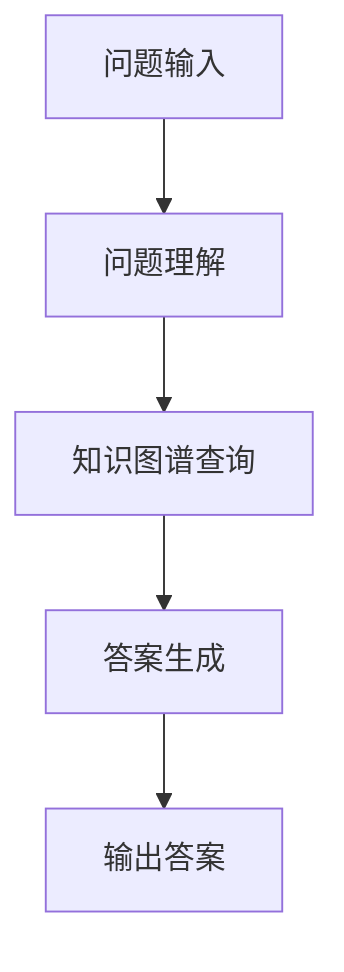
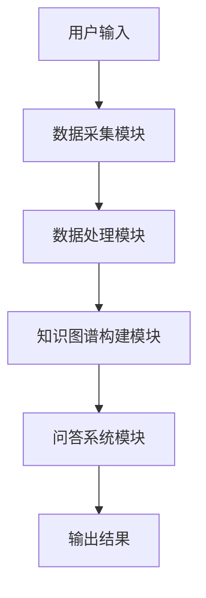
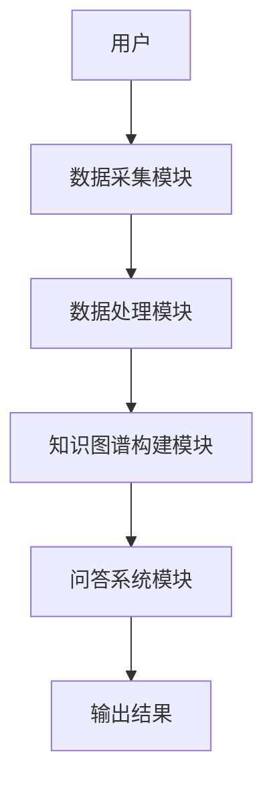
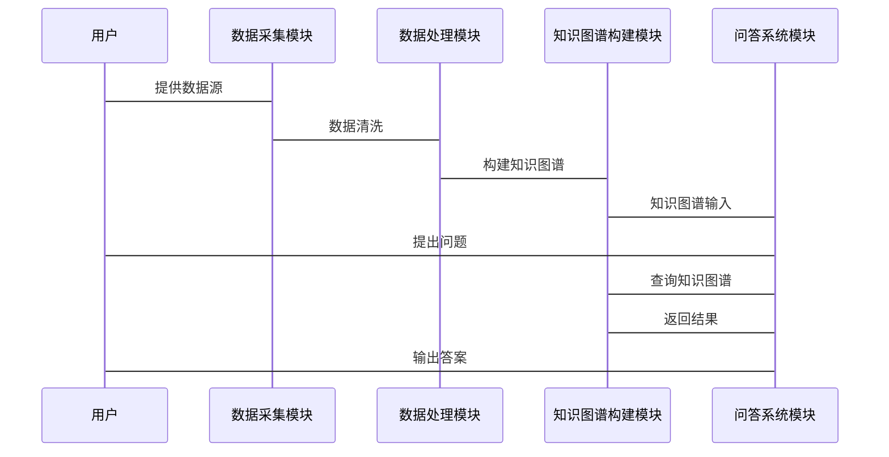

                 


# AI agents辅助价值投资者评估公司的数据资产价值

> 关键词：AI代理，价值投资，数据资产，知识图谱，数据评估，问答系统

> 摘要：本文探讨了如何利用AI代理辅助价值投资者评估公司的数据资产价值。文章从数据资产价值评估的基本概念出发，详细介绍了AI代理在这一过程中的核心作用，包括知识图谱的构建、基于知识图谱的问答系统设计以及实际项目中的应用。通过本文，读者将深入了解如何利用AI技术提升数据资产价值评估的效率和准确性。

---

# 第一部分: AI代理与价值投资的背景介绍

## 第1章: AI代理与价值投资概述

### 1.1 数据资产价值评估的背景
#### 1.1.1 数据资产在现代企业中的重要性
数据资产是企业核心竞争力的重要组成部分，其价值不仅体现在直接的经济收益上，还体现在对企业战略决策的支持上。随着数字化转型的推进，数据资产的价值日益凸显。

#### 1.1.2 价值投资的基本概念
价值投资是一种通过分析企业的基本面（如财务状况、市场地位等）来评估其内在价值的投资策略。传统价值投资依赖于分析师的主观判断，而AI代理可以通过数据挖掘和分析提供更客观的支持。

#### 1.1.3 AI代理在价值投资中的作用
AI代理可以通过处理海量数据、识别数据之间的关联关系，帮助投资者更准确地评估企业的数据资产价值。

### 1.2 问题背景与问题描述
#### 1.2.1 数据资产价值评估的核心问题
如何量化数据资产的价值？如何将数据资产的价值与企业整体价值联系起来？

#### 1.2.2 传统价值评估方法的局限性
传统方法依赖于人工分析，效率低、主观性强，且难以处理复杂的数据关系。

#### 1.2.3 AI代理如何解决这些问题
AI代理可以通过自动化数据处理、深度学习和知识图谱构建，提供更高效、更精准的价值评估方法。

### 1.3 问题解决与边界
#### 1.3.1 AI代理辅助价值评估的解决方案
构建知识图谱，利用问答系统进行数据关联分析，生成价值评估报告。

#### 1.3.2 解决方案的边界与外延
解决方案主要用于企业数据资产的定量评估，不涉及企业的具体业务决策。

#### 1.3.3 核心概念与要素组成
核心概念包括数据资产、知识图谱、问答系统等。

---

# 第二部分: 核心概念与联系

## 第2章: 数据资产价值评估的核心概念

### 2.1 数据资产的特征与属性
#### 2.1.1 数据的完整性
数据的完整性是指数据的准确性和完整性，是数据资产价值的重要指标。

#### 2.1.2 数据的准确性
数据的准确性是指数据的正确性，是数据资产可靠性的重要体现。

#### 2.1.3 数据的可用性
数据的可用性是指数据能够被有效利用的程度，是数据资产价值的重要评估指标。

#### 2.1.4 数据的保密性
数据的保密性是指数据的安全性，是数据资产保护的重要方面。

### 2.2 价值评估的关键指标
#### 2.2.1 数据的经济价值
数据的经济价值是指数据为企业带来的直接或间接的经济收益。

#### 2.2.2 数据的竞争优势
数据的竞争优势是指数据在市场竞争中的独特性和稀缺性。

#### 2.2.3 数据的风险评估
数据的风险评估是指数据可能面临的安全风险和法律风险。

### 2.3 数据资产与企业价值的关系
#### 2.3.1 数据资产对企业价值的影响
数据资产是企业核心竞争力的重要组成部分，直接影响企业的市场地位和盈利能力。

#### 2.3.2 数据资产的市场价值
数据资产的市场价值是指数据在市场中的交易价值，通常与数据的稀缺性和实用性密切相关。

#### 2.3.3 数据资产的长期价值
数据资产的长期价值是指数据在企业未来发展中的潜在价值，通常需要通过长期投资来实现。

## 第3章: AI代理的知识图谱构建

### 3.1 知识图谱的核心原理
#### 3.1.1 知识图谱的定义
知识图谱是一种以图结构形式表示知识的工具，用于描述实体及其关系。

#### 3.1.2 知识图谱的构建过程
知识图谱的构建通常包括数据采集、数据清洗、实体识别、关系抽取等步骤。

#### 3.1.3 知识图谱的表示方法
知识图谱可以通过节点和边来表示实体及其关系，节点表示实体，边表示实体之间的关系。

### 3.2 数据资产与知识图谱的关系
#### 3.2.1 数据资产的结构化表示
数据资产可以通过知识图谱中的节点和边进行结构化表示。

#### 3.2.2 知识图谱中的实体与关系
在知识图谱中，数据资产可以被视为实体，而数据之间的关联关系可以被视为边。

#### 3.2.3 数据资产的语义网络
通过知识图谱构建数据资产的语义网络，可以更好地理解和分析数据之间的关联关系。

### 3.3 知识图谱的构建流程
#### 3.3.1 数据采集与清洗
数据采集包括从多种数据源获取数据，数据清洗包括去重、填补缺失值等步骤。

#### 3.3.2 数据标注与实体识别
数据标注包括对数据进行分类和标注，实体识别包括从数据中提取实体信息。

#### 3.3.3 关系抽取与知识融合
关系抽取包括从数据中提取实体之间的关系，知识融合包括将多个数据源中的知识整合到一个知识图谱中。

---

# 第三部分: 算法原理讲解

## 第4章: 基于知识图谱的问答系统

### 4.1 算法原理概述
#### 4.1.1 基于知识图谱的问答系统
基于知识图谱的问答系统是一种通过查询知识图谱来回答问题的问答系统。

#### 4.1.2 系统的输入与输出
系统的输入是自然语言问题，输出是基于知识图谱的回答。

#### 4.1.3 系统的训练与推理
系统通过训练数据进行模型训练，推理过程包括问题理解、知识图谱查询和答案生成。

### 4.2 算法流程图


### 4.3 算法实现
#### 4.3.1 数据预处理
```python
# 示例代码：数据预处理
def preprocess(text):
    # 文本清洗
    text = text.lower()
    # 分词
    words = text.split()
    return words
```

#### 4.3.2 模型训练
```python
# 示例代码：模型训练
import tensorflow as tf
from tensorflow.keras import layers

model = tf.keras.Sequential([
    layers.Embedding(input_dim=10000, output_dim=100),
    layers.LSTM(64),
    layers.Dense(1, activation='sigmoid')
])
model.compile(optimizer='adam', loss='binary_crossentropy', metrics=['accuracy'])
model.fit(x_train, y_train, epochs=10, batch_size=32)
```

#### 4.3.3 问答系统实现
```python
# 示例代码：问答系统实现
def answer_question(question, knowledge_graph):
    # 将问题转换为向量表示
    question_vector = get_vector(question)
    # 在知识图谱中查询与问题最相关的节点
    similar_nodes = find_similar_nodes(question_vector)
    # 根据相似节点生成回答
    answer = generate_answer(similar_nodes)
    return answer
```

### 4.4 数学模型
#### 4.4.1 交叉熵损失函数
$$ \text{损失函数} = -\sum_{i=1}^{n} y_i \log p_i + (1 - y_i) \log (1 - p_i) $$

#### 4.4.2 优化器
优化器通常使用Adam优化器：
$$ \text{优化器} = \text{Adam}(\text{learning rate}=0.001, \beta_1=0.9, \beta_2=0.999) $$

---

# 第四部分: 系统分析与架构设计方案

## 第5章: 系统架构设计

### 5.1 问题场景介绍
系统主要用于辅助价值投资者评估公司的数据资产价值，通过AI代理提供数据挖掘和分析支持。

### 5.2 系统功能设计
#### 5.2.1 系统功能模块
- 数据采集模块
- 数据处理模块
- 知识图谱构建模块
- 问答系统模块

#### 5.2.2 功能模块的交互流程


### 5.3 系统架构设计
#### 5.3.1 系统架构图


### 5.4 系统接口设计
- 数据采集模块接口：接收数据源信息，返回数据。
- 数据处理模块接口：接收原始数据，返回处理后的数据。
- 知识图谱构建模块接口：接收处理后的数据，返回知识图谱。
- 问答系统模块接口：接收用户问题，返回回答。

### 5.5 系统交互设计
#### 5.5.1 交互流程


---

# 第五部分: 项目实战

## 第6章: 项目实战

### 6.1 环境安装
- 安装必要的库：
  ```bash
  pip install numpy pandas tensorflow transformers
  ```

### 6.2 核心实现
#### 6.2.1 数据预处理
```python
import pandas as pd

def preprocess(data):
    # 数据清洗
    data = data.dropna()
    # 分词
    data['tokens'] = data['text'].apply(lambda x: x.split())
    return data
```

#### 6.2.2 模型训练
```python
import tensorflow as tf
from tensorflow.keras import layers

def build_model():
    model = tf.keras.Sequential([
        layers.Embedding(input_dim=10000, output_dim=100),
        layers.LSTM(64),
        layers.Dense(1, activation='sigmoid')
    ])
    model.compile(optimizer='adam', loss='binary_crossentropy', metrics=['accuracy'])
    return model
```

#### 6.2.3 问答系统实现
```python
def answer_question(question, knowledge_graph):
    # 将问题转换为向量表示
    question_vector = get_vector(question)
    # 在知识图谱中查询与问题最相关的节点
    similar_nodes = find_similar_nodes(question_vector)
    # 根据相似节点生成回答
    answer = generate_answer(similar_nodes)
    return answer
```

### 6.3 案例分析
#### 6.3.1 实际案例
假设我们有一个公司A，我们可以通过AI代理分析其数据资产的价值，包括其客户数据、市场数据等。

#### 6.3.2 案例分析与解读
通过AI代理分析，我们可以更准确地评估公司A的数据资产价值，帮助投资者做出更明智的投资决策。

### 6.4 项目小结
通过本项目，我们展示了如何利用AI代理辅助价值投资者评估公司的数据资产价值，证明了AI技术在金融领域的巨大潜力。

---

# 第六部分: 最佳实践与总结

## 第7章: 最佳实践

### 7.1 数据质量
- 数据的准确性
- 数据的完整性
- 数据的及时性

### 7.2 模型调优
- 调整模型参数
- 优化算法
- 增加数据量

### 7.3 用户反馈
- 收集用户反馈
- 不断改进系统
- 提供更好的用户体验

## 第8章: 总结与展望

### 8.1 总结
通过本文的介绍，我们了解到如何利用AI代理辅助价值投资者评估公司的数据资产价值，展示了AI技术在金融领域的广泛应用。

### 8.2 展望
未来，随着AI技术的不断发展，AI代理在价值投资中的应用将更加广泛和深入，为企业数据资产的评估提供更强大的支持。

---

# 作者：AI天才研究院/AI Genius Institute & 禅与计算机程序设计艺术 /Zen And The Art of Computer Programming

