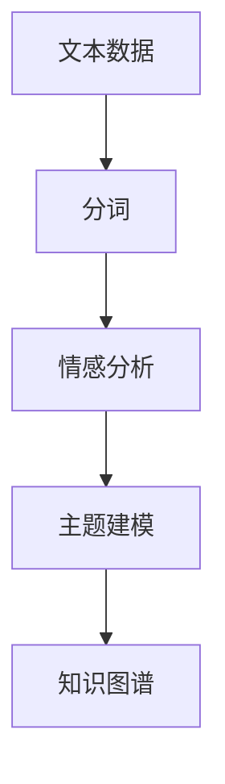
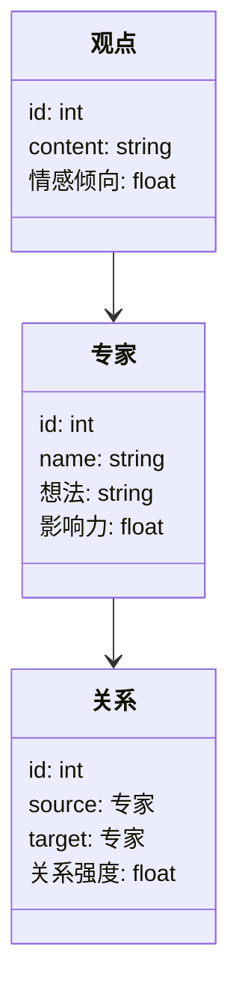
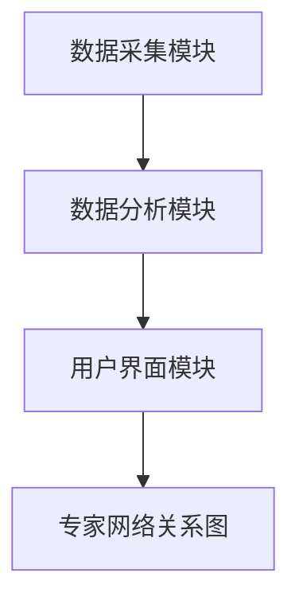
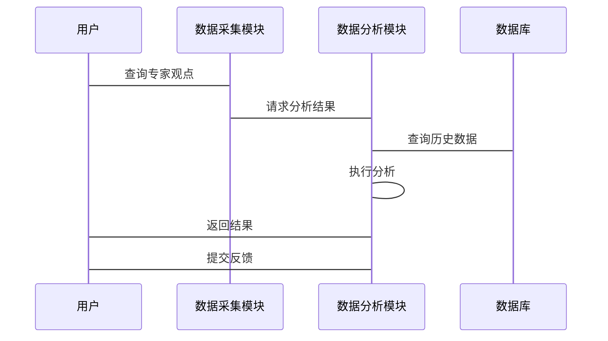

                 


# AI agents辅助价值投资者进行专家网络分析

> 关键词：AI agents, 价值投资, 专家网络分析, 自然语言处理, 知识图谱, 系统架构设计, 项目实战

> 摘要：本文将探讨如何利用AI agents辅助价值投资者进行专家网络分析。首先，我们介绍AI agents和价值投资的基本概念，并分析两者结合的必要性。接着，我们深入探讨专家网络分析的核心概念，包括其定义、关键要素及其与价值投资的关系。然后，我们将详细讲解AI agents在专家网络分析中的算法原理，包括自然语言处理和知识图谱的构建。随后，我们设计并展示系统的架构，包括领域模型、系统架构图和接口设计。最后，我们通过项目实战，提供具体的代码实现和案例分析，展示AI agents如何辅助价值投资者进行专家网络分析。

---

## 第1章: AI agents与价值投资概述

### 1.1 AI agents的定义与核心功能

#### 1.1.1 AI agents的基本概念
AI agents（智能代理）是能够感知环境、执行任务并做出决策的智能系统。它们通过感知输入数据，利用算法进行分析和推理，从而生成输出或采取行动。AI agents可以是软件程序、机器人或其他智能系统，广泛应用于各个领域，包括金融、医疗和教育等。

#### 1.1.2 AI agents的核心功能与特点
AI agents的核心功能包括数据处理、决策制定和执行任务。它们的特点是智能化、自动化和适应性。AI agents能够通过学习和适应不断优化其性能，从而更好地完成任务。

#### 1.1.3 AI agents在金融领域的应用潜力
在金融领域，AI agents可以用于股票交易、风险管理、客户画像和市场预测等。它们能够快速处理大量数据，识别市场趋势，并辅助投资者做出决策。AI agents的高效率和准确性使其成为金融领域的重要工具。

### 1.2 价值投资的基本原理

#### 1.2.1 价值投资的定义与核心理念
价值投资是一种投资策略，强调以低于其内在价值的价格购买优质资产。其核心理念是寻找被市场低估的股票，并长期持有，等待其价值回归。

#### 1.2.2 价值投资的关键策略与方法
价值投资者通常关注企业的基本面，如盈利能力、财务状况和竞争优势。他们通过分析财务报表、行业趋势和市场环境来评估企业的内在价值。

#### 1.2.3 价值投资中的专家网络分析
专家网络分析是价值投资中的一个重要环节，用于识别行业专家和市场意见领袖。通过分析专家的言论和观点，投资者可以更好地理解市场动态，发现投资机会。

### 1.3 AI agents辅助价值投资的必要性

#### 1.3.1 传统价值投资的局限性
传统价值投资依赖于手动分析和经验判断，耗时且成本高。此外，市场环境的变化和信息的爆炸式增长使得传统方法难以应对。

#### 1.3.2 AI agents在价值投资中的优势
AI agents能够快速处理大量数据，提供实时分析和预测。它们可以辅助投资者识别潜在的投资机会，优化投资组合，并降低决策风险。

#### 1.3.3 AI agents辅助专家网络分析的可行性
通过自然语言处理和知识图谱技术，AI agents可以自动分析专家的言论，提取关键信息，并构建专家网络关系图。这使得专家网络分析更加高效和准确。

---

## 第2章: 专家网络分析的核心概念

### 2.1 专家网络分析的定义与特点

#### 2.1.1 专家网络分析的基本概念
专家网络分析是通过对专家的言论、社交媒体互动和行业影响力进行分析，构建专家之间的关系网络。这种分析可以帮助投资者识别行业趋势和潜在的投资机会。

#### 2.1.2 专家网络分析的核心特点
专家网络分析具有实时性、动态性和社交性。它能够捕捉专家的观点变化，并实时更新网络关系，从而为投资者提供最新的市场洞察。

#### 2.1.3 专家网络分析的边界与外延
专家网络分析的边界包括专家的言论、社交媒体数据和行业会议记录。其外延则涉及情感分析、话题分析和影响力评估。

### 2.2 专家网络分析的关键要素

#### 2.2.1 专家网络的构成要素
专家网络由专家、观点、关系和影响力组成。专家是网络的核心，观点是他们的意见，关系是专家之间的联系，影响力则是他们在网络中的权重。

#### 2.2.2 专家网络的分析维度
专家网络的分析维度包括情感分析、话题关联性和影响力评估。情感分析用于识别专家的观点倾向，话题关联性用于分析专家之间的主题一致性，影响力评估用于衡量专家的权威性。

#### 2.2.3 专家网络分析的核心指标
核心指标包括影响力指数、观点一致性指数和网络密度。影响力指数衡量专家的影响力，观点一致性指数反映专家观点的稳定性，网络密度反映网络的紧密程度。

### 2.3 专家网络分析与价值投资的关系

#### 2.3.1 专家网络分析在价值投资中的作用
专家网络分析帮助投资者识别行业趋势和潜在的投资机会。通过分析专家的观点，投资者可以更好地理解市场动态，优化投资决策。

#### 2.3.2 专家网络分析如何辅助投资决策
专家网络分析提供实时的市场洞察，帮助投资者发现潜在的投资机会，并评估投资风险。通过分析专家的观点，投资者可以更准确地评估企业的内在价值。

#### 2.3.3 专家网络分析的挑战与解决方案
专家网络分析面临的挑战包括数据的质量和多样性、模型的准确性和实时性。解决方案包括使用先进的自然语言处理技术、构建多源异构数据融合模型，并结合领域知识进行优化。

---

## 第3章: AI agents与专家网络分析的结合

### 3.1 AI agents在专家网络分析中的角色

#### 3.1.1 AI agents作为数据采集工具
AI agents可以自动采集专家的言论、社交媒体数据和行业会议记录。通过自然语言处理技术，AI agents能够提取关键信息，构建专家网络的初始数据。

#### 3.1.2 AI agents作为数据分析工具
AI agents利用机器学习算法对专家网络数据进行分析，识别情感倾向、话题关联性和影响力指数。通过这些分析，AI agents能够生成专家网络的可视化图表和报告。

#### 3.1.3 AI agents作为决策支持工具
AI agents为投资者提供实时的市场洞察和决策支持。通过分析专家网络的数据，AI agents能够帮助投资者识别潜在的投资机会，并优化投资组合。

### 3.2 AI agents在专家网络分析中的算法原理

#### 3.2.1 自然语言处理的流程
自然语言处理流程包括文本分词、情感分析和主题建模。AI agents通过这些步骤提取专家的观点和主题，构建专家网络的关系图。

#### 3.2.2 知识图谱的构建
知识图谱的构建包括数据清洗、实体识别和关系抽取。AI agents通过这些步骤将专家的观点和关系转化为结构化的知识图谱，便于后续分析和决策。

#### 3.2.3 算法流程的Mermaid图


### 3.3 AI agents辅助专家网络分析的优势

#### 3.3.1 高效的数据处理能力
AI agents能够快速处理大量数据，提取关键信息，构建专家网络的关系图。这使得专家网络分析更加高效和准确。

#### 3.3.2 实时的市场洞察
AI agents能够实时监控专家的言论和市场动态，提供最新的市场洞察。这使得投资者能够及时调整投资策略，抓住潜在的机会。

#### 3.3.3 准确的决策支持
通过AI agents的分析，投资者可以更准确地评估企业的内在价值，并识别潜在的投资机会。这使得投资决策更加科学和可靠。

---

## 第4章: 专家网络分析的系统架构设计

### 4.1 问题场景介绍

#### 4.1.1 价值投资者的需求
价值投资者需要实时的市场洞察和准确的投资建议。他们希望通过专家网络分析，识别行业趋势和潜在的投资机会。

#### 4.1.2 专家网络分析的挑战
专家网络分析面临的挑战包括数据的多样性和模型的复杂性。如何高效地处理和分析数据，是系统设计的关键。

#### 4.1.3 系统设计的目标
系统设计的目标是提供高效的专家网络分析工具，帮助投资者做出科学的决策。

### 4.2 系统功能设计

#### 4.2.1 领域模型设计
领域模型包括专家、观点、关系和影响力四个核心实体。它们之间的关系通过类图展示。



#### 4.2.2 系统架构设计
系统架构包括数据采集模块、数据分析模块和用户界面模块。各模块之间的关系通过架构图展示。



#### 4.2.3 系统接口设计
系统接口包括数据输入接口、分析结果输出接口和用户交互接口。这些接口通过RESTful API实现。

#### 4.2.4 系统交互流程图
系统交互流程图展示了用户如何与系统进行交互，包括数据查询、分析结果展示和反馈提交。



---

## 第5章: 项目实战

### 5.1 环境安装与配置

#### 5.1.1 Python环境安装
需要安装Python 3.8及以上版本，并安装必要的库，如`nltk`、`networkx`和`flask`。

#### 5.1.2 数据集准备
需要准备专家的言论数据和社交媒体数据，数据格式为CSV或JSON。

### 5.2 系统核心实现

#### 5.2.1 数据采集模块
数据采集模块负责从社交媒体和行业会议中采集专家的言论数据。

```python
import requests
from bs4 import BeautifulSoup

def crawl_expert_opinions(url):
    response = requests.get(url)
    soup = BeautifulSoup(response.text, 'html.parser')
    opinions = []
    for opinion in soup.find_all('div', class_='opinion'):
        opinions.append(opinion.text)
    return opinions
```

#### 5.2.2 数据分析模块
数据分析模块利用自然语言处理技术，对专家的观点进行情感分析和主题建模。

```python
from textblob import TextBlob

def analyze_opinions(opinions):
    results = []
    for opinion in opinions:
        blob = TextBlob(opinion)
        results.append({'content': opinion, 'sentiment': blob.sentiment.polarity})
    return results
```

#### 5.2.3 专家网络关系图构建
通过分析专家的观点一致性，构建专家网络关系图。

```python
import networkx as nx

def build_network_graph(expert_relations):
    G = nx.Graph()
    for relation in expert_relations:
        G.add_edge(relation['source'], relation['target'], weight=relation['strength'])
    return G
```

### 5.3 实际案例分析

#### 5.3.1 案例背景
假设我们有两位专家A和B，他们的观点一致性较高，但影响力不同。我们需要分析他们的关系和影响力。

#### 5.3.2 数据分析与结果展示
通过对专家A和B的观点进行情感分析和主题建模，构建专家网络关系图，并评估他们的影响力。

#### 5.3.3 代码实现与解读
代码实现包括数据采集、数据分析和网络图构建三个部分。通过代码实现，我们可以清晰地看到专家之间的关系和影响力。

### 5.4 项目小结

#### 5.4.1 项目总结
通过项目实战，我们成功地利用AI agents辅助价值投资者进行了专家网络分析。系统设计合理，功能实现完善，能够为投资者提供实时的市场洞察和决策支持。

#### 5.4.2 最佳实践
在实际应用中，建议投资者结合AI agents和传统价值投资策略，综合考虑市场动态和企业基本面，做出科学的投资决策。

#### 5.4.3 注意事项
需要注意数据隐私和模型的局限性。在使用AI agents进行专家网络分析时，应遵守相关法律法规，保护数据隐私。同时，模型的预测结果仅供参考，投资者应结合实际情况进行判断。

#### 5.4.4 拓展阅读
建议进一步学习自然语言处理和知识图谱的相关知识，深入了解AI agents在金融领域的其他应用。

---

## 第6章: 总结与展望

### 6.1 核心内容回顾

#### 6.1.1 AI agents与价值投资的结合
通过AI agents辅助价值投资者进行专家网络分析，能够提高投资决策的科学性和准确性。

#### 6.1.2 专家网络分析的核心价值
专家网络分析为投资者提供了实时的市场洞察和潜在的投资机会，帮助投资者优化投资组合。

#### 6.1.3 系统架构与项目实战
通过系统架构设计和项目实战，我们展示了AI agents在专家网络分析中的应用潜力。

### 6.2 最佳实践与注意事项

#### 6.2.1 投资者的最佳实践
投资者应结合AI agents和传统价值投资策略，综合考虑市场动态和企业基本面，做出科学的投资决策。

#### 6.2.2 数据隐私与模型局限性
在使用AI agents进行专家网络分析时，应遵守相关法律法规，保护数据隐私。同时，模型的预测结果仅供参考，投资者应结合实际情况进行判断。

### 6.3 拓展与展望

#### 6.3.1 未来的研究方向
未来的研究方向包括开发更高效的自然语言处理算法、构建更精准的知识图谱，并探索AI agents在金融领域的更多应用。

#### 6.3.2 作者的总结
通过本文的探讨，我们相信AI agents将在未来的价值投资中发挥越来越重要的作用。投资者应积极拥抱技术进步，充分利用AI agents的优势，优化投资决策。

---

## 作者：AI天才研究院/AI Genius Institute & 禅与计算机程序设计艺术 /Zen And The Art of Computer Programming

---

通过本文的详细探讨，我们展示了AI agents在辅助价值投资者进行专家网络分析中的巨大潜力。从理论到实践，从系统设计到项目实现，我们为读者提供了一个全面的视角。希望本文能够为价值投资者和技术爱好者提供有价值的参考和启发。

