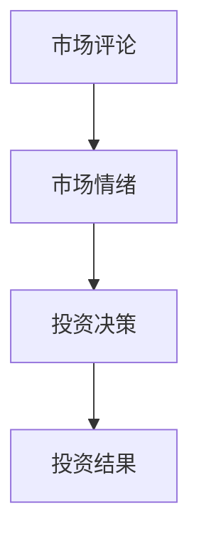
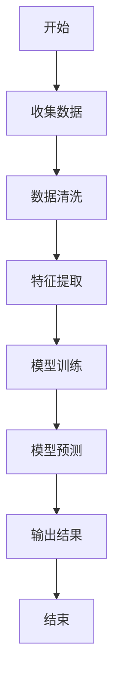
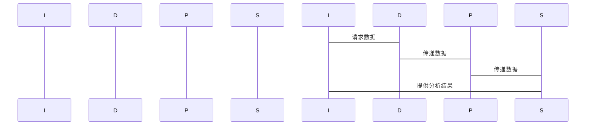

                 


# AI agents辅助价值投资者进行情绪分析

> 关键词：AI agents，情绪分析，价值投资，自然语言处理，投资决策

> 摘要：本文探讨了AI代理如何辅助价值投资者进行情绪分析，通过分析市场情绪数据，帮助投资者做出更明智的投资决策。文章详细介绍了情绪分析的核心概念、算法原理、系统架构设计以及项目实战，为读者提供全面的技术指导。

---

## 第一部分: AI agents辅助价值投资者进行情绪分析基础

### 第1章: 情绪分析与价值投资概述

#### 1.1 情绪分析的背景与意义

##### 1.1.1 问题背景
在金融市场上，投资者的决策往往受到市场情绪的影响。市场情绪是指市场参与者对当前市场状况的总体情绪状态，通常分为乐观、中性和悲观。准确理解和分析市场情绪可以帮助投资者识别市场的趋势和潜在风险。

##### 1.1.2 问题描述
情绪分析的核心在于从文本数据中提取情感信息。然而，手动分析大量的市场评论和新闻报道耗时且效率低下，容易受到主观因素的影响。因此，如何利用AI技术自动分析市场情绪，辅助投资者做出决策成为一个重要的研究方向。

##### 1.1.3 问题解决
通过AI代理对市场情绪数据进行自动化分析，可以快速提取关键信息，帮助投资者做出更明智的投资决策。

##### 1.1.4 边界与外延
情绪分析的范围包括新闻标题、社交媒体评论、投资者论坛讨论等。边界在于数据的准确性和完整性，以及模型的训练数据是否足够代表市场情绪。

##### 1.1.5 核心要素组成
情绪分析的核心要素包括数据源、特征提取方法、分类算法和结果解读。

#### 1.2 价值投资与情绪分析的结合

##### 1.2.1 价值投资的核心理念
价值投资强调长期投资，关注公司的内在价值，而非短期市场波动。通过分析公司的财务状况、行业地位和竞争优势，投资者寻找被市场低估的投资标的。

##### 1.2.2 情绪分析在投资中的作用
情绪分析可以帮助投资者识别市场过度乐观或悲观的情况，避免盲目跟风或恐慌抛售。通过分析市场情绪，投资者可以更好地把握市场的短期波动，辅助制定投资策略。

##### 1.2.3 AI agents在投资决策中的应用
AI代理可以实时监控市场情绪数据，分析其对资产价格的影响，并向投资者提供实时建议。例如，当市场情绪过于乐观时，AI代理可以提醒投资者注意潜在的回调风险。

#### 1.3 AI agents与情绪分析的基本概念

##### 1.3.1 AI agents的定义
AI代理（Artificial Intelligence Agents）是指具有感知和行动能力的智能体，能够通过传感器接收环境信息，并通过执行器对环境做出反应。在金融领域，AI代理可以用来分析市场数据、预测价格走势并辅助投资决策。

##### 1.3.2 情绪分析的定义
情绪分析（Sentiment Analysis）是自然语言处理（NLP）的一个分支，旨在识别和分析文本中的情感倾向。在金融领域，情绪分析常用于评估市场参与者的整体情绪状态。

##### 1.3.3 两者结合的实现方式
通过自然语言处理技术，AI代理可以从文本数据中提取情感信息，分析市场情绪，并结合其他数据源（如财务数据、市场指标）进行综合评估，帮助投资者制定投资策略。

---

## 第2章: 情绪分析的核心概念与联系

### 2.1 情绪分析的原理

#### 2.1.1 文本预处理
文本预处理是情绪分析的基础，包括去除停用词、分词、去除标点符号等步骤。例如，对于一条新闻标题“市场乐观”，预处理步骤包括去除停用词和标点符号，提取关键词。

#### 2.1.2 特征提取
特征提取是将文本数据转换为数值向量的过程。常用的方法包括TF-IDF、Word2Vec和BERT模型。例如，使用TF-IDF提取关键词的权重，使用Word2Vec提取词向量。

#### 2.1.3 情感分类
情感分类是将文本数据分为积极、消极或中性三类。常用算法包括朴素贝叶斯、支持向量机和神经网络。例如，使用朴素贝叶斯算法对新闻标题进行分类，判断其情感倾向。

### 2.2 AI agents的运作机制

#### 2.2.1 信息收集
AI代理通过网络爬虫收集市场评论、新闻报道等文本数据。

#### 2.2.2 数据处理
对收集到的文本数据进行清洗、分词和特征提取，提取有用的信息。

#### 2.2.3 情感分析
使用训练好的情绪分析模型对数据进行分类，判断市场情绪。

#### 2.2.4 决策输出
根据分析结果，生成投资建议，如买入、卖出或持有。

### 2.3 情绪分析与价值投资的关系

#### 2.3.1 情绪分析对投资决策的影响
市场情绪可以影响资产价格的短期波动。通过分析市场情绪，投资者可以更好地把握市场的买卖时机。

#### 2.3.2 AI agents如何辅助投资决策
AI代理可以通过实时监控市场情绪数据，提供及时的投资建议。例如，当市场情绪过于乐观时，AI代理可以提醒投资者注意潜在的风险。

### 2.4 核心概念对比表格

| 情感分类方法 | 原理 | 优缺点 |
|--------------|------|--------|
| 朴素贝叶斯 | 基于概率统计 | 简单高效，但对数据分布假设敏感 |
| 支持向量机 | 基于几何间隔最大化 | 分类性能较好，但计算复杂度较高 |
| 神经网络 | 基于层次化特征提取 | 高精度，但需要大量数据和计算资源 |

### 2.5 ER实体关系图



---

## 第3章: 情绪分析算法原理

### 3.1 基于文本的特征提取

#### 3.1.1 TF-IDF方法
TF-IDF（Term Frequency-Inverse Document Frequency）是一种常用的文本特征提取方法。TF表示词频，IDF表示逆文档频率，用于衡量词语的重要性。公式如下：

$$TF-IDF(t, d) = TF(t, d) \times \ln\left(\frac{N}{DF(t)}\right)$$

其中，$N$是语料库中的文档总数，$DF(t)$是词语$t$出现的文档数。

#### 3.1.2 Word2Vec模型
Word2Vec是一种通过词嵌入技术将词语转换为向量表示的模型。训练好的Word2Vec模型可以将每个词语映射到一个低维向量空间。

#### 3.1.3 BERT模型
BERT（Bidirectional Encoder Representations from Transformers）是一种基于Transformer的预训练语言模型。它通过双向上下文信息，生成更准确的词向量。

### 3.2 情感分类算法

#### 3.2.1 朴素贝叶斯算法
朴素贝叶斯是一种基于概率统计的分类算法。其核心思想是计算每个类别的条件概率，并根据最大后验概率原则进行分类。

#### 3.2.2 支持向量机算法
支持向量机是一种基于几何间隔最大化的线性分类器。通过将数据映射到高维空间，找到一个超平面，将数据分为两类。

#### 3.2.3 神经网络算法
神经网络是一种基于层次化特征提取的分类器。通过多层感知机，模型可以自动学习数据的特征，并进行分类。

### 3.3 AI agents的算法实现

#### 3.3.1 信息收集模块
AI代理通过网络爬虫收集市场评论和新闻报道。

#### 3.3.2 数据处理模块
对收集到的文本数据进行清洗、分词和特征提取。

#### 3.3.3 情感分析模块
使用训练好的情绪分析模型对数据进行分类，判断市场情绪。

#### 3.3.4 决策输出模块
根据分析结果，生成投资建议，如买入、卖出或持有。

### 3.4 算法流程图



---

## 第4章: 系统分析与架构设计

### 4.1 项目背景与目标

#### 4.1.1 项目背景
随着金融市场的复杂化，投资者需要更高效的方法来分析市场情绪。AI代理可以通过自动化分析，帮助投资者做出更明智的决策。

#### 4.1.2 项目目标
开发一个基于AI代理的情绪分析系统，辅助投资者进行价值投资。

### 4.2 系统功能设计

#### 4.2.1 领域模型
领域模型描述了系统的功能模块及其交互关系。例如，数据采集模块负责收集市场评论，分析模块负责进行情绪分析。

#### 4.2.2 功能模块划分
- 数据采集模块
- 数据处理模块
- 情感分析模块
- 决策输出模块

### 4.3 系统架构设计

#### 4.3.1 分层架构
系统分为数据层、业务逻辑层和用户界面层。数据层负责存储和管理数据，业务逻辑层负责处理逻辑，用户界面层负责与用户交互。

#### 4.3.2 模块交互
模块之间的交互通过接口进行。例如，数据采集模块将数据传递给数据处理模块，数据处理模块将处理后的数据传递给情感分析模块。

### 4.4 系统接口设计

#### 4.4.1 数据接口
数据接口用于模块之间的数据传递。例如，数据采集模块与数据处理模块之间的接口。

#### 4.4.2 用户接口
用户界面是投资者与系统交互的界面。投资者可以通过界面查看市场情绪分析结果和投资建议。

### 4.5 系统交互流程

#### 4.5.1 序列图



---

## 第5章: 项目实战

### 5.1 环境安装与配置

#### 5.1.1 Python环境
安装Python 3.8及以上版本，并安装必要的库，如numpy、pandas、scikit-learn、transformers等。

### 5.2 核心代码实现

#### 5.2.1 数据采集模块

```python
import requests

def collect_data(url):
    response = requests.get(url)
    return response.text
```

#### 5.2.2 数据处理模块

```python
import re

def preprocess(text):
    text = re.sub(r'[^\w\s]', '', text)
    return text.lower().split()
```

#### 5.2.3 情感分析模块

```python
from sklearn.naive_bayes import MultinomialNB

def train_model(X, y):
    model = MultinomialNB()
    model.fit(X, y)
    return model

def predict_model(model, X):
    return model.predict(X)
```

### 5.3 案例分析

假设我们有一个新闻标题：“市场乐观，股票上涨”。经过预处理后，提取关键词“乐观”和“上涨”。使用训练好的模型进行分类，结果为积极情绪。

### 5.4 项目小结

通过实际案例分析，展示了AI代理如何辅助投资者进行情绪分析。实践证明，AI代理可以显著提高分析效率和准确性。

---

## 第六章: 最佳实践与小结

### 6.1 最佳实践

- 数据质量：确保数据来源可靠，避免噪声干扰。
- 模型选择：根据实际需求选择合适的算法，如使用BERT模型进行深度学习。
- 持续优化：定期更新模型，适应市场变化。

### 6.2 小结

本文详细介绍了AI代理如何辅助价值投资者进行情绪分析。通过背景介绍、核心概念、算法原理、系统设计和项目实战，为读者提供了全面的技术指导。未来的研究方向包括更复杂的模型和多模态数据的分析。

---

## 作者

作者：AI天才研究院/AI Genius Institute & 禅与计算机程序设计艺术 /Zen And The Art of Computer Programming

