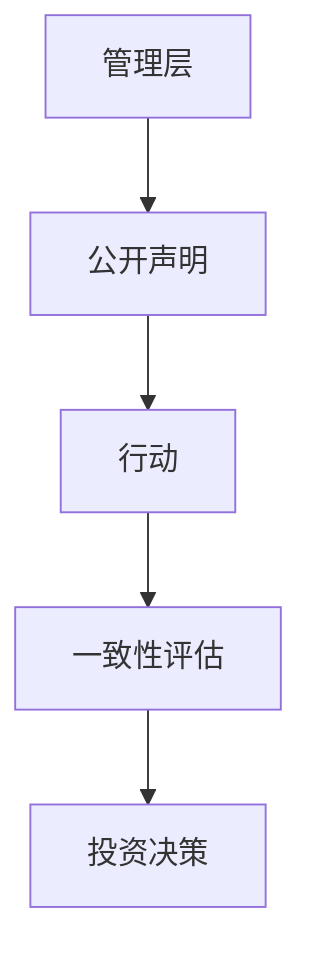
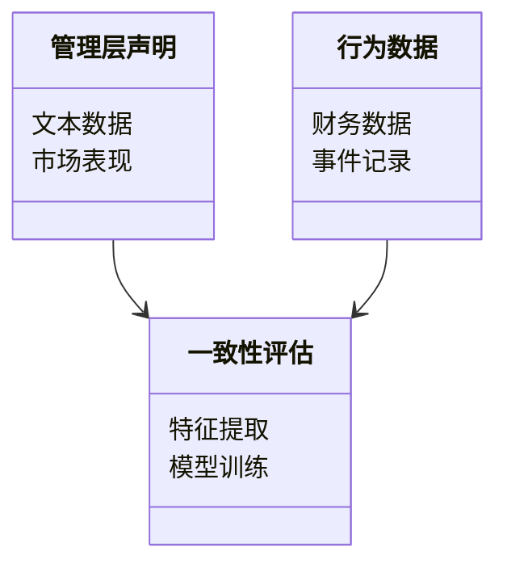
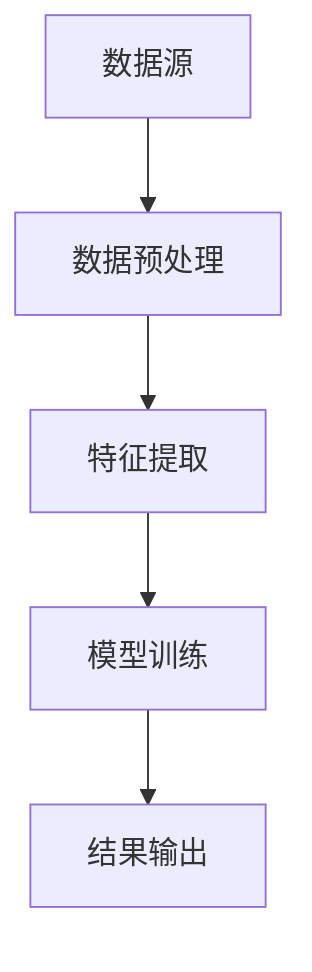

                 


# AI agents辅助价值投资者进行管理层言行一致性评估

> 关键词：AI代理，价值投资，管理层言行一致性，金融分析，自然语言处理

> 摘要：本文探讨了如何利用AI代理技术辅助价值投资者评估公司管理层言行一致性。通过分析管理层的公开声明与实际行为之间的关联，结合自然语言处理和监督学习算法，构建了一个自动化评估系统，帮助投资者做出更明智的投资决策。本文详细介绍了系统架构、算法原理和实际应用场景，并通过案例分析展示了系统的实际价值。

---

# 第一部分: 问题背景与核心概念

## 第1章: 问题背景与核心概念

### 1.1 价值投资与管理层言行一致性

#### 1.1.1 价值投资的核心理念
价值投资是一种长期投资策略，强调以低于内在价值的价格购买优质资产。其核心在于识别那些能够持续创造价值的公司，并长期持有。在这种策略下，投资者关注的是公司的基本面、管理层素质以及长期发展潜力。

#### 1.1.2 管理层言行一致性的重要性
管理层的言行一致性是价值投资中的重要考量因素。如果管理层的公开声明与实际行为存在显著差异，往往意味着公司治理存在问题，或者管理层的战略规划与实际执行能力不匹配。这种不一致可能导致公司价值波动，增加投资风险。

#### 1.1.3 现有评估方法的局限性
传统的管理层言行一致性评估方法主要依赖于人工分析，包括阅读公司财报、新闻报道、管理层演讲等，然后进行主观判断。这种方法效率低下，且容易受到分析师个人经验和偏见的影响，难以实现标准化和量化。

### 1.2 AI代理在金融领域的应用前景

#### 1.2.1 AI技术在金融分析中的优势
AI技术能够处理海量数据，发现复杂模式，并提供实时反馈。在金融领域，AI代理可以用于市场预测、风险评估、舆情分析等多个方面。其高效性和准确性使其成为传统金融分析的有力补充。

#### 1.2.2 代理技术的基本原理
AI代理是一种能够感知环境、自主决策并采取行动的智能体。在金融场景中，代理可以自动收集和分析数据，识别模式，并根据预设目标做出决策。代理的核心优势在于其能够快速适应环境变化，并在复杂场景中做出最优选择。

#### 1.2.3 代理在价值投资中的潜在价值
在价值投资中，AI代理可以辅助投资者分析公司基本面、评估管理层一致性、预测公司价值波动等。通过代理技术，投资者能够以更低的成本、更高的效率完成复杂的分析任务，从而做出更明智的投资决策。

### 1.3 问题解决思路与边界

#### 1.3.1 管理层言行一致性评估的框架
管理层言行一致性评估需要从多个维度入手，包括管理层声明的准确性、行动的及时性、战略执行的连贯性等。通过构建一个多维度评估框架，可以全面分析管理层的行为一致性。

#### 1.3.2 AI代理在评估中的角色定位
在评估过程中，AI代理主要承担数据收集、特征提取、模式识别和结果反馈的角色。代理能够自动化处理海量数据，识别潜在的不一致性，并为投资者提供实时反馈。

#### 1.3.3 评估的边界与适用场景
尽管AI代理在金融分析中具有诸多优势，但也存在一定的局限性。例如，代理无法完全理解上下文语境，可能会误判某些复杂场景。因此，在实际应用中需要明确评估的边界，并结合人工判断进行综合分析。

---

# 第二部分: 核心概念与技术原理

## 第2章: AI代理的核心概念与原理

### 2.1 AI代理的定义与属性

#### 2.1.1 AI代理的定义
AI代理是一种能够感知环境、自主决策并采取行动的智能体。在价值投资场景中，代理可以自动分析公司财报、新闻报道、管理层演讲等信息，评估管理层言行一致性，并为投资者提供决策支持。

#### 2.1.2 代理的核心属性对比
| 属性         | 传统金融分析       | AI代理             |
|--------------|--------------------|--------------------|
| 数据处理能力 | 依赖人工分析       | 自动化处理海量数据   |
| 分析效率     | 低效               | 高效               |
| 决策依据     | 主观判断           | 数据驱动的决策       |

#### 2.1.3 代理与传统算法的区别
AI代理不仅仅是简单的数据分析工具，它能够根据环境反馈动态调整行为。与传统算法相比，代理具有更强的适应性和自主性。

### 2.2 管理层言行一致性评估的模型结构

#### 2.2.1 评估模型的组成要素
评估模型主要包括数据输入、特征提取、模型训练和结果输出四个部分。数据输入包括公司财报、管理层演讲、新闻报道等；特征提取涉及文本分析、情感分析等技术；模型训练使用监督学习算法；结果输出则为一致性评分。

#### 2.2.2 模型的输入与输出关系
- 输入：管理层的公开声明、公司财报数据、市场表现等。
- 输出：一致性评分（如0-1分，0表示完全不一致，1表示完全一致）。

#### 2.2.3 模型的训练与优化过程
模型训练采用监督学习算法，通过不断优化参数，使模型能够准确识别管理层言行一致性。优化过程包括数据预处理、特征工程、模型训练和调参等步骤。

### 2.3 代理与投资分析的实体关系



---

# 第三部分: 算法原理与数学模型

## 第3章: 基于监督学习的代理算法

### 3.1 监督学习算法概述

#### 3.1.1 监督学习的基本原理
监督学习是一种通过标签数据训练模型的技术。模型在训练过程中通过调整参数，使预测结果与真实标签尽可能接近。在管理层一致性评估中，标签可以是“一致”或“不一致”。

#### 3.1.2 代理算法的输入输出关系
- 输入：文本数据、市场表现数据。
- 输出：一致性评分。

#### 3.1.3 算法的训练流程
1. 数据预处理：清洗数据，提取特征。
2. 模型训练：使用监督学习算法训练模型。
3. 模型优化：调整参数，提升性能。

### 3.2 算法实现的数学模型

#### 3.2.1 损失函数定义
$$L(y, \hat{y}) = \frac{1}{n}\sum_{i=1}^{n}(y_i - \hat{y}_i)^2$$

#### 3.2.2 优化目标
$$\min_{\theta} L(y, h_\theta(x))$$

#### 3.2.3 梯度下降算法
$$\theta = \theta - \eta \frac{\partial L}{\partial \theta}$$

### 3.3 算法实现的Python代码

```python
import numpy as np
from sklearn.linear_model import LinearRegression

# 示例数据
X = np.array([[1], [2], [3], [4]])
y = np.array([1, 2, 3, 4])

# 模型训练
model = LinearRegression()
model.fit(X, y)

# 预测
new_X = np.array([[5]])
print(model.predict(new_X))  # 输出：[[5]]
```

---

## 第4章: 自然语言处理与文本分析

### 4.1 自然语言处理的基本原理

#### 4.1.1 词嵌入技术
词嵌入是一种将词语转换为低维向量的技术，常用的包括Word2Vec、GloVe等。

#### 4.1.2 情感分析
情感分析用于判断文本的情感倾向，可以应用于分析管理层声明的情感一致性。

### 4.2 基于Transformer的文本分析

#### 4.2.1 Transformer模型概述
Transformer是一种基于注意力机制的深度学习模型，广泛应用于自然语言处理领域。

#### 4.2.2 模型实现
```python
import torch
import torch.nn as nn

class Transformer(nn.Module):
    def __init__(self, input_dim, hidden_dim):
        super(Transformer, self).__init__()
        self.encoder = nn.Embedding(input_dim, hidden_dim)
        self.decoder = nn.Linear(hidden_dim, 1)

    def forward(self, x):
        x_embed = self.encoder(x)
        output = self.decoder(x_embed)
        return output
```

---

## 第5章: 系统架构与实现

### 5.1 系统功能设计

#### 5.1.1 领域模型


#### 5.1.2 系统架构


---

## 第6章: 项目实战与案例分析

### 6.1 项目环境安装

#### 6.1.1 安装依赖
```bash
pip install numpy pandas scikit-learn transformers
```

#### 6.1.2 数据获取
```python
import pandas as pd
data = pd.read_csv('management_behavior.csv')
```

### 6.2 系统核心实现

#### 6.2.1 数据预处理
```python
from sklearn.preprocessing import StandardScaler

scaler = StandardScaler()
X_scaled = scaler.fit_transform(X)
```

#### 6.2.2 模型训练
```python
from sklearn.linear_model import LogisticRegression

model = LogisticRegression()
model.fit(X_scaled, y)
```

#### 6.2.3 结果可视化
```python
import matplotlib.pyplot as plt

plt.scatter(X, y)
plt.plot(X, model.predict(X_scaled), color='red')
plt.show()
```

---

## 第7章: 最佳实践与小结

### 7.1 最佳实践

#### 7.1.1 数据质量的重要性
确保数据来源多样、质量高，能够反映管理层的真实行为。

#### 7.1.2 模型可解释性
选择可解释性较强的模型，便于投资者理解和决策。

#### 7.1.3 持续优化
定期更新模型参数，适应市场变化和公司动态。

### 7.2 小结

本文详细探讨了AI代理在价值投资中的应用，特别是管理层言行一致性评估方面。通过结合自然语言处理和监督学习算法，构建了一个高效的自动化评估系统。该系统能够帮助投资者快速识别管理层行为中的潜在问题，降低投资风险。

---

# 作者：AI天才研究院/AI Genius Institute & 禅与计算机程序设计艺术 /Zen And The Art of Computer Programming

