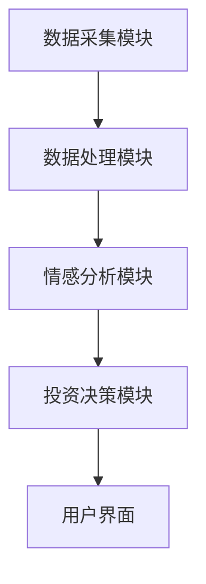

                 


# AI agents辅助价值投资者进行舆情分析

> **关键词**：AI agents，价值投资者，舆情分析，自然语言处理，情感分析，投资决策

> **摘要**：本文详细探讨了AI agents在辅助价值投资者进行舆情分析中的应用。通过分析价值投资的核心理论、舆情分析的技术基础以及AI agents的算法原理，本文展示了如何利用AI技术提升投资决策的效率和准确性。文章还结合实际案例，详细讲解了AI agents在舆情分析中的实现过程，并提出了最佳实践建议。

---

## 第1章: AI agents与价值投资概述

### 1.1 AI agents的基本概念

#### 1.1.1 AI agents的定义与特点
AI agents（人工智能代理）是指能够感知环境并采取行动以实现特定目标的智能实体。与传统程序不同，AI agents具有以下特点：
- **自主性**：能够在没有外部干预的情况下自主运行。
- **反应性**：能够实时感知环境并做出反应。
- **目标导向**：所有行为都以实现特定目标为导向。
- **学习能力**：能够通过数据和经验不断优化自身的性能。

#### 1.1.2 AI agents的核心技术
AI agents的核心技术包括：
- **自然语言处理（NLP）**：用于理解和生成人类语言。
- **机器学习**：用于从数据中学习模式和规律。
- **强化学习**：用于在动态环境中优化决策。
- **知识图谱**：用于构建和管理知识库。

#### 1.1.3 AI agents在金融领域的应用
在金融领域，AI agents的主要应用包括：
- **股票交易**：通过算法交易实现自动化投资。
- **风险控制**：通过实时监控和分析，识别和规避风险。
- **客户服务**：通过智能客服为投资者提供个性化服务。

### 1.2 价值投资的基本原理

#### 1.2.1 价值投资的定义与核心理念
价值投资是一种以内在价值为导向的投资策略，其核心理念是通过分析企业的基本面，寻找被市场低估的投资标的。价值投资的核心要素包括：
- **基本面分析**：分析企业的财务状况、盈利能力和发展前景。
- **市场情绪分析**：分析市场的整体情绪和投资者的心理。
- **长期投资**：注重长期回报，而非短期波动。

#### 1.2.2 价值投资的三大要素
1. **价格**：市场的价格反映企业的内在价值。
2. **价值**：企业的内在价值是其未来现金流的现值。
3. **安全边际**：以低于内在价值的价格买入，以确保投资的安全性。

#### 1.2.3 AI agents与价值投资的结合
AI agents可以通过以下方式辅助价值投资者：
- **数据收集与处理**：快速收集和处理大量的市场数据。
- **情感分析**：分析市场情绪，识别潜在的投资机会。
- **决策支持**：基于数据和模型提供投资建议。

### 1.3 舆情分析在价值投资中的作用

#### 1.3.1 舆情分析的定义与分类
舆情分析是指对公开信息（如新闻、社交媒体、论坛等）进行分析，以了解市场情绪和公众态度的过程。舆情分析可以分为以下几类：
- **文本分析**：通过分析文本内容，识别情感倾向。
- **情绪分析**：通过量化情绪强度，评估市场情绪。
- **趋势分析**：通过分析舆情的变化趋势，预测市场走势。

#### 1.3.2 舆情分析在价值投资中的应用场景
在价值投资中，舆情分析的主要应用场景包括：
- **市场情绪监控**：通过监控市场情绪，识别市场的过度乐观或悲观。
- **投资机会识别**：通过分析舆情，发现被市场低估的投资标的。
- **风险预警**：通过舆情分析，提前识别潜在的风险。

#### 1.3.3 舆情分析的挑战与解决方案
舆情分析的挑战主要包括：
- **数据噪声**：公开信息中存在大量噪声，影响分析的准确性。
- **情绪偏差**：市场情绪可能受到外部因素的影响，导致分析结果偏差。
- **数据实时性**：需要实时监控舆情，对计算能力和资源提出了更高要求。

### 1.4 本章小结
本章介绍了AI agents的基本概念、价值投资的核心原理以及舆情分析在价值投资中的作用。通过结合AI技术，价值投资者可以更高效地进行舆情分析，提升投资决策的准确性和效率。

---

## 第2章: 价值投资与AI agents的结合

### 2.1 价值投资的理论基础

#### 2.1.1 基本面分析
基本面分析是价值投资的核心方法之一，主要包括对企业财务状况、盈利能力和发展前景的分析。以下是基本面分析的主要指标：
- **市盈率（P/E）**：市盈率=股价/每股收益。
- **市净率（P/B）**：市净率=股价/每股净资产。
- **股息率**：股息率=股息/股价。

#### 2.1.2 技术分析
技术分析是通过分析历史价格和成交量的变化，预测未来价格走势的方法。技术分析的主要工具包括：
- **K线图**：用于显示价格的变化趋势。
- **移动平均线**：用于平滑价格波动，识别趋势。
- **技术指标**：如RSI（相对强弱指数）、MACD（移动平均收敛散度）等。

#### 2.1.3 市场情绪分析
市场情绪分析是通过分析市场的整体情绪，预测市场走势的方法。市场情绪分析的主要指标包括：
- **VIX指数**：反映市场的波动性和投资者情绪。
- **资金流向**：分析资金的流入和流出情况。
- **新闻情绪**：通过分析新闻的关键词和情感倾向，评估市场的整体情绪。

### 2.2 AI agents在价值投资中的角色

#### 2.2.1 数据收集与处理
AI agents可以通过以下方式收集和处理数据：
- **新闻爬取**：通过爬虫技术，获取新闻网站和社交媒体上的信息。
- **数据清洗**：对收集到的数据进行清洗和预处理，去除噪声。
- **数据存储**：将清洗后的数据存储在数据库中，便于后续分析。

#### 2.2.2 情感分析与市场情绪预测
AI agents可以通过情感分析技术，对公开信息进行分析，评估市场的整体情绪。以下是情感分析的主要步骤：
1. **数据预处理**：对文本数据进行分词、去除停用词等处理。
2. **特征提取**：提取文本的特征，如TF-IDF（词频-逆文档频率）。
3. **模型训练**：使用机器学习算法（如SVM、随机森林）或深度学习模型（如LSTM、BERT）进行情感分类。

#### 2.2.3 投资决策支持
AI agents可以通过以下方式为投资决策提供支持：
- **多因子模型**：结合基本面和技术指标，构建多因子模型，预测股票价格。
- **风险评估**：通过分析舆情和市场情绪，评估投资风险。
- **投资组合优化**：根据市场状况和投资目标，优化投资组合。

### 2.3 舆情分析与价值投资的结合

#### 2.3.1 舆情分析在投资决策中的应用
舆情分析在投资决策中的应用包括：
- **投资机会识别**：通过分析舆情，发现被市场低估的投资标的。
- **风险预警**：通过舆情分析，提前识别潜在的风险。
- **投资策略优化**：根据舆情分析结果，动态调整投资策略。

#### 2.3.2 舆情分析的量化指标
舆情分析的量化指标包括：
- **情感强度**：情感强度=正面情感占比-负面情感占比。
- **情感趋势**：情感趋势=近期情感强度-历史情感强度。
- **情感关联**：情感关联=相关关键词的出现频率。

#### 2.3.3 舆情分析的局限性与改进方向
舆情分析的局限性包括：
- **数据噪声**：公开信息中存在大量噪声，影响分析的准确性。
- **情绪偏差**：市场情绪可能受到外部因素的影响，导致分析结果偏差。
- **数据实时性**：需要实时监控舆情，对计算能力和资源提出了更高要求。

### 2.4 本章小结
本章详细探讨了价值投资与AI agents的结合，介绍了AI agents在价值投资中的角色以及舆情分析在投资决策中的应用。通过结合AI技术，价值投资者可以更高效地进行舆情分析，提升投资决策的准确性和效率。

---

## 第3章: 舆情分析的技术基础

### 3.1 自然语言处理（NLP）基础

#### 3.1.1 NLP的基本概念与技术
自然语言处理（NLP）是计算机科学、人工智能、语言学的交叉学科，主要研究如何让计算机理解和生成人类语言。以下是NLP的主要技术：
- **分词**：将文本分割成词语或短语。
- **词性标注**：对词语进行词性标注，如名词、动词、形容词等。
- **句法分析**：分析句子的语法结构。
- **语义分析**：理解文本的语义含义。

#### 3.1.2 常见的NLP任务与模型
常见的NLP任务包括：
- **文本分类**：将文本分为不同的类别，如正面、负面、中性。
- **情感分析**：分析文本的情感倾向。
- **命名实体识别**：识别文本中的实体，如人名、地名、组织名。

常用的NLP模型包括：
- **词袋模型（Bag-of-Words）**：将文本表示为词袋，不考虑词序。
- **TF-IDF**：通过计算词频-逆文档频率，提取关键词。
- **Word2Vec**：通过上下文预测词向量，生成词嵌入。
- **GloVe**：通过全局词嵌入，生成词向量。
- **BERT**：基于Transformer的预训练模型，用于多种NLP任务。

#### 3.1.3 NLP在舆情分析中的应用
在舆情分析中，NLP的主要应用包括：
- **情感分析**：通过NLP技术，分析文本的情感倾向。
- **主题分析**：通过主题模型（如LDA、LSA），识别文本的主题。
- **实体识别**：识别文本中的实体，如公司名称、人名等。

### 3.2 情感分析的原理与方法

#### 3.2.1 情感分析的定义与分类
情感分析是指对文本的情感倾向进行分类的过程。情感分析可以分为以下几类：
- **二元分类**：将情感分为正面和负面。
- **多分类**：将情感分为正面、中性、负面。
- **情感强度分析**：不仅分类情感倾向，还量化情感强度。

#### 3.2.2 基于规则的情感分析
基于规则的情感分析方法主要通过预设的规则和词典进行情感分类。以下是基于规则的情感分析的主要步骤：
1. **情感词典**：建立情感词典，包含正面词汇、负面词汇和中性词汇。
2. **情感计数**：统计文本中正面词汇和负面词汇的数量，计算情感倾向。
3. **情感强度**：根据正面词汇和负面词汇的数量，计算情感强度。

#### 3.2.3 基于机器学习的情感分析
基于机器学习的情感分析方法通过训练模型，实现情感分类。以下是基于机器学习的情感分析的主要步骤：
1. **数据预处理**：对文本进行分词、去停用词等处理。
2. **特征提取**：提取文本的特征，如TF-IDF、词袋模型。
3. **模型训练**：使用机器学习算法（如SVM、随机森林）进行情感分类。

#### 3.2.4 基于深度学习的情感分析
基于深度学习的情感分析方法通过神经网络模型，实现情感分类。以下是基于深度学习的情感分析的主要步骤：
1. **数据预处理**：对文本进行分词、去停用词等处理。
2. **特征提取**：提取文本的特征，如词嵌入（Word2Vec、GloVe）。
3. **模型训练**：使用深度学习模型（如LSTM、BERT）进行情感分类。

### 3.3 舆情分析系统的构建

#### 3.3.1 数据采集与预处理
舆情分析系统的数据采集与预处理步骤包括：
1. **数据采集**：通过爬虫技术，采集新闻、社交媒体等公开信息。
2. **数据清洗**：去除噪声数据，如特殊符号、停用词等。
3. **数据存储**：将清洗后的数据存储在数据库中，便于后续分析。

#### 3.3.2 情感分析模型的选择与训练
情感分析模型的选择与训练步骤包括：
1. **特征提取**：选择合适的特征提取方法，如TF-IDF、词嵌入。
2. **模型选择**：选择合适的模型，如机器学习模型（SVM、随机森林）或深度学习模型（LSTM、BERT）。
3. **模型训练**：使用训练数据，训练情感分析模型。

#### 3.3.3 舆情分析系统的实现
舆情分析系统的实现步骤包括：
1. **数据采集**：通过爬虫技术，采集新闻、社交媒体等公开信息。
2. **数据清洗**：去除噪声数据，如特殊符号、停用词等。
3. **情感分析**：使用训练好的情感分析模型，对文本进行情感分类。
4. **结果可视化**：将分析结果可视化，如情感强度分布图。

### 3.4 本章小结
本章详细介绍了舆情分析的技术基础，包括自然语言处理（NLP）的基本概念与技术、情感分析的原理与方法以及舆情分析系统的构建。通过结合NLP技术和情感分析方法，可以有效提升舆情分析的准确性和效率。

---

## 第4章: AI agents的算法原理

### 4.1 强化学习的原理与应用

#### 4.1.1 强化学习的定义与核心概念
强化学习是一种机器学习范式，通过智能体与环境的交互，学习最优策略。强化学习的核心概念包括：
- **状态（State）**：智能体所处的环境状态。
- **动作（Action）**：智能体根据当前状态做出的动作。
- **奖励（Reward）**：智能体动作后，环境给予的反馈。
- **策略（Policy）**：智能体根据当前状态选择动作的概率分布。

#### 4.1.2 强化学习的核心算法
强化学习的核心算法包括：
- **Q-learning**：通过Q值函数，学习状态-动作价值。
- **Deep Q-Networks（DQN）**：通过深度神经网络，近似Q值函数。
- **Actor-Critic**：通过两个网络（Actor和Critic），分别学习策略和价值函数。

#### 4.1.3 强化学习在AI agents中的应用
在AI agents中，强化学习的主要应用包括：
- **游戏AI**：通过强化学习，训练游戏AI，实现最优策略。
- **机器人控制**：通过强化学习，训练机器人，实现自主决策。
- **金融交易**：通过强化学习，训练交易AI，实现自动化交易。

### 4.2 注意力机制的原理与应用

#### 4.2.1 注意力机制的定义与核心概念
注意力机制是一种神经网络机制，用于关注输入中的重要部分。注意力机制的核心概念包括：
- **查询（Query）**：表示当前任务的查询向量。
- **键（Key）**：表示输入数据的键向量。
- **值（Value）**：表示输入数据的值向量。
- **注意力权重**：表示查询与键之间的相关性权重。

#### 4.2.2 注意力机制的核心算法
注意力机制的核心算法包括：
- **自注意力机制**：查询、键、值都来自同一输入序列。
- **交叉注意力机制**：查询来自一个序列，键和值来自另一个序列。

#### 4.2.3 注意力机制在AI agents中的应用
在AI agents中，注意力机制的主要应用包括：
- **文本摘要**：通过注意力机制，生成文本摘要。
- **机器翻译**：通过注意力机制，实现神经机器翻译。
- **图像识别**：通过注意力机制，识别图像中的重要部分。

### 4.3 基于强化学习与注意力机制的AI agents算法

#### 4.3.1 算法的整体框架
基于强化学习与注意力机制的AI agents算法的整体框架包括：
1. **状态表示**：将环境状态表示为向量。
2. **动作选择**：根据当前状态，选择最优动作。
3. **奖励机制**：根据动作的结果，给予奖励或惩罚。
4. **模型训练**：通过强化学习算法，训练AI agents的策略。

#### 4.3.2 算法的数学模型
基于强化学习与注意力机制的AI agents算法的数学模型包括：
- **Q值函数**：$Q(s, a) = q_\theta(s, a)$，其中$\theta$表示模型参数。
- **策略函数**：$\pi(a|s) = \text{softmax}(Q(s, a))$。
- **损失函数**：$\mathcal{L} = -\sum_{s,a} \pi(a|s) \log Q(s, a)$。

#### 4.3.3 算法的实现步骤
基于强化学习与注意力机制的AI agents算法的实现步骤包括：
1. **环境交互**：智能体与环境交互，获取状态和奖励。
2. **状态处理**：将状态表示为向量，输入到神经网络中。
3. **动作选择**：根据当前状态，选择最优动作。
4. **模型更新**：根据奖励，更新模型参数，优化Q值函数。

### 4.4 本章小结
本章详细介绍了AI agents的算法原理，包括强化学习和注意力机制的定义、核心概念、核心算法以及在AI agents中的应用。通过结合强化学习和注意力机制，可以提升AI agents的决策能力和注意力分配能力。

---

## 第5章: 系统架构设计与实现

### 5.1 系统功能设计

#### 5.1.1 系统功能模块
舆情分析系统的功能模块包括：
- **数据采集模块**：负责采集新闻、社交媒体等公开信息。
- **数据处理模块**：负责对采集到的数据进行清洗和预处理。
- **情感分析模块**：负责对文本进行情感分类，评估市场情绪。
- **投资决策模块**：负责根据舆情分析结果，提供投资建议。

#### 5.1.2 系统功能流程
舆情分析系统的功能流程包括：
1. **数据采集**：通过爬虫技术，采集公开信息。
2. **数据处理**：对采集到的数据进行清洗和预处理。
3. **情感分析**：使用情感分析模型，评估市场情绪。
4. **投资决策**：根据市场情绪和基本面分析，提供投资建议。

### 5.2 系统架构设计

#### 5.2.1 系统架构图
以下是舆情分析系统的架构图：



#### 5.2.2 系统接口设计
舆情分析系统的接口设计包括：
- **数据接口**：与爬虫和数据库交互，获取和存储数据。
- **模型接口**：与情感分析模型交互，进行情感分类。
- **用户接口**：与用户交互，提供可视化界面。

#### 5.2.3 系统交互流程
舆情分析系统的交互流程包括：
1. **用户请求**：用户通过可视化界面，输入查询条件。
2. **数据采集**：系统通过爬虫技术，采集公开信息。
3. **数据处理**：系统对采集到的数据进行清洗和预处理。
4. **情感分析**：系统使用情感分析模型，评估市场情绪。
5. **投资决策**：系统根据市场情绪和基本面分析，提供投资建议。
6. **结果展示**：系统通过可视化界面，展示分析结果。

### 5.3 本章小结
本章详细介绍了舆情分析系统的架构设计与实现，包括系统功能模块、系统架构图、系统接口设计以及系统交互流程。通过合理的系统架构设计，可以提升舆情分析系统的效率和可扩展性。

---

## 第6章: 项目实战——基于AI agents的舆情分析系统

### 6.1 项目环境安装与配置

#### 6.1.1 Python环境安装
安装Python和必要的Python包：
```bash
# 安装Python
# 安装必要Python包
pip install numpy pandas scikit-learn tensorflow keras nltk requests beautifulsoup4
```

#### 6.1.2 数据库安装与配置
安装MySQL或MongoDB数据库：
```bash
# 安装MySQL
# 或者安装MongoDB
```

#### 6.1.3 环境配置
配置API密钥和数据库连接参数。

### 6.2 系统核心实现

#### 6.2.1 数据采集模块实现
使用BeautifulSoup和requests库，实现新闻爬取：
```python
from bs4 import BeautifulSoup
import requests

def fetch_news(url):
    response = requests.get(url)
    soup = BeautifulSoup(response.text, 'html.parser')
    news_list = soup.find_all('h2', class_='news-title')
    return [news.text for news in news_list]
```

#### 6.2.2 情感分析模块实现
使用Keras和TensorFlow，实现情感分析模型：
```python
from keras.models import Sequential
from keras.layers import Dense, Embedding, LSTM

model = Sequential()
model.add(Embedding(input_dim=10000, output_dim=32, input_length=500))
model.add(LSTM(64))
model.add(Dense(1, activation='sigmoid'))
model.compile(loss='binary_crossentropy', optimizer='adam', metrics=['accuracy'])
```

#### 6.2.3 投资决策模块实现
基于多因子模型，实现投资决策：
```python
import pandas as pd
import numpy as np

def calculate_factor(return_series, market_return):
    return return_series - market_return

data = pd.read_csv('stock_data.csv')
data['Factor'] = calculate_factor(data['return'], data['market_return'])
```

### 6.3 项目实现中的注意事项

#### 6.3.1 数据采集的合法性
在进行数据采集时，需要遵守相关法律法规，确保数据来源合法。

#### 6.3.2 模型调优
通过交叉验证和网格搜索，优化模型参数，提升模型性能。

#### 6.3.3 系统性能优化
通过缓存机制和分布式计算，提升系统的处理能力。

### 6.4 项目小结
本章通过一个实际的项目案例，详细讲解了基于AI agents的舆情分析系统的实现过程。通过项目实战，读者可以更好地理解理论知识，并提升实际操作能力。

---

## 第7章: 总结与展望

### 7.1 本章总结
本文详细探讨了AI agents在辅助价值投资者进行舆情分析中的应用。通过分析价值投资的核心理论、舆情分析的技术基础以及AI agents的算法原理，本文展示了如何利用AI技术提升投资决策的效率和准确性。通过实际项目案例，本文还详细讲解了AI agents在舆情分析中的实现过程。

### 7.2 最佳实践 tips
- 在进行舆情分析时，需要结合基本面分析和市场情绪分析，全面评估投资标的的内在价值和市场风险。
- 在使用AI agents进行投资决策时，需要合理设置风险控制机制，避免过度依赖算法。

### 7.3 未来展望
随着AI技术的不断发展，AI agents在价值投资中的应用将更加广泛和深入。未来的研究方向包括：
- **多模态分析**：结合文本、图像等多种数据源，进行多模态分析。
- **实时分析**：通过实时数据分析，提升投资决策的及时性。
- **个性化投资**：通过个性化分析，提供定制化投资建议。

### 7.4 本章小结
本章总结了全文的主要内容，并提出了未来的研究方向。通过不断的技术创新和实践积累，AI agents将在价值投资中发挥更大的作用，为投资者创造更大的价值。

---

**作者：AI天才研究院/AI Genius Institute & 禅与计算机程序设计艺术 /Zen And The Art of Computer Programming**

