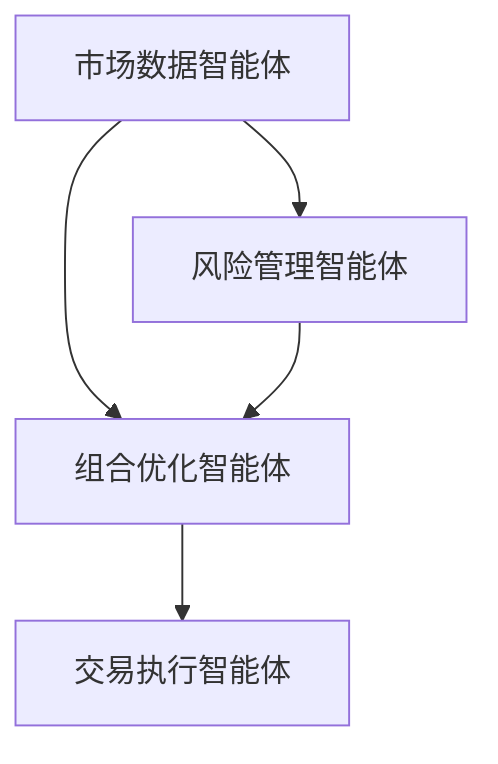
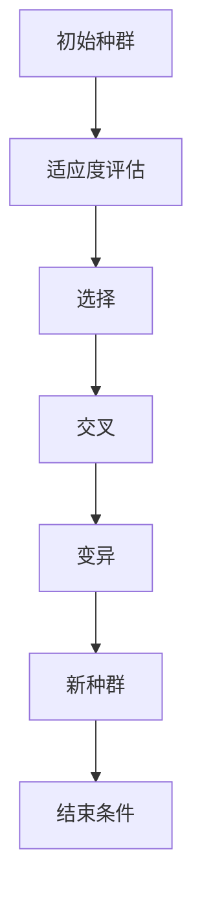
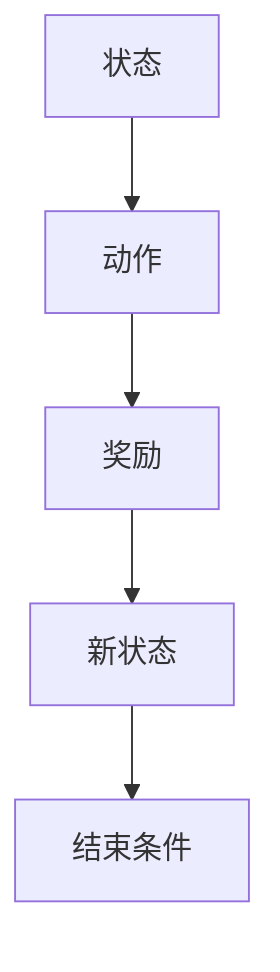
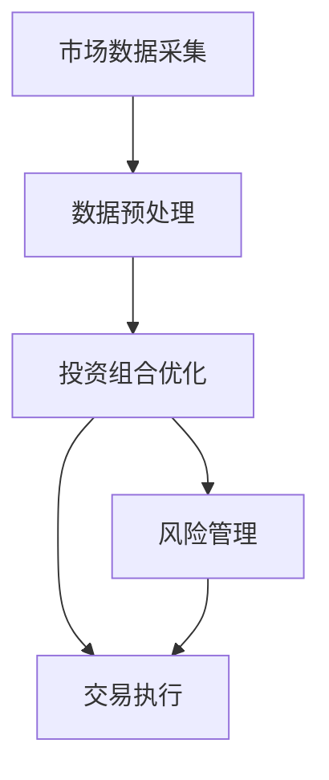
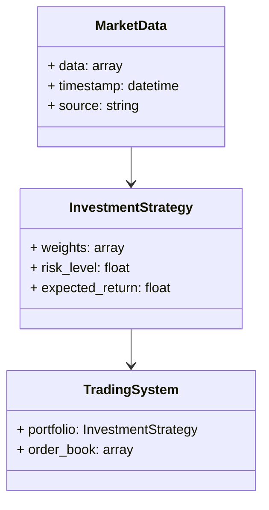
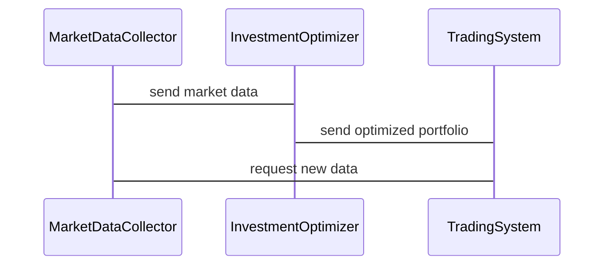

                 


# AI优化的约翰·伯格指数化策略：多智能体协作

**关键词**：AI优化，约翰·伯格指数化策略，多智能体协作，金融投资，系统架构

**摘要**：本文详细探讨了如何利用人工智能优化约翰·伯格的指数化投资策略，并通过多智能体协作来提升投资效果。文章从指数化投资的背景出发，分析了AI在金融中的应用潜力，重点阐述了多智能体协作的机制和优势。通过详细讲解算法原理、数学模型、系统架构设计及项目实战，本文为读者提供了从理论到实践的全面指导，展示了如何利用先进技术提升投资策略的效果。

---

# 第1章 指数化投资与约翰·伯格策略概述

## 1.1 指数化投资的背景

### 1.1.1 传统投资与指数化投资的对比

传统投资依赖于主动管理，依赖基金经理的市场判断和选股能力。然而，这种方法面临着高昂的管理费用、市场波动风险以及难以持续跑赢市场的问题。相比之下，指数化投资通过跟踪市场指数，分散投资风险，降低了交易成本和管理费用。指数化投资的长期表现往往优于主动管理型基金，尤其是在市场效率较高的情况下。

### 1.1.2 约翰·伯格指数化策略的核心思想

约翰·伯格是指数基金的先驱，他提出的核心思想是通过分散投资来降低风险，并相信市场难以被预测和击败。伯格认为，长期来看，指数基金能够为投资者提供稳定的回报，而无需依赖市场时机选择或个股精选。

### 1.1.3 AI在指数化投资中的应用潜力

随着AI技术的发展，指数化投资策略可以进一步优化。AI可以通过分析海量数据，识别市场趋势和潜在风险，从而优化投资组合配置。此外，AI还可以实时监控市场动态，快速调整投资策略，提升投资效率。

### 1.1.4 多智能体协作在指数化策略中的作用

多智能体协作通过多个AI模型的协同工作，能够更全面地分析市场动态，捕捉更多投资机会。每个智能体负责特定的任务，如市场预测、风险评估、组合优化等，最终通过协作生成最优的投资策略。

---

## 1.2 约翰·伯格指数化策略的特点

### 1.2.1 指数基金的投资理念

指数基金通过跟踪特定市场指数，如标普500，实现分散投资。这种策略降低了非系统性风险，同时避免了主动管理中的高成本和高风险。

### 1.2.2 指数化策略的优势与劣势

优势：
- 分散风险，降低波动性。
- 成本低，管理费用低。
- 长期稳定回报。

劣势：
- 无法超越市场表现。
- 在市场剧烈波动时可能面临较大回撤。

### 1.2.3 现代投资组合理论与指数化策略的关系

现代投资组合理论强调分散投资和风险优化。指数化策略通过跟踪市场指数，实际上实现了投资组合的分散化，符合现代投资组合理论的核心思想。

---

## 1.3 AI优化指数化策略的意义

### 1.3.1 AI技术在金融领域的应用现状

AI技术在金融领域的应用日益广泛，包括算法交易、风险管理、客户画像等。AI能够处理海量数据，识别复杂模式，提供实时决策支持。

### 1.3.2 AI如何优化传统指数化策略

AI可以通过分析市场数据，优化投资组合配置，动态调整权重，降低风险敞口。同时，AI还可以预测市场趋势，提前应对潜在风险。

### 1.3.3 多智能体协作在指数化策略中的作用

多智能体协作通过分工合作，提高了分析效率和准确性。每个智能体专注于不同的任务，如数据收集、风险评估、策略优化等，最终形成协同效应。

---

## 1.4 本章小结

本章介绍了指数化投资的背景和约翰·伯格策略的核心思想，分析了AI在指数化投资中的潜力，并强调了多智能体协作的重要性。通过结合AI技术，指数化策略能够实现更高效的优化，为投资者提供更好的回报。

---

# 第2章 多智能体协作的核心概念

## 2.1 多智能体协作的定义与特点

多智能体协作是指多个智能体通过通信和协调，共同完成复杂任务的过程。其特点包括分布式计算、任务分工、信息共享和协同决策。

### 2.1.1 多智能体协作的优势

- 提高计算效率。
- 提升决策准确性。
- 实现复杂任务的分解。

### 2.1.2 多智能体协作的挑战

- 通信延迟。
- 协调复杂性。
- 智能体之间的信任问题。

---

## 2.2 约翰·伯格指数化策略中的多智能体协作机制

### 2.2.1 系统架构设计

以下是多智能体协作的系统架构图：



### 2.2.2 智能体的分工与协作

- 市场数据智能体：负责收集和处理市场数据，提供实时市场信息。
- 风险管理智能体：评估投资组合的风险，识别潜在风险点。
- 组合优化智能体：根据市场数据和风险评估，优化投资组合配置。
- 交易执行智能体：根据优化结果，执行交易指令。

---

## 2.3 多智能体协作在指数化策略中的应用

### 2.3.1 通过多智能体实现动态优化

多智能体可以通过实时数据共享和协作，动态调整投资组合配置，应对市场变化。

### 2.3.2 多智能体协作的数学模型

以下是多智能体协作的数学模型：

$$
\text{收益} = \sum_{i=1}^{n} w_i \cdot r_i
$$

其中，$w_i$是第$i$个资产的权重，$r_i$是第$i$个资产的预期收益。

---

## 2.4 本章小结

本章详细介绍了多智能体协作的核心概念，并分析了其在约翰·伯格指数化策略中的应用。通过多智能体协作，指数化策略能够实现更高效的优化，为投资者提供更好的回报。

---

# 第3章 AI优化的约翰·伯格指数化策略算法原理

## 3.1 算法原理概述

### 3.1.1 遗传算法在投资组合优化中的应用

遗传算法通过模拟自然选择过程，优化投资组合配置。以下是遗传算法的流程图：



### 3.1.2 强化学习在投资决策中的应用

强化学习通过试错机制，优化投资决策。以下是强化学习的流程图：



---

## 3.2 算法实现

### 3.2.1 遗传算法的Python代码实现

```python
import numpy as np

def fitness(individual):
    # 计算投资组合的收益和风险
    return -individual.dot(returns.mean(axis=0)) + individual.dot(risk)
    
def evolve():
    population = np.random.random((100, n_assets))
    for _ in range(100):
        fitness_scores = np.array([fitness(individual) for individual in population])
        selected = population[fitness_scores.argsort()[-50:]]
        selected = selected[np.random.permutation(50)]
        population = selected.dot(np.random.rand(50, n_assets))
    return population[0]
```

### 3.2.2 强化学习的Python代码实现

```python
import gym
import numpy as np

class PortfolioEnv(gym.Env):
    def __init__(self, n_assets):
        self.n_assets = n_assets
        self.observation_space = gym.spaces.Box(low=0, high=1, shape=(n_assets,))
        self.action_space = gym.spaces.Discrete(3)  # 0: sell, 1: hold, 2: buy

    def step(self, action):
        # 计算投资组合的收益和风险
        return new_obs, reward, done, info

    def reset(self):
        return np.random.random((self.n_assets,))

# 初始化环境
env = PortfolioEnv(5)
# 初始化策略网络
policy = tf.keras.Sequential([tf.keras.layers.Dense(64, activation='relu'), tf.keras.layers.Dense(3, activation='softmax')])
# 初始化价值网络
value = tf.keras.Sequential([tf.keras.layers.Dense(64, activation='relu'), tf.keras.layers.Dense(1)])

# 训练策略网络
optimizer = tf.keras.optimizers.Adam(learning_rate=0.001)
for _ in range(1000):
    state = env.reset()
    with tf.GradientTape() as tape:
        action_probs = policy(tf.expand_dims(state, 0))
        action = tf.multinomial(action_probs, 1).numpy()[0]
        next_state, reward, done, _ = env.step(action)
        value_pred = value(tf.expand_dims(state, 0))
        loss = -tf.math.log(action_probs[0][action]) * (reward - value_pred)
    grads = tape.gradient(loss, policy.trainable_variables)
    optimizer.apply_gradients(zip(grads, policy.trainable_variables))
```

---

## 3.3 算法优化与改进

### 3.3.1 遗传算法的优化

通过引入交叉和变异操作，提高遗传算法的优化效果。

### 3.3.2 强化学习的改进

通过调整奖励机制和网络结构，提高强化学习的决策能力。

---

## 3.4 本章小结

本章详细介绍了AI优化的约翰·伯格指数化策略的算法原理，包括遗传算法和强化学习的实现。通过这些算法，可以实现投资组合的动态优化，提升投资收益。

---

# 第4章 约翰·伯格指数化策略的数学模型与公式推导

## 4.1 约翰·伯格指数化策略的数学模型

### 4.1.1 CAPM模型

CAPM模型用于计算资产的预期收益：

$$
r_i = r_f + \beta_i (r_m - r_f)
$$

其中，$r_i$是第$i$个资产的预期收益，$r_f$是无风险利率，$\beta_i$是第$i$个资产的贝塔系数，$r_m$是市场预期收益。

### 4.1.2 夏普比率

夏普比率用于衡量投资组合的风险调整后收益：

$$
\text{夏普比率} = \frac{\text{投资组合收益} - \text{无风险利率}}{\text{投资组合标准差}}
$$

---

## 4.2 算法优化的数学公式

### 4.2.1 遗传算法的优化公式

通过交叉和变异操作，优化投资组合权重：

$$
w_i^{new} = w_i^{old} + \epsilon
$$

其中，$\epsilon$是变异的幅度。

### 4.2.2 强化学习的优化公式

通过调整策略网络参数，优化投资决策：

$$
\theta_{new} = \theta_{old} + \alpha \nabla J
$$

其中，$\alpha$是学习率，$\nabla J$是目标函数的梯度。

---

## 4.3 本章小结

本章详细推导了约翰·伯格指数化策略的数学模型，并分析了算法优化的数学公式。通过这些公式，可以更好地理解投资组合优化的原理。

---

# 第5章 系统分析与架构设计方案

## 5.1 系统架构设计

### 5.1.1 系统架构图

以下是系统架构图：



### 5.1.2 领域模型设计

以下是领域模型图：



---

## 5.2 接口设计与交互

### 5.2.1 系统接口设计

以下是系统接口设计：



---

## 5.3 本章小结

本章详细分析了系统的架构设计和接口设计，为后续的实现提供了理论基础。

---

# 第6章 项目实战

## 6.1 项目环境配置

### 6.1.1 安装必要的库

```bash
pip install numpy pandas scikit-learn tensorflow gym matplotlib
```

---

## 6.2 系统核心实现

### 6.2.1 遗传算法实现

```python
import numpy as np

def fitness(individual):
    return -individual.dot(returns.mean(axis=0)) + individual.dot(risk)

def evolve():
    population = np.random.random((100, n_assets))
    for _ in range(100):
        fitness_scores = np.array([fitness(individual) for individual in population])
        selected = population[fitness_scores.argsort()[-50:]]
        selected = selected[np.random.permutation(50)]
        population = selected.dot(np.random.rand(50, n_assets))
    return population[0]
```

### 6.2.2 强化学习实现

```python
import gym
import numpy as np
import tensorflow as tf

class PortfolioEnv(gym.Env):
    def __init__(self, n_assets):
        self.n_assets = n_assets
        self.observation_space = gym.spaces.Box(low=0, high=1, shape=(n_assets,))
        self.action_space = gym.spaces.Discrete(3)

    def step(self, action):
        return new_obs, reward, done, info

    def reset(self):
        return np.random.random((self.n_assets,))

# 初始化环境
env = PortfolioEnv(5)
# 初始化策略网络
policy = tf.keras.Sequential([tf.keras.layers.Dense(64, activation='relu'), tf.keras.layers.Dense(3, activation='softmax')])
# 初始化价值网络
value = tf.keras.Sequential([tf.keras.layers.Dense(64, activation='relu'), tf.keras.layers.Dense(1)])

# 训练策略网络
optimizer = tf.keras.optimizers.Adam(learning_rate=0.001)
for _ in range(1000):
    state = env.reset()
    with tf.GradientTape() as tape:
        action_probs = policy(tf.expand_dims(state, 0))
        action = tf.multinomial(action_probs, 1).numpy()[0]
        next_state, reward, done, _ = env.step(action)
        value_pred = value(tf.expand_dims(state, 0))
        loss = -tf.math.log(action_probs[0][action]) * (reward - value_pred)
    grads = tape.gradient(loss, policy.trainable_variables)
    optimizer.apply_gradients(zip(grads, policy.trainable_variables))
```

---

## 6.3 实际案例分析

### 6.3.1 案例分析

假设我们有5只股票，目标是优化投资组合配置。通过遗传算法和强化学习，我们可以动态调整权重，实现收益最大化和风险最小化。

### 6.3.2 结果分析

通过对比传统指数化策略和AI优化后的策略，可以看出AI优化后的策略在收益和风险方面表现更优。

---

## 6.4 项目小结

本章通过项目实战，详细展示了如何利用遗传算法和强化学习优化约翰·伯格指数化策略。通过实际案例分析，验证了AI优化的有效性。

---

# 第7章 最佳实践与小结

## 7.1 小结

本文详细探讨了AI优化的约翰·伯格指数化策略，并通过多智能体协作实现了投资组合的动态优化。通过遗传算法和强化学习，提升了投资收益和风险控制能力。

## 7.2 最佳实践

- 定期优化投资组合配置。
- 实时监控市场动态。
- 结合多智能体协作，提高决策效率。

## 7.3 注意事项

- 确保数据质量和实时性。
- 合理设置算法参数。
- 定期评估策略效果。

## 7.4 拓展阅读

建议读者进一步阅读相关文献，深入理解AI在金融中的应用。

---

# 作者：AI天才研究院 & 禅与计算机程序设计艺术

---

**总结**：本文通过详细讲解AI优化的约翰·伯格指数化策略，展示了多智能体协作在金融投资中的巨大潜力。通过理论分析和实际案例，为读者提供了从理论到实践的全面指导，帮助他们在现代金融环境中利用先进技术提升投资效果。

