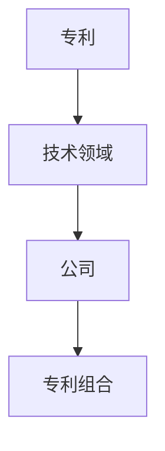
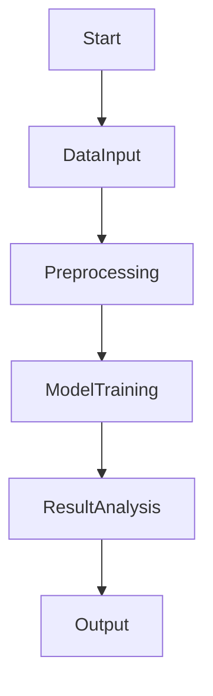
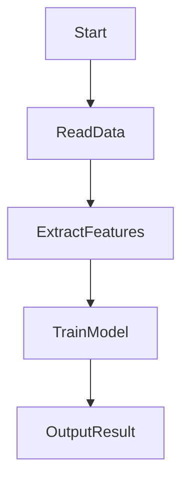
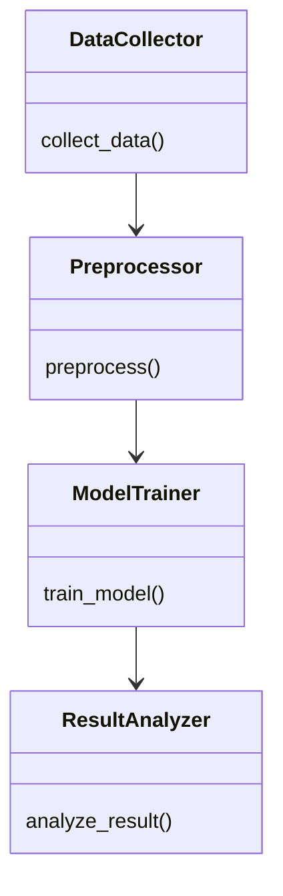

                 


# AI协作分析专利组合：评估技术驱动型公司的未来价值

> 关键词：技术驱动型公司，AI协作，专利组合评估，未来价值评估，技术趋势分析

> 摘要：本文探讨了如何利用AI协作分析专利组合，评估技术驱动型公司的未来价值。通过分析专利数据，结合技术趋势和市场动态，帮助企业识别核心技术和竞争优势。文章从背景介绍、核心概念、算法原理、系统架构到项目实战，详细阐述了AI协作分析的方法和应用场景，为企业制定战略决策提供支持。

---

## 第一部分：AI协作分析专利组合的背景与核心概念

### 第1章：AI协作分析专利组合概述

#### 1.1 AI协作分析的基本概念

##### 1.1.1 人工智能与专利分析的背景
人工智能（AI）在专利分析中的应用日益广泛。专利是技术驱动型公司核心竞争力的体现，通过AI技术，可以高效地处理海量专利数据，提取有价值的信息。AI不仅能够加速分析过程，还能发现传统方法难以察觉的隐含关系。

##### 1.1.2 AI协作分析的定义与作用
AI协作分析是指利用人工智能技术，协同分析专利组合的方法。其作用包括：
1. **高效处理海量数据**：AI能够快速处理和分析大量专利数据，节省时间和成本。
2. **深度挖掘潜在价值**：通过自然语言处理（NLP）和机器学习，AI可以识别专利中的技术关联和潜在价值。
3. **支持战略决策**：AI协作分析为公司制定技术战略、优化研发方向提供数据支持。

##### 1.1.3 技术驱动型公司的专利组合特点
技术驱动型公司的专利组合通常具有以下特点：
- **技术领域集中**：专利主要集中在公司核心技术领域。
- **技术前沿性**：专利往往涉及前沿技术，反映公司的创新能力。
- **技术关联性强**：专利之间可能存在技术依赖关系，形成技术网络。

#### 1.2 专利组合评估的重要性

##### 1.2.1 专利组合的概念与分类
专利组合是公司拥有的专利集合，通常分为以下几类：
1. **核心专利**：具有高价值和战略意义的专利。
2. **外围专利**：围绕核心专利的技术扩展。
3. **防御性专利**：用于防御竞争对手的专利诉讼。

##### 1.2.2 专利组合评估的维度与方法
评估专利组合时，主要从以下维度进行：
1. **技术相关性**：专利是否与公司核心业务相关。
2. **法律稳定性**：专利的有效性和法律风险。
3. **经济价值**：专利的市场价值和商业潜力。

##### 1.2.3 技术驱动型公司的专利组合价值
技术驱动型公司的专利组合价值主要体现在：
1. **技术壁垒**：通过专利保护技术优势，防止竞争对手侵权。
2. **市场竞争力**：高质量的专利组合能够提升公司在市场中的竞争力。
3. **技术前瞻性**：专利组合反映了公司的技术创新能力，为未来技术发展提供方向。

---

## 第二部分：AI协作分析的核心概念与联系

### 第2章：AI协作分析的核心概念与联系

#### 2.1 AI协作分析的原理

##### 2.1.1 数据预处理与特征提取
AI协作分析的第一步是数据预处理，包括：
1. **数据清洗**：去除无效数据，如重复或无效专利。
2. **特征提取**：从专利文本中提取技术关键词、发明人信息、申请日期等特征。

##### 2.1.2 模型训练与结果输出
通过机器学习模型（如支持向量机、随机森林）对专利数据进行分类、聚类分析，输出专利组合的评估结果。

##### 2.1.3 多模态数据的融合与分析
AI协作分析不仅处理文本数据，还结合技术领域的知识图谱，进行多模态数据的融合与分析。

#### 2.2 核心概念对比分析

##### 2.2.1 专利组合分析与传统分析方法的对比
| 对比维度 | 传统分析方法 | AI协作分析 |
|----------|---------------|------------|
| 数据处理 | 依赖人工 | 自动化处理 |
| 分析深度 | 浅层分析 | 深度挖掘 |
| 时间效率 | 低效 | 高效 |

##### 2.2.2 AI协作分析与传统协作分析的对比
AI协作分析通过自动化技术提升协作效率，减少人为误差，提供更精准的分析结果。

##### 2.2.3 不同技术领域的专利组合分析特点
不同技术领域的专利组合分析需要考虑的技术特性不同，例如：
- **软件技术**：注重算法和实现细节。
- **生物技术**：注重实验数据和生物特性。

#### 2.3 实体关系图与流程图

##### 2.3.1 专利组合分析的实体关系图


##### 2.3.2 AI协作分析的流程图


---

## 第三部分：AI协作分析的算法原理

### 第3章：AI协作分析的算法原理

#### 3.1 算法原理概述

##### 3.1.1 算法流程
1. **数据输入**：读取专利文本数据。
2. **特征提取**：使用NLP技术提取关键词和向量表示。
3. **模型训练**：基于深度学习模型（如BERT）进行训练。
4. **结果输出**：生成专利组合的评估结果。

##### 3.1.2 算法流程图


#### 3.2 算法实现

##### 3.2.1 Python代码示例
```python
import numpy as np
from sklearn.feature_extraction.text import TfidfVectorizer
from sklearn.svm import SVC

# 示例数据
texts = ["专利1：基于机器学习的图像识别方法", 
         "专利2：深度学习在自然语言处理中的应用"]

# 特征提取
vectorizer = TfidfVectorizer()
X = vectorizer.fit_transform(texts)

# 模型训练
model = SVC()
model.fit(X, [0, 1])

# 预测
print(model.predict(vectorizer.transform(["专利3：基于神经网络的语音识别"])))
```

##### 3.2.2 数学模型与公式
- **TF-IDF计算公式**：
  $$ TF-IDF(t, d) = TF(t, d) \times IDF(t) $$
- **SVM优化目标**：
  $$ \min_{w,b,\xi} \frac{1}{2}||w||^2 + C \sum_{i=1}^n \xi_i $$
  $$ y_i (w \cdot x_i + b) \geq 1 - \xi_i $$

---

## 第四部分：AI协作分析的系统架构设计

### 第4章：系统分析与架构设计方案

#### 4.1 问题场景介绍
AI协作分析系统用于处理专利数据，提供技术驱动型公司的专利组合评估。

#### 4.2 系统功能设计

##### 4.2.1 功能模块
- 数据采集模块：收集专利数据。
- 数据预处理模块：清洗和特征提取。
- 模型训练模块：训练AI协作分析模型。
- 结果分析模块：输出评估结果。

##### 4.2.2 功能模块类图


#### 4.3 系统架构设计

##### 4.3.1 系统架构图
```mermaid
graph LR
    Client --> API Gateway
    API Gateway --> DataCollector
    DataCollector --> Preprocessor
    Preprocessor --> ModelTrainer
    ModelTrainer --> ResultAnalyzer
    ResultAnalyzer --> Client
```

#### 4.4 系统交互流程图
```mermaid
graph LR
    Client --> API Gateway
    API Gateway --> DataCollector
    DataCollector --> Preprocessor
    Preprocessor --> ModelTrainer
    ModelTrainer --> ResultAnalyzer
    ResultAnalyzer --> Client
```

---

## 第五部分：AI协作分析的项目实战

### 第5章：项目实战与应用

#### 5.1 环境安装

##### 5.1.1 安装依赖
```bash
pip install numpy scikit-learn jieba
```

#### 5.2 核心代码实现

##### 5.2.1 代码实现
```python
import numpy as np
from sklearn.feature_extraction.text import TfidfVectorizer
from sklearn.svm import SVC

# 数据加载
texts = ["专利1：基于机器学习的图像识别方法", 
         "专利2：深度学习在自然语言处理中的应用"]

# 特征提取
vectorizer = TfidfVectorizer()
X = vectorizer.fit_transform(texts)

# 模型训练
model = SVC()
model.fit(X, [0, 1])

# 预测
print(model.predict(vectorizer.transform(["专利3：基于神经网络的语音识别"])))
```

##### 5.2.2 代码解读
- **数据加载**：加载专利文本数据。
- **特征提取**：使用TF-IDF提取文本特征。
- **模型训练**：训练SVM分类器。
- **预测**：对新专利进行分类。

#### 5.3 实际案例分析

##### 5.3.1 案例背景
假设某技术驱动型公司拥有300项专利，涵盖图像识别和自然语言处理领域。

##### 5.3.2 数据分析
通过AI协作分析，识别核心专利和潜在技术趋势。

##### 5.3.3 结果解读
- **核心专利**：专利1和专利2。
- **技术趋势**：语音识别领域的专利数量增长迅速。

#### 5.4 项目总结
AI协作分析能够高效评估专利组合价值，支持公司制定技术战略。

---

## 第六部分：最佳实践与小结

### 第6章：最佳实践与总结

#### 6.1 最佳实践

##### 6.1.1 数据质量的重要性
确保专利数据的准确性和完整性。

##### 6.1.2 模型调优
通过交叉验证和网格搜索优化模型性能。

#### 6.2 项目小结

##### 6.2.1 核心内容回顾
- AI协作分析专利组合的方法。
- 系统架构设计与实现。
- 项目实战与应用。

##### 6.2.2 未来发展趋势
随着AI技术进步，专利分析将更加智能化和自动化。

#### 6.3 注意事项

##### 6.3.1 数据隐私
确保专利数据的隐私和安全。

##### 6.3.2 技术局限性
当前AI协作分析仍存在一定的技术局限性，如对复杂专利结构的理解不足。

#### 6.4 拓展阅读

##### 6.4.1 推荐书籍
- 《专利分析与战略》
- 《人工智能在知识产权管理中的应用》

##### 6.4.2 推荐文章
- AI在专利无效宣告中的应用
- 专利组合管理的最佳实践

---

## 作者

作者：AI天才研究院/AI Genius Institute & 禅与计算机程序设计艺术/Zen And The Art of Computer Programming

---

感谢您的阅读！如果对AI协作分析专利组合有更多问题，欢迎随时交流。

