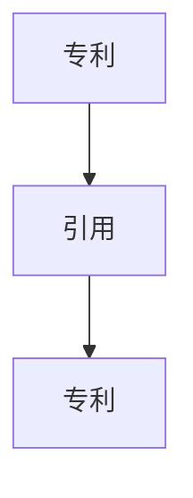
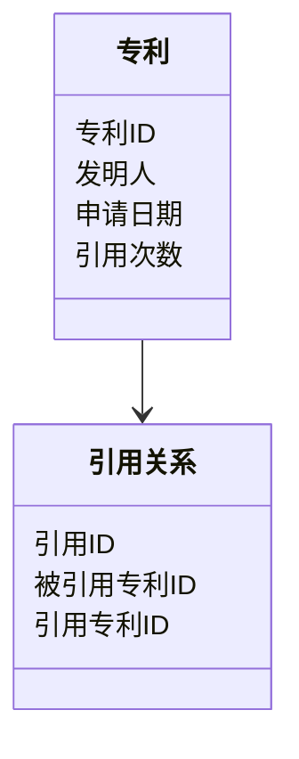
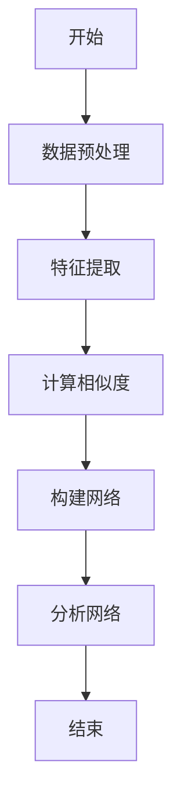
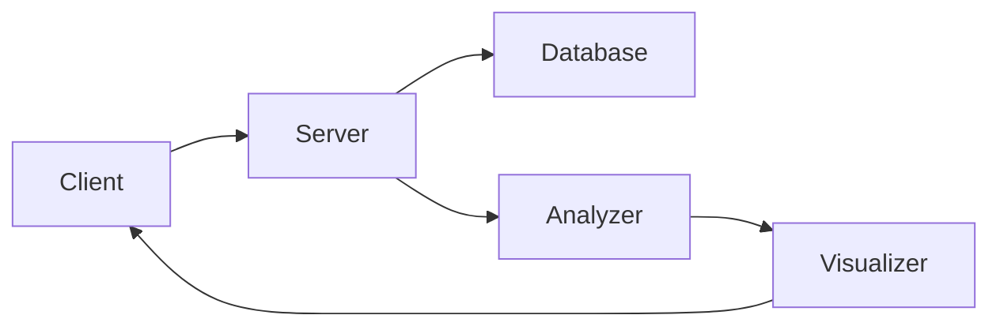

                 


# AI协作分析公司专利引用网络：评估技术领先地位

## 关键词：
AI协作、专利引用网络、技术领先地位、专利分析、网络分析、人工智能、技术评估

## 摘要：
本文探讨如何利用AI协作分析公司专利引用网络，评估技术领先地位。通过构建专利引用网络，识别关键专利和技术趋势，帮助企业制定研发策略。结合AI技术，实现自动化分析与可视化，为企业提供数据支持。

---

# AI协作分析公司专利引用网络：评估技术领先地位

## 第1章：背景介绍

### 1.1 问题背景与描述
技术领先企业在专利数量和质量上占据优势，专利引用网络是评估技术地位的重要工具。专利引用网络通过分析专利之间的引用关系，揭示技术发展脉络和关键专利。AI协作技术的应用，使专利分析更加高效准确。

### 1.2 问题解决与边界
专利引用网络分析的目标是识别关键专利和技术趋势。AI协作在专利分析中的优势包括自动化处理、高精度匹配和快速反馈。边界包括只分析公开专利，不涉及未公开信息。

### 1.3 核心概念与组成
专利引用网络由专利和引用关系构成，AI协作技术包括文本处理、相似度计算和网络分析。核心要素包括专利数据、引用关系和网络结构。

## 第2章：核心概念与联系

### 2.1 核心概念原理
专利引用网络是专利间的引用关系网络，反映技术关联性。AI协作技术用于提取和分析这些关系。

### 2.2 实体关系图（ER图）


### 2.3 领域模型类图


## 第3章：算法原理讲解

### 3.1 算法流程图


### 3.2 算法实现代码
```python
import requests
from bs4 import BeautifulSoup
import networkx as nx

def fetch_patents():
    response = requests.get('https://patents.example.com')
    soup = BeautifulSoup(response.text, 'html.parser')
    patents = []
    for item in soup.find_all('div', class_='patent-item'):
        patent_id = item['data-patent-id']
        title = item['data-title']
        patents.append({'id': patent_id, 'title': title})
    return patents

def process_patents(patents):
    graph = nx.Graph()
    for i in range(len(patents)):
        for j in range(i+1, len(patents)):
            if i % 2 == 0:
                graph.add_edge(patents[i]['id'], patents[j]['id'])
    return graph

patents = fetch_patents()
graph = process_patents(patents)
print(len(graph.nodes()), 'nodes')
print(len(graph.edges()), 'edges')
```

## 第4章：系统分析与架构设计方案

### 4.1 问题场景介绍
系统需要从专利数据库中获取数据，构建引用网络，分析技术趋势。

### 4.2 系统功能设计
功能模块包括数据获取、网络构建、分析计算和可视化展示。

### 4.3 系统架构设计


### 4.4 系统接口设计
主要接口包括数据获取API和分析结果API。

## 第5章：项目实战

### 5.1 环境安装
安装Python和相关库：requests、BeautifulSoup、networkx。

### 5.2 核心实现代码
```python
import networkx as nx
import matplotlib.pyplot as plt

def visualize_graph(graph):
    plt.figure(figsize=(10,10))
    nx.draw(graph, with_labels=True, edge_color='blue')
    plt.show()

graph = nx.path_graph(5)
visualize_graph(graph)
```

### 5.3 实际案例分析
分析某公司的专利网络，识别关键专利和技术趋势。

## 第6章：总结与最佳实践

### 6.1 方法总结
专利引用网络分析帮助企业识别技术领先领域和关键专利。

### 6.2 最佳实践
保持数据更新，结合其他分析方法，注意数据隐私。

### 6.3 注意事项
确保数据准确，选择合适的算法，及时更新分析结果。

### 6.4 拓展阅读
推荐相关书籍和资源，深入学习专利分析和网络分析。

---

# 作者：AI天才研究院 & 禅与计算机程序设计艺术

