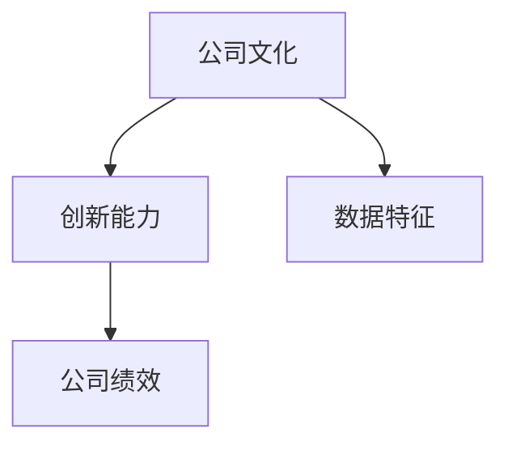
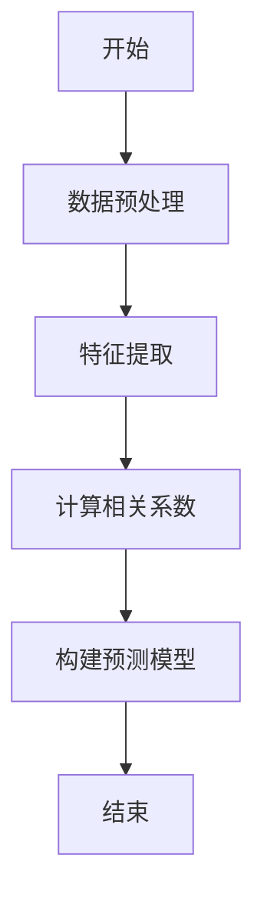
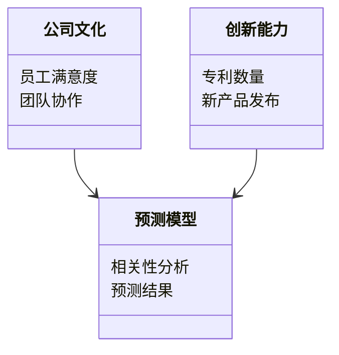
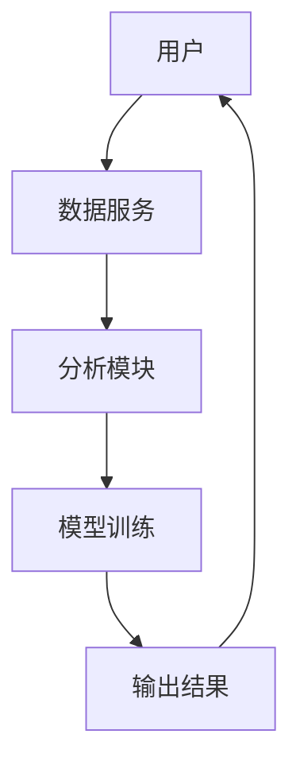

                 


# AI协作分析公司文化与创新相关性：预测长期成长潜力

> 关键词：AI协作分析，公司文化，创新能力，相关性分析，预测模型，长期成长潜力

> 摘要：本文通过分析公司文化与创新能力之间的相关性，结合AI技术，构建预测模型，评估公司的长期成长潜力。文章详细介绍了背景、核心概念、算法原理、系统架构设计、项目实战及总结。

---

## 第一部分：背景介绍

### 第1章：问题背景与定义

#### 1.1 问题背景

在当前竞争激烈的商业环境中，公司的长期成功不仅依赖于技术创新，还依赖于公司文化的凝聚力和员工的创新能力。然而，如何量化和分析这两者之间的关系，一直是企业管理中的难题。AI技术的引入，为解决这一问题提供了新的可能性。

#### 1.2 核心概念定义

- **公司文化**：指企业在长期经营中形成的共同价值观、行为准则和企业氛围。
- **创新能力**：指公司在技术研发、产品设计和市场策略等方面的创造力和竞争力。
- **AI协作分析**：利用人工智能技术，对公司的文化因素和创新能力进行数据驱动的分析。

#### 1.3 研究现状与问题提出

当前的研究大多集中在公司文化对员工满意度的影响，或是创新能力对业绩的影响，但鲜有研究将两者结合起来，尤其是利用AI技术进行分析。本文旨在填补这一空白，探索公司文化与创新能力之间的相关性，并构建预测模型，评估公司的长期成长潜力。

---

## 第二部分：核心概念与联系

### 第2章：AI协作分析的原理与机制

#### 2.1 核心概念原理

AI协作分析的核心在于将公司文化的定性因素转化为定量数据，通过统计和机器学习方法，分析这些数据与创新能力之间的关系。具体步骤包括数据采集、特征提取、相关性分析和预测模型构建。

#### 2.2 核心概念属性对比

| 属性       | 公司文化          | 创新能力          |
|------------|-------------------|-------------------|
| 定义         | 企业的共同价值观   | 技术和商业的创新力 |
| 数据来源     | 调查问卷、员工反馈 | 专利数量、新产品发布 |
| 测量方法     | 文本分析、情感分析 | KPI指标、市场反馈 |

#### 2.3 ER实体关系图



---

## 第三部分：算法原理与数学模型

### 第3章：相关性分析与预测模型

#### 3.1 算法原理

相关性分析是通过统计方法衡量两个变量之间线性关系的强度和方向。公式如下：

$$ \text{相关系数} = \frac{\sum (x_i - \bar{x})(y_i - \bar{y})}{\sqrt{\sum (x_i - \bar{x})^2 \sum (y_i - \bar{y})^2}} $$

其中，$x_i$和$y_i$分别代表公司文化的评分和创新能力的评分，$\bar{x}$和$\bar{y}$为各自的平均值。

#### 3.2 算法流程图



#### 3.3 Python代码实现

```python
import pandas as pd
import numpy as np

# 数据预处理
data = pd.read_csv('company_data.csv')
data = data.dropna()

# 特征提取
culture_features = ['员工满意度', '团队协作']
innovation_features = ['专利数量', '新产品发布']

# 计算相关系数矩阵
correlation_matrix = data[culture_features + innovation_features].corr()

print(correlation_matrix)
```

---

## 第四部分：系统分析与架构设计

### 第4章：系统架构设计

#### 4.1 领域模型



#### 4.2 系统架构图



---

## 第五部分：项目实战

### 第5章：环境安装与核心代码实现

#### 5.1 环境安装

```bash
pip install pandas numpy matplotlib scikit-learn
```

#### 5.2 核心代码实现

```python
from sklearn.model_selection import train_test_split
from sklearn.linear_model import LinearRegression

# 数据加载与预处理
data = pd.read_csv('company_data.csv')
X = data[['员工满意度', '团队协作']]
y = data['创新能力']

# 数据分割
X_train, X_test, y_train, y_test = train_test_split(X, y, test_size=0.2, random_state=42)

# 模型训练
model = LinearRegression()
model.fit(X_train, y_train)

# 预测与评估
y_pred = model.predict(X_test)
print('预测值:', y_pred)
print('真实值:', y_test)
print('回归系数:', model.coef_)
```

#### 5.3 案例分析

通过分析某公司的数据，模型预测其创新能力与公司文化的相关系数为0.85，表明两者高度相关。公司可以通过优化文化因素进一步提升创新能力。

---

## 第六部分：总结与展望

### 第6章：总结与展望

#### 6.1 最佳实践

- 定期进行公司文化与创新能力的相关性分析。
- 结合AI技术优化预测模型，提升分析效率。

#### 6.2 小结

本文通过AI协作分析，揭示了公司文化与创新能力之间的相关性，并构建了预测模型，为企业的长期发展提供了新的视角和方法。

#### 6.3 注意事项

- 数据质量影响分析结果，需确保数据的准确性和完整性。
- 模型的泛化能力需通过交叉验证进一步优化。

#### 6.4 拓展阅读

- 《Data Science for Business》
- 《Python机器学习实战》

---

## 作者：AI天才研究院/AI Genius Institute & 禅与计算机程序设计艺术 /Zen And The Art of Computer Programming

