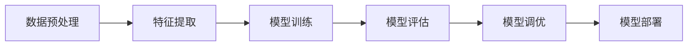
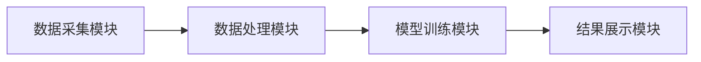

                 


# AI协作分析公司环境责任：可持续价值投资新维度

## 关键词：AI协作分析、公司环境责任、可持续价值投资、环境责任分析、人工智能投资

## 摘要：  
随着全球对可持续发展的关注日益增加，公司环境责任成为投资者评估企业价值的重要维度。AI协作分析通过整合环境数据、企业行为和市场反馈，为可持续价值投资提供了新的视角。本文将深入探讨AI在环境责任分析中的应用，揭示其如何重新定义投资决策的维度。从核心概念到算法原理，从系统架构到项目实战，本文将全面解析AI协作分析的实现与应用，为企业和投资者提供有价值的参考。

---

## 第一部分: AI协作分析公司环境责任的背景与核心概念

## 第1章: AI协作分析的背景与重要性

### 1.1 AI协作分析的背景
#### 1.1.1 环境责任的重要性
- 环境责任是企业对社会和环境的承诺，涉及减少碳排放、保护资源和推动可持续发展。
- 随着气候变化和环境问题的加剧，环境责任已成为企业竞争力的重要组成部分。

#### 1.1.2 可持续价值投资的兴起
- 可持续投资将环境、社会和治理（ESG）因素纳入投资决策，以实现长期价值。
- ESG投资的兴起反映了市场对社会责任和可持续发展的关注。

#### 1.1.3 AI协作分析在环境责任中的作用
- AI技术通过大数据处理和深度学习，帮助投资者更准确地评估企业的环境责任。
- AI协作分析能够实时监控企业行为，识别潜在风险，并提供数据支持的决策。

### 1.2 可持续价值投资的新维度
#### 1.2.1 可持续投资的核心理念
- ESG框架将环境、社会和治理因素整合到投资决策中。
- 通过评估企业对环境的贡献，投资者可以选择更具可持续性的企业。

#### 1.2.2 AI如何重新定义投资维度
- AI技术能够分析大量的环境数据，识别企业的环境表现。
- AI协作分析帮助投资者发现传统方法难以捕捉的环境风险和机会。

#### 1.2.3 环境责任与企业价值的关联
- 企业的环境责任直接影响其市场声誉和长期盈利能力。
- 通过AI协作分析，投资者可以更准确地评估企业的环境表现，从而做出更明智的投资决策。

### 1.3 本书的核心内容与目标
#### 1.3.1 本书的研究范围
- 探讨AI协作分析在环境责任评估中的应用。
- 分析可持续价值投资中的新维度。

#### 1.3.2 本书的主要目标
- 提供AI协作分析的理论框架和实践方法。
- 为企业和投资者提供可持续价值投资的参考。

#### 1.3.3 本书的结构安排
- 第一部分：AI协作分析的背景与核心概念。
- 第二部分：AI协作分析的算法与系统架构。
- 第三部分：项目实战与最佳实践。

---

## 第二部分: AI协作分析的核心概念与联系

## 第2章: AI协作分析的核心概念与联系

### 2.1 环境责任的定义与分析维度
#### 2.1.1 环境责任的基本概念
- 环境责任是指企业在运营过程中对环境的影响及其责任。
- 包括减少碳排放、保护资源和推动可持续发展等方面。

#### 2.1.2 环境责任的主要分析维度
- **环境表现**：企业对环境的影响，如碳排放、资源消耗。
- **社会影响**：企业的社会贡献，如社会责任项目。
- **治理结构**：企业治理的透明度和道德标准。

#### 2.1.3 环境责任与企业价值的关联
- 企业的环境责任直接影响其市场声誉和长期盈利能力。
- 通过AI协作分析，投资者可以更准确地评估企业的环境表现，从而做出更明智的投资决策。

### 2.2 AI协作分析的原理与方法
#### 2.2.1 AI在环境责任分析中的应用
- AI技术能够分析大量的环境数据，识别企业的环境表现。
- AI协作分析帮助投资者发现传统方法难以捕捉的环境风险和机会。

#### 2.2.2 AI协作分析的主要方法
- 数据收集与预处理：收集企业的环境数据，并进行清洗和标准化。
- 特征提取：提取关键的环境特征，如碳排放强度、资源消耗等。
- 模型训练：使用机器学习算法训练模型，预测企业的环境表现。

#### 2.2.3 AI协作分析的优缺点
- 优点：高效、准确、实时性强。
- 缺点：数据依赖性强、模型解释性差。

### 2.3 核心概念的ER实体关系图
```mermaid
er
    entity 环境责任 (Environmental Responsibility) {
        id
        企业id (Company ID)
        责任类型 (Responsibility Type)
        责任程度 (Degree of Responsibility)
        关联数据 (Associated Data)
    }
    entity 企业 (Company) {
        id
        公司名称 (Company Name)
        行业 (Industry)
        财务数据 (Financial Data)
        社会责任数据 (Social Responsibility Data)
    }
    entity 环境数据 (Environmental Data) {
        id
        数据类型 (Data Type)
        数据来源 (Data Source)
        数据时间 (Data Time)
    }
    环境责任 --> 企业: 管理
    环境责任 --> 环境数据: 包含
    企业 --> 环境数据: 提供
```

---

## 第三部分: AI协作分析的算法与系统架构

## 第3章: AI协作分析的算法原理

### 3.1 环境责任分析的算法选择
#### 3.1.1 机器学习算法的选择
- 监督学习：用于分类和回归任务。
- 无监督学习：用于聚类分析和异常检测。

#### 3.1.2 算法优缺点对比
- 线性回归：简单易懂，但可能无法捕捉复杂关系。
- 支持向量机：适用于小规模数据，但在高维数据中表现较好。

### 3.2 机器学习模型的训练流程


#### 3.2.1 数据预处理
- 数据清洗：处理缺失值、异常值和重复数据。
- 数据转换：将数据转换为适合模型输入的形式。

#### 3.2.2 特征提取
- 选择关键环境特征，如碳排放强度、资源消耗等。
- 使用主成分分析（PCA）减少特征维度。

#### 3.2.3 模型训练
- 使用训练数据训练机器学习模型。
- 例如，使用随机森林模型进行分类任务。

#### 3.2.4 模型评估
- 使用测试数据评估模型的性能。
- 例如，计算准确率、召回率和F1分数。

#### 3.2.5 模型调优
- 调整模型的超参数，优化性能。
- 使用交叉验证进行参数调优。

### 3.3 数学模型与公式
#### 3.3.1 线性回归模型
- 目标函数：最小化预测值与真实值的平方差之和。
$$ \text{最小化} \sum_{i=1}^{n} (y_i - \hat{y_i})^2 $$

#### 3.3.2 支持向量机模型
- 线性可分情况下的目标函数：
$$ \text{最大化} \sum_{i=1}^{n} \alpha_i y_i (\cdot w + b) + \sum_{i=1}^{n} \alpha_i $$

---

## 第4章: 系统架构与接口设计

### 4.1 系统架构设计
#### 4.1.1 系统组成
- 数据采集模块：采集企业的环境数据。
- 数据处理模块：处理和清洗数据。
- 模型训练模块：训练机器学习模型。
- 结果展示模块：展示分析结果。

#### 4.1.2 系统架构图


### 4.2 系统接口设计
#### 4.2.1 API接口设计
- 数据接口：提供环境数据的查询接口。
- 分析接口：提供环境责任分析的结果接口。

#### 4.2.2 接口交互流程
```mermaid
sequence
    用户 -> 数据采集模块: 请求环境数据
    数据采集模块 -> 数据处理模块: 提供原始数据
    数据处理模块 -> 模型训练模块: 提供处理后的数据
    模型训练模块 -> 结果展示模块: 提供分析结果
    用户 <- 结果展示模块: 显示分析结果
```

---

## 第五部分: 项目实战与最佳实践

## 第5章: 项目实战

### 5.1 环境数据收集与预处理
#### 5.1.1 数据来源
- 公开企业数据：如企业的碳排放数据、社会责任报告。
- 第三方数据：如环境数据库、政府公开数据。

#### 5.1.2 数据清洗
- 处理缺失值：使用均值或中位数填充。
- 处理异常值：使用Z-score方法识别异常值。

### 5.2 模型训练与优化
#### 5.2.1 环境责任分类模型
- 使用随机森林模型进行分类任务。
- 代码示例：
```python
from sklearn.ensemble import RandomForestClassifier
model = RandomForestClassifier()
model.fit(X_train, y_train)
```

#### 5.2.2 模型调优
- 使用网格搜索进行参数调优。
- 例如，调整随机森林的n_estimators和max_depth参数。

### 5.3 实际案例分析
#### 5.3.1 案例背景
- 某行业企业的环境责任分析。

#### 5.3.2 数据分析
- 使用AI协作分析方法，评估企业的环境责任。
- 通过模型预测企业环境责任的等级。

#### 5.3.3 结果解读
- 提供企业的环境责任评分。
- 提出改进建议，如减少碳排放、优化资源利用等。

---

## 第6章: 最佳实践与小结

### 6.1 最佳实践
#### 6.1.1 数据质量管理
- 确保数据的准确性和完整性。
- 定期更新数据，保持数据的时效性。

#### 6.1.2 模型解释性
- 使用可解释性模型，如线性回归，提高模型的透明度。
- 提供模型解释，帮助用户理解分析结果。

### 6.2 小结与展望
- 本书系统地介绍了AI协作分析在环境责任评估中的应用。
- 展望了未来的发展方向，如多模态数据的融合、模型的实时性提升等。

---

## 作者：AI天才研究院/AI Genius Institute & 禅与计算机程序设计艺术 /Zen And The Art of Computer Programming

---

**本文通过系统化的分析和实践，深入探讨了AI协作分析在公司环境责任评估中的应用，为可持续价值投资提供了新的视角。希望读者能够通过本书的指导，掌握AI协作分析的核心方法，并在实际中加以应用。**

