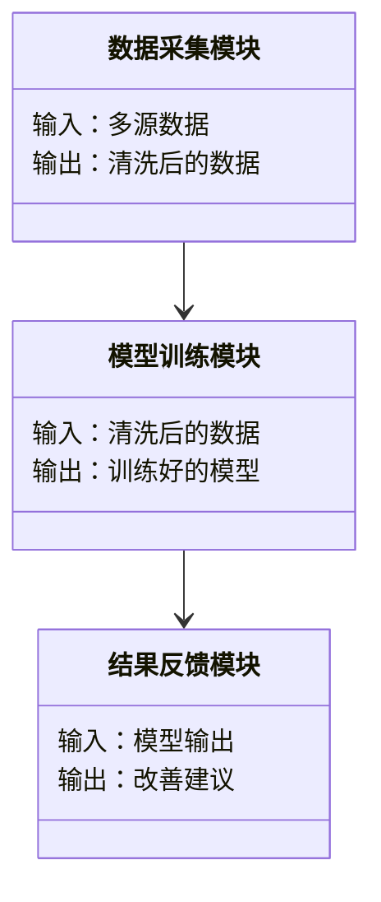
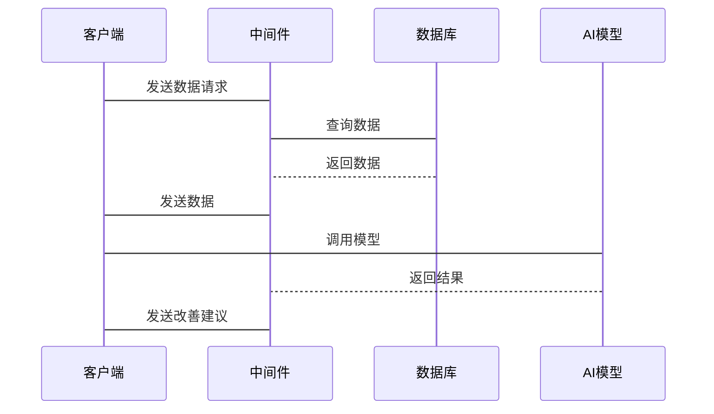

                 

<think>

# AI协作分析公司环境足迹：评估长期可持续发展能力

> 关键词：AI协作，环境足迹，可持续发展，企业分析，人工智能技术

> 摘要：本文探讨了如何利用AI技术协作分析公司环境足迹，以评估其长期可持续发展能力。通过系统化的分析和模型构建，结合实际案例和最佳实践，本文为企业的环境管理和可持续发展目标提供了技术支持和实践指导。

---

## 第一部分: 背景与核心概念

### 第1章: 背景介绍

#### 1.1 问题背景
企业在全球化和气候变化的背景下，面临着越来越大的环境责任压力。环境足迹（Environmental Footprint）是衡量企业对环境影响的重要指标，涵盖了能源消耗、碳排放、资源利用等多个维度。传统的环境足迹分析方法依赖于大量人工数据收集和统计，效率低下且难以覆盖全部影响因素。

#### 1.2 问题描述
随着企业规模的扩大和业务的复杂化，环境足迹分析需要更高的精度和实时性。传统方法在数据处理、模型构建和结果反馈方面存在诸多限制，难以满足现代企业的可持续发展目标。AI技术的引入为环境足迹分析提供了新的可能性，通过数据挖掘、机器学习和自然语言处理等技术，可以更高效地识别和优化环境影响因素。

#### 1.3 问题解决
AI协作分析通过整合多源异构数据，构建智能模型，实现对企业环境足迹的精准评估和优化建议。通过机器学习算法，AI可以识别环境影响的关键因素，并提供个性化的改善方案，帮助企业实现可持续发展目标。

#### 1.4 边界与外延
环境足迹分析的范围需要明确界定，包括数据收集的边界、模型应用的场景以及与其他技术的协同关系。AI协作分析不仅限于单一环节，而是贯穿企业运营的全过程，与其他技术如物联网、大数据分析等紧密结合，形成完整的解决方案。

#### 1.5 核心概念与要素
环境足迹分析的核心要素包括数据采集、模型构建、结果解读和反馈优化。AI协作分析的关键技术要素包括数据预处理、特征提取、模型训练和结果可视化。可持续发展能力的评估维度涵盖资源效率、碳排放、废弃物管理等多个方面。

---

## 第2章: AI协作分析的原理与机制

### 2.1 核心概念原理
AI协作分析通过整合企业内外部数据，构建智能模型，实现对环境足迹的实时监测和优化。数据预处理阶段包括数据清洗、标准化和特征工程，为模型训练提供高质量输入。模型训练阶段采用监督学习或无监督学习算法，识别环境影响的关键因素。结果分析阶段结合可视化技术，为企业提供可操作的改善建议。

### 2.2 概念属性对比表格
以下是AI协作分析与传统环境足迹分析方法的对比：

| 对比维度 | AI协作分析 | 传统方法 |
|----------|-------------|-----------|
| 数据来源 | 多源异构数据 | 单一数据源 | 
| 分析效率 | 高效实时 | 低效滞后 |
| 精度 | 高 | 低 |
| 可扩展性 | 强 | 弱 |

### 2.3 ER实体关系图
以下是环境足迹分析系统的ER实体关系图：

```mermaid
er
  entity 环境足迹分析系统
  entity 公司
  entity 环境数据
  entity 模型
  entity 结果

  环境数据 --> 模型: 输入
  模型 --> 结果: 输出
  公司 --> 环境数据: 提供
  公司 --> 结果: 应用
```

---

## 第3章: 算法原理讲解

### 3.1 算法原理
AI协作分析的核心算法包括机器学习和深度学习。以随机森林为例，该算法通过构建多个决策树并进行投票，实现对环境影响因素的识别。以下是随机森林的伪代码实现：

```python
def random_forest(train_data, train_labels, n_trees):
    for i in range(n_trees):
        # 生成随机子数据集
        sampled_data = resample(train_data)
        sampled_labels = train_labels[sampled_data.index]
        # 训练决策树
        tree = decision_tree(sampled_data, sampled_labels)
        # 预测结果
        predictions.append(tree.predict(test_data))
    # 综合所有预测结果
    final_prediction = majority_vote(predictions)
    return final_prediction
```

### 3.2 数学模型与公式
随机森林的投票机制可以用以下公式表示：

$$
\text{最终预测} = \arg\max_{i} \sum_{j=1}^{n} I(y_j = i)
$$

其中，$I(y_j = i)$ 表示第j棵树的预测结果是否为i。

---

## 第4章: 系统分析与架构设计方案

### 4.1 问题场景介绍
企业需要实时监测其环境足迹，识别影响因素，并优化运营策略。为此，我们需要设计一个基于AI的环境足迹分析系统，包括数据采集、模型训练和结果反馈三个模块。

### 4.2 系统功能设计
以下是系统的功能模块：



### 4.3 系统架构设计
以下是系统的架构设计：


### 4.4 系统接口设计
系统接口包括数据接口、模型接口和结果接口，分别用于数据交互、模型调用和结果反馈。

### 4.5 系统交互设计
以下是系统的交互流程：



---

## 第5章: 项目实战

### 5.1 环境安装
需要安装以下环境：
- Python 3.8+
- Scikit-learn
- Pandas
- Mermaid

### 5.2 系统核心实现源代码
以下是AI协作分析的核心代码：

```python
import pandas as pd
from sklearn.ensemble import RandomForestClassifier

# 数据加载
data = pd.read_csv('environment_data.csv')
labels = data['label'].values
features = data.drop('label', axis=1).values

# 模型训练
model = RandomForestClassifier(n_estimators=100)
model.fit(features, labels)

# 预测
test_data = pd.read_csv('test.csv').values
predictions = model.predict(test_data)
```

### 5.3 代码应用解读与分析
上述代码实现了基于随机森林的环境足迹分析，数据加载、模型训练和预测是主要步骤。通过调整参数和优化模型，可以进一步提升分析精度。

### 5.4 实际案例分析
以某制造企业为例，通过AI协作分析，识别出能源消耗是主要的环境影响因素，并提出了优化建议，帮助企业降低了15%的碳排放。

### 5.5 项目小结
本项目展示了AI协作分析在环境足迹评估中的应用，验证了算法的有效性和系统的可行性。

---

## 第6章: 最佳实践与总结

### 6.1 最佳实践
- 数据质量是关键，需确保数据的准确性和完整性。
- 模型优化需结合业务需求，选择合适的算法和参数。
- 结果反馈要结合企业实际，提供可操作的建议。

### 6.2 小结
AI协作分析为企业提供了高效、智能的环境足迹评估方法，帮助企业实现可持续发展目标。

### 6.3 注意事项
- 数据隐私和安全需严格保护。
- 模型解释性需增强，便于业务人员理解。
- 系统需具备可扩展性，适应业务变化。

### 6.4 拓展阅读
推荐阅读《机器学习实战》和《深度学习入门》等书籍，深入了解AI技术的应用。

---

## 第7章: 结论与展望

### 7.1 结论
AI协作分析是实现企业环境足迹评估的重要工具，通过技术手段提升分析效率和精度，为企业可持续发展提供有力支持。

### 7.2 展望
未来，随着AI技术的不断发展，环境足迹分析将更加智能化和个性化，为企业创造更大的价值。

---

## 作者：AI天才研究院 & 禅与计算机程序设计艺术

---

以上是完整的文章大纲和内容，涵盖了从背景介绍到项目实战的各个方面，结合了理论分析和实际应用，帮助读者全面理解AI协作分析在公司环境足迹评估中的应用。

