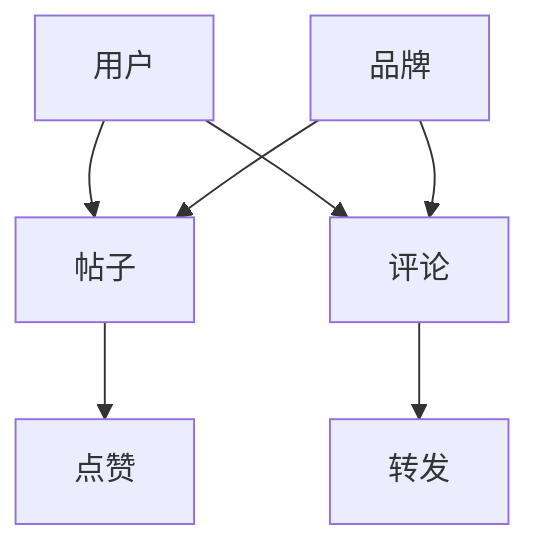
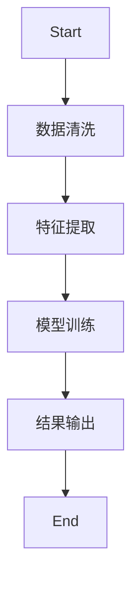
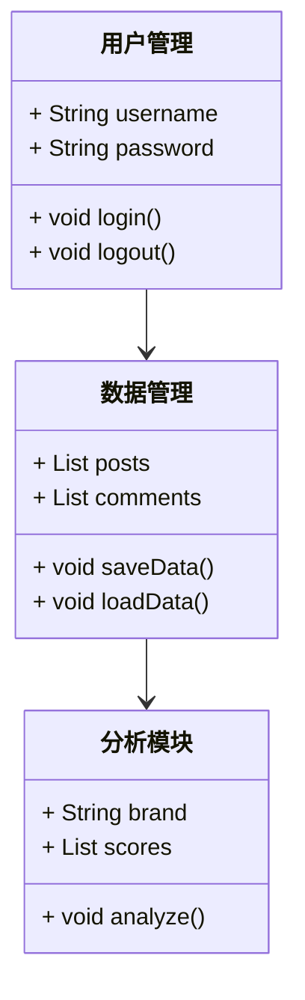
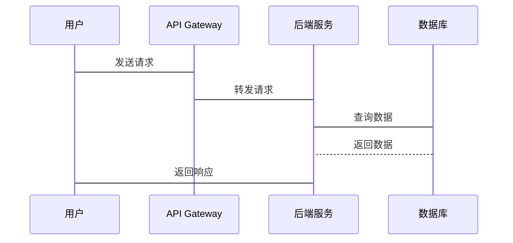

                 


# AI协作分析公司社交网络影响力：评估品牌价值

## 关键词：社交网络影响力, 品牌价值, AI协作, 影响力传播力, 数据驱动

## 摘要：在数字化时代，品牌价值评估变得越来越复杂，社交网络作为信息传播的主要渠道，对品牌影响力起着至关重要的作用。本文通过AI协作技术，系统地分析社交网络数据，评估品牌影响力，揭示影响力传播的规律。我们从背景介绍、核心概念、算法原理、系统架构、项目实战等多角度展开，提供详细的解决方案和实施步骤，帮助读者理解并应用这一技术。

---

## 第一部分: 背景介绍与核心概念

### 第1章: 社交网络影响力评估的背景与问题描述

#### 1.1 问题背景
- **数字化时代的品牌价值评估挑战**：在当今信息爆炸的时代，品牌价值不仅仅体现在传统媒体上，社交网络已经成为品牌传播的重要渠道。如何准确评估社交网络上的品牌影响力，成为企业面临的重要问题。
- **社交网络在品牌价值评估中的重要性**：社交网络数据能够反映品牌在用户中的口碑、情感倾向以及传播能力，这些都是传统评估方法难以捕捉的信息。
- **当前品牌价值评估的主要问题与局限性**：传统评估方法依赖于问卷调查和销售数据，难以捕捉实时的用户反馈和互动数据。社交网络数据的复杂性和多样性使得手动分析变得困难。

#### 1.2 问题描述
- **社交网络数据的特点与复杂性**：社交网络数据包括用户帖子、评论、点赞、转发等行为，这些数据具有高度的关联性和非结构化特征。
- **品牌影响力评估的核心维度**：包括品牌知名度、用户情感倾向、品牌忠诚度、内容传播力等。
- **从社交网络数据到品牌价值的转化路径**：需要通过数据清洗、特征提取、模型构建等步骤，将社交网络数据转化为可量化的品牌价值指标。

#### 1.3 问题解决思路
- **数据驱动的品牌价值评估方法**：通过收集和分析社交网络数据，提取关键指标，构建评估模型。
- **AI协作在社交网络分析中的应用**：利用AI技术处理海量数据，识别情感倾向，预测传播趋势。
- **从数据到价值的转化模型设计**：构建基于机器学习的模型，将社交网络数据转化为品牌价值评分。

#### 1.4 边界与外延
- **评估范围的界定**：明确评估的社交平台范围、时间范围和用户范围。
- **相关概念的外延与限制**：品牌影响力评估不涵盖线下销售数据，主要关注线上互动数据。
- **与其他评估方法的对比分析**：对比传统问卷调查和销售数据分析，突出社交网络分析的独特优势。

### 第2章: 核心概念与联系

#### 2.1 核心概念原理
- **社交网络分析的基本原理**：通过图论方法分析用户之间的关系，识别关键意见领袖（KOL）和社群结构。
- **品牌价值的核心要素**：包括品牌认知度、用户忠诚度、品牌影响力等。
- **影响力与传播力的定义与区别**：影响力指用户对品牌的影响能力，传播力指内容的扩散能力。

#### 2.2 核心概念属性特征对比
| 概念 | 属性 | 特征 |
|------|------|------|
| 社交网络分析 | 节点 | 用户、内容 |
| 边   | 关系、互动 |  |
| 品牌价值 | 核心 | 品牌认知度 |
| 周边 | 用户情感、传播力 |  |
| 影响力 | 权重 | 用户影响力得分 |
| 传播力 | 达成度 | 内容扩散率 |

#### 2.3 实体关系图（Mermaid）


---

## 第二部分: 算法原理讲解

### 第3章: 算法原理与实现

#### 3.1 算法选择与原理
- **PageRank算法**：用于评估用户在社交网络中的影响力，通过计算用户的权重来衡量其影响力。
- **情感分析算法**：用于识别用户对品牌的情感倾向，采用文本挖掘技术提取关键词并进行分类。

#### 3.2 算法流程图（Mermaid）


#### 3.3 算法实现代码
```python
import networkx as nx
from sklearn.feature_extraction.text import TfidfVectorizer
from sklearn.svm import SVC

# 数据清洗
def clean_data(text):
    return text.lower().strip()

# 特征提取
vectorizer = TfidfVectorizer()
X = vectorizer.fit_transform(clean_data_list)

# 模型训练
model = SVC()
model.fit(X, y)

# 模型预测
new_text = ["用户评论"]
new_X = vectorizer.transform(clean_data(new_text))
predicted = model.predict(new_X)
```

#### 3.4 数学模型与公式
- **PageRank公式**：$$P_{i} = \frac{1 - d}{N} + d \cdot \sum_{j} \frac{P_{j}}{O_{j}}$$
  其中，$$P_i$$ 是第i个用户的PageRank值，$$d$$ 是阻尼系数，$$N$$ 是用户总数，$$O_j$$ 是第j个用户的出度。

---

## 第三部分: 系统分析与架构设计方案

### 第4章: 系统架构与设计

#### 4.1 项目介绍
- **项目背景**：介绍项目的初衷和目标，即通过AI技术提升品牌影响力评估的效率和准确性。
- **项目目标**：构建一个基于社交网络数据的品牌价值评估系统，提供实时的影响力分析和传播趋势预测。

#### 4.2 系统功能设计（Mermaid类图）


#### 4.3 系统架构设计（Mermaid架构图）
```mermaid
docker
    service 前端服务 {
        deploy 2 instances
        loadBalancer: 前端路由
        containerPort: 3000
    }
    service 后端服务 {
        deploy 2 instances
        loadBalancer: API Gateway
        containerPort: 8080
    }
    service 数据库 {
        deploy 1 instance
        persistentVolumeClaim: data_volume
    }
```

#### 4.4 接口设计与交互序列图（Mermaid）


---

## 第四部分: 项目实战

### 第5章: 实战与分析

#### 5.1 环境安装
```bash
pip install networkx sklearn tensorflow
```

#### 5.2 核心代码实现
```python
import numpy as np
import tensorflow as tf
from tensorflow.keras import layers

# 模型构建
model = tf.keras.Sequential([
    layers.Dense(64, activation='relu'),
    layers.Dense(1, activation='sigmoid')
])

model.compile(optimizer='adam', loss='binary_crossentropy', metrics=['accuracy'])
```

#### 5.3 实际案例分析
- **案例背景**：某品牌在社交媒体上的用户互动数据。
- **数据处理**：清洗数据，提取关键词和用户情感。
- **模型训练**：使用深度学习模型预测用户情感倾向和影响力得分。

#### 5.4 项目小结
- **项目成果**：构建了一个高效的品牌影响力评估系统，能够实时分析用户互动数据，提供准确的品牌价值评分。
- **经验总结**：数据清洗和特征提取是关键步骤，模型的选择和调优对结果影响重大。

---

## 第五部分: 总结与展望

### 第6章: 总结与最佳实践

#### 6.1 最佳实践
- 数据清洗要彻底，避免噪声影响模型效果。
- 模型选择要根据数据特点，尝试多种算法找到最优解。
- 系统设计要模块化，便于维护和扩展。

#### 6.2 小结
本文通过AI协作技术，系统地分析了社交网络影响力，评估了品牌价值。从背景介绍到算法实现，再到系统设计和项目实战，全面展示了如何利用技术手段提升品牌影响力评估的效率和准确性。

#### 6.3 注意事项
- 数据隐私问题需要高度重视，确保用户数据的安全性。
- 模型的可解释性需要加强，便于用户理解和使用。
- 系统的实时性和稳定性需要进一步优化，确保在高并发情况下的正常运行。

#### 6.4 拓展阅读
- 《社交网络分析与数据挖掘》
- 《深度学习在自然语言处理中的应用》
- 《系统架构设计与实现》

---

## 作者：AI天才研究院 & 禅与计算机程序设计艺术

