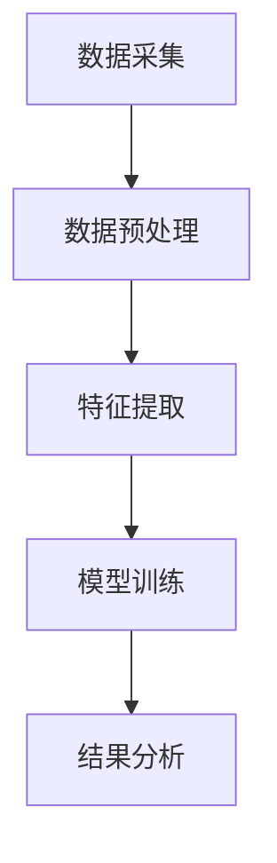
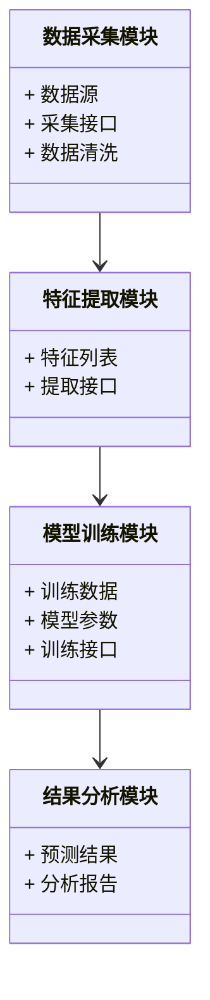
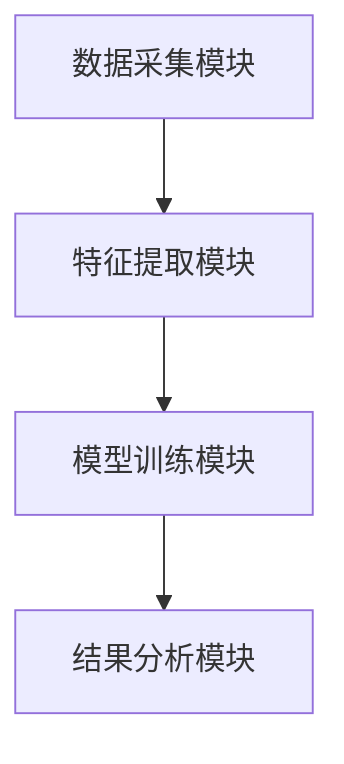

                 


# AI协作分析公司社会责任实践：全面评估企业价值

> 关键词：AI协作分析, 企业社会责任, 企业价值评估, 算法原理, 数学模型, 系统架构, 项目实战

> 摘要：随着人工智能技术的快速发展，AI协作分析在企业社会责任评估中的应用越来越广泛。本文将从AI协作分析的基本概念出发，结合企业社会责任的核心指标，详细探讨AI协作分析在企业价值评估中的算法原理、数学模型、系统架构设计以及实际项目案例。通过对AI协作分析在企业社会责任中的应用进行深入分析，本文旨在为企业提供一种高效、准确的评估方法，从而帮助企业在履行社会责任的同时实现可持续发展。

---

# 第一部分: AI协作分析与企业社会责任概述

## 第1章: AI协作分析与企业社会责任背景

### 1.1 问题背景与定义

#### 1.1.1 企业社会责任的定义与内涵

企业社会责任（Corporate Social Responsibility, CSR）是指企业在追求经济效益的同时，还需关注环境保护、员工福利、社会公益等方面的社会责任。传统的企业社会责任评估主要依赖于主观判断和人工分析，存在效率低下、结果不一致的问题。

#### 1.1.2 AI协作分析的定义与特点

AI协作分析是指通过人工智能技术，将企业社会责任相关数据进行整合、分析和评估的过程。其特点包括数据处理能力强、分析效率高、结果客观准确等。AI协作分析能够帮助企业从海量数据中提取有价值的信息，从而更好地履行社会责任。

#### 1.1.3 企业社会责任与AI协作分析的结合

随着技术的进步，AI协作分析逐渐成为企业社会责任评估的重要工具。通过AI技术，企业可以实时监测和评估其社会责任履行情况，从而实现更加高效和精准的管理。

### 1.2 问题描述与目标

#### 1.2.1 企业社会责任评估的挑战

传统的企业社会责任评估方法存在以下问题：数据来源单一、评估标准不统一、结果缺乏客观性等。这些问题严重影响了企业社会责任评估的效果和效率。

#### 1.2.2 AI协作分析在企业价值评估中的作用

AI协作分析能够通过大数据处理、机器学习等技术，帮助企业更好地识别和评估其社会责任履行情况。它不仅可以提高评估效率，还可以为企业提供更加全面和精准的评估结果。

#### 1.2.3 本研究的目标与意义

本研究的目标是通过AI协作分析技术，探索企业社会责任评估的新方法，为企业提供一种高效、准确的评估工具。这将有助于企业在履行社会责任的同时，实现更加可持续的发展。

### 1.3 问题解决与边界

#### 1.3.1 AI协作分析解决企业社会责任问题的思路

AI协作分析通过整合企业内外部数据，利用机器学习算法，对企业社会责任履行情况进行全面评估。这种方法不仅可以提高评估效率，还可以为企业提供更加客观和准确的评估结果。

#### 1.3.2 问题的边界与外延

AI协作分析在企业社会责任评估中的应用范围包括环境保护、员工福利、社会公益等多个方面。然而，由于数据获取和隐私保护等问题，其应用还存在一定的局限性。

#### 1.3.3 核心概念与要素的组成

企业社会责任评估的核心要素包括环境影响、员工权益、社会公益等。AI协作分析需要整合这些要素，通过数据分析和模型构建，生成全面的评估结果。

---

# 第二部分: 核心概念与原理

## 第2章: AI协作分析的核心概念与原理

### 2.1 核心概念原理

#### 2.1.1 AI协作分析的基本原理

AI协作分析通过整合企业内外部数据，利用机器学习算法，对企业社会责任履行情况进行全面评估。其基本原理包括数据采集、特征提取、模型训练和结果分析等步骤。

#### 2.1.2 企业社会责任评估的关键指标

企业社会责任评估的关键指标包括环境保护、员工福利、社会公益等。这些指标需要通过数据化、量化的方式进行评估。

#### 2.1.3 AI协作分析与企业价值的关系

AI协作分析通过帮助企业更好地履行社会责任，从而提升企业的社会形象和市场竞争力。这不仅有助于企业实现可持续发展，还可以为企业创造更大的经济价值。

### 2.2 核心概念属性对比表

以下是AI协作分析与传统企业社会责任评估方法的对比：

| **对比维度** | **AI协作分析** | **传统评估方法** |
|--------------|-----------------|-------------------|
| 数据来源     | 多源数据         | 单一数据来源       |
| 评估效率     | 高               | 低                 |
| 评估结果     | 客观准确         | 主观性较强         |

### 2.3 ER实体关系图

以下是企业社会责任评估的ER实体关系图：

```mermaid
er
    actor: 企业
    attribute: 社会责任指标
    relation: 评估结果
    actor --> attribute: 提供数据
    attribute --> relation: 存储结果
```

## 第3章: AI协作分析的算法原理

### 3.1 算法原理概述

#### 3.1.1 AI协作分析的基本算法

AI协作分析的核心算法包括数据预处理、特征提取、模型训练和结果分析等步骤。以下是算法流程图：



#### 3.1.2 算法的输入与输出

算法输入包括企业社会责任相关数据，如环境影响数据、员工福利数据等。算法输出包括企业社会责任评估结果，如环境影响评分、员工福利评分等。

#### 3.1.3 算法的实现步骤

以下是算法的详细实现步骤：

1. **数据采集**：从企业内外部数据源获取社会责任相关数据。
2. **数据预处理**：对数据进行清洗、归一化等处理，确保数据质量。
3. **特征提取**：从数据中提取关键特征，如环境影响指标、员工福利指标等。
4. **模型训练**：利用机器学习算法（如线性回归、随机森林等）构建评估模型。
5. **结果分析**：根据模型输出结果，生成企业社会责任评估报告。

### 3.2 算法流程图

以下是算法流程图：


### 3.3 算法实现代码

以下是Python实现的示例代码：

```python
import pandas as pd
from sklearn.model_selection import train_test_split
from sklearn.linear_model import LinearRegression

# 数据预处理
data = pd.read_csv('社会责任数据.csv')
X = data.drop('目标变量', axis=1)
y = data['目标变量']

# 数据分割
X_train, X_test, y_train, y_test = train_test_split(X, y, test_size=0.2)

# 模型训练
model = LinearRegression()
model.fit(X_train, y_train)

# 模型预测
y_pred = model.predict(X_test)

# 结果分析
print('预测结果:', y_pred)
print('真实结果:', y_test)
```

---

# 第三部分: 数学模型与系统架构设计

## 第4章: 数学模型与系统架构设计

### 4.1 数学模型

#### 4.1.1 线性回归模型

以下是线性回归模型的数学公式：

$$ y = \beta_0 + \beta_1 x_1 + \beta_2 x_2 + ... + \beta_n x_n $$

其中，$y$ 是目标变量，$x_i$ 是特征变量，$\beta_i$ 是回归系数。

#### 4.1.2 随机森林模型

随机森林模型是一种集成学习方法，其数学公式较为复杂，但其核心思想是通过构建多个决策树并进行投票或平均来提高模型的准确性和鲁棒性。

### 4.2 系统架构设计

#### 4.2.1 系统功能设计

以下是系统功能模块的类图：



#### 4.2.2 系统架构设计

以下是系统架构图：



---

# 第四部分: 项目实战

## 第5章: 项目实战与案例分析

### 5.1 项目环境配置

以下是项目环境配置示例：

```python
# 环境配置
import pandas as pd
import numpy as np
from sklearn.model_selection import train_test_split
from sklearn.linear_model import LinearRegression

# 数据加载
data = pd.read_csv('社会责任数据.csv')
```

### 5.2 核心代码实现

以下是核心代码实现：

```python
# 数据预处理
data = pd.read_csv('社会责任数据.csv')
X = data.drop('目标变量', axis=1)
y = data['目标变量']

# 数据分割
X_train, X_test, y_train, y_test = train_test_split(X, y, test_size=0.2)

# 模型训练
model = LinearRegression()
model.fit(X_train, y_train)

# 模型预测
y_pred = model.predict(X_test)

# 结果分析
print('预测结果:', y_pred)
print('真实结果:', y_test)
```

### 5.3 项目总结与改进建议

通过对项目的实施和分析，我们可以得出以下结论：

1. AI协作分析能够有效提高企业社会责任评估的效率和准确性。
2. 在实际应用中，需要根据具体需求选择合适的算法和模型。
3. 未来可以进一步优化算法，提高模型的准确性和鲁棒性。

---

# 第五部分: 最佳实践与小结

## 第6章: 最佳实践与小结

### 6.1 小结

通过本文的分析和探讨，我们可以看到，AI协作分析在企业社会责任评估中的应用具有重要的意义。它不仅能够提高评估效率，还能够为企业提供更加客观和准确的评估结果。

### 6.2 注意事项

在实际应用中，需要注意以下几点：

1. 数据的准确性和完整性。
2. 算法的选择和优化。
3. 结果的解释和应用。

### 6.3 拓展阅读

以下是拓展阅读推荐：

1. 《机器学习实战》
2. 《企业社会责任评估方法》
3. 《人工智能与企业可持续发展》

---

# 结语

随着人工智能技术的不断发展，AI协作分析在企业社会责任评估中的应用前景广阔。通过本文的探讨，我们不仅了解了AI协作分析的基本原理和算法实现，还通过实际案例展示了其在企业社会责任评估中的应用价值。未来，随着技术的进一步发展，AI协作分析将在企业社会责任评估中发挥更加重要的作用。

---

作者：AI天才研究院/AI Genius Institute & 禅与计算机程序设计艺术 /Zen And The Art of Computer Programming

