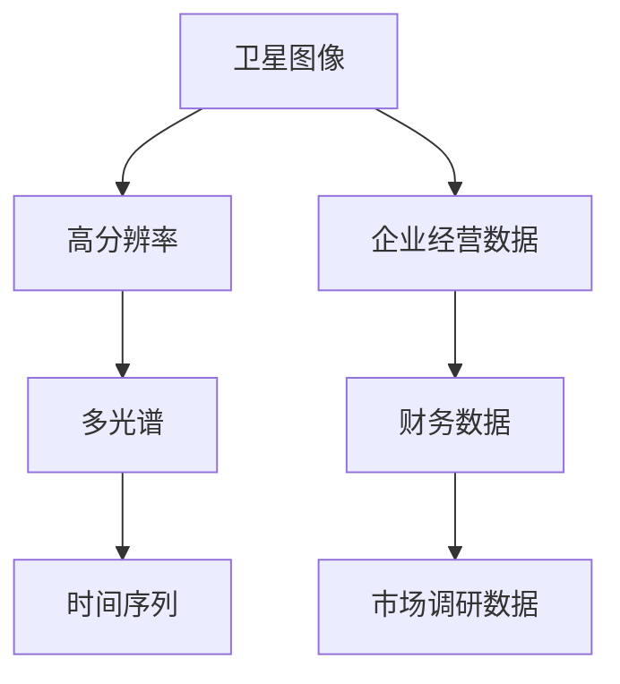
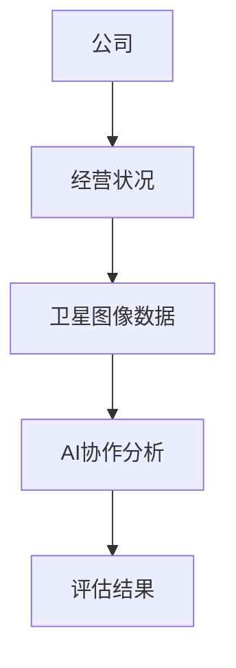
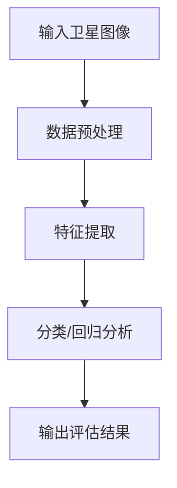
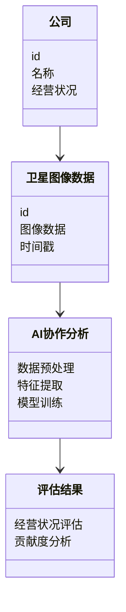
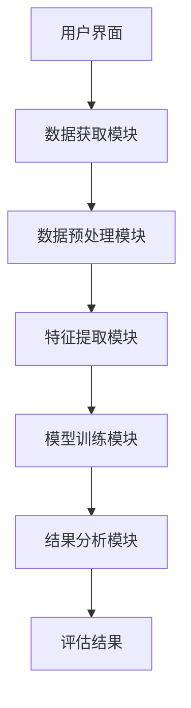
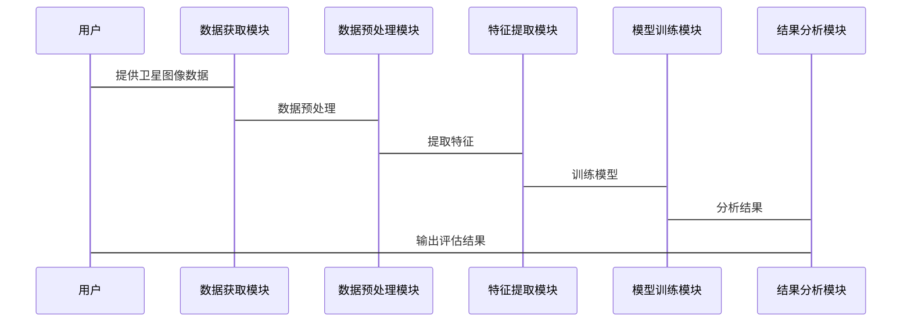

                 


# AI协作分析卫星图像数据：评估公司实际经营状况

**关键词**：AI协作、卫星图像、企业经营状况、图像分析、深度学习、数据处理、商业分析

**摘要**：本文详细探讨了如何利用AI协作技术分析卫星图像数据，以评估公司实际经营状况。通过背景介绍、核心概念与联系、算法原理、系统架构设计、项目实战和总结等部分，系统性地阐述了AI协作在卫星图像分析中的应用流程，包括数据预处理、特征提取、分类与回归算法等关键步骤，并通过实际案例展示了其在商业分析中的潜力和价值。文章最后总结了AI协作的优势与挑战，为读者提供了全面的技术指导和实践参考。

---

## 第一部分：背景介绍

### 第1章：问题背景与描述

#### 1.1 问题背景
- **从图像分析到商业价值的演变**：随着卫星技术的快速发展，卫星图像数据的获取变得越来越频繁和高效。这些数据不仅提供了地理信息，还隐藏着丰富的商业价值。通过对卫星图像的分析，我们可以获取企业的经营状况、市场动态等信息，为企业决策提供支持。
- **卫星图像数据的商业潜力**：卫星图像数据可以用于监测企业的生产基地、物流网络、销售网点等，帮助评估企业的经营规模和市场影响力。此外，卫星图像还可以用于监测企业的环境影响，评估企业的社会责任。
- **公司经营状况评估的传统方法与局限性**：传统上，公司经营状况的评估主要依赖于财务报表、市场调研等方法。然而，这些方法往往依赖于企业的自我报告，存在数据不准确、难以验证等问题。卫星图像数据的引入为公司经营状况的评估提供了新的可能性。

#### 1.2 问题描述
- **卫星图像在企业经营分析中的应用场景**：卫星图像可以用于监测企业的生产基地、物流网络、销售网点等，帮助评估企业的经营规模和市场影响力。例如，通过分析卫星图像，可以监测企业的物流车辆数量，进而评估企业的物流能力。
- **AI协作在卫星图像分析中的必要性**：卫星图像数据量大、复杂度高，单靠人工分析难以高效处理。AI协作技术可以通过自动化的方式处理卫星图像数据，提高分析效率和准确性。
- **当前技术挑战与解决方案**：卫星图像数据的处理需要高度的专业知识和技术支持。AI协作技术可以帮助企业快速建立卫星图像分析能力，降低技术门槛。

#### 1.3 问题解决
- **AI协作的核心优势**：AI协作技术可以通过自动化的方式处理卫星图像数据，提高分析效率和准确性。同时，AI协作还可以通过多团队协作，整合不同领域的知识，提高分析的全面性。
- **卫星图像数据处理的关键步骤**：包括数据预处理、特征提取、分类与回归等步骤。通过这些步骤，可以从卫星图像中提取出有用的特征，进而评估企业的经营状况。
- **企业经营状况评估的AI协作流程**：包括数据获取、数据预处理、特征提取、模型训练、结果分析等步骤。通过这些步骤，可以系统性地评估企业的经营状况。

#### 1.4 边界与外延
- **卫星图像分析的边界条件**：卫星图像的分辨率、覆盖范围、时间跨度等都会影响分析结果。因此，在实际应用中需要明确分析的边界条件，确保分析结果的准确性。
- **企业经营评估的适用范围**：卫星图像分析适用于大型企业和跨国公司，对于小型企业和本地企业可能效果有限。此外，卫星图像分析更适合用于宏观层面的评估，微观层面的评估可能需要结合其他数据源。
- **技术的可扩展性与局限性**：AI协作技术可以通过扩展计算能力来处理更大的数据量，但同时也需要更多的计算资源和专业知识。

#### 1.5 核心概念组成
- **数据源**：卫星图像数据、企业经营数据。
- **分析工具**：AI算法、图像处理技术。
- **输出结果**：经营状况评估指标，如企业的市场影响力、物流能力、社会责任等。

---

## 第二部分：核心概念与联系

### 第2章：AI协作与卫星图像分析

#### 2.1 核心概念原理
- **AI协作的基本原理**：AI协作技术通过整合多个AI模型的优势，实现对卫星图像的高效分析。例如，可以通过多个AI模型的协作，提高图像识别的准确性。
- **卫星图像分析的数学模型**：卫星图像分析可以通过多种数学模型实现，如卷积神经网络（CNN）、支持向量机（SVM）等。这些模型可以帮助提取卫星图像中的特征，进而评估企业的经营状况。
- **企业经营状况评估的逻辑框架**：通过分析卫星图像中的特征，可以提取出企业的经营规模、市场影响力等指标，进而评估企业的经营状况。

#### 2.2 概念属性特征对比
**表格：AI协作 vs. 传统图像分析**

| **特性**         | **AI协作**              | **传统图像分析**        |
|------------------|------------------------|-------------------------|
| 数据处理效率     | 高                     | 低                     |
| 分析准确性       | 高                     | 中                     |
| 技术门槛         | 低（通过协作实现）     | 高                     |
| 可扩展性         | 高                     | 中                     |

**图表：卫星图像 vs. 其他数据源的特征对比**



#### 2.3 ER实体关系图


---

## 第三部分：算法原理讲解

### 第3章：卫星图像处理算法

#### 3.1 数据预处理
- **图像增强与标准化**：通过调整图像的亮度、对比度等参数，提高图像的质量。标准化处理可以确保不同图像之间的可比性。
- **噪声消除与分辨率提升**：通过去噪算法（如高斯滤波）消除图像中的噪声，同时通过插值算法提高图像的分辨率。
- **数据标注与分割**：对图像进行标注，标注企业的建筑物、物流车辆等目标。图像分割算法可以将图像中的目标区域分割出来。

#### 3.2 特征提取
- **使用CNN提取图像特征**：卷积神经网络（CNN）可以有效地提取图像中的空间特征。通过训练CNN模型，可以从卫星图像中提取出企业的特征。
- **图像分割算法**：使用分割算法（如U-Net）将图像中的目标区域分割出来，例如企业的生产基地、物流车辆等。
- **特征向量构建**：将分割后的图像区域转换为特征向量，用于后续的分类和回归分析。

#### 3.3 分类与回归算法
- **使用随机森林进行分类**：随机森林是一种常用的分类算法，可以通过集成多个决策树模型，提高分类的准确性。可以用于企业的市场影响力分类。
- **线性回归模型**：线性回归模型可以用于预测企业的经营规模，例如通过企业的物流车辆数量预测企业的物流能力。
- **深度学习模型（如ResNet）**：ResNet是一种常用的深度学习模型，可以用于图像分类和回归分析。可以通过ResNet模型对卫星图像进行分类，评估企业的经营状况。

#### 3.4 算法流程图


---

## 第四部分：系统分析与架构设计

### 第4章：系统功能设计

#### 4.1 项目介绍
- **项目目标**：通过AI协作技术分析卫星图像数据，评估企业的经营状况。
- **项目范围**：涵盖卫星图像数据获取、数据处理、特征提取、模型训练、结果分析等环节。

#### 4.2 领域模型


#### 4.3 系统架构设计


#### 4.4 接口设计
- **输入接口**：接收卫星图像数据和企业经营数据。
- **输出接口**：输出企业的经营状况评估结果。

#### 4.5 交互流程图


---

## 第五部分：项目实战

### 第5章：项目实战

#### 5.1 环境安装
- **安装Python**：需要安装Python 3.8或更高版本。
- **安装必要的库**：包括Pillow、numpy、pandas、scikit-learn、tensorflow等。
- **安装Mermaid**：用于生成图表。

#### 5.2 核心功能实现
- **数据预处理**：编写Python代码进行图像增强、噪声消除等操作。
- **特征提取**：使用CNN模型提取图像特征。
- **模型训练**：训练随机森林模型进行分类，训练线性回归模型进行回归分析。

#### 5.3 代码实现
```python
import numpy as np
from sklearn.ensemble import RandomForestClassifier
from sklearn.metrics import accuracy_score

# 数据预处理
def preprocess(image):
    # 调整亮度
    image_adjusted = image * 1.2
    # 去噪
    image_denoised = image.filter(GaussianBlur(radius=2))
    return image_denoised

# 特征提取
def extract_features(image):
    model = CNNModel()
    features = model.extract(image)
    return features

# 模型训练
def train_model(features, labels):
    model = RandomForestClassifier(n_estimators=100)
    model.fit(features, labels)
    return model

# 分类与回归
def classify(model, new_features):
    prediction = model.predict(new_features)
    return prediction
```

#### 5.4 实际案例分析
- **案例背景**：某跨国企业在全球多个国家设有生产基地，通过分析卫星图像数据，评估其生产能力和市场影响力。
- **数据获取**：获取该企业的生产基地卫星图像数据。
- **数据处理**：对图像进行预处理，提取企业的建筑物特征。
- **模型训练**：训练随机森林模型，分类企业的生产基地分布。
- **结果分析**：输出企业的生产基地分布情况，评估其市场影响力。

#### 5.5 项目小结
- **项目成果**：通过AI协作技术，成功分析卫星图像数据，评估企业的经营状况。
- **经验总结**：AI协作技术可以有效提高卫星图像分析的效率和准确性，为企业经营状况评估提供新的可能性。

---

## 第六部分：总结

### 第6章：总结

#### 6.1 最佳实践 tips
- **数据预处理**：确保数据质量，提高分析结果的准确性。
- **模型选择**：根据实际需求选择合适的模型，如随机森林、线性回归等。
- **团队协作**：通过团队协作，整合不同领域的知识，提高分析的全面性。

#### 6.2 小结
- 通过AI协作技术，可以高效分析卫星图像数据，评估企业的经营状况。
- AI协作技术的应用不仅提高了分析效率，还提高了分析结果的准确性。

#### 6.3 注意事项
- **数据隐私**：确保数据的安全性和隐私性，避免数据泄露。
- **模型解释性**：选择可解释性强的模型，确保分析结果的透明性。
- **技术可行性**：根据实际需求选择合适的技术方案，确保技术的可行性。

#### 6.4 拓展阅读
- 推荐阅读《Deep Learning》（Ian Goodfellow等著），深入理解深度学习模型。
- 推荐阅读《Satellite Image Analysis for Business Insights》（假设书名），了解卫星图像在商业分析中的应用。

---

**作者：AI天才研究院/AI Genius Institute & 禅与计算机程序设计艺术 /Zen And The Art of Computer Programming**

