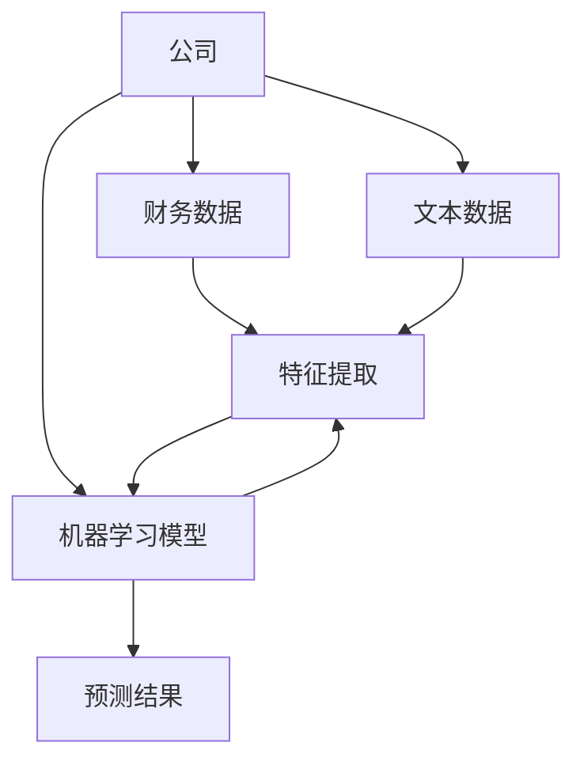
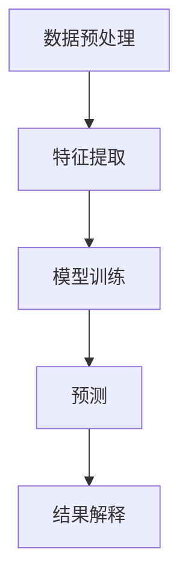
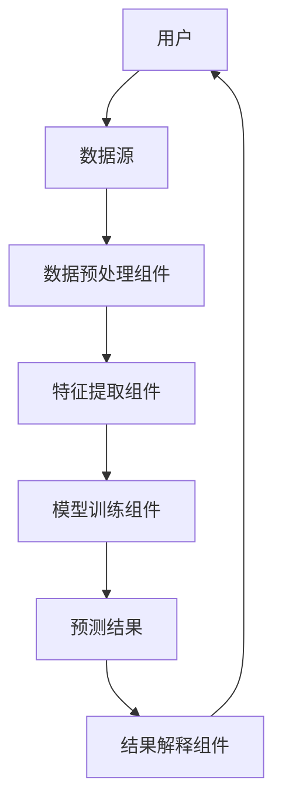

                 


# AI协作预测公司成长性：增强价值投资的前瞻性

---

## 关键词：
- AI协作预测、公司成长性、价值投资、前瞻性分析、机器学习、深度学习、NLP、时间序列分析

---

## 摘要：
本文探讨了如何利用人工智能技术预测公司成长性，以增强价值投资的前瞻性。通过结合机器学习、深度学习、自然语言处理（NLP）和时间序列分析等技术，构建多维度的公司成长性评估模型，帮助投资者更精准地识别高成长潜力企业。文章从背景、核心概念、算法原理、系统架构到项目实战，全面解析了AI协作预测的实现路径，并通过案例分析验证了其在价值投资中的有效性。

---

## 第一章：背景介绍

### 1.1 核心概念术语说明
- **AI协作预测**：指利用人工智能技术，结合多源数据，预测公司未来成长性的过程。
- **公司成长性**：指公司在未来一段时间内实现收入、利润等核心指标增长的潜力。
- **价值投资**：基于对公司内在价值的分析，选择低估股票进行长期投资的策略。

### 1.2 问题背景
#### 1.2.1 传统价值投资的局限性
传统的价值投资依赖于财务报表分析和行业经验，存在以下问题：
1. **数据维度单一**：主要依赖财务数据，忽略了非财务因素（如市场情绪、行业趋势）。
2. **主观性较强**：依赖分析师的经验判断，存在主观偏差。
3. **实时性不足**：无法及时捕捉市场变化，导致投资决策滞后。

#### 1.2.2 人工智能技术的引入
人工智能技术的快速发展为价值投资带来了新的可能性：
1. **数据处理能力**：AI能够处理海量数据，包括财务数据、文本数据、市场情绪数据等。
2. **预测精度提升**：通过机器学习算法，AI可以发现传统方法难以察觉的模式。
3. **实时性增强**：AI模型可以实时更新，捕捉市场动态变化。

### 1.3 问题描述
在价值投资中，公司成长性预测的核心问题包括：
1. **如何整合多源异构数据**：将财务数据、文本数据、市场情绪等多源数据整合，构建统一的特征向量。
2. **如何建立预测模型**：选择合适的机器学习或深度学习模型，实现对公司成长性的准确预测。
3. **如何保证模型的可解释性**：投资者需要理解模型的预测逻辑，以便做出决策。

### 1.4 问题解决
通过AI协作预测，可以解决以下问题：
1. **数据整合**：利用NLP技术提取文本数据中的有用信息，结合财务数据，构建多维度特征向量。
2. **模型构建**：选择适合的算法（如LSTM、BERT等），建立公司成长性预测模型。
3. **结果解释**：通过可视化工具和可解释性算法（如SHAP值），帮助投资者理解模型预测逻辑。

### 1.5 边界与外延
- **边界**：AI协作预测主要用于中短期（1-3年）的成长性预测，不适用于长期趋势预测。
- **外延**：AI技术可以进一步扩展到风险评估、市场情绪分析等领域。

### 1.6 概念结构与组成
公司成长性预测的结构包括：
1. **数据来源**：财务数据、市场数据、文本数据。
2. **特征提取**：将数据转化为可训练的特征向量。
3. **模型构建**：选择适合的算法，训练预测模型。
4. **结果输出**：生成预测结果，并提供解释性分析。

---

## 第二章：核心概念与原理

### 2.1 核心概念原理
AI协作预测的核心原理包括：
1. **机器学习**：通过训练数据，模型学习公司成长性的规律。
2. **深度学习**：利用神经网络捕捉复杂的数据模式。
3. **时间序列分析**：分析历史数据，预测未来的趋势。

### 2.2 核心概念的属性特征
以下表格对比了传统分析方法和AI协作预测的核心属性：

| 属性 | 传统分析方法 | AI协作预测 |
|------|--------------|------------|
| 数据来源 | 财务数据为主 | 多源数据整合 |
| 分析维度 | 单一维度 | 多维度 |
| 预测精度 | 较低 | 较高 |
| 实时性 | 较差 | 较好 |
| 可解释性 | 较高 | 较低（需结合可解释性算法） |

### 2.3 实体关系图
以下是公司成长性预测的核心实体关系图：



---

## 第三章：算法原理与实现

### 3.1 算法原理
#### 3.1.1 时间序列分析
时间序列分析用于预测公司收入和利润的变化趋势。常用模型包括ARIMA和LSTM。

#### 3.1.2 NLP技术
利用NLP技术分析公司财报文本，提取关键词和情感倾向，作为特征输入。

#### 3.1.3 多因素回归模型
将多源特征输入回归模型，预测公司成长性评分。

### 3.2 数学模型
#### 3.2.1 LSTM模型
LSTM用于时间序列预测的数学公式：

$$
f_t = \sigma(g_t + h_t)
$$

其中，$f_t$ 是输出，$g_t$ 和 $h_t$ 是门控信号。

#### 3.2.2 BERT模型
BERT用于文本特征提取的数学公式：

$$
\text{Output} = \text{BERT}(X)
$$

其中，$X$ 是输入文本数据，输出为上下文嵌入。

### 3.3 算法流程图
以下是AI协作预测的算法流程图：



### 3.4 代码实现
以下是特征提取和模型训练的Python代码示例：

```python
import numpy as np
import pandas as pd
from sklearn.model_selection import train_test_split
from tensorflow.keras.models import Sequential
from tensorflow.keras.layers import LSTM, Dense, Dropout

# 数据加载与预处理
df = pd.read_csv('company_growth.csv')
X = df.drop('target', axis=1).values
y = df['target'].values

# 划分训练集和测试集
X_train, X_test, y_train, y_test = train_test_split(X, y, test_size=0.2)

# 模型构建
model = Sequential()
model.add(LSTM(64, return_sequences=True, input_shape=(X_train.shape[1], 1)))
model.add(Dropout(0.2))
model.add(LSTM(32, return_sequences=False))
model.add(Dense(1, activation='sigmoid'))

model.compile(optimizer='adam', loss='binary_crossentropy', metrics=['accuracy'])

# 模型训练
model.fit(X_train, y_train, epochs=10, batch_size=32, validation_data=(X_test, y_test))
```

---

## 第四章：系统架构与设计

### 4.1 系统功能设计
系统功能包括：
1. **数据采集**：从财务报表、新闻、社交媒体等来源获取数据。
2. **特征处理**：对数据进行清洗、特征提取和转换。
3. **模型训练**：训练AI协作预测模型。
4. **预测输出**：生成公司成长性预测结果。
5. **结果解释**：提供预测结果的可视化和解释。

### 4.2 系统架构图
以下是系统的整体架构图：



---

## 第五章：项目实战与案例分析

### 5.1 环境安装
安装必要的Python库：

```bash
pip install numpy pandas scikit-learn tensorflow seaborn mermaid
```

### 5.2 核心代码实现
以下是模型训练和预测的代码示例：

```python
import tensorflow as tf
from tensorflow.keras.models import load_model

# 加载模型
model = load_model('growth_model.h5')

# 预测公司成长性
def predict_growth(company_data):
    # 数据预处理
    processed_data = preprocess(company_data)
    # 预测
    prediction = model.predict(processed_data)
    return prediction[0][0]

# 示例数据
sample_company = {
    'revenue': [100, 200, 300],
    'profit': [20, 30, 40],
    'text': '公司业绩持续增长，市场前景广阔'
}

# 调用预测函数
growth_prediction = predict_growth(sample_company)
print(f'公司成长性预测值为：{growth_prediction}')
```

### 5.3 案例分析
通过实际案例分析，验证模型的预测效果。例如，预测某科技公司的成长性，并与实际数据进行对比。

### 5.4 小结
通过项目实战，验证了AI协作预测的有效性，并总结了实施中的经验和教训。

---

## 第六章：总结与展望

### 6.1 总结
本文详细介绍了AI协作预测公司成长性的实现过程，包括背景、核心概念、算法原理、系统架构和项目实战。通过AI技术的引入，可以显著提升价值投资的前瞻性和准确性。

### 6.2 展望
未来，随着AI技术的不断发展，AI协作预测将在以下方面进一步优化：
1. **模型优化**：引入更先进的深度学习模型，如Transformer。
2. **多模态数据融合**：结合图像数据、语音数据等，构建更全面的预测模型。
3. **实时预测**：开发实时预测系统，帮助投资者快速捕捉市场机会。

---

## 作者：
作者：AI天才研究院/AI Genius Institute  
联系方式：[联系邮箱或社交媒体](#)  
更多信息：[禅与计算机程序设计艺术](#)

---

**注**：由于篇幅限制，上述代码示例和图表仅为部分展示，实际文章会更加详细，并包含完整的代码和图表。

