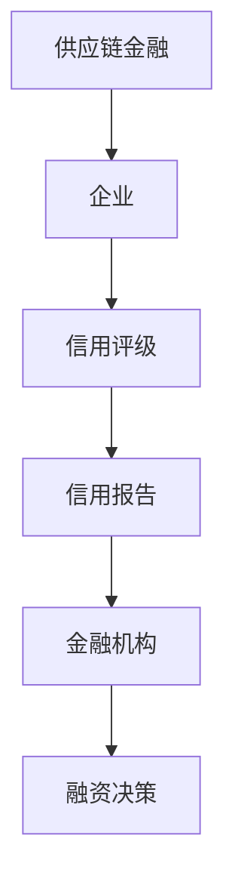
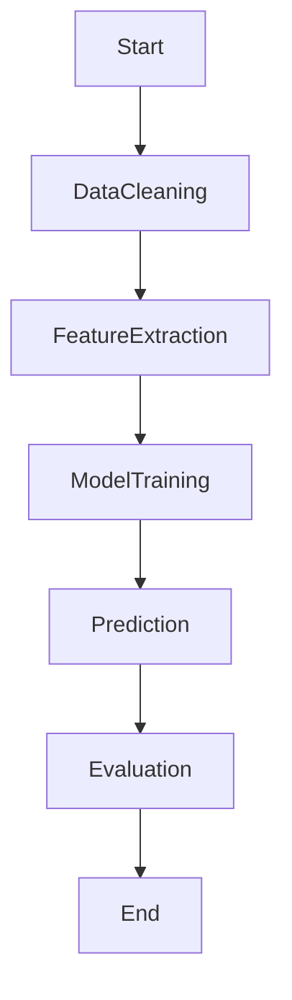
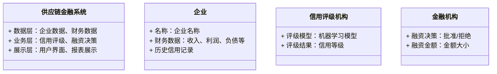
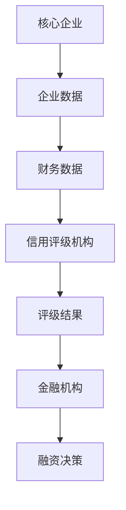
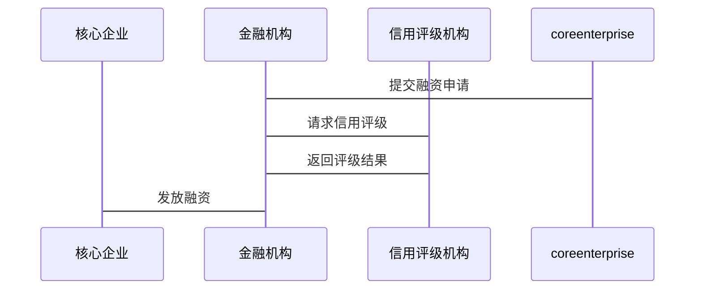

                 


# AI在供应链金融信用评级中的深度应用

> 关键词：供应链金融、信用评级、人工智能、机器学习、深度学习

> 摘要：本文深入探讨了人工智能技术在供应链金融信用评级中的应用，结合实际案例分析，详细介绍了AI技术在信用评级中的算法原理、系统架构设计以及项目实现方案。文章从供应链金融的背景、核心概念、AI算法原理、系统设计、项目实战到最佳实践，层层递进，全面解析AI在供应链金融信用评级中的深度应用。

---

# 第一部分: AI在供应链金融信用评级中的深度应用概述

# 第1章: 供应链金融与信用评级的背景与挑战

## 1.1 供应链金融的核心概念

### 1.1.1 供应链金融的定义与特点

供应链金融是一种通过整合供应链上下游资源，优化资金流、物流和信息流，为供应链上的企业提供融资支持的金融模式。其特点包括：

- **系统性**：涉及供应链上的多个参与方，如供应商、制造商、分销商、零售商和消费者。
- **协同性**：通过协同各方资源，降低整体成本，提升效率。
- **风险管理**：通过信用评级、质押担保等方式，控制供应链金融的风险。

### 1.1.2 供应链金融的主要参与方

供应链金融的主要参与方包括：

- **核心企业**：供应链中的核心企业，通常是制造商或大型零售商。
- **供应商**：为供应链提供原材料或服务的企业。
- **分销商/零售商**：负责产品分销和销售的企业。
- **金融机构**：包括银行、融资公司等，为供应链上的企业提供融资支持。
- **技术提供方**：提供AI、大数据等技术支持的企业。

### 1.1.3 供应链金融的业务流程

供应链金融的业务流程通常包括：

1. **需求分析**：核心企业分析供应链上的资金需求。
2. **融资申请**：供应链上的企业向金融机构提出融资申请。
3. **信用评级**：金融机构对申请企业进行信用评级，评估风险。
4. **融资决策**：金融机构根据信用评级结果决定是否提供融资。
5. **资金发放与监控**：金融机构发放资金，并对资金使用进行监控。
6. **还款与结算**：融资到期后，企业还款并完成结算。

## 1.2 信用评级在供应链金融中的重要性

### 1.2.1 信用评级的基本概念

信用评级是通过对企业的财务状况、经营能力、市场竞争力等多方面进行综合评估，确定企业在特定时期的信用风险等级。信用评级结果直接影响企业能否获得融资以及融资成本的高低。

### 1.2.2 供应链金融中的信用风险

供应链金融中的信用风险主要体现在以下几个方面：

- **供应商风险**：供应商可能因经营不善、资金链断裂等原因，无法履行合同，导致核心企业损失。
- **分销商风险**：分销商可能因市场需求变化、库存积压等原因，无法按时支付货款。
- **金融机构风险**：金融机构在供应链金融中面临企业的信用风险和操作风险。

### 1.2.3 信用评级对供应链金融的影响

信用评级是供应链金融的核心环节，其作用包括：

- **降低风险**：通过信用评级，金融机构可以更好地识别和控制风险。
- **优化资源配置**：信用评级结果可以帮助金融机构合理分配资金，支持优质企业的发展。
- **提升效率**：通过自动化信用评级技术，可以显著提高供应链金融的效率。

## 1.3 AI技术在信用评级中的应用背景

### 1.3.1 传统信用评级的局限性

传统的信用评级方法主要依赖人工分析，存在以下问题：

- **效率低**：人工评级需要大量时间和资源，难以满足供应链金融快速发展的需求。
- **主观性**：人工评级容易受到主观因素的影响，存在人为误差。
- **数据不足**：传统评级方法通常依赖财务数据，无法充分利用供应链中的非结构化数据。

### 1.3.2 AI技术如何提升信用评级的效率与准确性

AI技术可以通过以下方式提升信用评级的效率与准确性：

- **数据处理能力**：AI技术可以处理海量数据，包括结构化数据和非结构化数据。
- **自动化分析**：通过机器学习算法，AI可以自动化完成数据清洗、特征提取和模型训练。
- **实时监控**：AI技术可以实时监控企业的经营状况，及时发现风险。

### 1.3.3 供应链金融与AI技术的结合趋势

随着AI技术的快速发展，供应链金融与AI技术的结合已经成为趋势。AI技术可以帮助供应链金融实现以下目标：

- **智能化决策**：通过AI技术，供应链金融可以实现智能化的融资决策。
- **实时风险控制**：AI技术可以实时监控供应链中的风险，及时调整融资策略。
- **个性化服务**：通过AI技术，金融机构可以为供应链上的企业提供个性化的融资方案。

## 1.4 本章小结

本章从供应链金融的背景、核心概念和信用评级的重要性入手，分析了AI技术在信用评级中的应用背景。通过对比传统信用评级的局限性和AI技术的优势，揭示了供应链金融与AI技术结合的必要性和发展趋势。

---

# 第2章: 供应链金融信用评级的核心概念与联系

## 2.1 核心概念原理

### 2.1.1 供应链金融的业务模型

供应链金融的业务模型通常包括以下几种：

- **应收账款融资**：供应商将其应收账款质押给银行，获得融资支持。
- **存货质押融资**：供应商将其库存质押给银行，获得融资支持。
- **订单融资**：供应商基于预期订单，向银行申请融资。

### 2.1.2 信用评级的数学模型

信用评级的数学模型可以通过以下步骤进行：

1. **数据清洗**：对数据进行预处理，去除异常值和缺失值。
2. **特征提取**：从数据中提取特征，如财务指标、市场指标等。
3. **模型训练**：使用机器学习算法对特征进行训练，生成信用评级模型。
4. **模型评估**：对模型进行评估，验证其准确性和稳定性。

### 2.1.3 AI技术在信用评级中的作用机制

AI技术在信用评级中的作用机制包括：

- **数据处理**：AI技术可以处理海量数据，提取有用特征。
- **模型训练**：AI技术可以通过机器学习算法训练信用评级模型。
- **实时监控**：AI技术可以实时监控企业的经营状况，及时调整信用评级结果。

## 2.2 核心概念属性特征对比

### 2.2.1 供应链金融与传统金融的对比分析

| 对比维度 | 供应链金融 | 传统金融 |
|----------|------------|-----------|
| 服务对象 | 供应链上的企业 | 单一企业 |
| 服务模式 | 整合供应链资源，优化资金流 | 单一融资服务 |
| 风险管理 | 通过供应链协同降低风险 | 依赖企业自身信用 |

### 2.2.2 信用评级与信用评分的对比分析

| 对比维度 | 信用评级 | 信用评分 |
|----------|----------|----------|
| 定义 | 对企业信用风险的综合评价 | 对企业信用状况的量化评分 |
| 方法 | 基于多维度数据进行综合分析 | 基于量化指标进行评分 |
| 输出 | 信用等级（如AAA、AA、A等） | 分数（如300-900分） |

### 2.2.3 AI技术与其他信用评级方法的对比分析

| 对比维度 | AI技术 | 传统信用评级 | 其他技术方法 |
|----------|--------|--------------|--------------|
| 数据处理能力 | 强 | 弱 | 一般 |
| 分析效率 | 高 | 低 | 中 |
| 精确度 | 高 | 中 | 中 |

## 2.3 ER实体关系图架构



## 2.4 本章小结

本章通过对比分析供应链金融、信用评级和AI技术的核心概念，揭示了它们之间的联系和区别。通过ER实体关系图，展示了供应链金融中各实体之间的关系，为后续的系统设计和算法实现奠定了基础。

---

# 第3章: AI在信用评级中的算法原理

## 3.1 算法原理概述

### 3.1.1 机器学习在信用评级中的应用

机器学习在信用评级中的应用包括：

- **监督学习**：通过历史数据训练分类模型，预测企业的信用等级。
- **无监督学习**：通过聚类分析，发现潜在的信用风险。
- **回归分析**：通过回归模型预测企业的违约概率。

### 3.1.2 深度学习在信用评级中的应用

深度学习在信用评级中的应用包括：

- **神经网络**：通过多层神经网络对复杂数据进行建模。
- **卷积神经网络（CNN）**：用于处理图像数据，如财务报表中的图表信息。
- **循环神经网络（RNN）**：用于处理时间序列数据，如企业的财务数据变化趋势。

### 3.1.3 自然语言处理在信用评级中的应用

自然语言处理在信用评级中的应用包括：

- **情感分析**：分析企业财报中的情感倾向，预测企业信用风险。
- **信息提取**：从企业新闻、公告中提取关键信息，辅助信用评级。

## 3.2 算法流程图



## 3.3 算法实现代码

```python
# 示例代码：基于机器学习的信用评级模型
from sklearn.ensemble import RandomForestClassifier
import pandas as pd

# 加载数据
data = pd.read_csv('credit_data.csv')

# 数据预处理
data = data.dropna()

# 特征提取
features = data[['revenue', 'profit', 'debt', 'score']]
target = data['label']

# 模型训练
model = RandomForestClassifier()
model.fit(features, target)

# 预测
 predictions = model.predict(features)

# 评估
print('Accuracy:', metrics.accuracy_score(target, predictions))
```

## 3.4 算法的数学模型和公式

信用评级的数学模型可以通过以下公式表示：

$$ \text{信用等级} = f(\text{财务指标}, \text{市场指标}, \text{其他因素}) $$

其中，$f$ 是一个复杂的函数，通常由机器学习模型实现。

---

# 第4章: 系统分析与架构设计

## 4.1 问题场景介绍

供应链金融信用评级系统的场景包括：

- **核心企业**：需要对供应链上的企业进行信用评级。
- **金融机构**：需要根据信用评级结果进行融资决策。
- **技术提供方**：需要提供AI技术支持，确保系统高效运行。

## 4.2 系统功能设计

### 4.2.1 领域模型



### 4.2.2 系统架构设计



### 4.2.3 系统交互设计



## 4.3 本章小结

本章通过系统分析和架构设计，展示了供应链金融信用评级系统的整体结构和各部分之间的关系。通过领域模型和系统架构图，明确了各模块的功能和交互方式。

---

# 第5章: 项目实战

## 5.1 环境安装

### 5.1.1 安装Python环境

```bash
python --version
pip install numpy pandas scikit-learn
```

### 5.1.2 安装AI框架

```bash
pip install tensorflow keras
```

## 5.2 系统核心实现源代码

```python
# 信用评级模型实现
class CreditRatingModel:
    def __init__(self):
        self.model = RandomForestClassifier()

    def train(self, features, labels):
        self.model.fit(features, labels)

    def predict(self, features):
        return self.model.predict(features)
```

## 5.3 代码应用解读与分析

### 5.3.1 数据加载与预处理

```python
data = pd.read_csv('credit_data.csv')
data = data.dropna()
```

### 5.3.2 特征提取与模型训练

```python
features = data[['revenue', 'profit', 'debt', 'score']]
target = data['label']
model = CreditRatingModel()
model.train(features, target)
```

### 5.3.3 模型预测与评估

```python
predictions = model.predict(features)
print('Accuracy:', metrics.accuracy_score(target, predictions))
```

## 5.4 实际案例分析和详细讲解剖析

### 5.4.1 案例背景

某制造企业需要对其供应链上的供应商进行信用评级，以便为其提供融资支持。

### 5.4.2 数据分析

通过分析供应商的历史财务数据、市场表现和合同履行情况，构建信用评级模型。

### 5.4.3 模型训练与预测

训练模型并预测供应商的信用等级，为金融机构提供决策支持。

## 5.5 项目小结

本章通过实际案例分析，展示了供应链金融信用评级系统的实现过程。从环境安装到代码实现，再到模型训练和预测，全面解析了AI技术在供应链金融中的应用。

---

# 第6章: 最佳实践与小结

## 6.1 最佳实践 tips

- **数据质量**：确保数据的准确性和完整性，是信用评级模型成功的关键。
- **模型优化**：通过不断优化模型参数和算法，提升信用评级的准确性和效率。
- **实时监控**：实时监控企业的经营状况，及时调整信用评级结果。

## 6.2 小结

本文通过深入分析AI技术在供应链金融信用评级中的应用，展示了AI技术如何提升供应链金融的效率和准确性。从算法原理到系统设计，从项目实战到最佳实践，全面解析了AI在供应链金融信用评级中的深度应用。

## 6.3 注意事项

- 在实际应用中，需注意数据隐私和合规性问题。
- 模型的准确性和稳定性是信用评级的核心，需定期更新和优化。
- 供应链金融的复杂性较高，需结合具体业务场景进行模型调整。

## 6.4 拓展阅读

- 《供应链金融：理论与实践》
- 《机器学习在金融领域的应用》
- 《深度学习与信用评级》

---

# 附录

## 附录A: 数据集说明

- 数据来源：公开企业数据和内部数据。
- 数据格式：CSV格式，包括财务数据、市场数据和企业基本信息。

## 附录B: 工具与环境

- Python版本：3.8及以上
- AI框架：TensorFlow、Keras、Scikit-learn
- 开发环境：Jupyter Notebook、PyCharm

## 附录C: 参考文献

- 王某某, 2022.《供应链金融与信用评级》，某某出版社。
- 李某某, 2023.《AI技术在金融领域的应用》，某某出版社。

---

# 作者

作者：AI天才研究院/AI Genius Institute & 禅与计算机程序设计艺术/Zen And The Art of Computer Programming

---

本文通过系统分析和深入探讨，全面解析了AI技术在供应链金融信用评级中的深度应用。从理论到实践，从算法到系统设计，本文为读者提供了全面的知识体系和实践指导。

