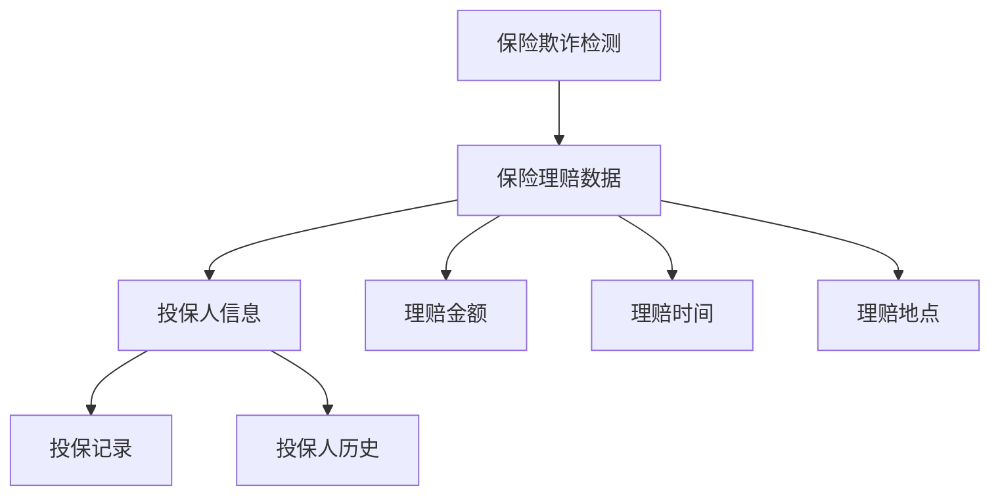
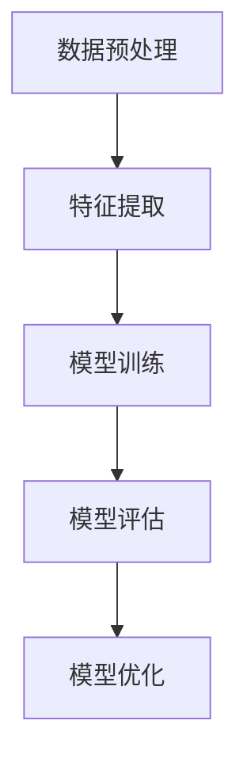
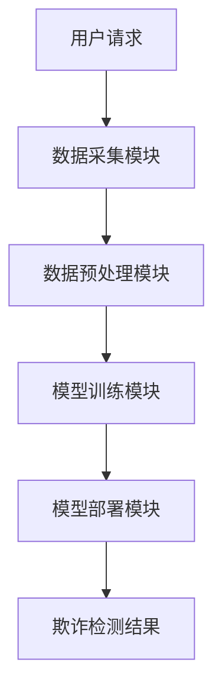

                 


# AI在保险理赔欺诈检测中的深度应用

> 关键词：保险欺诈检测，AI，深度学习，机器学习，自然语言处理，计算机视觉，知识图谱

> 摘要：随着保险行业的快速发展，保险欺诈行为日益复杂化和多样化，传统的欺诈检测方法已难以应对新型欺诈手段。本文将深入探讨人工智能技术在保险理赔欺诈检测中的应用，从背景、核心概念、算法实现到系统架构和项目实战，全面解析AI如何助力保险行业提升反欺诈能力。本文还将结合具体案例，分析基于机器学习和深度学习的欺诈检测模型，并提供系统设计与实现方案，为保险行业的智能化转型提供参考。

---

# 第一部分: 保险理赔欺诈检测的背景与挑战

# 第1章: 保险欺诈检测的背景与问题

## 1.1 保险欺诈的定义与类型

### 1.1.1 保险欺诈的基本定义

保险欺诈是指投保人或受益人通过虚构事实、隐瞒真相或其他非法手段，骗取保险金的行为。根据保险类型的不同，欺诈行为可分为寿险欺诈、财险欺诈、健康险欺诈等。

### 1.1.2 保险欺诈的主要类型

- **虚构投保人**：通过虚构投保人身份，编造投保记录。
- **夸大损失**：在理赔时夸大损失程度，骗取更多保险金。
- **隐瞒既往病史**：在健康险中，投保人隐瞒自身疾病史。
- **重复理赔**：通过虚构不同理赔案件，重复申请保险金。

### 1.1.3 保险欺诈的经济损失分析

保险欺诈不仅导致保险公司经济损失，还增加了保险成本，最终影响保险产品的价格和市场竞争力。据相关数据显示，保险欺诈行为导致的经济损失每年高达数十亿美元。

## 1.2 保险理赔流程与欺诈行为分析

### 1.2.1 保险理赔的基本流程

1. 投保人提交理赔申请。
2. 保险公司审核理赔材料。
3. 保险公司调查理赔案件的真实性。
4. 保险公司决定是否赔付。

### 1.2.2 欺诈理赔行为的模式与特征

- **时间集中性**：欺诈理赔往往集中在特定时间段内。
- **金额异常性**：理赔金额远高于实际损失。
- **信息不一致**：投保人提供的信息与保险公司记录不符。

## 1.3 保险行业反欺诈的痛点与难点

### 1.3.1 传统反欺诈方法的局限性

- 依赖人工审核，效率低下。
- 规则检测依赖经验，难以覆盖所有欺诈场景。
- 模型更新周期长，难以应对新型欺诈手段。

### 1.3.2 数据孤岛与信息孤岛问题

- 数据分散在不同部门或系统中，难以统一分析。
- 数据隐私保护要求高，数据共享困难。

### 1.3.3 智能化转型的挑战

- 技术门槛高，需要引入AI、大数据等技术。
- 数据质量参差不齐，影响模型性能。
- 模型解释性差，难以获得业务部门信任。

## 1.4 保险欺诈检测的边界与外延

### 1.4.1 欺诈检测的范围界定

- 仅限于保险理赔阶段的欺诈行为。
- 不包括其他类型的保险欺诈，如销售环节的欺诈行为。

### 1.4.2 相关概念的对比与区分

- 欺诈检测与风险评估：欺诈检测关注是否存在欺诈行为，风险评估关注整体风险水平。
- 保险欺诈与金融欺诈：保险欺诈是金融欺诈的一种，但应用场景和数据特征有所不同。

## 1.5 本章小结

通过本章的介绍，我们了解了保险欺诈的基本定义、主要类型以及保险行业反欺诈的痛点与难点。AI技术的引入为保险欺诈检测提供了新的思路和方法，但也面临诸多挑战。下一章我们将深入探讨保险欺诈检测的核心概念与联系。

---

# 第二部分: 保险欺诈检测的核心概念与联系

# 第2章: 保险欺诈检测的核心要素

## 2.1 欺诈检测的关键要素

### 2.1.1 数据特征分析

- **投保人特征**：年龄、职业、投保金额、投保历史等。
- **理赔特征**：理赔金额、理赔时间、理赔地点、理赔原因等。
- **行为特征**：投保人行为模式、理赔申请频率、理赔金额变化趋势等。

### 2.1.2 模型特征提取

- **文本特征**：从投保人填写的信息中提取关键词和模式。
- **行为特征**：分析投保人的行为轨迹，发现异常行为。
- **交互特征**：通过人机交互数据，发现异常操作。

### 2.1.3 业务规则与特征工程

- **业务规则**：基于保险行业的业务规则，提取特征。
- **特征工程**：通过数据预处理、特征选择等技术，提取更有价值的特征。

## 2.2 欺诈检测的数学模型与算法

### 2.2.1 传统机器学习算法

- **逻辑回归（Logistic Regression）**：适用于二分类问题，常用于欺诈检测。
- **随机森林（Random Forest）**：基于树模型的集成算法，适合处理高维数据。
- **支持向量机（SVM）**：适用于小样本数据，分类性能较好。

### 2.2.2 深度学习算法

- **神经网络（Neural Networks）**：通过多层神经网络提取数据的高层次特征。
- **卷积神经网络（CNN）**：适用于图像数据的处理，可用于OCR识别。
- **循环神经网络（RNN）**：适用于序列数据的处理，可用于时间序列分析。

### 2.2.3 混合模型的优势

- **集成学习（Ensemble Learning）**：通过组合多个模型的结果，提高预测准确率。
- **深度学习与传统机器学习的结合**：利用深度学习提取特征，结合传统机器学习进行分类。

## 2.3 核心概念的ER实体关系图



## 2.4 核心概念对比分析

| 概念 | 特征 | 优势 | 局限性 |
|------|------|------|--------|
| 传统规则检测 | 简单易实现 | 高效快速 | 易被欺诈手段绕过 |
| 机器学习模型 | 高精度 | 强大学习能力 | 数据依赖性强 |
| 深度学习模型 | 自适应能力强 | 模式识别精准 | 计算资源消耗大 |

## 2.5 本章小结

通过本章的分析，我们了解了保险欺诈检测的核心要素，包括数据特征分析、模型特征提取以及业务规则与特征工程。同时，我们还探讨了传统机器学习算法和深度学习算法的特点及优劣。下一章我们将深入探讨保险欺诈检测的算法原理与实现。

---

# 第三部分: 保险欺诈检测的算法原理与实现

# 第3章: 基于机器学习的欺诈检测算法

## 3.1 机器学习在保险欺诈检测中的应用

### 3.1.1 机器学习模型的输入与输出

- **输入**：投保人信息、理赔记录、行为数据等。
- **输出**：欺诈概率或欺诈标签（0或1）。

### 3.1.2 机器学习模型的训练过程



### 3.1.3 机器学习模型的优势

- **高精度**：机器学习模型能够捕捉数据中的复杂模式，提高欺诈检测的准确率。
- **可解释性**：传统的机器学习模型（如逻辑回归）具有较高的可解释性，便于业务部门理解。

## 3.2 基于深度学习的欺诈检测算法

### 3.2.1 深度学习模型的输入与输出

- **输入**：多维数据，包括文本、图像、行为数据等。
- **输出**：欺诈概率或欺诈标签。

### 3.2.2 深度学习模型的训练过程


### 3.2.3 深度学习模型的优势

- **高精度**：深度学习模型能够捕捉数据的高层次特征，提高欺诈检测的准确率。
- **自适应性**：深度学习模型能够自动适应数据的变化，无需手动特征提取。

## 3.3 混合模型的实现与优势

### 3.3.1 混合模型的构建

- **特征提取**：利用深度学习模型提取特征。
- **分类器训练**：利用传统机器学习模型进行分类。

### 3.3.2 混合模型的优势

- **高精度**：结合两种模型的优势，提高欺诈检测的准确率。
- **计算效率**：深度学习模型用于特征提取，传统机器学习模型用于分类，计算效率较高。

## 3.4 保险欺诈检测的数学模型与公式

### 3.4.1 逻辑回归模型

$$ P(y=1|x) = \frac{1}{1 + e^{-\beta x}} $$

其中，$\beta$ 是模型的系数，$x$ 是输入特征。

### 3.4.2 随机森林模型

随机森林模型通过集成多个决策树的预测结果，提高分类准确率。决策树的构建过程如下：

1. 随机选择特征和样本，构建决策树。
2. 重复上述过程，构建多棵决策树。
3. 统计所有决策树的投票结果，得到最终预测结果。

### 3.4.3 深度学习模型的损失函数

$$ \text{损失函数} = \sum_{i=1}^{n} (y_i - \hat{y_i})^2 $$

其中，$y_i$ 是真实标签，$\hat{y_i}$ 是模型预测值。

## 3.5 本章小结

通过本章的介绍，我们了解了机器学习和深度学习在保险欺诈检测中的应用，以及混合模型的优势。下一章我们将深入探讨保险欺诈检测的系统架构与实现。

---

# 第四部分: 保险欺诈检测的系统架构与实现

# 第4章: 保险欺诈检测系统的设计与实现

## 4.1 欺诈检测系统的功能模块

### 4.1.1 数据采集模块

- **功能**：从保险公司系统中采集投保人信息、理赔记录、行为数据等。
- **实现**：通过API接口或数据库查询获取数据。

### 4.1.2 数据预处理模块

- **功能**：清洗数据，处理缺失值、异常值，进行特征提取。
- **实现**：使用Python的pandas库进行数据清洗和特征提取。

### 4.1.3 模型训练模块

- **功能**：训练机器学习或深度学习模型，保存模型参数。
- **实现**：使用Scikit-learn或Keras框架进行模型训练。

### 4.1.4 模型部署模块

- **功能**：将训练好的模型部署到生产环境，实时检测欺诈行为。
- **实现**：通过Docker容器化部署模型服务。

## 4.2 系统架构设计

### 4.2.1 系统架构图



### 4.2.2 系统功能设计

- **数据采集模块**：负责采集投保人信息、理赔记录等数据。
- **数据预处理模块**：对采集的数据进行清洗、特征提取等处理。
- **模型训练模块**：训练机器学习或深度学习模型，保存模型参数。
- **模型部署模块**：将训练好的模型部署到生产环境，实时检测欺诈行为。

## 4.3 系统接口设计

### 4.3.1 API接口定义

- **输入接口**：接收投保人信息、理赔记录等数据。
- **输出接口**：返回欺诈概率或欺诈标签。

### 4.3.2 接口实现

- **数据接口**：通过REST API接口实现数据的接收和发送。
- **模型接口**：通过API接口实现模型的调用和结果返回。

## 4.4 系统交互流程

### 4.4.1 系统交互图


### 4.4.2 交互流程说明

1. 用户提交理赔申请。
2. 数据采集模块采集用户信息。
3. 数据预处理模块对数据进行清洗和特征提取。
4. 模型训练模块训练模型，返回欺诈概率。
5. 模型部署模块将结果返回给用户。

## 4.5 本章小结

通过本章的介绍，我们了解了保险欺诈检测系统的功能模块、系统架构设计以及系统接口设计。下一章我们将通过一个具体的项目实战，进一步加深对保险欺诈检测系统的理解。

---

# 第五部分: 保险欺诈检测的项目实战

# 第5章: 保险欺诈检测项目实战

## 5.1 项目背景与目标

### 5.1.1 项目背景

本项目旨在利用人工智能技术，构建一个高效的保险欺诈检测系统，帮助保险公司降低欺诈损失。

### 5.1.2 项目目标

- 构建一个基于机器学习的保险欺诈检测模型。
- 实现模型的训练、部署和应用。

## 5.2 项目实施步骤

### 5.2.1 环境安装与配置

- **安装Python**：建议使用Python 3.6及以上版本。
- **安装依赖库**：包括pandas、scikit-learn、keras等。

### 5.2.2 数据采集与预处理

- **数据采集**：从保险公司系统中获取投保人信息、理赔记录等数据。
- **数据预处理**：清洗数据，处理缺失值、异常值，进行特征提取。

### 5.2.3 模型训练与优化

- **模型训练**：使用训练数据训练机器学习或深度学习模型。
- **模型优化**：通过调整模型参数，提高模型的准确率和召回率。

### 5.2.4 模型部署与应用

- **模型部署**：将训练好的模型部署到生产环境，实时检测欺诈行为。
- **模型应用**：通过API接口实现模型的调用和结果返回。

## 5.3 项目实现代码

### 5.3.1 数据预处理代码

```python
import pandas as pd

# 读取数据
data = pd.read_csv('insurance_fraud.csv')

# 处理缺失值
data = data.dropna()

# 特征提取
X = data.drop('fraud', axis=1)
y = data['fraud']
```

### 5.3.2 模型训练代码

```python
from sklearn.ensemble import RandomForestClassifier
from sklearn.model_selection import train_test_split

# 数据分割
X_train, X_test, y_train, y_test = train_test_split(X, y, test_size=0.2, random_state=42)

# 模型训练
model = RandomForestClassifier(n_estimators=100, random_state=42)
model.fit(X_train, y_train)
```

### 5.3.3 模型评估代码

```python
from sklearn.metrics import accuracy_score, precision_score, recall_score

# 模型预测
y_pred = model.predict(X_test)

# 模型评估
accuracy = accuracy_score(y_test, y_pred)
precision = precision_score(y_test, y_pred)
recall = recall_score(y_test, y_pred)

print(f'Accuracy: {accuracy}')
print(f'Precision: {precision}')
print(f'Recall: {recall}')
```

## 5.4 项目案例分析

### 5.4.1 案例背景

某保险公司收到一笔高额理赔申请，需要判断是否存在欺诈行为。

### 5.4.2 数据分析

- 投保人信息：投保人年龄较大，投保历史较少。
- 理赔记录：理赔金额远高于实际损失，理赔时间集中。
- 行为特征：投保人多次申请理赔，理赔金额异常。

### 5.4.3 模型预测

模型预测结果为欺诈概率为95%，判断为欺诈行为。

## 5.5 项目小结

通过本章的项目实战，我们了解了保险欺诈检测系统的实施步骤和实现代码。通过具体案例分析，我们验证了模型的预测能力。下一章我们将总结全书内容，并提供最佳实践的建议。

---

# 第六部分: 总结与展望

# 第6章: 总结与展望

## 6.1 全书总结

通过本书的介绍，我们系统地探讨了人工智能技术在保险欺诈检测中的应用，从背景、核心概念、算法实现到系统架构和项目实战，全面解析了AI如何助力保险行业提升反欺诈能力。

## 6.2 最佳实践 tips

### 6.2.1 数据质量管理

- 确保数据的完整性、准确性和一致性。
- 处理缺失值、异常值，确保数据质量。

### 6.2.2 模型优化建议

- 选择合适的算法，根据数据特征选择适合的模型。
- 调整模型参数，优化模型性能。
- 结合业务规则，提升模型的可解释性。

### 6.2.3 系统设计建议

- 设计模块化系统，便于功能扩展和维护。
- 采用容器化部署，提高系统的可移植性和可扩展性。
- 通过API接口实现系统的灵活性和高效性。

## 6.3 未来展望

随着人工智能技术的不断发展，保险欺诈检测将更加智能化和自动化。未来的挑战包括如何进一步提高模型的准确率和召回率，如何应对数据隐私保护的挑战，如何实现模型的实时更新和优化。

## 6.4 小结

保险欺诈检测是保险行业智能化转型的重要方向，人工智能技术的应用为保险行业带来了新的机遇和挑战。通过不断的技术创新和实践积累，保险行业将能够更好地应对欺诈行为，保护自身利益，为客户提供更优质的服务。

---

# 作者：AI天才研究院/AI Genius Institute & 禅与计算机程序设计艺术 /Zen And The Art of Computer Programming

---

以上是《AI在保险理赔欺诈检测中的深度应用》的技术博客文章的完整目录和内容概要。

