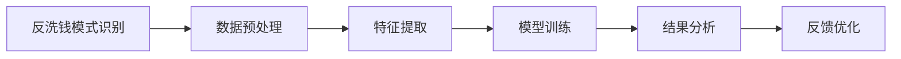
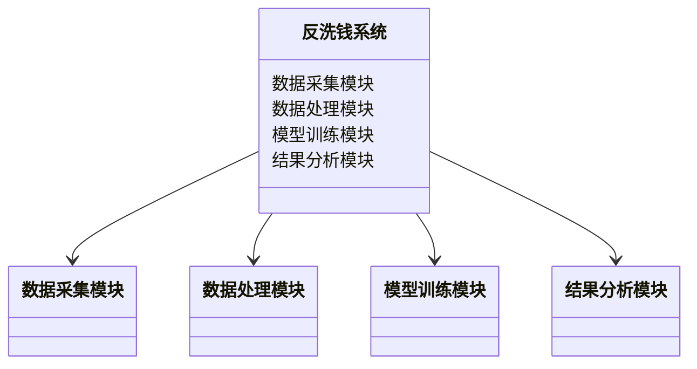
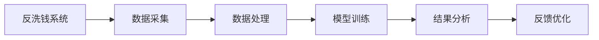

                 


# AI在反洗钱模式识别中的创新应用

> 关键词：反洗钱，人工智能，模式识别，机器学习，深度学习

> 摘要：反洗钱是金融系统中一项至关重要的任务，传统的反洗钱方法在面对日益复杂的洗钱手段时显得力不从心。人工智能（AI）技术的引入为反洗钱模式识别带来了新的可能性。本文将详细探讨AI在反洗钱模式识别中的创新应用，从核心概念、算法原理到系统架构设计，再到项目实战，全面解析AI如何助力反洗钱工作。

---

# 第1章: 反洗钱的基本概念与挑战

## 1.1 反洗钱的基本概念

### 1.1.1 洗钱的定义与常见手法
洗钱是指将非法获得的资金通过一系列复杂的交易使其合法化的过程。常见的洗钱手法包括：
- **隐藏资金来源**：通过多层交易隐藏资金的实际来源。
- **虚构交易**：通过虚假的商业交易将非法资金合法化。
- **利用金融机构**：利用银行等金融机构的复杂性掩盖资金流动。
- **跨国转移**：通过跨国资金流动躲避监管。

### 1.1.2 反洗钱的法律与监管要求
反洗钱是全球范围内的一项重要法律要求，各国都制定了相关法规，例如：
- **美国《爱国者法案》**：要求金融机构加强反洗钱措施。
- **欧盟反洗钱指令**：规范了金融机构在反洗钱方面的责任。
- ** FATF建议**：国际金融行动特别工作组（FATF）提出了反洗钱的国际标准。

### 1.1.3 反洗钱在金融系统中的重要性
反洗钱不仅是法律要求，更是维护金融系统稳定的重要手段。洗钱活动可能导致金融市场的不稳定，甚至威胁国家的经济安全。

## 1.2 反洗钱模式识别的挑战

### 1.2.1 传统反洗钱方法的局限性
传统的反洗钱方法主要依赖人工审查和简单的规则匹配，存在以下问题：
- **效率低**：人工审查效率低下，难以应对海量的交易数据。
- **漏判率高**：规则匹配方法难以捕捉到复杂的洗钱模式。
- **误判率高**：误判率较高，容易将正常交易误认为是洗钱交易。

### 1.2.2 洗钱手段的多样化与复杂化
洗钱分子不断变换手法，例如：
- **多层次交易**：通过多个中间账户转移资金。
- **利用虚拟货币**：利用比特币等虚拟货币进行跨境洗钱。
- **隐藏在合法交易中**：将非法资金混入合法交易中，难以识别。

### 1.2.3 数据量与数据类型的挑战
现代金融系统中，交易数据量巨大，且数据类型多样，包括文本、数值、时间序列等。传统的统计方法难以处理这些复杂数据。

---

# 第2章: 反洗钱模式识别的核心概念

## 2.1 反洗钱模式识别的定义与目标

### 2.1.1 模式识别的定义
模式识别是通过计算机技术对数据进行分析和处理，识别出数据中的模式和规律。在反洗钱领域，模式识别的目标是发现异常交易模式。

### 2.1.2 反洗钱模式识别的目标
- **识别异常交易**：发现符合洗钱特征的交易模式。
- **预测洗钱行为**：通过历史数据预测未来的洗钱行为。
- **优化反洗钱策略**：根据识别结果优化反洗钱策略。

### 2.1.3 模式识别在反洗钱中的作用
模式识别能够帮助金融机构快速识别潜在的洗钱行为，减少误判和漏判的概率。

## 2.2 反洗钱模式识别的核心要素

### 2.2.1 数据来源与特征
反洗钱模式识别的数据来源包括：
- **交易数据**：包括交易金额、时间、地点等。
- **客户信息**：包括客户身份、职业、收入等。
- **行为数据**：包括交易频率、交易方式等。

### 2.2.2 模型训练与优化
模型训练是反洗钱模式识别的核心步骤，需要选择合适的算法并优化模型性能。

### 2.2.3 结果分析与反馈
通过分析模型识别结果，不断优化模型，并将结果反馈给金融机构。

## 2.3 反洗钱模式识别的边界与外延

### 2.3.1 与其他金融犯罪识别的对比
反洗钱模式识别与反欺诈、反恐怖融资等其他金融犯罪识别有相似之处，但也存在差异。

### 2.3.2 与传统反洗钱方法的结合
模式识别可以与传统反洗钱方法结合，形成更加完善的反洗钱体系。

### 2.3.3 模式识别的局限性与改进方向
模式识别虽然能够发现异常交易，但也存在数据依赖性强、模型解释性差等问题。

---

# 第3章: AI技术在反洗钱模式识别中的核心概念

## 3.1 AI技术的基本原理

### 3.1.1 机器学习的基本概念
机器学习是一种通过数据训练模型，使其能够自动识别模式的技术。机器学习分为监督学习、无监督学习和半监督学习三种类型。

### 3.1.2 深度学习的基本概念
深度学习是一种基于人工神经网络的机器学习技术，能够处理复杂的非线性数据。

### 3.1.3 自然语言处理的基本概念
自然语言处理（NLP）是使计算机能够理解人类语言的技术，常用于处理交易中的文本信息。

## 3.2 AI技术在反洗钱中的应用原理

### 3.2.1 数据预处理与特征提取
数据预处理包括数据清洗、数据转换等步骤，特征提取则是从数据中提取有助于模型识别的关键特征。

### 3.2.2 模型训练与优化
选择合适的算法，训练模型并进行优化，以提高模型的识别准确率。

### 3.2.3 结果解释与反馈
通过模型识别结果，解释识别的异常交易，并将结果反馈给金融机构。

## 3.3 AI技术的核心概念与联系

### 3.3.1 AI技术的核心概念对比
通过表格对比机器学习、深度学习和自然语言处理的核心概念。

| 技术 | 定义 | 应用 | 优势 |
|------|------|------|------|
| 机器学习 | 通过数据训练模型 | 分类、聚类 | 适用于结构化数据 |
| 深度学习 | 基于人工神经网络 | 图像识别、语音识别 | 适用于非结构化数据 |
| 自然语言处理 | 处理人类语言 | 文本分析 | 适用于文本数据 |

### 3.3.2 AI技术与反洗钱模式识别的实体关系图



---

# 第4章: 基于机器学习的反洗钱模式识别算法原理

## 4.1 聚类算法

### 4.1.1 聚类算法的基本原理
聚类算法通过将数据分成不同的簇，识别出异常交易。

### 4.1.2 K-means算法的实现
K-means算法是一种常用的聚类算法，通过计算数据点之间的距离，将数据分成K个簇。

### 4.1.3 聚类算法在反洗钱中的应用
通过聚类算法识别出交易中的异常簇，标记为潜在的洗钱交易。

## 4.2 分类算法

### 4.2.1 分类算法的基本原理
分类算法通过训练数据，将数据分为不同的类别。

### 4.2.2 支持向量机(SVM)的实现
支持向量机是一种常用的分类算法，通过构建超平面将数据分为两类。

### 4.2.3 分类算法在反洗钱中的应用
通过分类算法识别出洗钱交易，标记为异常交易。

---

# 第5章: 系统分析与架构设计

## 5.1 问题场景介绍
反洗钱系统需要处理海量的交易数据，识别异常交易模式。

## 5.2 项目介绍
反洗钱模式识别系统，旨在通过AI技术帮助金融机构识别洗钱行为。

## 5.3 系统功能设计

### 5.3.1 领域模型


### 5.3.2 系统架构设计


---

# 第6章: 项目实战

## 6.1 环境安装
安装Python、机器学习库（如scikit-learn、TensorFlow）等。

## 6.2 系统核心实现源代码
```python
from sklearn.cluster import KMeans
from sklearn.svm import SVC
import pandas as pd

# 数据加载
data = pd.read_csv('transactions.csv')

# 数据预处理
X = data[['amount', 'time', 'location']]
model = KMeans(n_clusters=2)
model.fit(X)

# 模型预测
labels = model.predict(X)
print(labels)
```

## 6.3 代码应用解读与分析
通过代码实现聚类算法，识别出异常交易。

---

# 第7章: 总结与展望

## 7.1 总结
AI技术为反洗钱模式识别带来了新的可能性，提高了识别效率和准确性。

## 7.2 未来展望
未来，随着AI技术的不断发展，反洗钱模式识别将更加智能化和精准化。

---

# 结束语

反洗钱是金融系统中的一项重要任务，AI技术的引入为反洗钱模式识别带来了新的可能性。通过本文的详细讲解，读者可以了解AI在反洗钱中的创新应用，并掌握实际操作的方法和技巧。

---

作者：AI天才研究院/AI Genius Institute & 禅与计算机程序设计艺术 /Zen And The Art of Computer Programming

