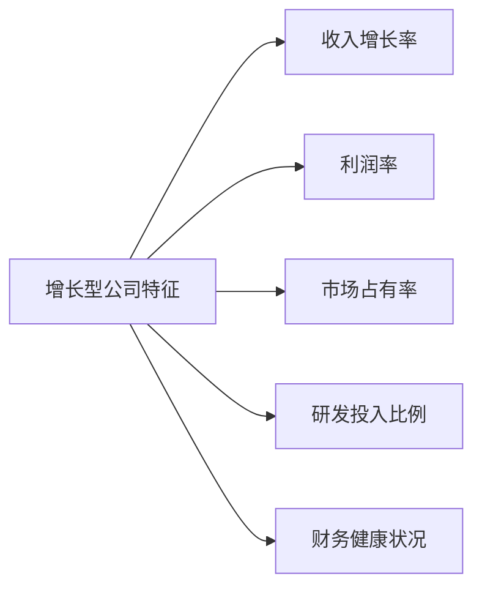

                 


# AI在实现费雪的增长型公司特征分析中的应用

## 关键词：AI技术，费雪增长型公司，特征分析，机器学习，深度学习，数据科学

## 摘要：  
本文探讨了人工智能技术在分析费雪增长型公司特征中的应用。通过结合AI算法与公司特征分析，提出了一套基于机器学习和深度学习的分析框架，详细分析了增长型公司的核心特征，如收入增长率、利润率、市场占有率等，并展示了如何利用这些特征构建预测模型，帮助投资者识别和评估潜在的增长型公司。文章内容包括背景介绍、核心概念、算法原理、系统架构设计、项目实战以及总结与展望。

---

# 第1章: 费雪增长型公司的理论基础

## 1.1 费雪增长型公司的定义与特征

### 1.1.1 费雪增长型公司的定义  
费雪增长型公司是指那些具备持续增长潜力，能够在较长时期内保持收入和利润增长的公司。这类公司通常具有较高的市场占有率、稳定的盈利能力以及较强的创新能力。

### 1.1.2 费雪增长型公司的核心特征  
| 特征 | 描述 |
|------|------|
| 收入增长率 | 公司收入的年增长率较高且稳定 |
| 利润率 | 净利润占收入的比例较高 |
| 市场占有率 | 在所在行业中占据领先地位 |
| 研发投入比例 | 研发投入占收入的比例较高 |
| 财务健康状况 | 资产负债率低，现金流充裕 |

### 1.1.3 费雪增长型公司的边界与外延  
费雪增长型公司的定义并非一成不变，其外延可以根据不同行业和市场环境进行调整。例如，在科技行业，研发投入比例可能是一个更重要的特征，而在传统制造业，市场占有率可能更为关键。

---

## 1.2 AI在公司特征分析中的应用背景

### 1.2.1 公司特征分析的传统方法  
传统的公司特征分析主要依赖于财务报表分析、行业对标和专家经验判断。这种方法虽然有效，但存在主观性强、效率低下的问题。

### 1.2.2 AI技术在特征分析中的优势  
AI技术能够通过大数据分析和机器学习算法，从海量数据中提取有用的特征信息，并建立预测模型，从而提高分析效率和准确性。

### 1.2.3 费雪增长型公司与AI技术的结合  
通过AI技术，可以更精准地识别和预测增长型公司，帮助投资者在复杂的市场环境中做出更明智的投资决策。

---

## 1.3 费雪增长型公司特征分析的意义

### 1.3.1 企业价值评估的重要性  
准确评估企业的价值是投资者做出决策的基础。费雪增长型公司的特征分析能够帮助投资者识别具有长期增长潜力的企业。

### 1.3.2 AI在企业价值评估中的作用  
AI技术能够通过数据分析和建模，提供更客观、更准确的企业价值评估结果。

### 1.3.3 费雪增长型公司特征分析的实践价值  
通过分析增长型公司的特征，投资者可以更好地识别投资机会，降低投资风险。

---

## 1.4 本章小结  
本章介绍了费雪增长型公司的定义和核心特征，并探讨了AI技术在公司特征分析中的应用背景及其重要意义。

---

# 第2章: 增长型公司特征分析的核心概念与联系

## 2.1 增长型公司特征的核心要素

### 2.1.1 收入增长率  
收入增长率是衡量公司增长潜力的重要指标。通常，收入增长率越高，公司的增长潜力越大。

### 2.1.2 利润率  
利润率反映了公司盈利能力的强弱。高利润率的公司通常具有更强的市场竞争力。

### 2.1.3 市场占有率  
市场占有率是公司在市场中的地位的体现。高市场占有率意味着公司具有更强的市场影响力。

### 2.1.4 研发投入比例  
研发投入比例反映了公司对技术创新的重视程度。高研发投入比例通常意味着公司具备更强的技术创新能力。

### 2.1.5 财务健康状况  
财务健康状况是公司整体财务状况的综合反映，包括资产负债率、现金流状况等。

---

## 2.2 AI技术在特征分析中的应用原理

### 2.2.1 数据采集与预处理  
数据采集是特征分析的第一步，需要从多个渠道获取相关数据，并进行清洗和预处理。

### 2.2.2 特征提取与选择  
特征提取是从原始数据中提取有用的特征信息，特征选择则是从提取的特征中选择最具代表性的特征。

### 2.2.3 模型训练与评估  
通过机器学习算法对特征进行建模，并对模型的性能进行评估。

### 2.2.4 结果解释与可视化  
通过对模型结果的解释和可视化，帮助用户更好地理解特征分析的结果。

---

## 2.3 增长型公司特征与AI技术的实体关系图



---

## 2.4 本章小结  
本章详细介绍了增长型公司特征的核心要素，并探讨了AI技术在特征分析中的应用原理。

---

# 第3章: AI在增长型公司特征分析中的算法原理

## 3.1 机器学习算法在特征分析中的应用

### 3.1.1 监督学习  
监督学习是一种基于标记数据的机器学习方法，常用于分类和回归问题。

### 3.1.2 无监督学习  
无监督学习是一种基于无标记数据的机器学习方法，常用于聚类和降维问题。

### 3.1.3 半监督学习  
半监督学习是一种结合了监督学习和无监督学习的机器学习方法。

---

## 3.2 基于深度学习的特征提取

### 3.2.1 卷积神经网络（CNN）  
CNN适用于图像识别和文本处理等任务，能够有效提取空间特征。

### 3.2.2 循环神经网络（RNN）  
RNN适用于时间序列数据的处理，能够捕捉数据的时间依赖性。

### 3.2.3 变量自注意力机制  
自注意力机制能够捕捉数据中的全局依赖关系，提升模型的表达能力。

---

## 3.3 增长型公司特征分析的数学模型

### 3.3.1 线性回归模型  
$$ y = \beta_0 + \beta_1x_1 + \beta_2x_2 + ... + \beta_nx_n $$

### 3.3.2 支持向量机（SVM）  
SVM通过构建超平面，将数据分为不同的类别。

### 3.3.3 随机森林  
随机森林是一种基于决策树的集成学习方法，能够有效处理高维数据。

---

## 3.4 算法流程图


---

## 3.5 本章小结  
本章详细介绍了机器学习和深度学习算法在增长型公司特征分析中的应用，并展示了算法的流程图。

---

# 第4章: 增长型公司特征工程与数据处理

## 4.1 特征工程的核心步骤

### 4.1.1 数据预处理  
数据预处理包括数据清洗、数据转换和数据标准化等步骤。

### 4.1.2 特征提取  
特征提取是从原始数据中提取有用的特征信息，例如从文本数据中提取关键词。

### 4.1.3 特征选择  
特征选择是从提取的特征中选择最具代表性的特征，通常采用过滤法和包装法。

---

## 4.2 基于机器学习的特征选择方法

### 4.2.1 基于统计的方法  
如卡方检验和相关系数分析。

### 4.2.2 基于模型的方法  
如LASSO回归和 Ridge回归。

### 4.2.3 基于树模型的方法  
如随机森林和梯度提升树（GBDT）。

---

## 4.3 数据处理与特征工程的代码实现

### 4.3.1 数据预处理代码

```python
import pandas as pd
import numpy as np

# 加载数据
data = pd.read_csv('company_data.csv')

# 数据清洗
data.dropna(inplace=True)
data = data[~data['收入增长率'].isnull()]
```

### 4.3.2 特征提取与选择代码

```python
from sklearn.feature_selection import SelectKBest
from sklearn.feature_selection import chi2

# 特征选择
selector = SelectKBest(score_func=chi2, k=5)
selected_features = selector.fit_transform(data, target)
```

---

## 4.4 本章小结  
本章详细介绍了特征工程的核心步骤，并通过代码示例展示了数据处理与特征选择的具体实现。

---

# 第5章: 增长型公司特征分析的系统架构设计

## 5.1 系统功能设计

### 5.1.1 数据采集模块  
数据采集模块负责从多个数据源获取公司特征数据。

### 5.1.2 数据处理模块  
数据处理模块负责对数据进行清洗、转换和标准化处理。

### 5.1.3 模型训练模块  
模型训练模块基于特征数据进行模型训练和优化。

### 5.1.4 结果展示模块  
结果展示模块负责将模型的分析结果以可视化的方式呈现给用户。

---

## 5.2 系统架构设计


---

## 5.3 系统接口设计

### 5.3.1 数据接口  
数据接口用于与外部数据源进行数据交互。

### 5.3.2 模型接口  
模型接口用于与外部模型服务进行交互。

### 5.3.3 用户接口  
用户接口用于与最终用户进行交互，展示分析结果。

---

## 5.4 本章小结  
本章详细介绍了增长型公司特征分析系统的功能设计和架构设计。

---

# 第6章: 项目实战——基于AI的增长型公司特征分析系统

## 6.1 项目背景与目标

### 6.1.1 项目背景  
随着AI技术的不断发展，越来越多的企业开始利用AI技术进行公司特征分析。

### 6.1.2 项目目标  
通过构建基于AI的特征分析系统，帮助投资者识别和评估增长型公司。

---

## 6.2 环境配置与数据准备

### 6.2.1 环境配置  
安装必要的Python库，例如pandas、numpy、scikit-learn等。

### 6.2.2 数据准备  
加载公司特征数据，并进行初步的数据清洗和预处理。

---

## 6.3 系统核心实现

### 6.3.1 数据预处理代码

```python
import pandas as pd
import numpy as np

# 加载数据
data = pd.read_csv('company_data.csv')

# 数据清洗
data.dropna(inplace=True)
data = data[~data['收入增长率'].isnull()]
```

### 6.3.2 模型训练代码

```python
from sklearn.model import LinearRegression
from sklearn.metrics import mean_squared_error

# 模型训练
model = LinearRegression()
model.fit(X_train, y_train)

# 模型预测
y_pred = model.predict(X_test)
```

---

## 6.4 实例分析与结果解读

### 6.4.1 实例分析  
通过实际案例分析，展示如何利用AI技术进行增长型公司特征分析。

### 6.4.2 结果解读  
解释模型的输出结果，帮助用户理解分析结果的含义。

---

## 6.5 本章小结  
本章通过一个实际项目展示了基于AI的增长型公司特征分析系统的实现过程。

---

# 第7章: 总结与展望

## 7.1 本章总结

### 7.1.1 核心内容回顾  
回顾了AI技术在增长型公司特征分析中的应用，包括特征工程、算法选择和系统设计等方面。

### 7.1.2 实践意义  
强调了AI技术在公司特征分析中的实践意义，为投资者提供了新的工具和方法。

---

## 7.2 未来展望

### 7.2.1 技术发展  
随着AI技术的不断发展，未来可能会涌现出更多先进的算法和技术，进一步提升公司特征分析的准确性和效率。

### 7.2.2 应用拓展  
AI技术在公司特征分析中的应用可能会扩展到更多领域，例如风险管理、投资组合优化等。

---

## 作者：AI天才研究院/AI Genius Institute & 禅与计算机程序设计艺术 /Zen And The Art of Computer Programming  

---

以上是完整的技术博客文章目录和内容概要，希望对您有所帮助！

