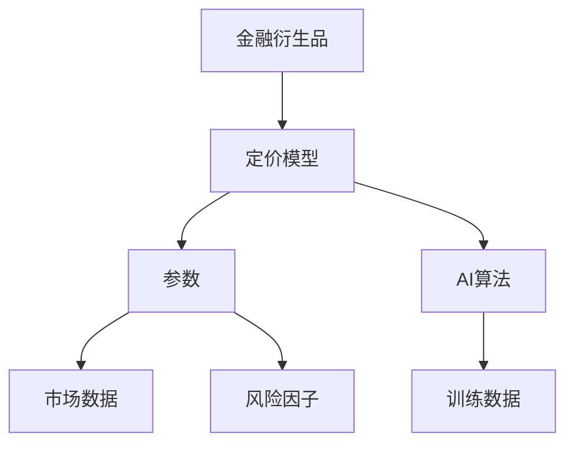
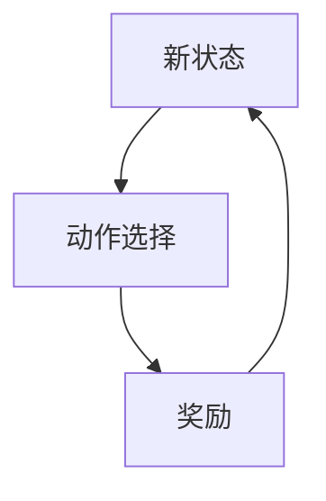
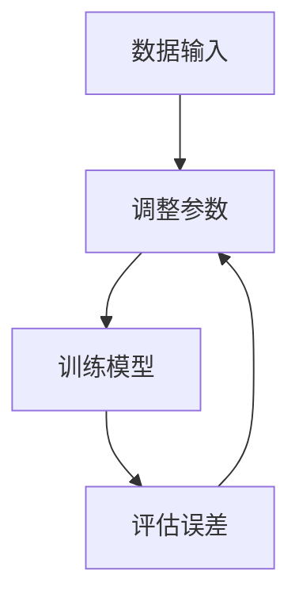
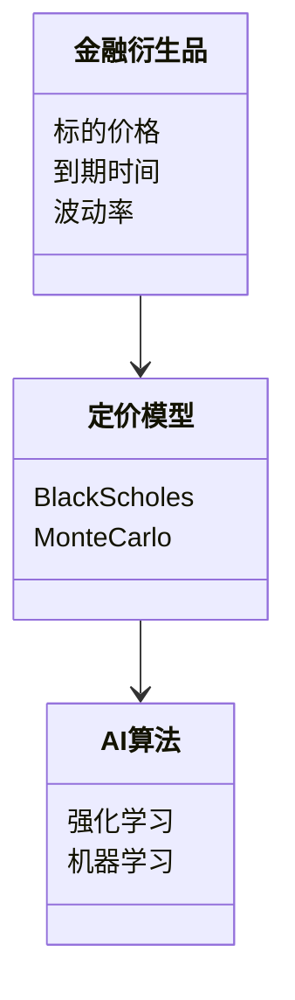
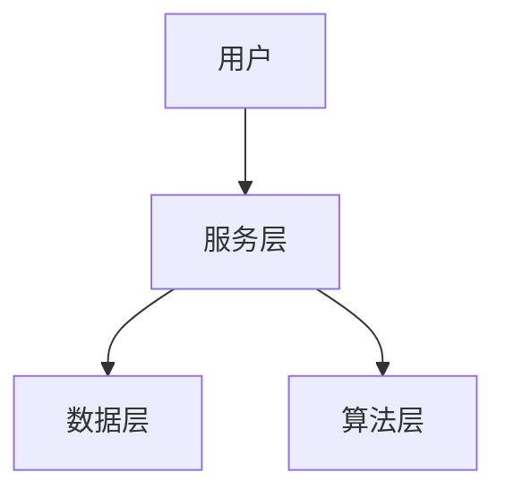
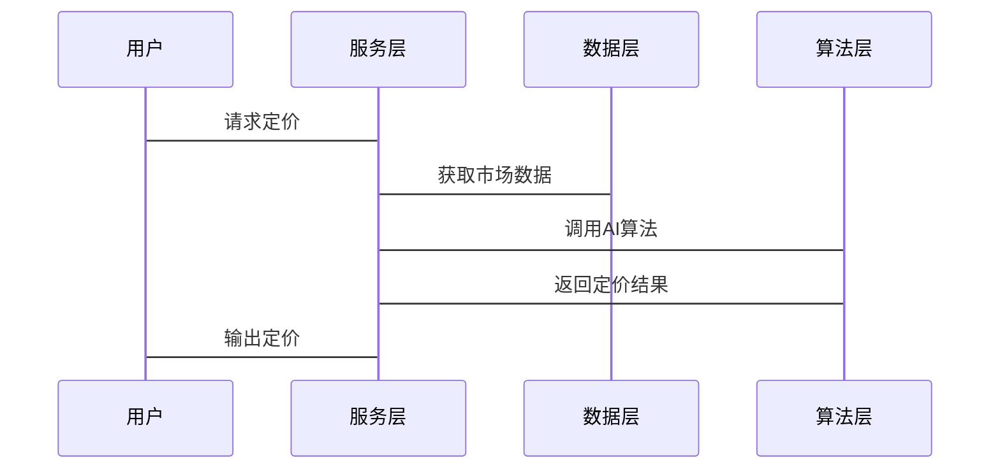

                 


# AI在金融衍生品定价模型动态选择与校准中的创新应用

## 关键词
- 人工智能
- 金融衍生品
- 定价模型
- 动态选择
- 校准
- 强化学习

## 摘要
本文探讨AI技术在金融衍生品定价模型中的创新应用，重点分析动态选择与校准的策略。通过强化学习等方法，优化定价模型，提升准确性和适应性，解决传统模型的局限性。结合实际案例，展示AI技术的优势，并提出未来发展方向。

---

# 第一部分: 背景介绍

## 第1章: 金融衍生品定价模型概述

### 1.1 问题背景
#### 1.1.1 金融衍生品的基本概念
金融衍生品是从基础资产派生的金融工具，如期权、期货等，其价值依赖于标的资产的价格变动。

#### 1.1.2 定价模型的重要性
准确的定价模型是金融衍生品交易和风险管理的基础，影响市场参与者的收益和风险。

#### 1.1.3 动态选择与校准的必要性
市场环境不断变化，静态模型难以适应，动态选择和校准能提升模型的适应性和准确性。

### 1.2 问题描述
#### 1.2.1 传统定价模型的局限性
传统模型假设稳定，难以应对市场波动，参数调整困难，导致定价误差。

#### 1.2.2 动态选择与校准的定义
动态选择指根据市场变化选择合适的模型；校准是调整模型参数使其适应市场数据。

#### 1.2.3 问题解决的思路
引入AI技术，通过机器学习和强化学习优化模型选择和参数调整，提升动态适应性。

### 1.3 问题解决
#### 1.3.1 AI技术的应用潜力
AI能够处理复杂数据，实时调整模型，提供动态支持。

#### 1.3.2 动态选择与校准的创新点
结合AI，实现模型的自动优化和实时调整，提升定价精度和风险管理能力。

#### 1.3.3 技术路线与方法
利用机器学习和强化学习，构建动态选择和校准框架，实现自动化定价。

### 1.4 边界与外延
#### 1.4.1 适用场景与限制
适用于波动较大市场，但需处理数据质量和计算资源问题。

#### 1.4.2 相关领域的联系
涉及金融学、统计学、计算机科学，与其他AI金融应用相互关联。

#### 1.4.3 技术的未来发展
AI技术将更深度融入金融定价，推动智能化金融发展。

### 1.5 概念结构与核心要素
#### 1.5.1 核心概念的组成
包含金融衍生品、定价模型、动态选择、AI技术等。

#### 1.5.2 关键要素的定义
AI技术：机器学习、强化学习；定价模型：Black-Scholes模型等。

#### 1.5.3 概念之间的关系
AI技术优化定价模型，动态选择和校准提升模型适应性。

---

## 第2章: AI技术在金融衍生品定价中的应用

### 2.1 核心概念与联系
#### 2.1.1 AI技术的核心原理
通过数据训练，AI学习定价模式，自动优化参数。

#### 2.1.2 与金融定价模型的结合方式
AI作为工具，优化模型选择和参数调整。

#### 2.1.3 关键技术的对比分析
机器学习、深度学习、强化学习在定价中的应用对比。

### 2.2 核心概念原理
#### 2.2.1 机器学习与深度学习的原理
机器学习从数据中学习定价规律，深度学习处理复杂特征。

#### 2.2.2 强化学习的应用
通过奖励机制，优化定价策略。

#### 2.2.3 自然语言处理的潜在应用
分析市场报告，辅助定价决策。

### 2.3 概念属性特征对比
| 技术 | 优势 | 局限 |
|------|-------|-------|
| 机器学习 | 高准确性 | 计算复杂 |
| 强化学习 | 实时调整 | 短期波动处理 |
| 深度学习 | 复杂特征识别 | 数据需求高 |

### 2.4 ER实体关系图


---

# 第二部分: 算法原理讲解

## 第3章: 强化学习在动态选择中的应用

### 3.1 算法原理
#### 3.1.1 强化学习的基本概念
通过试错，学习最优策略，应用于模型选择和参数调整。

#### 3.1.2 在动态选择中的应用
动态调整模型参数，适应市场变化。

#### 3.1.3 状态、动作、奖励的定义
- 状态：市场数据
- 动作：模型选择
- 奖励：定价误差

### 3.2 算法流程


### 3.3 数学模型
#### 3.3.1 状态值函数
$$ V(s) = \max_{a} [ r + \gamma V(s') ] $$
其中，\( s \) 是状态，\( a \) 是动作，\( r \) 是奖励，\( \gamma \) 是折扣因子。

---

## 第4章: 机器学习模型校准

### 4.1 算法原理
#### 4.1.1 机器学习模型校准
使用历史数据训练模型，优化参数。

#### 4.1.2 参数调整方法
- 梯度下降
- 贝叶斯优化

### 4.2 算法流程


### 4.3 数学模型
#### 4.3.1 梯度下降公式
$$ \theta_{t+1} = \theta_t - \eta \nabla L(\theta_t) $$
其中，\( \theta \) 是参数，\( \eta \) 是学习率，\( L \) 是损失函数。

---

# 第三部分: 系统分析与架构设计

## 第5章: 系统分析与架构设计

### 5.1 问题场景介绍
金融衍生品定价面临市场波动和数据复杂性，传统模型难以适应。

### 5.2 项目介绍
构建AI辅助定价系统，实现动态选择和校准。

### 5.3 系统功能设计
#### 5.3.1 领域模型


### 5.4 系统架构设计


### 5.5 系统接口设计
- 用户接口：输入参数，输出定价
- 数据接口：获取市场数据
- 算法接口：调用AI算法

### 5.6 系统交互


---

## 第6章: 项目实战

### 6.1 环境安装
- Python 3.8+
- TensorFlow、Keras、Scikit-learn
- Jupyter Notebook

### 6.2 系统核心实现源代码
#### 6.2.1 强化学习代码
```python
class Agent:
    def __init__(self, state_space, action_space):
        self.state_space = state_space
        self.action_space = action_space
        # 策略网络
        self.model = self.build_model()
    
    def build_model(self):
        model = Sequential()
        model.add(Dense(64, activation='relu', input_dim=self.state_space))
        model.add(Dense(self.action_space))
        model.compile(optimizer='adam', loss='mse')
        return model
    
    def act(self, state):
        prediction = self.model.predict(state)
        return np.argmax(prediction)
    
    def train(self, state, action, reward, next_state):
        target = reward + self.gamma * self.model.predict(next_state)[0]
        target = np.array([target])
        self.model.fit(state, target, epochs=1, verbose=0)
```

#### 6.2.2 机器学习校准代码
```python
from sklearn import svm

def train_model(X, y):
    model = svm.SVR()
    model.fit(X, y)
    return model

def predict_price(model, X_test):
    return model.predict(X_test)
```

### 6.3 代码应用解读与分析
- 强化学习代码实现模型选择和参数调整。
- 机器学习代码用于校准定价模型，优化参数。

### 6.4 实际案例分析
案例：某期权定价，市场波动剧烈，使用强化学习选择模型，校准参数，提高定价精度。

### 6.5 项目小结
通过AI技术，实现动态选择和校准，提升定价模型的准确性和适应性，降低风险。

---

## 第7章: 最佳实践 tips

### 7.1 小结
AI技术显著提升金融衍生品定价的动态调整能力。

### 7.2 注意事项
- 数据质量
- 模型选择
- 计算资源

### 7.3 拓展阅读
- 强化学习在金融中的应用
- 深度学习在定价中的应用
- 实时数据分析技术

---

# 第四部分: 结论与展望

## 第8章: 结论

### 8.1 成果总结
AI技术成功应用于动态选择和校准，提升定价模型性能。

### 8.2 经验与教训
数据质量关键，模型选择影响结果，计算资源需求高。

## 第9章: 未来展望

### 9.1 技术发展趋势
- 更复杂的模型
- 更实时的数据处理
- 多模态数据应用

### 9.2 应用前景
AI技术将进一步融入金融定价，推动智能化金融发展。

---

# 作者
作者：AI天才研究院 & 禅与计算机程序设计艺术

