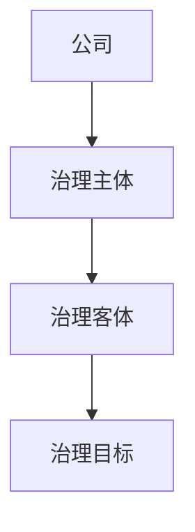
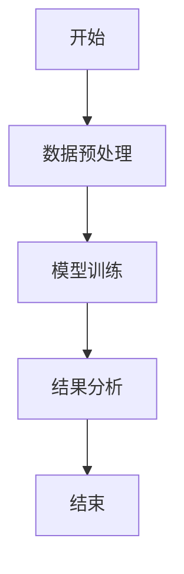
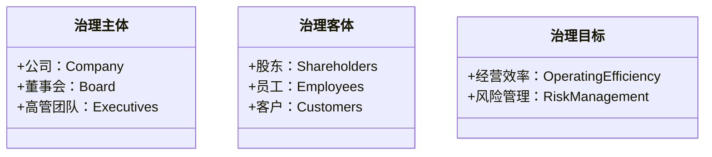
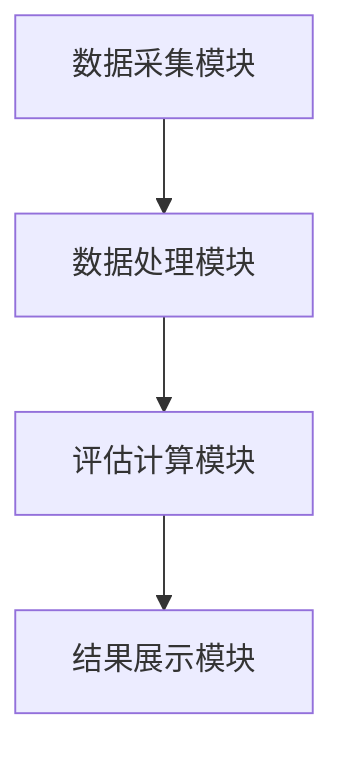
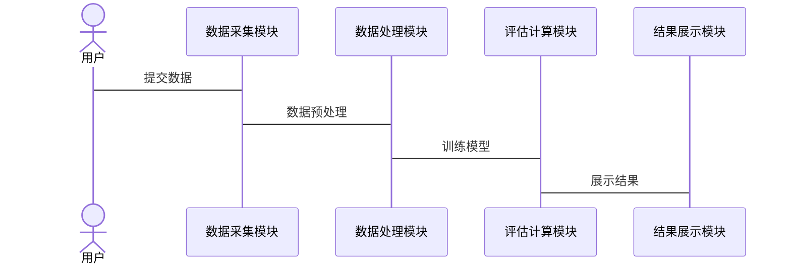

                 


# AI增强型公司治理效能评估工具

## 关键词：AI，公司治理，效能评估，技术工具，系统架构，算法原理，项目实战

## 摘要：  
本文探讨了如何利用人工智能技术提升公司治理效能评估的工具和方法。通过对公司治理核心要素的分析，结合AI技术的特点，提出了一种基于数据驱动的评估模型，并详细阐述了该模型的算法原理、系统架构和实际应用场景。通过案例分析和项目实战，展示了AI增强型公司治理效能评估工具的实际价值和应用前景。

---

# 第1章 AI与公司治理的结合

## 1.1 公司治理的基本概念

### 1.1.1 公司治理的定义  
公司治理是通过规范公司权力结构、决策流程和行为准则，确保公司目标的实现和利益相关者的权益得到保护。  

### 1.1.2 公司治理的核心要素  
- 股权结构  
- 董事会治理  
- 高管团队职责  
- 内部控制与风险管理  

### 1.1.3 公司治理的现状与挑战  
- 传统治理模式效率低下  
- 信息不对称问题突出  
- 风险管理难度大  

## 1.2 AI技术在公司治理中的应用

### 1.2.1 AI技术的基本概念  
人工智能（AI）通过模拟人类智能，实现数据处理、模式识别、决策支持等功能。  

### 1.2.2 AI在公司治理中的潜在应用场景  
- 股权结构优化  
- 风险预警  
- 决策支持  

### 1.2.3 AI增强型公司治理的优势  
- 提高决策效率  
- 减少人为错误  
- 实现数据驱动的精准治理  

## 1.3 本章小结  
本章介绍了公司治理的基本概念和AI技术的特点，分析了AI在公司治理中的潜在应用价值。

---

# 第2章 AI增强型公司治理效能评估工具的定义与特点

## 2.1 AI增强型治理工具的定义  
AI增强型公司治理效能评估工具是一种结合人工智能技术，用于评估公司治理效率和效果的智能化工具。  

### 2.1.1 工具的核心概念  
- 数据驱动的评估方法  
- AI算法支持的决策优化  
- 实时监控与反馈  

### 2.1.2 工具的主要功能  
- 数据采集与分析  
- 治理效能评估  
- 决策建议生成  

## 2.2 工具的特点

### 2.2.1 数据驱动  
工具基于大量数据进行分析，确保评估结果的客观性和准确性。  

### 2.2.2 智能化  
通过AI算法，工具能够自动识别问题并提供解决方案。  

### 2.2.3 实时性  
工具能够实时监控公司治理的动态，及时反馈评估结果。  

## 2.3 工具的边界与外延

### 2.3.1 工具的适用范围  
- 中小型企业治理优化  
- 大型企业治理效能提升  

### 2.3.2 工具的局限性  
- 数据质量对评估结果的影响较大  
- 算法模型的可解释性有限  

## 2.4 本章小结  
本章详细阐述了AI增强型公司治理效能评估工具的定义、特点及其适用范围。

---

# 第3章 AI增强型公司治理效能评估工具的核心概念

## 3.1 问题背景与问题描述

### 3.1.1 公司治理中的常见问题  
- 决策效率低下  
- 风险管理不完善  
- 内部控制薄弱  

### 3.1.2 传统评估方法的局限性  
- 主观性强  
- 数据支持不足  
- 评估周期长  

## 3.2 问题解决的思路

### 3.2.1 引入AI技术的必要性  
AI技术能够通过数据分析和模式识别，提高评估的准确性和效率。  

### 3.2.2 AI在问题解决中的作用  
- 数据清洗与预处理  
- 模型训练与优化  
- 结果分析与反馈  

## 3.3 核心概念的结构与组成

### 3.3.1 数据流  
- 数据采集  
- 数据预处理  
- 数据分析  

### 3.3.2 算法模型  
- 评估模型的选择  
- 模型训练与优化  

### 3.3.3 评估指标  
- 经营效率指标  
- 风险管理指标  

## 3.4 本章小结  
本章从问题背景出发，分析了传统评估方法的局限性，并提出了AI增强型评估工具的核心概念。

---

# 第4章 AI增强型公司治理效能评估工具的核心概念与联系

## 4.1 核心概念的原理

### 4.1.1 数据预处理  
- 数据清洗  
- 数据标准化  

### 4.1.2 模型训练  
- 算法选择  
- 模型优化  

### 4.1.3 结果分析  
- 结果解读  
- 反馈优化  

## 4.2 核心概念的属性特征对比

### 4.2.1 数据特征对比表  
| 数据特征 | 描述 | 示例 |
|----------|------|------|
| 数据量   | 高   | 公司运营数据 |
| 数据类型 | 结构化与非结构化 | 财务数据、文本数据 |

### 4.2.2 算法特征对比表  
| 算法特征 | 描述 | 示例 |
|----------|------|------|
| 算法类型 | 监督学习 | 决策树、随机森林 |
| 算法优势 | 解释性强 | 线性回归 |

## 4.3 ER实体关系图架构


## 4.4 本章小结  
本章通过对比和图表，详细阐述了AI增强型公司治理效能评估工具的核心概念及其相互关系。

---

# 第5章 AI增强型公司治理效能评估工具的算法原理

## 5.1 算法原理概述

### 5.1.1 算法选择的依据  
- 数据类型与规模  
- 问题特点与目标  

### 5.1.2 算法的基本原理  
以层次分析法（AHP）为例，详细阐述其数学模型和公式。

## 5.2 算法流程图


## 5.3 数学公式与模型

### 5.3.1 层次分析法（AHP）  
- 权重计算公式：$$ A_{weight} = \frac{A_{score}}{\sum A_{score}} $$  
- 综合评分公式：$$ S = \sum w_i \cdot x_i $$  

### 5.3.2 示例代码  
```python
def calculate_weights(matrix):
    # 计算权重
    total = sum(matrix)
    weights = [score / total for score in matrix]
    return weights
```

## 5.4 本章小结  
本章详细讲解了AI增强型公司治理效能评估工具的算法原理，并通过层次分析法进行了具体说明。

---

# 第6章 系统架构与实现

## 6.1 问题场景介绍  
以某公司治理效能评估为例，分析系统需求和目标。

## 6.2 系统功能设计

### 6.2.1 领域模型设计


### 6.2.2 系统架构设计


### 6.2.3 系统接口设计  
- 数据接口：RESTful API  
- 用户界面：Web界面  

### 6.2.4 系统交互流程  


## 6.3 本章小结  
本章从系统架构的角度，详细设计了AI增强型公司治理效能评估工具的实现方案。

---

# 第7章 项目实战与案例分析

## 7.1 环境安装

### 7.1.1 安装Python  
- 使用Anaconda安装Python 3.8及以上版本。  

### 7.1.2 安装相关库  
- pandas、numpy、scikit-learn  

## 7.2 核心代码实现

### 7.2.1 数据预处理代码  
```python
import pandas as pd
data = pd.read_csv('governance.csv')
```

### 7.2.2 模型训练代码  
```python
from sklearn.tree import DecisionTreeClassifier
model = DecisionTreeClassifier()
model.fit(X_train, y_train)
```

## 7.3 案例分析

### 7.3.1 案例背景  
以某公司治理效能评估为例，分析数据来源和目标。  

### 7.3.2 实施步骤  
- 数据清洗  
- 模型训练  
- 结果分析  

## 7.4 项目总结

### 7.4.1 成果展示  
- 评估结果对比图  
- 关键指标分析  

### 7.4.2 经验总结  
- 数据质量的重要性  
- 模型调优的必要性  

## 7.5 本章小结  
本章通过实际案例，详细展示了AI增强型公司治理效能评估工具的实施过程和成果。

---

# 第8章 最佳实践与注意事项

## 8.1 最佳实践 tips

### 8.1.1 数据质量管理  
- 数据清洗与验证  
- 数据标注与归一化  

### 8.1.2 模型选择与优化  
- 算法对比与选择  
- 模型调优与验证  

## 8.2 小结  
AI增强型公司治理效能评估工具的应用前景广阔，但需要结合实际场景进行优化。

## 8.3 注意事项

### 8.3.1 数据隐私保护  
- 数据加密与匿名化处理  

### 8.3.2 模型可解释性  
- 优化模型的可解释性  

## 8.4 拓展阅读  
推荐相关书籍和论文，供读者深入学习。

## 8.5 本章小结  
本章总结了AI增强型公司治理效能评估工具的应用经验，并提出了未来的研究方向。

---

# 作者：AI天才研究院/AI Genius Institute & 禅与计算机程序设计艺术 /Zen And The Art of Computer Programming

