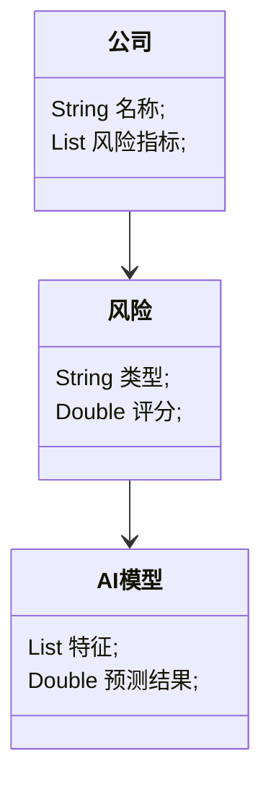
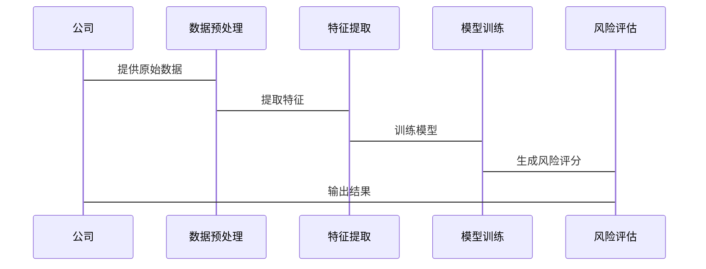

                 


# AI增强型公司治理风险评估工具

> 关键词：AI增强、公司治理、风险评估、机器学习、数据挖掘、NLP

> 摘要：本文详细探讨了AI技术在公司治理风险评估中的应用，通过分析传统风险评估方法的局限性，结合AI技术的优势，提出了一种基于机器学习和自然语言处理的AI增强型公司治理风险评估工具。文章从核心概念、算法原理、系统架构到项目实战，全面阐述了该工具的构建过程和实际应用价值。

---

## 第1章: AI增强型公司治理风险评估的背景与核心概念

### 1.1 问题背景介绍

在现代企业环境中，公司治理的核心挑战之一是如何有效识别和评估潜在风险。传统的风险评估方法通常依赖于人工分析和经验判断，这种方式不仅效率低下，而且容易受到主观因素的影响，难以覆盖企业运营中的复杂场景。

#### 1.1.1 当前公司治理中的风险评估挑战
- **数据量大**：现代企业每天产生海量数据，包括财务报表、市场动态、法律法规变化等，人工分析难以覆盖所有关键信息。
- **风险种类多**：公司治理中的风险类型繁多，包括财务风险、合规风险、声誉风险等，传统方法难以全面覆盖。
- **动态变化**：市场环境和企业内部状况不断变化，风险评估需要实时更新，但传统方法难以做到这一点。

#### 1.1.2 传统风险评估方法的局限性
- **效率低下**：人工分析耗时耗力，难以应对海量数据。
- **主观性强**：依赖个人经验和判断，结果可能存在偏差。
- **缺乏实时性**：无法及时捕捉市场变化和突发事件。

#### 1.1.3 AI技术在风险评估中的潜在优势
- **高效处理数据**：AI技术能够快速处理海量数据，提取关键信息。
- **精准预测**：通过机器学习算法，可以实现对风险的精准预测和分类。
- **实时监控**：AI系统可以实时分析数据，及时发现潜在风险。

### 1.2 问题描述与目标

公司治理风险评估的目标是通过识别和评估潜在风险，为企业提供决策支持。然而，传统方法在效率、准确性和实时性方面存在明显不足。引入AI技术可以显著提升风险评估的效率和准确性。

#### 1.2.1 公司治理风险评估的核心问题
- 如何快速、准确地识别潜在风险？
- 如何将不同来源的数据整合到统一的分析框架中？
- 如何实现风险的动态评估和实时监控？

#### 1.2.2 AI增强型工具的目标与边界
- **目标**：构建一个基于AI的公司治理风险评估工具，能够实时分析数据，识别潜在风险，并提供决策支持。
- **边界**：仅关注公司治理相关的风险，不涉及企业运营的其他方面。

#### 1.2.3 核心功能与预期效果
- **数据采集与整合**：从多种数据源（如财务报表、新闻报道、社交媒体）获取数据，并进行清洗和预处理。
- **风险识别与分类**：利用机器学习算法对数据进行分析，识别潜在风险并进行分类。
- **风险评估与预警**：根据分析结果生成风险评分，并提供预警功能。

### 1.3 核心概念与组成要素

为了实现AI增强型公司治理风险评估工具的目标，我们需要明确核心概念和组成要素。

#### 1.3.1 核心概念的定义
- **风险源**：可能对企业治理造成影响的因素，如财务数据、市场动态、法律法规等。
- **风险指标**：用于衡量风险的量化指标，如财务杠杆率、舆情评分等。
- **AI模型**：用于分析数据、识别风险的算法，如随机森林、逻辑回归等。

#### 1.3.2 核心概念的属性特征对比表

| 概念     | 属性               | 特征描述                                 |
|----------|--------------------|----------------------------------------|
| 风险源   | 数据来源           | 包括财务数据、市场数据、社交媒体等     |
| 风险指标 | 计量方式           | 如舆情评分、财务指标等                 |
| AI模型   | 算法类型           | 如随机森林、逻辑回归等                 |

#### 1.3.3 ER实体关系图架构


---

## 第2章: AI增强型公司治理风险评估的核心原理

### 2.1 AI与公司治理的结合原理

AI技术在公司治理中的应用主要体现在以下几个方面：

#### 2.1.1 机器学习在风险预测中的应用
- **监督学习**：用于根据历史数据预测未来风险。
- **无监督学习**：用于发现数据中的隐藏模式和异常值。

#### 2.1.2 自然语言处理在文本分析中的应用
- **情感分析**：分析社交媒体和新闻中的情感倾向，预测企业声誉风险。
- **实体识别**：识别文本中的关键实体，如公司名称、事件等。

#### 2.1.3 数据挖掘在风险识别中的作用
- **关联规则挖掘**：发现不同数据之间的关联性，识别潜在风险。

### 2.2 核心算法原理

#### 2.2.1 机器学习算法的分类与选择
- **监督学习**：适用于有标签的数据，如逻辑回归、支持向量机（SVM）。
- **无监督学习**：适用于无标签的数据，如聚类分析。
- **集成学习**：通过组合多个模型的结果来提高准确性，如随机森林。

#### 2.2.2 算法流程图


#### 2.2.3 算法实现的数学模型

以逻辑回归为例，其数学模型如下：

$$
P(y=1|x) = \frac{1}{1 + e^{-(\beta_0 + \beta_1 x)}}
$$

其中，$x$ 是输入特征，$\beta_0$ 和 $\beta_1$ 是模型参数。

### 2.3 算法实现的数学模型

#### 2.3.1 线性回归模型

线性回归是一种常用的回归分析方法，其数学模型如下：

$$
y = \beta_0 + \beta_1 x + \epsilon
$$

其中，$y$ 是目标变量，$x$ 是输入特征，$\beta_0$ 和 $\beta_1$ 是模型参数，$\epsilon$ 是误差项。

#### 2.3.2 逻辑回归模型

逻辑回归用于分类问题，其数学模型如下：

$$
P(y=1|x) = \frac{1}{1 + e^{-(\beta_0 + \beta_1 x)}}
$$

其中，$P(y=1|x)$ 是在给定 $x$ 的条件下，$y=1$ 的概率。

---

## 第3章: AI增强型公司治理风险评估的系统分析与架构设计

### 3.1 问题场景介绍

在实际应用中，公司治理风险评估需要考虑多个因素，包括财务数据、市场动态、法律法规变化等。为了实现高效的评估，我们需要设计一个高效的系统架构。

### 3.2 系统功能设计

#### 3.2.1 领域模型



#### 3.2.2 系统架构设计


#### 3.2.3 系统接口设计

系统接口设计需要考虑数据输入、模型训练和结果输出。以下是接口的定义：



---

## 第4章: AI增强型公司治理风险评估的项目实战

### 4.1 环境安装

为了实现AI增强型公司治理风险评估工具，我们需要安装以下环境：

- **Python**：3.6+
- **机器学习库**：scikit-learn、XGBoost
- **自然语言处理库**：NLTK、spaCy
- **数据处理库**：Pandas、NumPy

### 4.2 系统核心实现源代码

以下是一个简单的逻辑回归实现代码：

```python
import pandas as pd
from sklearn.linear_model import LogisticRegression
from sklearn.model_selection import train_test_split
from sklearn.metrics import accuracy_score

# 加载数据
data = pd.read_csv('risk_data.csv')
X = data.drop('risk', axis=1)
y = data['risk']

# 划分训练集和测试集
X_train, X_test, y_train, y_test = train_test_split(X, y, test_size=0.2, random_state=42)

# 训练模型
model = LogisticRegression()
model.fit(X_train, y_train)

# 预测结果
y_pred = model.predict(X_test)

# 评估准确率
print(accuracy_score(y_test, y_pred))
```

### 4.3 案例分析与实际应用

以某公司为例，假设我们有以下数据：

| 公司名称 | 财务杠杆率 | 股价波动 | 偿债能力 | 风险评分 |
|---------|------------|----------|----------|----------|
| A公司   | 0.8        | 0.6      | 0.7      | 0.75     |
| B公司   | 1.2        | 0.8      | 0.6      | 0.85     |

通过训练好的逻辑回归模型，我们可以对这些公司进行风险评分预测。

### 4.4 项目小结

通过以上步骤，我们可以实现一个简单的AI增强型公司治理风险评估工具。然而，实际应用中可能需要考虑更多的因素和更复杂的算法。

---

## 第5章: 总结与展望

### 5.1 最佳实践 tips

- 数据预处理是关键，确保数据的准确性和完整性。
- 在选择算法时，需要根据数据特性和任务需求进行选择。
- 定期更新模型，以适应市场环境的变化。

### 5.2 小结

本文详细探讨了AI增强型公司治理风险评估工具的构建过程，从背景介绍、核心概念、算法原理到系统架构和项目实战，全面阐述了该工具的设计和应用。

### 5.3 注意事项

- 数据隐私和安全问题需要特别注意。
- 模型的可解释性是实际应用中的一个重要因素。

### 5.4 拓展阅读

- 《机器学习实战》
- 《自然语言处理实战》
- 《公司治理与风险管理》

---

## 作者：AI天才研究院 & 禅与计算机程序设计艺术

---

