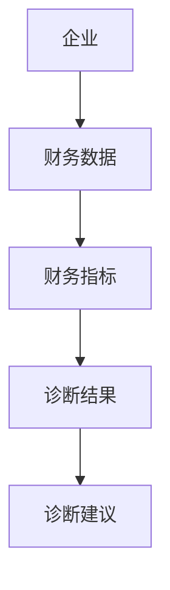
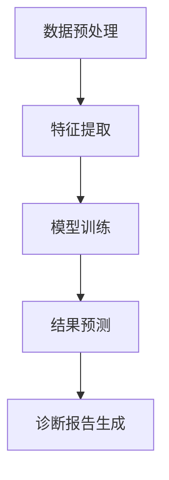

                 


# AI增强型公司财务健康诊断

> 关键词：AI，财务健康诊断，机器学习，数据驱动，企业诊断

> 摘要：本文详细探讨了AI技术在公司财务健康诊断中的应用，通过分析传统财务诊断的局限性，结合AI算法的核心原理，构建了一个基于机器学习的诊断系统，从数据采集到模型部署，详细介绍了实现过程，并通过案例展示了实际应用效果。文章还总结了最佳实践和注意事项，为读者提供了全面的技术指导。

---

# 第1章: AI增强型公司财务健康诊断的背景与概念

## 1.1 问题背景

### 1.1.1 传统财务诊断的局限性
传统的财务诊断方法依赖于财务报表分析和人工判断，存在主观性强、效率低、准确性差等问题。企业财务状况复杂多变，人工分析难以捕捉所有关键指标和潜在风险。

### 1.1.2 数字化转型与AI技术的兴起
随着企业数字化转型的推进，海量财务数据的积累为AI技术的应用提供了基础。机器学习、深度学习等技术在数据分析领域的成功应用，为财务诊断提供了新的可能性。

### 1.1.3 企业财务健康诊断的重要性
财务健康诊断是企业风险管理的重要环节，直接关系到企业的生存和发展。及时发现财务问题并采取措施，可以有效规避财务风险，提升企业竞争力。

## 1.2 问题描述

### 1.2.1 财务数据的复杂性
财务数据种类繁多，包括收入、支出、资产、负债等，且时间跨度长，数据量大，传统方法难以高效处理。

### 1.2.2 财务诊断的主观性
传统诊断过程高度依赖分析师的经验，存在主观判断偏差，难以保证诊断结果的客观性和一致性。

### 1.2.3 传统诊断方法的不足
传统方法通常只关注单一维度的财务指标，难以全面评估企业的财务健康状况，且诊断效率低下。

## 1.3 问题解决与AI的结合

### 1.3.1 AI在财务分析中的优势
AI技术能够处理海量数据，提取关键特征，发现潜在规律，提供客观、全面的诊断结果。通过自动化分析，显著提高诊断效率。

### 1.3.2 AI增强型诊断的核心目标
通过AI技术，构建一个多维度、动态的财务诊断模型，实现对企业财务健康状况的实时监测和预警。

### 1.3.3 技术实现路径概述
AI增强型诊断系统包括数据采集、特征提取、模型训练、诊断预测和结果可视化等步骤，形成一个完整的诊断流程。

## 1.4 边界与外延

### 1.4.1 财务健康诊断的范围界定
诊断范围包括企业的财务状况、经营状况、偿债能力等多个维度，但不涉及企业的战略决策和市场环境分析。

### 1.4.2 AI增强型诊断的适用场景
适用于需要快速、准确诊断财务健康状况的企业，特别适合数据量大、财务指标复杂的中大型企业。

### 1.4.3 与其他技术的协同关系
AI增强型诊断可以与大数据分析、云计算等技术结合，形成更强大的财务分析和决策支持系统。

## 1.5 概念结构与核心要素

### 1.5.1 核心概念组成
AI增强型诊断系统由数据层、算法层、模型层和应用层组成，各层协同工作，实现诊断目标。

### 1.5.2 关键要素对比表
| 要素 | 传统诊断 | AI增强型诊断 |
|------|----------|---------------|
| 数据来源 | 财务报表 | 多源数据，包括财务、运营等 |
| 方法 | 主观分析 | 数据驱动，模型自动分析 |
| 结果 | 单一指标 | 多维度综合评价 |

### 1.5.3 实体关系图（ER图）


---

# 第2章: AI增强型公司财务健康诊断的核心概念与联系

## 2.1 核心概念原理

### 2.1.1 数据驱动的诊断模型
通过收集和分析企业的财务数据，构建数据驱动的诊断模型，利用机器学习算法进行预测和分类。

### 2.1.2 AI算法在财务分析中的应用
常用算法包括决策树、随机森林、逻辑回归和神经网络等，不同算法适用于不同的诊断任务。

### 2.1.3 多维度特征分析
从企业的财务、运营和市场等多个维度提取特征，进行全面分析，提高诊断的准确性和全面性。

## 2.2 概念属性特征对比

### 2.2.1 数据来源对比
| 数据来源 | 传统诊断 | AI增强型诊断 |
|----------|----------|---------------|
| 数据类型 | 单一 | 多维 |
| 数据量 | 小 | 大 |

### 2.2.2 模型类型对比
| 模型类型 | 传统诊断 | AI增强型诊断 |
|----------|----------|---------------|
| 是否自动化 | 否 | 是 |
| 是否动态 | 否 | 是 |

### 2.2.3 诊断结果对比
| 诊断结果 | 传统诊断 | AI增强型诊断 |
|----------|----------|---------------|
| 维度 | 单一 | 多维 |
| 准确性 | 低 | 高 |

## 2.3 ER实体关系图


---

# 第3章: AI增强型诊断的算法原理与实现

## 3.1 算法原理

### 3.1.1 机器学习模型选择
根据诊断任务的特点，选择合适的模型。例如，使用逻辑回归进行分类，使用随机森林进行特征重要性分析。

### 3.1.2 模型训练流程
1. 数据预处理：清洗数据，处理缺失值，标准化特征。
2. 特征提取：从原始数据中提取关键特征，如收入增长率、资产负债率等。
3. 模型训练：使用训练数据训练模型，调整超参数。
4. 模型评估：通过交叉验证评估模型性能，调整模型参数。

### 3.1.3 模型评估与优化
使用准确率、召回率、F1分数等指标评估模型性能，通过网格搜索优化模型参数。

## 3.2 算法流程图



## 3.3 算法实现代码

```python
import pandas as pd
from sklearn.ensemble import RandomForestClassifier
from sklearn.model_selection import train_test_split
from sklearn.metrics import accuracy_score

# 数据加载
data = pd.read_csv('financial_data.csv')
X = data.drop('target', axis=1)
y = data['target']

# 数据分割
X_train, X_test, y_train, y_test = train_test_split(X, y, test_size=0.2, random_state=42)

# 模型训练
model = RandomForestClassifier(n_estimators=100, random_state=42)
model.fit(X_train, y_train)

# 预测与评估
y_pred = model.predict(X_test)
print(f'Accuracy: {accuracy_score(y_test, y_pred):.2f}')
```

---

# 第4章: AI增强型诊断的系统架构与实现

## 4.1 系统架构设计

### 4.1.1 系统组成
1. 数据采集模块：从财务系统中采集数据。
2. 数据处理模块：清洗和预处理数据。
3. 模型训练模块：训练诊断模型。
4. 诊断服务模块：提供诊断接口，生成诊断报告。

### 4.1.2 系统架构图


## 4.2 项目实现

### 4.2.1 环境安装
安装Python、机器学习库（如scikit-learn、xgboost）和数据处理库（如pandas、numpy）。

### 4.2.2 核心实现代码

```python
import pandas as pd
from sklearn.ensemble import RandomForestClassifier
from sklearn.model_selection import GridSearchCV
from sklearn.metrics import classification_report

# 数据加载
data = pd.read_csv('financial_data.csv')
X = data.drop('target', axis=1)
y = data['target']

# 数据分割
X_train, X_test, y_train, y_test = train_test_split(X, y, test_size=0.2, random_state=42)

# 参数搜索
param_grid = {'n_estimators': [100, 200], 'max_depth': [None, 10]}
grid_search = GridSearchCV(RandomForestClassifier(), param_grid, cv=5)
grid_search.fit(X_train, y_train)

best_model = grid_search.best_estimator_
y_pred = best_model.predict(X_test)

print(classification_report(y_test, y_pred))
```

## 4.3 系统接口设计

### 4.3.1 接口定义
提供RESTful API接口，支持批量诊断和单个诊断请求。

### 4.3.2 接口实现

```python
from flask import Flask, jsonify
from model import best_model

app = Flask(__name__)

@app.route('/api/health_check', methods=['POST'])
def health_check():
    data = request.json
    prediction = best_model.predict(data)
    return jsonify({'result': prediction.tolist()})
```

---

# 第5章: 项目实战——AI增强型诊断系统实现

## 5.1 项目背景

### 5.1.1 项目目标
构建一个基于AI的财务健康诊断系统，帮助中型企业快速诊断财务问题。

## 5.2 实战环境与工具

### 5.2.1 开发工具
使用Jupyter Notebook进行数据分析和模型训练，Flask构建Web接口。

### 5.2.2 数据集
使用公开的财务数据集，包括收入、支出、资产、负债等指标。

## 5.3 核心代码实现

### 5.3.1 数据预处理

```python
import pandas as pd
import numpy as np

# 数据加载
data = pd.read_csv('financial_data.csv')

# 处理缺失值
data = data.dropna()

# 标准化处理
from sklearn.preprocessing import StandardScaler
scaler = StandardScaler()
X = scaler.fit_transform(data.drop('target', axis=1))
y = data['target']
```

### 5.3.2 模型训练

```python
from sklearn.ensemble import RandomForestClassifier
from sklearn.model_selection import train_test_split

X_train, X_test, y_train, y_test = train_test_split(X, y, test_size=0.2, random_state=42)

model = RandomForestClassifier(n_estimators=200, max_depth=10)
model.fit(X_train, y_train)
```

### 5.3.3 接口开发

```python
from flask import Flask
from model import model

app = Flask(__name__)

@app.route('/api/predict', methods=['POST'])
def predict():
    import json
    data = json.loads(request.data)
    prediction = model.predict([data])
    return jsonify({'result': int(prediction[0])})

if __name__ == '__main__':
    app.run(debug=True)
```

---

# 第6章: 最佳实践与注意事项

## 6.1 最佳实践

### 6.1.1 数据质量管理
确保数据的完整性和准确性，及时清洗和更新数据。

### 6.1.2 模型调优
通过网格搜索和交叉验证优化模型参数，提高诊断准确率。

### 6.1.3 系统可扩展性
设计模块化架构，方便后续功能扩展和性能优化。

## 6.2 注意事项

### 6.2.1 数据隐私保护
遵守数据隐私法规，确保财务数据的安全性。

### 6.2.2 模型解释性
选择可解释性较强的模型，便于分析和优化。

### 6.2.3 系统稳定性
确保系统的高可用性和稳定性，避免因故障影响诊断结果。

## 6.3 小结

通过AI技术实现财务健康诊断，不仅提高了诊断效率，还显著提升了诊断的准确性和全面性。本文详细介绍了系统的实现过程，并提供了实际案例，供读者参考和学习。

---

# 结论

AI增强型公司财务健康诊断系统通过结合机器学习算法和大数据分析技术，为企业提供了高效、准确的财务诊断工具。本文从背景、原理到实现，全面介绍了系统的构建过程，并通过实战案例展示了其应用价值。未来，随着AI技术的不断发展，财务诊断将更加智能化和自动化，为企业创造更大的价值。

---

# 作者

**作者：AI天才研究院 & 禅与计算机程序设计艺术**

