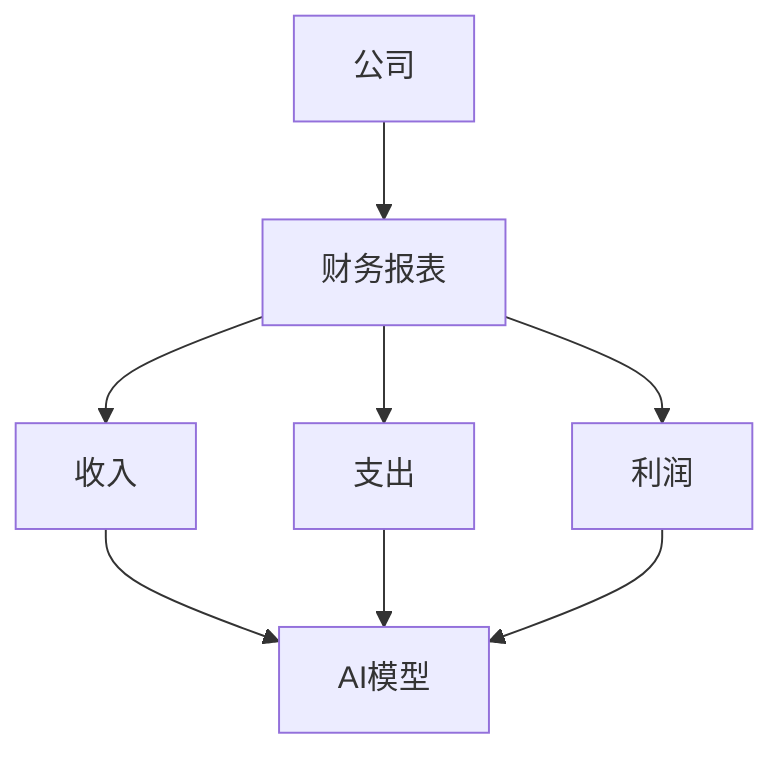
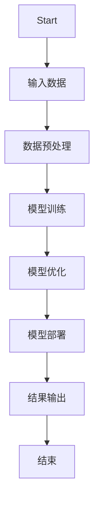
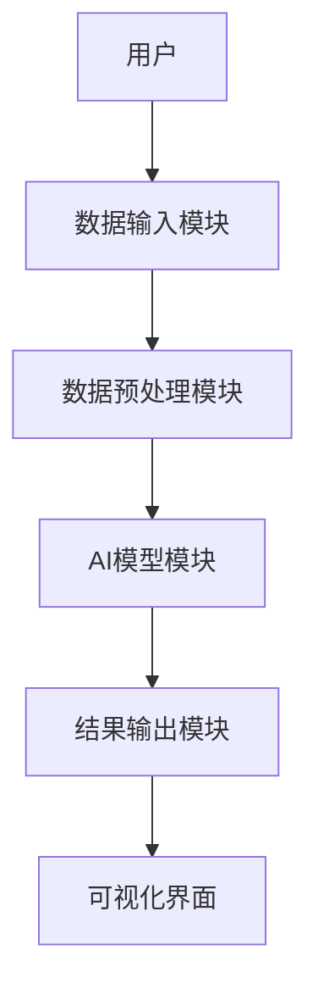
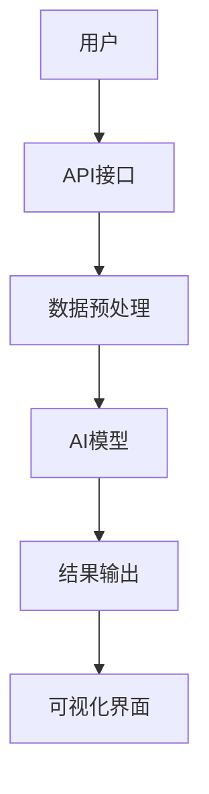

                 


# AI增强型公司财务报表分析工具

## 关键词：AI，财务报表，数据分析，深度学习，自然语言处理，系统架构

## 摘要：  
本文详细介绍了AI增强型公司财务报表分析工具的设计与实现。通过结合AI技术与财务报表分析的深度需求，提出了一种高效、智能的财务分析方法。文章从背景介绍、核心概念、算法原理、系统架构到项目实战，全面阐述了如何利用AI技术提升财务报表分析的效率与准确性。通过具体的实现步骤和案例分析，展示了该工具在实际应用中的优势和价值。

---

# 第1章: AI增强型公司财务报表分析工具的背景介绍

## 1.1 问题背景与描述

### 1.1.1 财务报表分析的传统方法与局限性  
传统的财务报表分析主要依赖人工操作，包括数据收集、整理、计算和分析。这种方法效率低下，容易出错，且难以处理大规模数据。此外，传统方法难以捕捉数据之间的复杂关系，且需要大量专业人员的参与。

### 1.1.2 AI技术在财务分析中的潜力  
AI技术，尤其是深度学习和自然语言处理技术，能够快速处理大量数据，发现数据中的隐含关系，并生成有意义的洞察。AI技术的引入可以显著提高财务报表分析的效率和准确性。

### 1.1.3 AI增强型工具的核心目标与应用场景  
AI增强型公司财务报表分析工具的核心目标是通过AI技术，自动化完成财务数据的清洗、分析和预测，并为用户提供直观的可视化结果。该工具适用于企业财务部门、投资机构、审计事务所等需要高频、精准财务分析的场景。

---

## 1.2 问题解决与边界

### 1.2.1 AI如何提升财务报表分析的效率与准确性  
AI可以通过自动化数据处理、智能模型预测和实时数据监控，显著提升财务分析的效率和准确性。例如，AI可以自动识别财务数据中的异常值，并生成预警信息。

### 1.2.2 AI增强型工具的边界与适用范围  
AI增强型工具主要适用于结构化数据的分析，如收入、支出、利润等财务指标。对于非结构化数据（如财务报告中的文本描述），AI可以通过自然语言处理技术进行分析。

### 1.2.3 工具的核心功能与用户需求分析  
工具的核心功能包括：数据清洗、财务指标计算、趋势预测、异常检测、可视化展示等。用户需求主要集中在提高分析效率、降低人工错误率、提供数据驱动的决策支持等方面。

---

## 1.3 核心概念与结构

### 1.3.1 AI增强型工具的组成要素  
AI增强型工具主要包括数据输入模块、AI模型模块、结果输出模块和用户交互界面模块。

### 1.3.2 财务报表分析的流程与模型  
财务报表分析的流程包括数据清洗、特征提取、模型训练、结果解释等。常用的模型包括线性回归、决策树、神经网络等。

### 1.3.3 AI与财务数据的结合方式  
AI通过将财务数据输入模型，利用算法提取数据特征，生成分析结果，并通过可视化界面呈现给用户。

---

## 1.4 本章小结  
本章介绍了AI增强型公司财务报表分析工具的背景、核心概念和组成部分。通过分析传统方法的局限性和AI技术的潜力，明确了该工具的应用场景和核心功能。

---

# 第2章: AI增强型工具的核心概念与联系

## 2.1 核心概念原理

### 2.1.1 AI模型的基本原理  
AI模型通过输入财务数据，利用神经网络等算法，提取数据特征，并生成预测结果。例如，深度学习模型可以自动学习财务数据中的复杂关系。

### 2.1.2 财务报表分析的关键指标与方法  
财务报表分析的关键指标包括收入增长率、利润率、资产负债率等。常用的方法包括趋势分析、比率分析和财务预测。

### 2.1.3 AI与财务数据的交互机制  
AI通过数据预处理模块对财务数据进行清洗和标准化，然后输入模型进行分析，并将结果输出给用户。

---

## 2.2 核心概念属性对比表

| 概念          | 属性              | 描述                                                                 |
|---------------|-------------------|-----------------------------------------------------------------------|
| AI模型        | 输入              | 财务数据（结构化和非结构化）                                         |
|               | 输出              | 分析结果（如预测值、趋势分析）                                       |
|               | 算法              | 神经网络、决策树、随机森林                                           |
| 财务报表分析   | 输入              | 结构化数据（收入、支出、利润）                                       |
|               | 输出              | 分析报告、预测结果                                                   |
|               | 方法              | 趋势分析、比率分析、财务预测                                         |

---

## 2.3 ER实体关系图



---

## 2.4 本章小结  
本章详细阐述了AI增强型工具的核心概念及其与财务报表分析的关系，通过对比表和实体关系图帮助读者更好地理解工具的组成和工作原理。

---

# 第3章: AI增强型工具的算法原理

## 3.1 算法原理概述

### 3.1.1 神经网络的基本结构  
神经网络由输入层、隐藏层和输出层组成。输入层接收财务数据，隐藏层通过激活函数提取特征，输出层生成预测结果。

### 3.1.2 深度学习在财务分析中的应用  
深度学习广泛应用于财务预测、风险评估和异常检测。例如，卷积神经网络（CNN）可以用于识别财务报表中的模式。

### 3.1.3 自然语言处理与财务文本分析  
自然语言处理技术可以分析财务报告中的文本，提取关键词和情感信息，辅助财务分析。

---

## 3.2 算法流程图



---

## 3.3 算法实现代码

```python
import numpy as np
import tensorflow as tf

# 数据预处理
def preprocess(data):
    # 数据清洗与标准化
    return data

# 模型训练
def train_model(data):
    model = tf.keras.Sequential([
        tf.keras.layers.Dense(64, activation='relu'),
        tf.keras.layers.Dense(1, activation='sigmoid')
    ])
    model.compile(optimizer='adam', loss='binary_crossentropy')
    model.fit(data, epochs=10, batch_size=32)
    return model

# 模型预测
def predict(model, new_data):
    return model.predict(new_data)
```

---

## 3.4 数学模型与公式

### 线性回归模型  
$$ y = \beta_0 + \beta_1 x + \epsilon $$  
其中，$y$ 是预测值，$x$ 是自变量，$\beta_0$ 和 $\beta_1$ 是回归系数，$\epsilon$ 是误差项。

### 神经网络模型  
$$ y = \sigma(w x + b) $$  
其中，$w$ 是权重，$b$ 是偏置，$\sigma$ 是激活函数。

---

## 3.5 本章小结  
本章通过流程图和代码示例，详细讲解了AI增强型工具的算法原理，包括数据预处理、模型训练和预测的实现步骤。

---

# 第4章: AI增强型工具的系统架构与设计

## 4.1 系统架构设计

### 4.1.1 系统架构图  


### 4.1.2 系统功能模块  
- 数据输入模块：接收财务数据。
- 数据预处理模块：清洗和标准化数据。
- AI模型模块：训练和预测。
- 结果输出模块：生成分析结果。
- 可视化界面：展示结果。

---

## 4.2 系统接口设计

### 4.2.1 API接口  
- 输入接口：`POST /api/data`
- 输出接口：`GET /api/results`

### 4.2.2 数据格式  
- 输入：JSON格式的财务数据。
- 输出：JSON格式的分析结果。

---

## 4.3 系统交互流程图



---

## 4.4 本章小结  
本章详细设计了AI增强型工具的系统架构和接口，展示了各模块之间的交互流程。

---

# 第5章: AI增强型工具的项目实战

## 5.1 环境配置

### 5.1.1 安装依赖  
```bash
pip install tensorflow pandas numpy matplotlib
```

---

## 5.2 核心代码实现

### 5.2.1 数据预处理  
```python
import pandas as pd

def preprocess_data(file_path):
    data = pd.read_csv(file_path)
    data = data.dropna()
    data = (data - data.mean()) / data.std()
    return data
```

### 5.2.2 模型训练  
```python
import tensorflow as tf

def train_model(data):
    model = tf.keras.Sequential([
        tf.keras.layers.Dense(64, activation='relu'),
        tf.keras.layers.Dense(1, activation='sigmoid')
    ])
    model.compile(optimizer='adam', loss='binary_crossentropy')
    model.fit(data, epochs=10, batch_size=32)
    return model
```

---

## 5.3 案例分析与解读

### 5.3.1 数据来源  
假设我们分析某公司的季度财务报表，包括收入、支出和利润。

### 5.3.2 模型预测  
经过训练的模型可以预测下一季度的收入和利润。

---

## 5.4 本章小结  
本章通过实际案例展示了AI增强型工具的实现过程，从数据预处理到模型训练，再到结果输出，详细讲解了每个步骤的具体操作。

---

# 第6章: 总结与展望

## 6.1 总结  
本文详细介绍了AI增强型公司财务报表分析工具的设计与实现，通过结合AI技术与财务分析需求，提出了高效的解决方案。通过实际案例的分析，验证了该工具的有效性和实用性。

## 6.2 展望  
未来，随着AI技术的不断发展，AI增强型工具将在财务分析领域发挥更大的作用。例如，结合强化学习和生成模型，可以实现更加智能化和个性化的财务分析。

---

# 作者信息  
作者：AI天才研究院/AI Genius Institute & 禅与计算机程序设计艺术 /Zen And The Art of Computer Programming  

---

# 延伸阅读  
- 《深度学习入门》  
- 《自然语言处理实战》  
- 《系统架构设计指南》  

---

