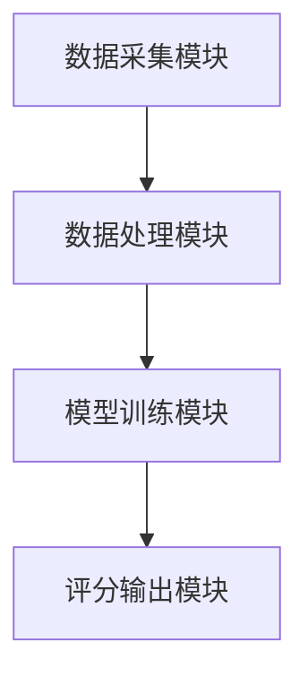

                 


# AI增强型公司质量评分系统

## 关键词：AI增强型评分系统、公司质量评分、机器学习、深度学习、评分模型

## 摘要：  
本文详细探讨了AI增强型公司质量评分系统的设计与实现。通过结合传统评分方法与现代AI技术，提出了一个高效、精准的质量评分解决方案。文章从系统背景、核心概念、算法原理、系统架构到项目实战，全面分析了AI在公司质量评分中的应用，为企业的质量评估提供了新的思路和实践指导。

---

## 第一部分: AI增强型公司质量评分系统概述

### 第1章: 公司质量评分系统背景介绍

#### 1.1 问题背景与描述

##### 1.1.1 传统公司质量评分的局限性  
传统公司质量评分系统通常依赖人工评估和简单的统计方法，存在以下问题：  
- 数据采集范围有限，难以覆盖多维度信息。  
- 评分标准主观性强，容易受到人为因素干扰。  
- 计算效率低，难以实时更新和反馈。  

##### 1.1.2 AI增强型评分的必要性  
随着AI技术的发展，引入机器学习和深度学习方法，可以显著提升评分系统的智能化水平：  
- 自动化采集和处理多维度数据。  
- 通过模型优化实现更精准的评分结果。  
- 支持实时更新和动态调整。  

##### 1.1.3 企业质量评分的核心目标  
- 提供全面、客观的公司质量评估。  
- 为决策者提供数据支持。  
- 优化企业运营效率。  

#### 1.2 问题解决与边界

##### 1.2.1 AI在质量评分中的作用  
- 数据预处理与特征提取。  
- 构建评分模型并进行训练。  
- 实时评分与结果反馈。  

##### 1.2.2 系统的边界与外延  
- 数据来源：公司财务数据、市场表现、用户反馈等。  
- 处理范围：从数据采集到评分输出的完整流程。  
- 外部依赖：依赖AI算法库和计算资源。  

##### 1.2.3 核心要素与组成结构  
- 数据层：数据采集与存储。  
- 模型层：评分模型的设计与训练。  
- 应用层：评分结果的应用与展示。  

#### 1.3 本章小结  
本章介绍了传统公司质量评分系统的局限性，提出了AI增强型评分系统的必要性，并明确了系统的边界和核心组成。

---

### 第2章: AI增强型评分系统的核心概念

#### 2.1 评分模型的基本原理

##### 2.1.1 传统评分模型的局限性  
- 简单线性模型难以捕捉复杂关系。  
- 无法处理非结构化数据。  

##### 2.1.2 AI增强型评分模型的优势  
- 能够处理多维度、非结构化数据。  
- 模型具有自适应能力，可以动态优化。  

##### 2.1.3 模型的核心要素与关系  
- 输入数据：公司各项指标。  
- 模型参数：AI算法中的权重与偏置。  
- 输出结果：最终评分。  

#### 2.2 数据采集与特征工程

##### 2.2.1 数据来源与采集方式  
- 财务数据：收入、利润、资产负债率等。  
- 市场数据：市场份额、品牌影响力。  
- 用户反馈：客户满意度、投诉率。  

##### 2.2.2 特征提取与处理  
- 数据清洗：去除噪声数据。  
- 特征选择：提取关键特征。  
- 数据标准化：统一数据尺度。  

#### 2.3 评分模型的选择与对比

##### 2.3.1 传统评分模型 vs AI模型  
| 对比维度      | 传统评分模型             | AI增强型评分模型       |
|---------------|--------------------------|------------------------|
| 数据处理能力 | 依赖结构化数据           | 支持多维度数据         |
| 模型复杂度    | 简单线性模型             | 复杂非线性模型         |
| 精度          | 较低                     | 较高                   |

##### 2.3.2 不同AI模型的性能对比  
- 线性回归：适合线性关系，精度较低。  
- 支持向量机（SVM）：适合小样本数据，分类效果好。  
- 随机森林：适合高维数据，抗过拟合能力强。  

##### 2.3.3 模型选择的注意事项  
- 数据量与模型复杂度匹配。  
- 模型的可解释性与实际需求结合。  

#### 2.4 本章小结  
本章详细介绍了AI增强型评分系统的核心概念，包括评分模型的基本原理、数据采集与处理方法，以及不同模型的对比分析。

---

### 第3章: AI增强型评分系统的算法原理

#### 3.1 机器学习基础

##### 3.1.1 监督学习与无监督学习  
- 监督学习：基于标记数据进行训练，如回归和分类任务。  
- 无监督学习：基于无标记数据进行聚类分析。  

##### 3.1.2 深度学习的基本原理  
- 神经网络：通过多层非线性变换提取数据特征。  
- 卷积神经网络（CNN）：适合图像数据处理。  
- 循序神经网络（RNN）：适合序列数据处理。  

#### 3.2 算法原理与流程

##### 3.2.1 线性回归模型  
$$ y = \beta_0 + \beta_1 x + \epsilon $$  
其中，$y$ 是目标变量，$x$ 是自变量，$\beta_0$ 和 $\beta_1$ 是模型参数，$\epsilon$ 是误差项。  

##### 3.2.2 支持向量机（SVM）  
SVM的目标是最小化以下损失函数：  
$$ \min_{\beta, \beta_0} \frac{1}{2}||\beta||^2 + C \sum_{i=1}^{n} \max(0, 1 - y_i (\beta_0 + \beta^T x_i)) $$  
其中，$C$ 是惩罚系数，$y_i$ 是标签，$x_i$ 是输入样本。  

##### 3.2.3 随机森林与梯度提升树  
随机森林通过集成多个决策树提升模型的鲁棒性，而梯度提升树（如XGBoost）通过逐步优化损失函数来提升模型性能。  

#### 3.3 算法实现与优化

##### 3.3.1 算法优化策略  
- 参数调优：使用网格搜索或随机搜索优化模型参数。  
- 正则化：防止过拟合，如L1/L2正则化。  
- 并行计算：利用分布式计算加速训练过程。  

##### 3.3.2 超参数调优  
- 学习率（learning rate）  
- 树的深度（tree depth）  
- 样本分割策略（subsample ratio）  

##### 3.3.3 模型评估与验证  
- 训练集、验证集和测试集的划分。  
- 使用准确率、召回率、F1分数等指标评估模型性能。  

#### 3.4 本章小结  
本章详细讲解了AI增强型评分系统中常用的算法原理，包括线性回归、SVM、随机森林和梯度提升树，并讨论了算法优化策略。

---

### 第4章: 系统分析与架构设计

#### 4.1 系统功能设计

##### 4.1.1 功能模块划分  
- 数据采集模块：负责数据的采集与预处理。  
- 模型训练模块：负责模型的训练与优化。  
- 评分输出模块：负责生成并展示评分结果。  

##### 4.1.2 功能模块描述  
- 数据采集模块：支持多种数据源的接入，如数据库、API接口等。  
- 模型训练模块：提供多种算法选择，支持分布式训练。  
- 评分输出模块：生成评分报告，并提供可视化展示。  

#### 4.2 系统架构设计

##### 4.2.1 分层架构设计  


##### 4.2.2 微服务架构的应用  
- 数据采集服务：负责数据的采集与存储。  
- 模型训练服务：负责模型的训练与部署。  
- 评分服务：负责实时评分与结果输出。  

##### 4.2.3 系统的可扩展性与稳定性  
- 支持横向扩展，增加计算资源。  
- 采用容错设计，确保系统稳定性。  

#### 4.3 接口设计与交互流程

##### 4.3.1 API接口设计  
- 数据接口：`GET /data`，返回预处理后的数据。  
- 训练接口：`POST /train`，启动模型训练任务。  
- 评分接口：`POST /score`，返回公司评分结果。  

##### 4.3.2 交互设计与用户体验  
- 界面简洁直观，支持用户自定义参数。  
- 提供实时反馈，展示评分结果和分析报告。  

#### 4.4 本章小结  
本章详细描述了AI增强型评分系统的功能设计和架构设计，包括模块划分、架构选择和接口设计。

---

### 第5章: 项目实战与实现

#### 5.1 环境搭建与数据准备

##### 5.1.1 开发环境的安装与配置  
- 安装Python和相关库：`numpy`、`pandas`、`scikit-learn`、`xgboost`。  
- 安装AI框架：`TensorFlow`或`PyTorch`。  

##### 5.1.2 数据准备与预处理  
- 数据清洗：处理缺失值和异常值。  
- 特征工程：提取关键特征并进行标准化。  

#### 5.2 系统核心实现

##### 5.2.1 数据采集与处理代码  
```python
import pandas as pd
import requests

# 数据采集
def fetch_data(api_url):
    response = requests.get(api_url)
    data = response.json()
    return pd.DataFrame(data)
```

##### 5.2.2 模型训练与优化代码  
```python
from sklearn.ensemble import RandomForestClassifier
from sklearn.model_selection import GridSearchCV

# 参数调优
param_grid = {
    'n_estimators': [100, 200],
    'max_depth': [None, 10, 20],
    'min_samples_split': [2, 5]
}

grid_search = GridSearchCV(RandomForestClassifier(), param_grid, cv=5)
grid_search.fit(X_train, y_train)
best_model = grid_search.best_estimator_
```

##### 5.2.3 评分输出与可视化代码  
```python
import matplotlib.pyplot as plt

# 可视化评分结果
def visualize_scores(scores):
    plt.hist(scores, bins=10, edgecolor='black')
    plt.xlabel('Score')
    plt.ylabel('Frequency')
    plt.title('Company Quality Scores Distribution')
    plt.show()
```

#### 5.3 项目小结  
本章通过实际案例展示了AI增强型评分系统的实现过程，包括环境搭建、数据准备、模型训练和结果可视化。

---

## 第六章: 最佳实践与注意事项

### 6.1 小结与总结  
- AI增强型评分系统能够显著提升企业质量评估的效率和准确性。  
- 通过合理的数据处理和模型优化，可以进一步提升系统性能。  

### 6.2 注意事项  
- 数据隐私与安全：确保数据的合法性和安全性。  
- 模型解释性：在实际应用中，模型的可解释性非常重要。  
- 系统维护：定期更新模型和优化系统性能。  

### 6.3 拓展阅读  
- 《机器学习实战》  
- 《深度学习入门：基于Python和Keras》  
- 《企业级AI系统设计》  

---

## 作者：AI天才研究院/AI Genius Institute & 禅与计算机程序设计艺术 /Zen And The Art of Computer Programming

---

以上是《AI增强型公司质量评分系统》的技术博客文章，文章内容涵盖从理论到实践的完整流程，结合实际案例和代码实现，为读者提供了全面的指导。

