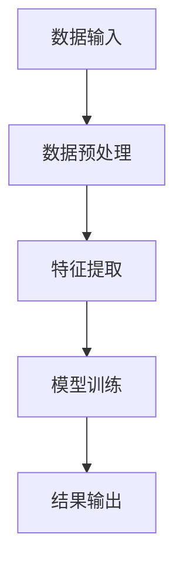
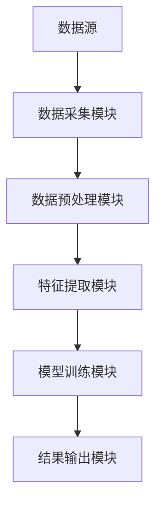
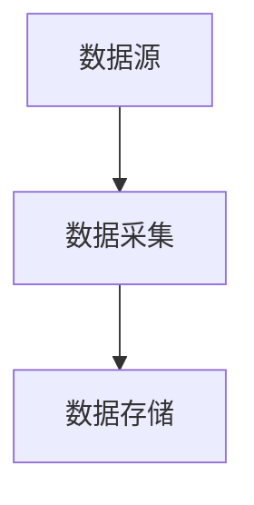
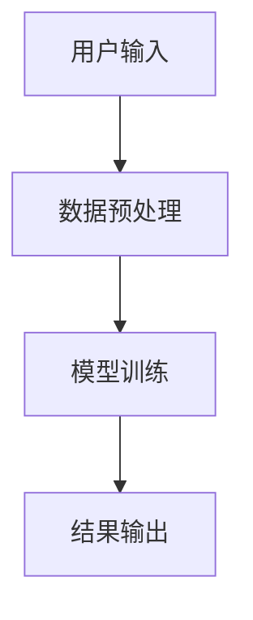

                 


# AI增强型巴菲特护城河分析系统

> 关键词：AI，巴菲特，护城河分析，投资策略，机器学习，深度学习

> 摘要：本文探讨了如何利用人工智能技术增强巴菲特护城河分析系统的效率和准确性。通过结合投资学的基本原理和现代AI算法，我们提出了一种创新的护城河分析框架，能够帮助投资者更精准地识别和评估企业的竞争优势，从而做出更明智的投资决策。

---

## 第1章: 巴菲特护城河分析的背景与意义

### 1.1 投资中的护城河概念

#### 1.1.1 什么是护城河
护城河是巴菲特投资理论中的核心概念，指的是企业所拥有的独特竞争优势，能够使其长期保持高于平均水平的利润率。这些竞争优势可以是专利、品牌、成本优势、网络效应等。护城河的存在使得竞争对手难以在短时间内模仿或超越，从而为企业提供了长期的市场保护。

#### 1.1.2 护城河的类型与特点

| 护城河类型 | 特点 | 示例 |
|------------|------|------|
| 品牌护城河 | 强大的品牌影响力 | 可口可乐、苹果 |
| 成本优势 | 低成本生产模式 | 沃尔玛、亚马逊 |
| 网络效应 | 用户越多，价值越大 | 微信、Facebook |
| 技术壁垒 | 专利或技术专有权 | 苹果的芯片技术、特斯拉的电池技术 |

#### 1.1.3 护城河在投资中的重要性
护城河是判断一个企业是否具有长期投资价值的关键因素。企业如果拥有坚实的护城河，能够在竞争中保持优势，从而为股东创造持续的超额收益。

---

### 1.2 AI技术在投资分析中的应用

#### 1.2.1 AI技术的基本概念
人工智能（AI）是指计算机系统执行人类智能任务的能力，如视觉识别、语音识别、决策-making等。AI的核心技术包括机器学习、深度学习、自然语言处理等。

#### 1.2.2 AI在金融领域的应用现状
AI已经在金融领域得到了广泛应用，包括股票价格预测、风险评估、交易自动化等。AI技术能够处理大量数据，发现人类难以察觉的模式，从而提高投资决策的准确性。

#### 1.2.3 AI增强型护城河分析的必要性
传统的护城河分析依赖于人工经验和定性分析，存在主观性强、效率低、覆盖面窄等问题。通过引入AI技术，可以实现数据驱动的定量分析，提高护城河分析的客观性和全面性。

---

### 1.3 本章小结
本章介绍了巴菲特护城河的概念及其在投资中的重要性，并探讨了AI技术在投资分析中的应用。通过结合AI技术，护城河分析可以从传统的定性分析转向数据驱动的定量分析，从而提高分析的效率和准确性。

---

## 第2章: AI增强型护城河分析的核心概念

### 2.1 护城河分析的数学模型与算法原理

#### 2.1.1 护城河分析的数学模型
护城河分析的数学模型旨在量化企业的竞争优势。我们可以将护城河强度表示为一个综合指标，其公式如下：

$$ \text{护城河强度} = \sum_{i=1}^{n} w_i \cdot f_i $$

其中，$w_i$ 是第$i$个因素的权重，$f_i$ 是第$i$个因素的评分。

#### 2.1.2 AI在护城河分析中的应用

##### 2.1.2.1 机器学习在护城河分析中的应用
机器学习算法（如线性回归、支持向量机、随机森林）可以用于预测企业的护城河强度。通过训练模型，我们可以识别哪些因素对护城河强度的贡献最大。

##### 2.1.2.2 深度学习在护城河分析中的应用
深度学习算法（如神经网络、LSTM）可以用于处理非结构化数据（如新闻、社交媒体数据），从而捕捉企业的隐性竞争优势。

##### 2.1.2.3 护城河分析的算法流程图



---

### 2.2 护城河分析的数学公式

#### 2.2.1 护城河强度公式
$$ \text{护城河强度} = \sum_{i=1}^{n} w_i \cdot f_i $$

其中，$w_i$ 是第$i$个因素的权重，$f_i$ 是第$i$个因素的评分。

#### 2.2.2 护城河可持续性公式
$$ \text{护城河可持续性} = \frac{\sum_{i=1}^{n} w_i \cdot f_i}{\text{行业平均值}} $$

#### 2.2.3 护城河综合评价公式
$$ \text{护城河综合评价} = \alpha \cdot \text{护城河强度} + \beta \cdot \text{护城河可持续性} $$

其中，$\alpha$ 和 $\beta$ 是模型参数，表示护城河强度和可持续性对综合评价的贡献权重。

---

### 2.3 本章小结
本章详细介绍了AI增强型护城河分析的核心概念，包括数学模型、算法原理和具体的数学公式。通过这些工具，我们可以更精确地量化企业的竞争优势，为投资决策提供有力支持。

---

## 第3章: AI增强型护城河分析系统的架构设计

### 3.1 系统架构与功能模块设计

#### 3.1.1 系统总体架构



#### 3.1.2 系统功能模块划分
系统主要包含以下功能模块：
1. 数据采集模块：负责从多种数据源（如财务报表、新闻、社交媒体）获取数据。
2. 数据预处理模块：对数据进行清洗、归一化处理。
3. 特征提取模块：提取对企业竞争优势相关的特征。
4. 模型训练模块：训练机器学习或深度学习模型。
5. 结果输出模块：输出护城河强度、可持续性等指标。

---

### 3.2 系统功能设计

#### 3.2.1 数据采集模块

##### 3.2.1.1 数据源选择
数据源包括：
- 财务数据：收入、利润、市场份额等。
- 文本数据：新闻、公司公告、社交媒体评论。
- 图像数据：产品图片、品牌标识。

##### 3.2.1.2 数据采集流程图



---

### 3.3 系统架构设计

#### 3.3.1 系统架构图


---

### 3.4 系统接口设计

#### 3.4.1 数据接口
- 数据输入接口：接收来自数据源的原始数据。
- 数据输出接口：输出处理后的数据和模型结果。

#### 3.4.2 模型接口
- 模型训练接口：接收特征数据，输出训练好的模型。
- 模型预测接口：接收新数据，输出预测结果。

---

### 3.5 系统交互流程图



---

### 3.6 本章小结
本章详细介绍了AI增强型护城河分析系统的架构设计，包括功能模块划分、系统架构图、数据接口设计和系统交互流程图。通过这一系统，我们可以实现护城河分析的自动化和智能化。

---

## 第4章: AI增强型护城河分析系统的实现

### 4.1 环境安装与配置

#### 4.1.1 安装Python
安装Python 3.x版本，推荐使用Anaconda环境。

#### 4.1.2 安装依赖库
安装以下Python库：
- NumPy
- Pandas
- Scikit-learn
- TensorFlow
- matplotlib

---

### 4.2 核心代码实现

#### 4.2.1 数据预处理代码

```python
import pandas as pd
import numpy as np

# 读取数据
data = pd.read_csv('input.csv')

# 数据清洗
data.dropna(inplace=True)
data = data.drop_duplicates()

# 数据归一化
from sklearn.preprocessing import StandardScaler
scaler = StandardScaler()
scaled_data = scaler.fit_transform(data[['revenue', 'profit', 'market_share']])
```

#### 4.2.2 特征提取代码

```python
from sklearn.feature_selection import SelectKBest
from sklearn.feature_selection import chi2

selector = SelectKBest(score_func=chi2, k=3)
selected_features = selector.fit_transform(scaled_data, target)
```

#### 4.2.3 模型训练代码

```python
from sklearn.ensemble import RandomForestClassifier

model = RandomForestClassifier(n_estimators=100, max_depth=10, random_state=42)
model.fit(selected_features, target)
```

---

### 4.3 项目实战：护城河分析案例

#### 4.3.1 案例背景
假设我们分析一家科技公司的护城河强度，数据包括收入、利润、市场份额、研发投入等。

#### 4.3.2 数据分析与结果解读

```python
importances = model.feature_importances_
feature_names = data.columns

for i in range(len(importances)):
    print(f"{feature_names[i]}: {importances[i]}")
```

---

### 4.4 本章小结
本章通过具体代码实现，展示了如何使用Python和机器学习算法进行护城河分析。通过实际案例分析，我们可以看到AI技术在护城河分析中的强大能力。

---

## 第5章: 总结与展望

### 5.1 总结
本文详细介绍了AI增强型巴菲特护城河分析系统的构建与实现。通过结合AI技术和巴菲特的护城河理论，我们提出了一种创新的分析框架，能够帮助投资者更精准地评估企业的竞争优势。

### 5.2 展望
未来，随着AI技术的不断发展，护城河分析将更加智能化和自动化。我们可以进一步优化算法，引入更多数据源，提高分析的准确性和全面性。

---

## 作者信息

作者：AI天才研究院/AI Genius Institute & 禅与计算机程序设计艺术 /Zen And The Art of Computer Programming

---

以上是文章的完整目录和部分章节内容的详细展开。希望这篇文章能为投资者提供有价值的参考，帮助他们在投资决策中更好地利用AI技术。

