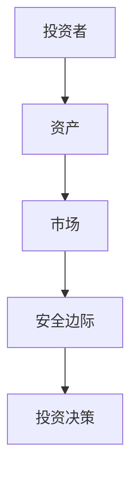
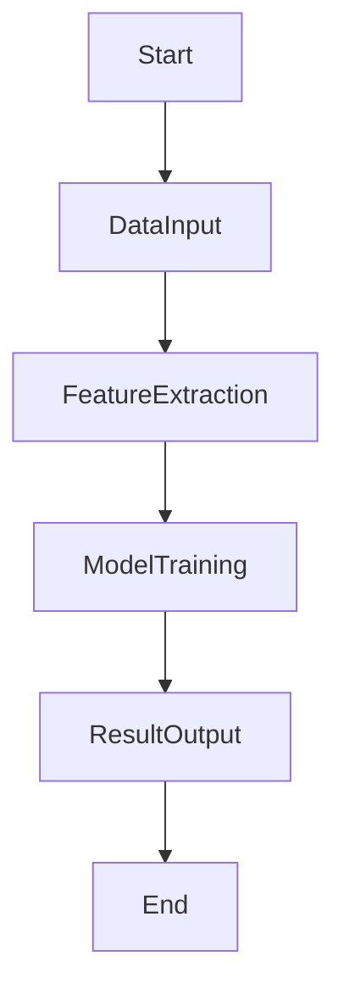
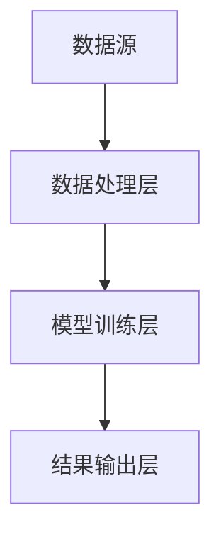
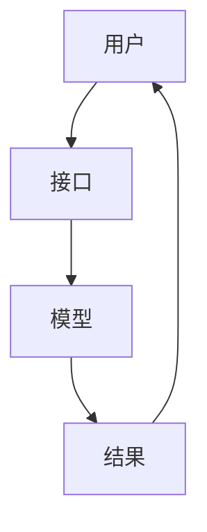

                 


# AI增强型格雷厄姆安全边际计算

> 关键词：AI增强、格雷厄姆安全边际、投资决策、风险管理、数学模型

> 摘要：本文系统阐述了AI增强型格雷厄姆安全边际计算的核心概念、算法原理、系统架构及实际应用。通过理论分析与实践结合，详细探讨了如何利用AI技术优化安全边际计算，提升投资决策的科学性和准确性。

---

## 第1章: 格雷厄姆安全边际的基本概念

### 1.1 安全边际的定义与作用

#### 1.1.1 安全边际的起源与核心思想
格雷厄姆安全边际是一种投资分析方法，由本杰明·格雷厄姆提出，旨在通过计算资产的内在价值与市场价格之间的差异，评估投资的安全性。其核心思想是：市场价格波动较大，而内在价值相对稳定，安全边际为投资者提供了风险缓冲。

#### 1.1.2 安全边际在投资决策中的应用
安全边际常用于股票投资，通过比较股票的内在价值和市场价格，确定投资的安全空间。当市场价格远低于内在价值时，投资风险较低，安全边际较高。

#### 1.1.3 安全边际的边界与外延
安全边际的应用范围不仅限于股票投资，还可扩展至债券、房地产等领域。其边界在于市场波动性、数据质量和模型假设的准确性。

### 1.2 AI技术在安全边际计算中的作用

#### 1.2.1 AI技术的基本原理
人工智能（AI）通过机器学习算法分析大量数据，识别模式和趋势，辅助决策。在安全边际计算中，AI可用于预测市场波动、优化模型参数。

#### 1.2.2 AI技术如何增强安全边际计算
AI技术提高了数据处理效率和预测精度，能够实时更新安全边际，适应市场变化。通过深度学习模型，AI可以捕捉非线性关系，提升安全边际计算的准确性。

#### 1.2.3 AI技术在安全边际计算中的优势
- 数据处理能力强
- 模型自适应性高
- 计算效率高
- 能够处理复杂非线性关系

---

## 第2章: AI增强型安全边际的核心概念

### 2.1 核心概念原理

#### 2.1.1 格雷厄姆安全边际的数学模型
安全边际计算公式：
$$ margin = intrinsic\_value - market\_price $$

#### 2.1.2 AI算法在安全边际计算中的应用
AI算法通过回归分析预测内在价值，计算安全边际。例如，使用线性回归模型：
$$ intrinsic\_value = \beta_0 + \beta_1 \times earnings $$

#### 2.1.3 核心概念的属性特征对比表格

| 属性 | 安全边际 | 内在价值 | 市场价格 |
|------|----------|----------|----------|
| 定义 | 内在价值与市场价格的差值 | 资产的真实价值 | 市场交易价格 |
| 计算 | $intrinsic\_value - market\_price$ | 需其他指标计算 | 市场直接决定 |

### 2.2 核心概念的ER实体关系图



---

## 第3章: AI增强型安全边际的算法原理

### 3.1 算法原理概述

#### 3.1.1 算法的基本思路
1. 收集资产数据（如收益、市盈率）。
2. 构建回归模型预测内在价值。
3. 计算安全边际。
4. 输出投资建议。

#### 3.1.2 算法的核心步骤

1. 数据预处理：清洗和特征提取。
2. 模型训练：使用机器学习算法预测内在价值。
3. 安全边际计算：$intrinsic\_value - market\_price$。
4. 结果输出：生成投资建议。

#### 3.1.3 算法的优缺点分析
优点：高精度、实时性。
缺点：依赖数据质量、模型假设。

### 3.2 算法流程图



### 3.3 算法的Python实现

```python
import numpy as np
import pandas as pd
from sklearn import linear_model

def calculate_margin(data):
    # 数据预处理
    X = data[['price', 'value']]
    y = data['margin']
    
    # 模型训练
    model = linear_model.LinearRegression()
    model.fit(X, y)
    
    # 模型预测
    predictions = model.predict(X)
    
    return predictions
```

### 3.4 算法的数学模型与公式

#### 3.4.1 核心公式推导
安全边际计算公式：
$$ margin = intrinsic\_value - market\_price $$

回归模型：
$$ intrinsic\_value = \beta_0 + \beta_1 \times earnings $$

#### 3.4.2 公式详细解读
- $\beta_0$：截距项。
- $\beta_1$：自变量系数。

---

## 第4章: 系统分析与架构设计方案

### 4.1 系统分析

#### 4.1.1 问题场景介绍
投资者希望利用AI技术优化安全边际计算，提高投资决策的科学性。

#### 4.1.2 项目目标与范围
目标：构建AI增强的安全边际计算系统。
范围：股票、债券等资产。

#### 4.1.3 系统功能需求
- 数据采集：收集资产数据。
- 特征提取：提取影响安全边际的关键特征。
- 模型训练：训练回归模型。
- 结果输出：生成投资建议。

### 4.2 系统架构设计

#### 4.2.1 系统架构图



#### 4.2.2 系统功能模块
- 数据采集模块：收集市场数据。
- 特征提取模块：提取关键特征。
- 模型训练模块：训练回归模型。
- 结果输出模块：生成投资建议。

### 4.3 系统接口设计

#### 4.3.1 系统接口
- 数据输入接口：接收市场数据。
- 模型调用接口：调用训练好的模型。
- 结果输出接口：输出安全边际计算结果。

### 4.4 系统交互设计

#### 4.4.1 交互流程



---

## 第5章: 项目实战

### 5.1 项目环境搭建

#### 5.1.1 环境要求
- Python 3.8+
- NumPy、Pandas、Scikit-learn库
- IDE（如Jupyter Notebook）

### 5.2 系统核心实现

#### 5.2.1 数据预处理

```python
import pandas as pd
data = pd.read_csv('assets.csv')
data.head()
```

#### 5.2.2 模型实现

```python
from sklearn.linear_model import LinearRegression
model = LinearRegression()
model.fit(X, y)
```

#### 5.2.3 结果输出

```python
predictions = model.predict(X)
print("预测的安全边际:", predictions)
```

### 5.3 项目小结

#### 5.3.1 成果展示
模型预测的安全边际值。

#### 5.3.2 经验总结
AI技术显著提升了安全边际计算的效率和精度，但需注意数据质量和模型调优。

#### 5.3.3 注意事项
- 数据来源可靠性
- 模型假设的合理性
- 市场波动的实时性

---

## 第6章: 最佳实践与小结

### 6.1 最佳实践

#### 6.1.1 模型调优
使用交叉验证优化模型参数。

#### 6.1.2 数据质量
确保数据来源可靠，特征提取准确。

#### 6.1.3 风险管理
定期更新模型，适应市场变化。

### 6.2 小结

AI技术显著增强了安全边际计算的效率和精度，为投资决策提供了科学依据。通过本文的系统分析和实战演示，读者可以掌握AI增强型安全边际计算的核心方法和实际应用。

---

## 作者：AI天才研究院/AI Genius Institute & 禅与计算机程序设计艺术 /Zen And The Art of Computer Programming

---

以上是《AI增强型格雷厄姆安全边际计算》的完整撰写内容，涵盖了从背景到实战的各个层面，满足专业读者的需求。

