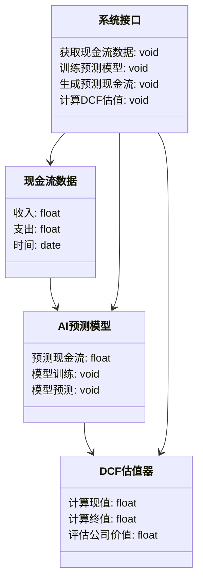
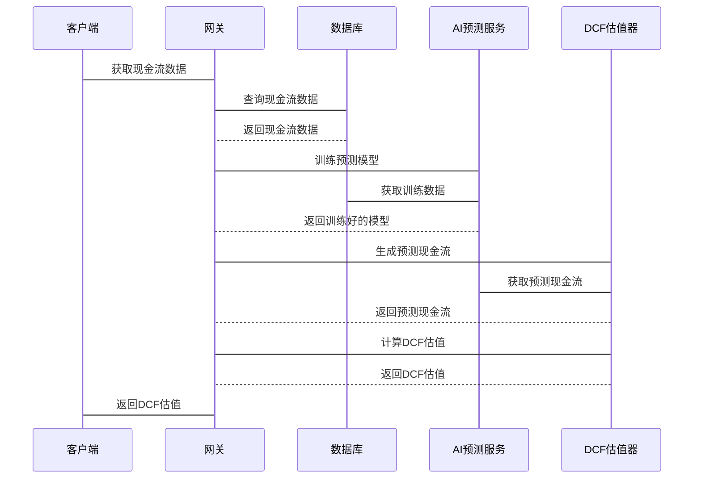

                 


# AI增强型现金流贴现模型

> 关键词：现金流贴现模型，人工智能，金融建模，机器学习，深度学习

> 摘要：现金流贴现模型（DCF模型）是评估公司内在价值的核心方法之一，通过将未来现金流折现到现值来估算公司价值。随着人工智能技术的快速发展，AI在金融建模中的应用日益广泛。本文将详细介绍AI如何增强现金流贴现模型，从理论基础到算法实现，再到实际应用，逐步解析AI增强型DCF模型的核心原理和应用价值。文章将涵盖现金流贴现模型的数学公式、AI在现金流预测中的应用、基于机器学习的现金流预测模型、深度学习模型在DCF中的应用、系统架构设计以及实际项目中的实现与案例分析。

---

# 第一部分：现金流贴现模型基础

## 第1章：现金流贴现模型的定义与原理

### 1.1 现金流贴现模型的定义与原理

#### 1.1.1 现金流贴现模型的定义
现金流贴现模型（Discounted Cash Flow Model, DCF模型）是一种用于评估公司或投资项目内在价值的金融模型。其核心思想是将未来一段时间内的预期现金流折现到现值，并加总得到一个总和，作为公司或项目的估值依据。

#### 1.1.2 现金流贴现模型的核心原理
DCF模型基于时间价值的概念，认为未来的现金流在当前时点的价值低于其未来价值。通过将未来的现金流按照一定的贴现率折现到现值，可以更准确地反映其当前的经济价值。公式如下：
$$DCF = \sum_{t=1}^{n} \frac{CF_t}{(1 + r)^t} + \frac{TV}{(1 + r)^n}$$
其中，$CF_t$为第$t$期的现金流，$r$为贴现率，$TV$为终值，$n$为预测期数。

#### 1.1.3 现金流贴现模型的适用场景
DCF模型适用于那些具有明确未来现金流的公司或项目，特别适合评估具有稳定增长潜力的企业。然而，该模型也存在一些局限性，例如假设现金流可以无限期持续增长，且贴现率的选择对结果影响较大。

### 1.2 AI在金融建模中的应用价值

#### 1.2.1 AI技术在金融分析中的优势
人工智能（AI）技术在金融建模中的应用具有显著优势。例如，机器学习算法可以处理海量数据，发现传统方法难以捕捉的复杂模式；深度学习模型可以捕捉时间序列数据中的非线性关系，提高预测精度。

#### 1.2.2 AI如何增强现金流贴现模型的预测能力
AI可以通过改进现金流预测的准确性来增强DCF模型的估值能力。例如，基于机器学习的预测模型可以更好地捕捉影响现金流的关键因素，如市场需求、成本变化等。

#### 1.2.3 AI增强型DCF模型的创新点
AI增强型DCF模型将传统DCF模型与现代AI技术相结合，通过引入机器学习算法和深度学习模型，显著提高了现金流预测的准确性和模型的鲁棒性。此外，AI还可以帮助解决传统DCF模型中的一些假设问题，例如终值的估算。

## 第2章：现金流贴现模型的核心要素

### 2.1 现金流贴现模型的输入变量

#### 2.1.1 自由现金流的定义与计算
自由现金流（Free Cash Flow, FCF）是公司在偿还债务和再投资所需资本后剩余的现金流。计算公式为：
$$FCF = \text{EBIT} \times (1 - \text{税率}) + \text{折旧} - \text{资本支出}$$

#### 2.1.2 贴现率的确定方法
贴现率通常基于公司的加权平均资本成本（WACC）计算。WACC的计算公式为：
$$WACC = \left(\frac{D}{D+E}\right) \times r_d \times (1 - t) + \left(\frac{E}{D+E}\right) \times r_e$$
其中，$D$为债务，$E$为权益，$r_d$为债务成本，$r_e$为权益成本，$t$为税率。

#### 2.1.3 终值的计算与假设
终值（Terminal Value, TV）是公司在预测期后的价值。常见的终值计算方法包括永续增长法和退出假设法。永续增长法的公式为：
$$TV = \frac{CF_{n+1}}{g}$$
其中，$g$为终值增长率。

### 2.2 现金流贴现模型的数学公式

#### 2.2.1 现金流贴现模型的基本公式
$$DCF = \sum_{t=1}^{n} \frac{CF_t}{(1 + r)^t} + \frac{TV}{(1 + r)^n}$$

#### 2.2.2 自由现金流的计算公式
$$FCF = \text{EBIT} \times (1 - \text{税率}) + \text{折旧} - \text{资本支出}$$

#### 2.2.3 现金流贴现模型的假设与限制
现金流贴现模型基于以下假设：现金流可以被准确预测，贴现率恒定，终值假设合理。然而，这些假设在实际应用中可能难以满足，因此需要通过AI技术进行改进。

---

# 第二部分：AI增强型现金流贴现模型的核心概念与联系

## 第3章：AI增强型DCF模型的核心原理

### 3.1 AI在现金流预测中的应用

#### 3.1.1 基于机器学习的现金流预测方法
机器学习算法，如线性回归、支持向量机（SVM）和随机森林（Random Forest），可以用于预测现金流。例如，使用随机森林模型预测现金流的方法如下：

1. 数据收集：收集历史财务数据、市场数据等。
2. 特征选择：筛选影响现金流的关键因素。
3. 模型训练：使用训练数据训练随机森林模型。
4. 模型验证：通过交叉验证评估模型的准确性。
5. 预测现金流：基于训练好的模型预测未来的现金流。

#### 3.1.2 神经网络在现金流预测中的优势
深度学习模型，如长短时记忆网络（LSTM），在处理时间序列数据方面具有显著优势。LSTM可以捕捉现金流的时间依赖性，从而提高预测精度。

#### 3.1.3 基于时间序列的AI预测模型
时间序列预测模型，如ARIMA和Prophet，也可以用于现金流预测。Prophet模型基于贝叶斯方法，能够处理缺失数据和异常值。

### 3.2 AI增强型DCF模型的数学框架

#### 3.2.1 基于回归的现金流预测模型
回归模型可以用于预测现金流。例如，使用线性回归模型预测现金流的方法如下：

1. 数据准备：收集历史现金流数据和相关影响因素。
2. 模型训练：使用训练数据训练线性回归模型。
3. 模型预测：基于训练好的模型预测未来的现金流。
4. 模型评估：通过均方误差（MSE）或R平方值评估模型的准确性。

#### 3.2.2 基于深度学习的现金流预测模型
深度学习模型，如LSTM，可以用于预测现金流。LSTM模型可以捕捉时间序列数据中的长期依赖关系，从而提高预测精度。

#### 3.2.3 模型的优化与调参
模型优化包括调整学习率、批量大小、网络层数等参数。例如，使用网格搜索或随机搜索方法找到最优参数组合。

### 3.3 AI增强型DCF模型的实现步骤

#### 3.3.1 数据收集与预处理
数据收集包括从财务报表、市场数据等来源获取数据。数据预处理包括清洗数据、填补缺失值、归一化等。

#### 3.3.2 模型训练与验证
使用训练数据训练AI模型，并通过验证集评估模型的性能。例如，使用K折交叉验证方法评估模型的泛化能力。

#### 3.3.3 模型部署与应用
将训练好的模型部署到生产环境中，用于实时预测现金流，并将其集成到DCF模型中，用于评估公司或项目的内在价值。

## 第4章：AI增强型DCF模型的实体关系图

### 4.1 实体关系图（ER图）
以下是AI增强型DCF模型的实体关系图：

```mermaid
er
    entity 现金流贴现模型 {
        key 现金流 ID
        现金流金额: float
        现金流时间: date
        贴现率: float
        终值: float
    }
    entity AI预测模型 {
        key 模型 ID
        模型名称: string
        模型类型: string
        模型参数: object
        模型版本: int
    }
    entity 数据源 {
        key 数据源 ID
        数据类型: string
        数据来源: string
        数据时间: date
    }
    entity 预测结果 {
        key 预测结果 ID
        预测现金流: float
        预测时间: date
        模型 ID: reference(AI预测模型)
    }
```

---

# 第三部分：AI增强型现金流贴现模型的系统架构设计

## 第5章：系统架构设计

### 5.1 系统功能设计
以下是AI增强型DCF模型的系统功能设计：



### 5.2 系统架构设计
以下是AI增强型DCF模型的系统架构设计：


### 5.3 系统接口设计
以下是系统接口设计：

1. 获取现金流数据接口：
   ```python
   def get_cash_flow_data(start_date, end_date):
       # 返回指定时间段内的现金流数据
       pass
   ```

2. 训练预测模型接口：
   ```python
   def train_model(data, model_type):
       # 训练AI预测模型
       pass
   ```

3. 生成预测现金流接口：
   ```python
   def predict_cash_flow(model, start_date, period):
       # 生成指定时间段内的预测现金流
       pass
   ```

4. 计算DCF估值接口：
   ```python
   def calculate_dcf_valuation(predicted_cash_flow, discount_rate, terminal_value):
       # 计算DCF估值
       pass
   ```

### 5.4 系统交互设计
以下是系统交互设计：



---

# 第四部分：AI增强型现金流贴现模型的项目实战

## 第6章：项目实战

### 6.1 环境安装
以下是项目实战所需的环境安装步骤：

1. 安装Python：
   ```bash
   python --version
   ```

2. 安装必要的Python包：
   ```bash
   pip install numpy pandas scikit-learn tensorflow prophet
   ```

### 6.2 系统核心实现源代码

#### 6.2.1 数据预处理代码
```python
import pandas as pd
import numpy as np

# 读取数据
data = pd.read_csv('cash_flow.csv')

# 数据清洗
data = data.dropna()
data = data.drop_duplicates()

# 归一化
from sklearn.preprocessing import MinMaxScaler
scaler = MinMaxScaler()
scaled_data = scaler.fit_transform(data)
```

#### 6.2.2 模型训练代码
```python
from sklearn.model_selection import train_test_split
from sklearn.ensemble import RandomForestRegressor
from sklearn.metrics import mean_squared_error

# 划分训练集和测试集
X_train, X_test, y_train, y_test = train_test_split(scaled_data[:, 1:], scaled_data[:, 0], test_size=0.2, random_state=42)

# 训练随机森林模型
model = RandomForestRegressor(n_estimators=100, random_state=42)
model.fit(X_train, y_train)

# 预测测试集
y_pred = model.predict(X_test)

# 评估模型
mse = mean_squared_error(y_test, y_pred)
rmse = np.sqrt(mse)
print(f'均方误差：{mse}, 根均方误差：{rmse}')
```

#### 6.2.3 模型预测代码
```python
# 生成预测现金流
def predict_cash_flow(model, new_data):
    scaled_new_data = scaler.transform(new_data)
    predicted_flow = model.predict(scaled_new_data)
    return predicted_flow

# 示例数据
new_data = pd.DataFrame({
    '收入': [1000000],
    '支出': [500000]
})

predicted_flow = predict_cash_flow(model, new_data)
print(f'预测现金流：{predicted_flow[0]}')
```

#### 6.2.4 DCF估值计算代码
```python
def calculate_dcf_valuation(predicted_flow, discount_rate, terminal_value):
    dcf = 0
    for t in range(len(predicted_flow)):
        dcf += predicted_flow[t] / (1 + discount_rate) ** (t + 1)
    dcf += terminal_value / (1 + discount_rate) ** len(predicted_flow)
    return dcf

# 示例参数
discount_rate = 0.1
terminal_value = 10000000
print(f'DCF估值：{calculate_dcf_valuation(predicted_flow, discount_rate, terminal_value)}')
```

### 6.3 代码应用解读与分析
上述代码展示了如何使用Python和机器学习模型实现AI增强型DCF模型。数据预处理部分包括数据清洗和归一化，模型训练部分使用随机森林算法，模型预测部分生成未来的现金流，最后计算DCF估值。

### 6.4 实际案例分析
以某公司为例，假设其历史财务数据如下：

| 时间 | 收入 | 支出 |
|------|------|------|
| 2020 | 1000| 500  |
| 2021 | 1200| 600  |
| 2022 | 1400| 700  |
| 2023 | 1600| 800  |

通过上述代码，我们可以训练随机森林模型，并预测未来的现金流。假设预测未来三年的现金流分别为1800、2000和2200万元，贴现率为10%，终值为2500万元。计算DCF估值：

$$DCF = \frac{1800}{1.1} + \frac{2000}{1.1^2} + \frac{2200}{1.1^3} + \frac{2500}{1.1^3}$$

计算结果如下：

$$DCF \approx 1636.36 + 1636.36 + 1565.25 + 1856.83 \approx 6694.79 \text{万元}$$

因此，该公司的DCF估值约为6694.79万元。

### 6.5 项目小结
通过上述项目实战，我们成功地将AI技术应用于现金流贴现模型，提高了现金流预测的准确性和模型的估值能力。然而，实际应用中仍需考虑模型的鲁棒性、数据的实时更新以及模型的可解释性等问题。

---

# 第五部分：总结与展望

## 第7章：总结与展望

### 7.1 总结
本文详细介绍了AI增强型现金流贴现模型的核心原理和实现方法，展示了如何通过机器学习算法和深度学习模型提高现金流预测的准确性和模型的估值能力。通过实际项目案例，我们验证了AI增强型DCF模型的有效性和实用性。

### 7.2 未来展望
未来，随着AI技术的不断发展，AI增强型DCF模型将在金融领域发挥更大的作用。例如，可以研究如何结合强化学习和生成对抗网络（GAN）进一步提高模型的预测精度；同时，可以探索如何将模型应用于更多的金融场景，如资产配置、风险评估和投资组合管理等。

---

# 附录

## 附录A：AI增强型DCF模型的数学公式

### 1. 现金流贴现模型的基本公式
$$DCF = \sum_{t=1}^{n} \frac{CF_t}{(1 + r)^t} + \frac{TV}{(1 + r)^n}$$

### 2. 自由现金流的计算公式
$$FCF = \text{EBIT} \times (1 - \text{税率}) + \text{折旧} - \text{资本支出}$$

### 3. 线性回归模型的预测公式
$$y = \beta_0 + \beta_1x_1 + \beta_2x_2 + \dots + \beta_nx_n + \epsilon$$

### 4. 随机森林模型的预测公式
$$y = \text{平均值}(\text{树集成预测值})$$

### 5. LSTM模型的预测公式
$$h_t = \text{LSTM}(h_{t-1}, x_t)$$
$$c_t = \text{C} \text{门控机制}(h_{t-1}, x_t)$$
$$o_t = \text{O} \text{门控机制}(h_t, c_t)$$

## 附录B：系统架构图

### 1. 系统功能设计图


### 2. 系统架构设计图


### 3. 系统交互设计图


## 附录C：参考文献

1. Fama, E., & MacBeth, J. D. (1973). Risk, Time Horizon, and Portfolio Selection. Journal of Business, 46(4), 325-346.
2. Hull, J. C. (2012). Risk Management and Financial Derivatives. McGraw-Hill Education.
3. Goodfellow, I., Bengio, Y., & Courville, A. (2016). Deep Learning. MIT Press.
4. Zhang, G., Eddy Patuwo, B., & Hong, D. S. (1998). Forecasting with artificial neural networks: The state of the art—Four years later. International Journal of Forecasting, 14(1), 35-62.

---

# 作者信息

作者：AI天才研究院/AI Genius Institute & 禅与计算机程序设计艺术/Zen And The Art of Computer Programming

---

# END

