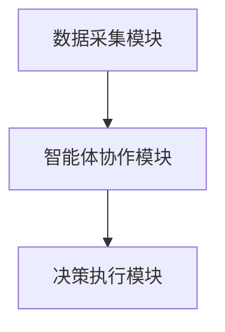

                 


# AI增强的价值投资时机选择：多智能体协作模型

> 关键词：价值投资、人工智能、多智能体协作、投资时机、强化学习

> 摘要：本文探讨了如何利用人工智能技术，特别是多智能体协作模型，来增强价值投资中的时机选择。通过分析多智能体协作模型的原理、算法设计、系统架构以及实际应用案例，本文为投资者提供了一种基于AI的新型投资决策方法，以优化投资时机的选择。

---

# 第一部分: AI增强的价值投资时机选择背景介绍

## 第1章: 价值投资的基本概念

### 1.1 价值投资的定义与特点

#### 1.1.1 价值投资的核心理念
价值投资是一种长期投资策略，强调以低于内在价值的价格买入优质资产。其核心理念是关注企业的基本面，寻找市场低估的股票，并长期持有。价值投资的核心思想是“买 cheap, 卖 expensive”，即在市场低估时买入，在市场高估时卖出。

#### 1.1.2 价值投资的三大原则
1. **价格与价值分离原则**：市场价格波动与内在价值无关，投资应基于对企业内在价值的评估。
2. **安全边际原则**：买入价格应低于企业的内在价值，以降低投资风险。
3. **长期持有原则**：价值投资者倾向于长期持有优质资产，等待市场重新定价。

#### 1.1.3 价值投资与短期交易的对比
- **价值投资**：注重长期价值，关注企业基本面，风险承受能力强，适合长期投资者。
- **短期交易**：注重短期价格波动，关注市场情绪和技术分析，风险承受能力弱，适合短期交易者。

---

## 第2章: AI在金融投资中的应用现状

### 2.1 人工智能在金融领域的应用

#### 2.1.1 AI在股票预测中的应用
人工智能通过分析历史价格、市场情绪、新闻数据等，预测股票价格的波动趋势。例如，使用LSTM（长短期记忆网络）模型进行时间序列预测，或者利用自然语言处理技术分析新闻和社交媒体情绪。

#### 2.1.2 AI在风险评估中的应用
人工智能可以帮助评估投资组合的风险，例如使用蒙特卡洛模拟预测市场波动，或者通过机器学习模型识别市场风险因子。

#### 2.1.3 AI在投资组合管理中的应用
人工智能可以优化投资组合配置，例如使用因子模型筛选优质股票，或者通过强化学习算法动态调整资产配置。

---

## 第3章: 多智能体协作模型的背景

### 3.1 多智能体协作的基本概念

#### 3.1.1 多智能体系统的定义
多智能体系统（Multi-Agent System, MAS）是由多个智能体组成的系统，每个智能体具有一定的自主性、反应性和协作性，能够通过通信和协调完成复杂任务。

#### 3.1.2 多智能体协作的优势
1. **分布式计算能力**：多个智能体可以同时处理不同任务，提高计算效率。
2. **任务分工**：智能体可以分工合作，专注于不同的子问题。
3. **鲁棒性**：单个智能体故障不会导致整个系统崩溃。

#### 3.1.3 多智能体协作的挑战
1. **通信开销**：智能体之间的通信可能会增加计算复杂度。
2. **协调问题**：如何确保智能体之间的协作目标一致。
3. **决策冲突**：智能体可能因为信息不全导致决策冲突。

---

### 3.2 多智能体协作模型在金融中的应用

#### 3.2.1 多智能体协作模型的金融应用场景
1. **股票交易**：多个智能体分别负责市场分析、风险评估和交易执行。
2. **投资组合管理**：智能体协作优化资产配置。
3. **市场风险管理**：智能体协同监测市场风险。

#### 3.2.2 多智能体协作模型的优势
1. **高效性**：多个智能体可以并行处理不同任务，提高决策效率。
2. **准确性**：通过协作，可以整合多个智能体的决策信息，提高决策的准确性。
3. **适应性**：智能体可以根据市场变化动态调整策略。

#### 3.2.3 多智能体协作模型的未来发展趋势
1. **智能化**：智能体将更加智能化，能够自主学习和优化。
2. **分布式计算**：利用分布式计算技术，提高系统的计算能力。
3. **人机协作**：智能体将与人类投资者协同工作，提供更个性化的投资建议。

---

# 第二部分: AI增强的价值投资时机选择的核心概念与联系

## 第4章: 多智能体协作模型的原理

### 4.1 多智能体协作模型的架构

#### 4.1.1 智能体的定义与角色分配
智能体是多智能体协作模型的基本单元，每个智能体负责不同的任务。例如，一个智能体负责市场数据分析，另一个负责风险评估，还有一个负责交易执行。

#### 4.1.2 多智能体协作的通信机制
智能体之间的通信是通过消息传递完成的，消息内容包括数据、指令和反馈。

#### 4.1.3 多智能体协作的决策机制
智能体根据接收到的信息，结合自身的知识库和决策规则，做出决策并反馈给其他智能体。

---

### 4.2 多智能体协作模型的数学模型

#### 4.2.1 智能体的收益函数
收益函数描述了智能体在协作过程中的收益情况，通常表示为：
$$
R_i = \sum_{j=1}^{n} w_{ij} \cdot R_j
$$
其中，$R_i$ 是智能体i的收益，$w_{ij}$ 是智能体i对智能体j的权重，$R_j$ 是智能体j的收益。

#### 4.2.2 智能体的策略选择
智能体的策略选择可以通过强化学习实现，例如使用Q-learning算法：
$$
Q(s, a) = Q(s, a) + \alpha \cdot [r + \gamma \cdot \max Q(s', a') - Q(s, a)]
$$
其中，$Q(s, a)$ 是状态s下动作a的Q值，$\alpha$ 是学习率，$r$ 是奖励，$\gamma$ 是折扣因子，$s'$ 是下一个状态。

#### 4.2.3 智能体之间的协作机制
智能体之间的协作可以通过分布式优化算法实现，例如：
$$
\theta^{(k+1)} = \arg\min_{\theta} \sum_{i=1}^{n} f_i(\theta^{(k)})
$$
其中，$\theta$ 是模型参数，$f_i$ 是智能体i的目标函数。

---

## 第5章: 多智能体协作模型与价值投资的结合

### 5.1 价值投资中的时机选择问题

#### 5.1.1 价值投资中的时机选择挑战
1. **市场波动**：市场波动会影响股票价格，导致价值投资者的买入和卖出时机难以把握。
2. **信息不对称**：市场参与者之间的信息不对称会影响投资决策的准确性。
3. **情绪影响**：投资者情绪波动可能影响市场价格，导致价值投资者的决策失误。

#### 5.1.2 时机选择对投资收益的影响
时机选择对价值投资的收益有直接影响，例如在市场低估时买入可以提高投资收益。

#### 5.1.3 时机选择的数学模型
时机选择的数学模型可以通过时间序列分析实现，例如使用ARIMA模型：
$$
y_t = \phi_1 y_{t-1} + \phi_2 y_{t-2} + \theta_1 \epsilon_{t-1} + \theta_2 \epsilon_{t-2} + \epsilon_t
$$
其中，$y_t$ 是t时刻的股票价格，$\phi_i$ 和 $\theta_j$ 是模型参数，$\epsilon_t$ 是误差项。

---

### 5.2 多智能体协作模型在时机选择中的应用

#### 5.2.1 多智能体协作模型的优化目标
多智能体协作模型的优化目标是最大化投资收益，同时最小化投资风险。

#### 5.2.2 多智能体协作模型的优化策略
多智能体协作模型的优化策略可以通过强化学习实现，例如：
$$
Q(s, a) = Q(s, a) + \alpha \cdot [r + \gamma \cdot \max Q(s', a') - Q(s, a)]
$$
其中，$s$ 是当前状态，$a$ 是动作，$r$ 是奖励，$\gamma$ 是折扣因子。

#### 5.2.3 多智能体协作模型的优化结果分析
优化结果可以通过回测分析实现，例如计算投资组合的收益率、波动率和夏普比率。

---

# 第三部分: 多智能体协作模型的算法原理

## 第6章: 多智能体协作模型的算法设计

### 6.1 基于强化学习的多智能体协作算法

#### 6.1.1 强化学习的基本原理
强化学习是一种通过试错学习的方法，智能体通过与环境交互，获得奖励或惩罚，从而优化自己的策略。

#### 6.1.2 多智能体强化学习的挑战
1. **通信复杂性**：智能体之间的通信会增加计算复杂度。
2. **决策冲突**：多个智能体可能因为目标不一致导致决策冲突。

#### 6.1.3 基于强化学习的协作策略设计
基于强化学习的协作策略可以通过分布式优化算法实现，例如：
$$
\theta^{(k+1)} = \arg\min_{\theta} \sum_{i=1}^{n} f_i(\theta^{(k)})
$$
其中，$\theta$ 是模型参数，$f_i$ 是智能体i的目标函数。

---

### 6.2 多智能体协作模型的数学模型

#### 6.2.1 智能体的收益函数
智能体的收益函数可以通过以下公式表示：
$$
R_i = \sum_{j=1}^{n} w_{ij} \cdot R_j
$$
其中，$R_i$ 是智能体i的收益，$w_{ij}$ 是智能体i对智能体j的权重，$R_j$ 是智能体j的收益。

#### 6.2.2 智能体的策略选择
智能体的策略选择可以通过强化学习实现，例如使用Q-learning算法：
$$
Q(s, a) = Q(s, a) + \alpha \cdot [r + \gamma \cdot \max Q(s', a') - Q(s, a)]
$$
其中，$Q(s, a)$ 是状态s下动作a的Q值，$\alpha$ 是学习率，$r$ 是奖励，$\gamma$ 是折扣因子，$s'$ 是下一个状态。

#### 6.2.3 智能体之间的协作机制
智能体之间的协作可以通过分布式优化算法实现，例如：
$$
\theta^{(k+1)} = \arg\min_{\theta} \sum_{i=1}^{n} f_i(\theta^{(k)})
$$
其中，$\theta$ 是模型参数，$f_i$ 是智能体i的目标函数。

---

## 第7章: 多智能体协作模型的系统架构

### 7.1 系统功能设计

#### 7.1.1 系统功能模块
1. **数据采集模块**：负责采集市场数据，包括股票价格、市场情绪等。
2. **智能体协作模块**：负责智能体之间的通信和协作。
3. **决策执行模块**：负责根据智能体的决策执行交易指令。

#### 7.1.2 系统功能流程
数据采集模块首先采集市场数据，然后传递给智能体协作模块，智能体协作模块根据数据做出决策，最后决策执行模块根据决策执行交易指令。

---

### 7.2 系统架构设计

#### 7.2.1 系统架构图


#### 7.2.2 系统模块交互
1. 数据采集模块采集市场数据，包括股票价格、市场情绪等。
2. 智能体协作模块接收数据后，智能体之间通过通信协商，做出决策。
3. 决策执行模块根据智能体的决策，执行交易指令。

---

## 第8章: 多智能体协作模型的项目实战

### 8.1 项目背景

#### 8.1.1 项目目标
项目目标是利用多智能体协作模型优化价值投资的时机选择。

#### 8.1.2 项目需求
项目需求包括数据采集、智能体协作、决策执行等。

---

### 8.2 项目实现

#### 8.2.1 环境安装
需要安装Python、TensorFlow、Keras等工具。

#### 8.2.2 核心算法实现
核心算法包括数据采集、智能体协作、决策执行等。

#### 8.2.3 代码实现
以下是核心代码示例：
```python
import numpy as np
import tensorflow as tf

class Agent:
    def __init__(self, state_size, action_size):
        self.state_size = state_size
        self.action_size = action_size
        self.model = self.build_model()

    def build_model(self):
        model = tf.keras.Sequential()
        model.add(tf.keras.layers.Dense(64, activation='relu', input_dim=self.state_size))
        model.add(tf.keras.layers.Dense(self.action_size, activation='linear'))
        model.compile(optimizer=tf.keras.optimizers.Adam(), loss='mse')
        return model

    def act(self, state):
        state = np.array(state)
        prediction = self.model.predict(state.reshape(1, -1))
        return np.argmax(prediction[0])
```

---

## 第9章: 多智能体协作模型的最佳实践

### 9.1 小结

#### 9.1.1 多智能体协作模型的优势
1. **高效性**：多智能体可以并行处理任务。
2. **准确性**：协作可以提高决策的准确性。

#### 9.1.2 多智能体协作模型的挑战
1. **通信复杂性**：智能体之间的通信会增加计算复杂度。
2. **决策冲突**：多个智能体可能因为目标不一致导致决策冲突。

---

## 第10章: 多智能体协作模型的注意事项

### 10.1 注意事项

#### 10.1.1 数据质量
数据质量对模型的性能有重要影响，需要确保数据的准确性和完整性。

#### 10.1.2 模型优化
模型优化是提高模型性能的重要手段，可以通过调整超参数、优化算法等实现。

---

## 第11章: 多智能体协作模型的拓展阅读

### 11.1 拓展阅读

#### 11.1.1 多智能体协作的经典论文
1. **Multi-Agent Systems**：介绍多智能体系统的经典理论。
2. **Reinforcement Learning in Multi-Agent Systems**：介绍强化学习在多智能体系统中的应用。

#### 11.1.2 多智能体协作的最新研究
1. **Distributed Reinforcement Learning**：介绍分布式强化学习的最新研究。
2. **Multi-Agent Collaboration in Finance**：介绍多智能体协作在金融领域的最新研究。

---

作者：AI天才研究院/AI Genius Institute & 禅与计算机程序设计艺术 /Zen And The Art of Computer Programming

