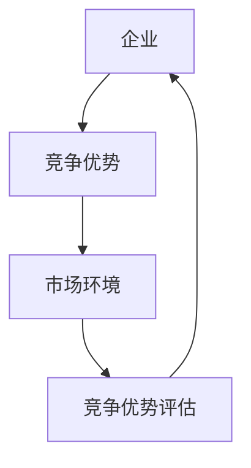
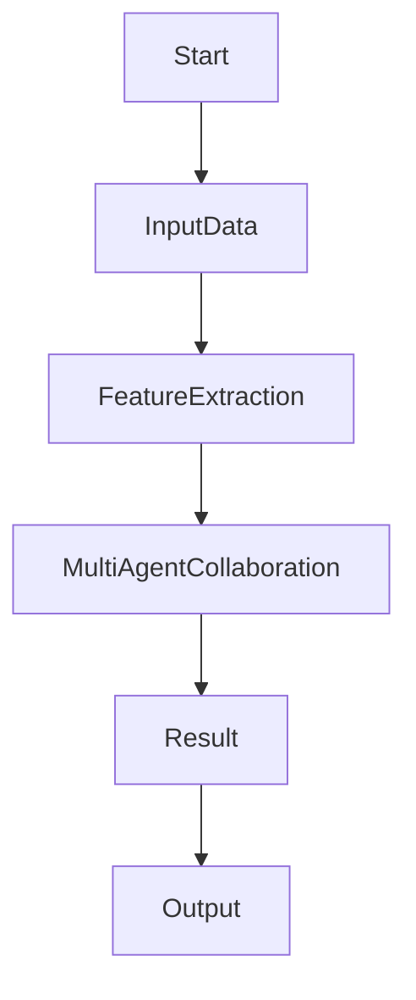
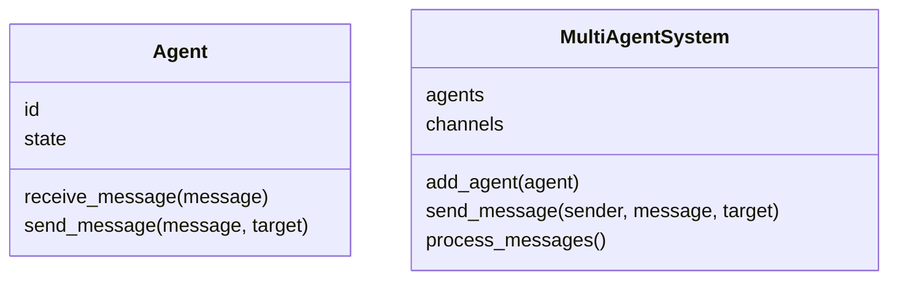
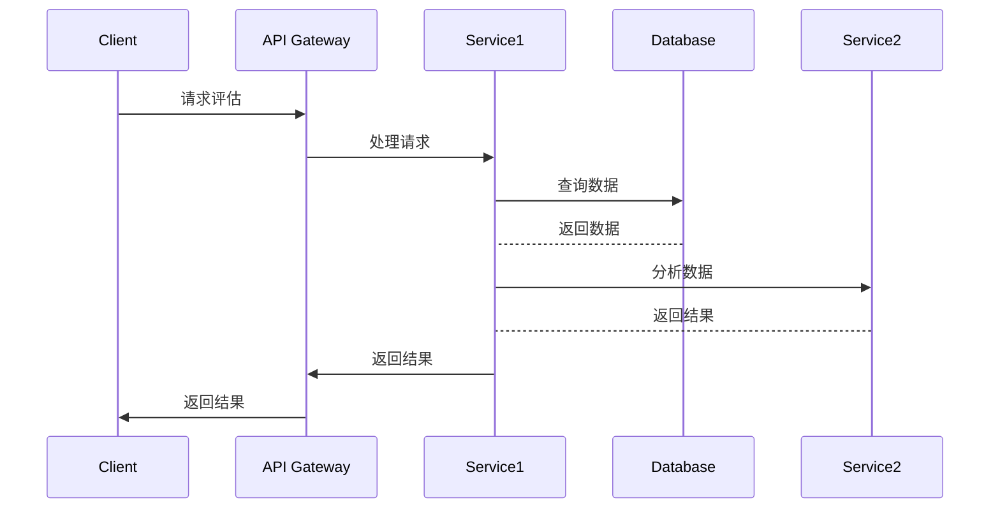

                 


---

# AI增强的护城河持久性评估：多智能体协作模型

> 关键词：AI增强，护城河持久性评估，多智能体协作模型，算法原理，系统架构设计，项目实战

> 摘要：本文探讨了AI增强的护城河持久性评估方法，重点介绍了多智能体协作模型的应用。通过详细分析模型的背景、核心概念、算法原理、系统架构、项目实战及最佳实践，展示了如何利用AI技术提升企业竞争优势的评估效率与准确性。

---

# 第一部分：AI增强的护城河持久性评估背景介绍

# 第1章：问题背景与定义

## 1.1 企业护城河的定义与重要性

企业护城河是指企业在市场中形成的竞争优势，能够有效防止竞争对手侵蚀其市场份额。护城河持久性评估则是衡量这些竞争优势的长期有效性。

## 1.2 AI在护城河评估中的作用

AI技术通过数据挖掘、机器学习等方法，能够快速分析海量数据，发现潜在的竞争优势，帮助企业在动态市场中维持竞争优势。

## 1.3 多智能体协作模型的基本概念

多智能体协作模型是一种通过多个智能体协同工作的方法，能够在复杂环境中实现任务目标。在护城河评估中，多智能体协作模型能够从多个维度分析企业的竞争优势。

## 1.4 护城河评估的主要挑战

- 数据多样性与复杂性
- 动态竞争环境的适应性
- 多目标优化的平衡性

## 1.5 本章小结

---

# 第二部分：多智能体协作模型的核心概念与联系

# 第2章：多智能体协作模型的原理与特性

## 2.1 多智能体协作模型的基本原理

- 分布式协作
- 信息共享
- 协作决策

## 2.2 实体关系图（ER图）



## 2.3 多智能体协作模型的属性特征对比

| 特性 | 描述 |
|------|------|
| 协作方式 | 同步/异步 |
| 智能体类型 | 简单/复杂 |
| 通信机制 | 基于消息/基于状态 |

## 2.4 模型结构与核心要素



---

# 第三部分：多智能体协作模型的算法原理

# 第3章：算法流程与实现

## 3.1 算法流程图


## 3.2 核心代码实现

```python
class Agent:
    def __init__(self, id):
        self.id = id
        self.state = {}

    def receive_message(self, message):
        # 处理消息并更新状态
        pass

    def send_message(self, message, target):
        # 发送消息给目标智能体
        pass

class MultiAgentSystem:
    def __init__(self):
        self.agents = []
        self.channels = {}

    def add_agent(self, agent):
        self.agents.append(agent)

    def send_message(self, sender, message, target):
        # 发送消息并路由到目标
        pass

    def process_messages(self):
        # 处理所有消息
        pass
```

---

# 第四部分：系统分析与架构设计

# 第4章：系统分析与架构设计

## 4.1 问题场景介绍

- 多智能体协作模型在护城河评估中的应用场景
- 系统功能需求分析

## 4.2 系统功能设计



## 4.3 系统架构设计

```mermaid
graph TD
    Client --> API Gateway
    API Gateway --> Service1
    Service1 --> Database
    Service1 --> Service2
    Service2 --> Database
```

## 4.4 接口设计与交互流程



---

# 第五部分：项目实战

# 第5章：项目实战

## 5.1 环境安装

- 安装Python
- 安装相关库（如numpy、pandas、scikit-learn）

## 5.2 核心代码实现

```python
def evaluate_hospitality_competitive_advantages(customers, competitors):
    # 竞争优势评估算法
    pass

def multi_agent_collaboration(agents):
    # 多智能体协作算法
    pass
```

## 5.3 案例分析与结果解读

- 案例背景
- 数据准备
- 模型训练
- 结果分析

## 5.4 项目小结

---

# 第六部分：最佳实践与总结

# 第6章：最佳实践与总结

## 6.1 最佳实践 tips

- 数据预处理的重要性
- 模型调参的技巧
- 系统优化建议

## 6.2 小结

## 6.3 注意事项

- 数据隐私与安全
- 模型的可解释性
- 系统的可扩展性

## 6.4 拓展阅读

- 多智能体协作的最新研究
- 护城河评估的其他方法

---

作者：AI天才研究院 & 禅与计算机程序设计艺术

