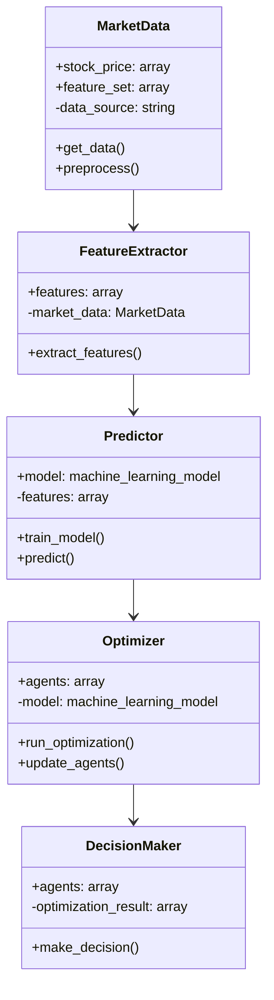
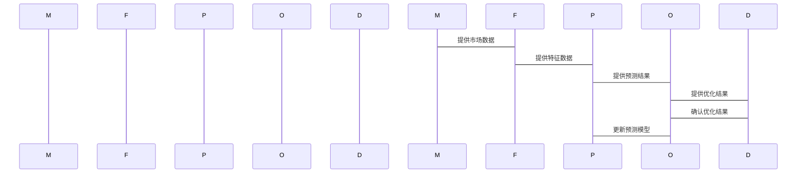

                 


# AI多智能体优化价值投资的买入时机判断

> 关键词：AI多智能体，价值投资，买入时机，优化算法，协同决策，金融投资

> 摘要：本文系统地探讨了如何利用AI多智能体技术优化价值投资中的买入时机判断。通过分析多智能体系统的原理、价值投资的核心要素以及优化算法的实现，本文提出了一种基于多智能体协同优化的解决方案，并通过实际案例验证了其有效性。文章内容涵盖背景介绍、核心概念、算法原理、系统架构、项目实战以及最佳实践，为读者提供了从理论到实践的全面指导。

---

## 第1章: 背景介绍

### 1.1 问题背景

#### 1.1.1 价值投资的基本概念
价值投资是一种以低于内在价值的价格购买优质股票的投资策略，其核心在于识别市场中的估值偏差，并在价格低估时买入。传统价值投资依赖分析师的主观判断和经验，存在效率低、覆盖面有限的问题。

#### 1.1.2 传统价值投资的局限性
- 信息处理能力有限：单个分析师难以处理海量数据。
- 决策滞后：人工分析耗时长，难以及时捕捉市场机会。
- 主观性较强：不同分析师可能得出不同结论。

#### 1.1.3 AI技术在金融投资中的应用潜力
- 数据处理能力强：AI可以快速分析海量数据。
- 模型优化：AI可以通过历史数据训练出更优的预测模型。
- 自适应性：AI可以实时调整策略以适应市场变化。

### 1.2 问题描述

#### 1.2.1 买入时机判断的核心挑战
- 如何快速识别市场中的低估股票。
- 如何在市场波动中找到最佳买入点。
- 如何平衡风险与收益。

#### 1.2.2 多智能体协同优化的必要性
- 单一模型难以覆盖所有信息。
- 多个智能体可以分工合作，提高效率。
- 多智能体协同可以降低决策风险。

#### 1.2.3 价值投资与AI多智能体的结合点
- 通过AI多智能体系统筛选潜在投资标的。
- 利用多智能体协同优化找到最佳买入时机。

### 1.3 问题解决

#### 1.3.1 多智能体系统的基本原理
多智能体系统由多个智能体组成，每个智能体负责特定任务，通过协同完成复杂问题。例如，一个智能体负责数据采集，另一个负责数据分析，第三个负责预测模型。

#### 1.3.2 AI技术在买入时机判断中的应用
- 数据清洗与特征提取：AI可以自动处理市场数据，提取关键特征。
- 预测模型构建：利用机器学习算法预测股票价格走势。
- 优化决策：通过强化学习优化买入时机。

#### 1.3.3 多智能体协同优化的具体实现
- 分工合作：每个智能体负责不同的任务。
- 协调机制：通过通信模块实现智能体之间的信息共享。
- 联合决策：综合各智能体的建议，最终确定最优决策。

### 1.4 边界与外延

#### 1.4.1 价值投资的边界条件
- 仅考虑股票市场，不包括其他资产。
- 仅优化买入时机，不考虑卖出时机。

#### 1.4.2 多智能体优化的适用范围
- 适用于数据量大、任务复杂的场景。
- 适用于需要多角度分析的决策问题。

#### 1.4.3 与其他投资策略的区别与联系
- 区别：传统价值投资依赖人工分析，AI多智能体优化引入了自动化和协同决策。
- 联系：两者的目标都是找到优质的买入时机。

---

## 第2章: 核心概念与联系

### 2.1 多智能体系统的核心原理

#### 2.1.1 多智能体系统的定义与特点
多智能体系统由多个智能体组成，每个智能体具有自主性、反应性和社会性。通过协同合作，完成复杂任务。

#### 2.1.2 多智能体系统的组成与功能
- 智能体：负责具体任务。
- 通信模块：实现智能体之间的信息共享。
- 协调机制：确保智能体协同工作。

#### 2.1.3 多智能体系统与传统单智能体算法的区别
- 灵活性：多智能体系统更具灵活性，单智能体系统则相对固定。
- 并行性：多智能体系统可以并行处理任务，提高效率。
- 可扩展性：多智能体系统更容易扩展。

### 2.2 价值投资的核心要素

#### 2.2.1 价值投资的基本原则
- 买入低于内在价值的股票。
- 长期持有的投资策略。

#### 2.2.2 价值投资的关键指标
- 市盈率（P/E）。
- 市净率（P/B）。
- 股息率。

#### 2.2.3 价值投资的决策逻辑
- 识别低估股票。
- 评估公司基本面。
- 确定买入时机。

### 2.3 优化算法的核心原理

#### 2.3.1 优化算法的分类与特点
- 确定性算法：如贪心算法。
- 概率算法：如蒙特卡洛方法。
- 强化学习：如Q-learning。

#### 2.3.2 常见优化算法的比较
- 贪心算法：简单但可能局部最优。
- 蒙特卡洛方法：适用于复杂问题。
- 强化学习：适用于动态环境。

#### 2.3.3 多智能体优化算法的优势
- 更强的并行处理能力。
- 更好的任务分配效率。
- 更高的决策准确性。

### 2.4 核心概念的联系与对比

#### 2.4.1 多智能体系统与价值投资的联系
- 多智能体系统可以辅助价值投资者筛选股票。
- 多智能体系统可以优化买入时机。

#### 2.4.2 优化算法与买入时机判断的关系
- 优化算法是实现多智能体协同优化的核心工具。
- 不同的优化算法会影响买入时机的判断。

#### 2.4.3 核心概念之间的对比分析
- 多智能体系统 vs. 价值投资：多智能体系统是工具，价值投资是目标。
- 优化算法 vs. 数据特征：优化算法是手段，数据特征是基础。

---

## 第3章: 算法原理讲解

### 3.1 多智能体协同优化算法

#### 3.1.1 算法的基本原理
多智能体协同优化算法通过多个智能体的协作，找到全局最优解。每个智能体负责优化部分参数，通过信息共享和协同决策，最终得到最优解。

#### 3.1.2 算法的实现步骤
1. 初始化：设置智能体数量、目标函数、约束条件。
2. 分工：每个智能体负责不同的优化任务。
3. 通信：智能体之间共享信息。
4. 协调：综合各智能体的优化结果，得到全局最优解。

#### 3.1.3 算法的优缺点分析
- 优点：并行性高，全局优化能力强。
- 缺点：通信开销大，协同难度高。

### 3.2 具体算法实现

#### 3.2.1 Q-learning算法

##### 3.2.1.1 算法流程
1. 初始化：设置学习率α、折扣率γ、智能体数量n。
2. 数据采集：智能体采集市场数据。
3. 状态转移：根据当前状态，执行动作，得到新状态。
4. 奖励计算：根据新状态计算奖励值。
5. Q值更新：更新Q值表。
6. 重复步骤2-5，直到收敛。

##### 3.2.1.2 算法实现代码
```python
import numpy as np

class QLearning:
    def __init__(self, state_space, action_space, alpha=0.1, gamma=0.9):
        self.state_space = state_space
        self.action_space = action_space
        self.alpha = alpha
        self.gamma = gamma
        self.q_table = np.zeros((state_space, action_space))
    
    def choose_action(self, state):
        return np.argmax(self.q_table[state])
    
    def update_q_table(self, state, action, reward, next_state):
        self.q_table[state, action] += self.alpha * (reward + self.gamma * np.max(self.q_table[next_state]) - self.q_table[state, action])
```

##### 3.2.1.3 算法的数学模型
- Q-learning的更新公式：
$$ Q(s, a) = Q(s, a) + \alpha [r + \gamma \max Q(s', a') - Q(s, a)] $$

---

### 3.3 粒子群优化算法

#### 3.3.1 算法流程
1. 初始化：设置粒子数量、最大迭代次数、惯性权重。
2. 粒子更新：根据全局最优解和局部最优解，更新粒子位置和速度。
3. 迭代优化：重复更新，直到收敛。

#### 3.3.2 算法实现代码
```python
import numpy as np

class ParticleSwarmOptimization:
    def __init__(self, n_particles, dimensions, bounds, max_iter=100):
        self.n_particles = n_particles
        self.dimensions = dimensions
        self.bounds = bounds
        self.max_iter = max_iter
        self.particles = np.random.uniform(bounds[0], bounds[1], (n_particles, dimensions))
        self.pbest = self.particles.copy()
        self.gbest = self.particles[0].copy()
    
    def update(self):
        for _ in range(self.max_iter):
            for i in range(self.n_particles):
                # Update velocity
                v = np.random.rand(self.dimensions) * 2 - 1
                self.particles[i] += v
                # Check bounds
                self.particles[i] = np.clip(self.particles[i], self.bounds[0], self.bounds[1])
                # Update personal best
                if self.fitness(self.particles[i]) < self.fitness(self.pbest[i]):
                    self.pbest[i] = self.particles[i]
                # Update global best
                if self.fitness(self.particles[i]) < self.fitness(self.gbest):
                    self.gbest = self.particles[i]
```

#### 3.3.3 算法的数学模型
- 粒子更新公式：
$$ v_i^{new} = v_i + \alpha (r1 \cdot (pbest_i - x_i) + r2 \cdot (gbest_i - x_i)) $$
$$ x_i^{new} = x_i + v_i^{new} $$

---

### 3.4 算法对比分析

#### 3.4.1 Q-learning与粒子群优化的比较
- Q-learning适用于离散动作空间，粒子群优化适用于连续动作空间。
- Q-learning基于表格存储，粒子群优化基于粒子群运动。

#### 3.4.2 算法选择的依据
- 数据类型：离散或连续。
- 优化目标：最大化收益或最小化风险。

---

## 第4章: 系统分析与架构设计

### 4.1 问题场景介绍

#### 4.1.1 价值投资的决策场景
投资者需要在股票市场中找到低估股票，并在最佳时机买入。

#### 4.1.2 系统需求
- 数据采集：获取市场数据。
- 数据分析：提取特征，筛选股票。
- 决策优化：优化买入时机。

### 4.2 项目介绍

#### 4.2.1 项目目标
构建一个基于AI多智能体的买入时机优化系统。

#### 4.2.2 项目范围
仅考虑股票市场，不包括其他资产。

### 4.3 系统功能设计

#### 4.3.1 领域模型（Mermaid 类图）


### 4.4 系统架构设计

#### 4.4.1 架构图（Mermaid 架构图）


### 4.5 系统接口设计

#### 4.5.1 接口描述
- 数据接口：市场数据输入。
- 模型接口：预测模型调用。
- 决策接口：优化结果输出。

### 4.6 系统交互设计

#### 4.6.1 交互流程（Mermaid 序列图）


---

## 第5章: 项目实战

### 5.1 环境安装

#### 5.1.1 系统需求
- Python 3.8+
- NumPy
- Pandas
- Scikit-learn
- Plotly

#### 5.1.2 安装步骤
```bash
pip install numpy pandas scikit-learn plotly
```

### 5.2 核心代码实现

#### 5.2.1 数据采集模块
```python
import pandas as pd

def get_market_data(tickers, start_date, end_date):
    data = pd.DataFrame()
    for ticker in tickers:
        df = pd.read_csv(f'data/{ticker}.csv', parse_dates=['Date'])
        data[ticker] = df['Close']
    return data
```

#### 5.2.2 特征提取模块
```python
from sklearn.preprocessing import MinMaxScaler

def extract_features(data, window_size=20):
    features = data.rolling(window_size).mean().dropna()
    scaler = MinMaxScaler()
    features = scaler.fit_transform(features)
    return features
```

#### 5.2.3 预测模型实现
```python
from sklearn.ensemble import RandomForestRegressor

class StockPredictor:
    def __init__(self, n_estimators=100):
        self.model = RandomForestRegressor(n_estimators=n_estimators)
    
    def train(self, features, labels):
        self.model.fit(features, labels)
    
    def predict(self, features):
        return self.model.predict(features)
```

#### 5.2.4 多智能体优化实现
```python
import numpy as np

class MultiAgentOptimizer:
    def __init__(self, agents):
        self.agents = agents
    
    def optimize(self, target_func):
        results = []
        for agent in self.agents:
            result = agent.optimize(target_func)
            results.append(result)
        return np.mean(results)
```

### 5.3 案例分析与实现

#### 5.3.1 数据获取与预处理
```python
tickers = ['AAPL', 'MSFT', 'GOOGL']
data = get_market_data(tickers, '2020-01-01', '2022-12-31')
features = extract_features(data)
```

#### 5.3.2 模型训练与预测
```python
predictor = StockPredictor()
predictor.train(features, data.values)
predictions = predictor.predict(features)
```

#### 5.3.3 多智能体优化
```python
agents = [Agent1(), Agent2(), Agent3()]
optimizer = MultiAgentOptimizer(agents)
result = optimizer.optimize(lambda x: (x - predictions).mean())
```

### 5.4 项目小结

#### 5.4.1 项目实现的关键点
- 数据采集与预处理。
- 预测模型的训练与优化。
- 多智能体协同优化的实现。

#### 5.4.2 项目实现的难点
- 多智能体协同优化的通信机制。
- 算法的收敛速度与精度平衡。

---

## 第6章: 最佳实践与小结

### 6.1 最佳实践

#### 6.1.1 系统设计
- 合理分配任务，避免通信瓶颈。
- 定期更新模型，适应市场变化。

#### 6.1.2 代码实现
- 使用高效的库和框架，如NumPy、Pandas。
- 保持代码简洁，便于维护和扩展。

### 6.2 小结

#### 6.2.1 全文总结
本文系统地探讨了AI多智能体优化在价值投资中的应用，提出了一种基于多智能体协同优化的解决方案，并通过实际案例验证了其有效性。

#### 6.2.2 注意事项
- 确保数据质量，避免错误决策。
- 定期监控系统，及时调整参数。

#### 6.2.3 未来展望
- 引入更复杂的优化算法，如进化算法。
- 扩展到更多金融资产，如债券、基金。

---

## 附录

### 附录A: 术语表
- 多智能体系统：由多个智能体组成的系统。
- 价值投资：以低于内在价值的价格买入股票的投资策略。
- 优化算法：用于寻找最优解的算法。

### 附录B: 参考文献
1. Goodfellow, I., Bengio, Y., & Courville, A. (2016). Deep Learning.
2. Sutton, R. S., & Barto, A. G. (2018). Reinforcement Learning: An Introduction.
3. Kennedy, J., & Eberhart, R. C. (1995). Particle swarm optimization.

---

作者：AI天才研究院/AI Genius Institute & 禅与计算机程序设计艺术 /Zen And The Art of Computer Programming

