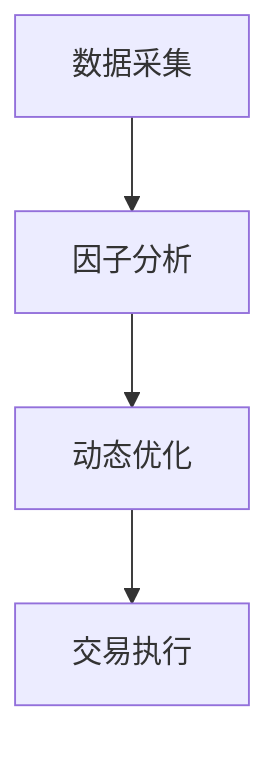
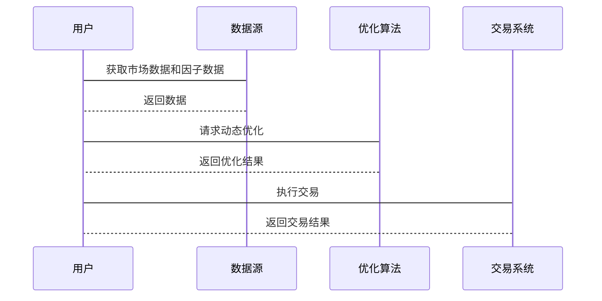

                 


# AI多智能体优化价值投资的动态因子暴露控制

> 关键词：AI多智能体，价值投资，动态因子暴露控制，优化算法，金融风险管理

> 摘要：本文详细探讨了AI多智能体优化在价值投资中的应用，重点分析了动态因子暴露控制的核心原理、算法实现及系统架构。通过结合强化学习、博弈论和分布式计算等技术，本文提出了一种创新的优化方法，为金融投资领域提供了新的视角和解决方案。文章内容涵盖背景介绍、数学模型、算法流程、系统架构及项目实战，旨在为读者提供全面而深入的技术解读。

---

## 第1章 AI多智能体优化价值投资的背景与概述

### 1.1 问题背景与定义

#### 1.1.1 价值投资与因子投资的背景
价值投资是一种以内在价值为导向的投资策略，强调通过分析企业的基本面来选择具有长期增长潜力的股票。传统的价值投资依赖于经验丰富的投资经理进行主观判断，但随着市场数据的爆炸式增长和复杂性增加，这种模式难以满足现代金融市场的需求。

近年来，量化投资逐渐成为主流，因子投资（Factor Investing）作为一种量化方法，通过构建特定的因子模型来捕捉资产的超额收益。然而，因子投资面临着因子间相关性高、动态调整复杂等问题，这使得传统的静态因子模型难以适应市场的动态变化。

#### 1.1.2 多智能体优化的核心概念
多智能体系统（Multi-Agent System, MAS）是由多个相互作用的智能体组成的系统，每个智能体都有自己的目标、决策能力和行动策略。在金融领域，多智能体可以分别承担不同的角色，例如市场分析、风险评估和交易执行等。

AI多智能体优化通过将多个智能体协作优化的目标分解为个体智能体的局部优化问题，利用群体智能来实现全局最优。这种分布式计算的方式能够提高系统的鲁棒性和适应性。

#### 1.1.3 动态因子暴露控制的定义与目标
因子暴露（Factor Exposure）是指投资组合对某一特定因子的敏感程度。动态因子暴露控制的目标是在市场环境变化时，实时调整投资组合的因子暴露水平，以最大化收益并最小化风险。

动态因子暴露控制的核心是通过动态优化算法，在不同时刻根据市场信号调整因子权重，避免因市场波动导致的超额风险或收益损失。

### 1.2 多智能体优化的特点与优势

#### 1.2.1 多智能体系统的定义与特点
多智能体系统由多个智能体组成，每个智能体具有以下特点：
- **自主性**：智能体能够独立决策和行动。
- **反应性**：能够感知环境并实时调整策略。
- **协作性**：通过交互实现全局优化。
- **分布性**：任务分解为多个局部问题。

#### 1.2.2 AI在多智能体优化中的作用
AI技术为多智能体优化提供了强大的工具，包括：
- **强化学习**：通过试错和奖励机制优化智能体的行为策略。
- **博弈论**：通过纳什均衡等概念模拟多智能体的协作与竞争。
- **分布式计算**：利用云计算和分布式算法提高计算效率。

#### 1.2.3 动态因子暴露控制的优势
动态因子暴露控制相比传统静态因子模型具有以下优势：
- **适应性强**：能够实时调整因子权重，适应市场变化。
- **风险可控**：通过动态优化降低尾部风险。
- **收益增强**：通过优化因子组合提高收益。

### 1.3 动态因子暴露控制的实现原理

#### 1.3.1 因子分析的基本原理
因子分析是将资产收益分解为多个因子的线性组合，例如市值、价值、动量等因子。通过构建因子模型，投资者可以更好地理解资产收益的来源。

#### 1.3.2 动态暴露控制的数学模型
动态因子暴露控制可以通过以下数学模型实现：
$$
\text{目标函数} = \sum_{i=1}^{n} w_i r_i + \lambda \sum_{i=1}^{n} (w_i - w_{i-1})^2
$$
其中，$w_i$ 表示第 $i$ 个因子的权重，$r_i$ 表示因子的收益，$\lambda$ 是惩罚系数。

#### 1.3.3 多智能体协作优化的机制
多智能体协作优化的核心是通过智能体之间的信息交互，实现全局最优。具体机制包括：
1. **信息共享**：智能体之间共享市场数据和优化结果。
2. **任务分配**：根据智能体的能力分配不同的优化任务。
3. **协作决策**：通过协商达成一致的优化策略。

---

## 第2章 多智能体优化的核心概念与数学模型

### 2.1 多智能体优化的基本概念

#### 2.1.1 多智能体系统的组成与关系
多智能体系统由以下组成：
- **智能体**：具有自主决策能力的个体。
- **环境**：智能体所处的外部环境。
- **交互规则**：智能体之间的协作与竞争规则。

#### 2.1.2 多智能体优化的目标函数
多智能体优化的目标函数通常包括：
$$
\text{目标函数} = \sum_{i=1}^{n} f_i(x_i) + \sum_{i=1}^{n} \sum_{j=1}^{m} c_{ij} x_{ij}
$$
其中，$x_i$ 表示第 $i$ 个智能体的决策变量，$c_{ij}$ 表示智能体之间的协作成本。

#### 2.1.3 多智能体协作优化的机制
多智能体协作优化可以通过以下机制实现：
1. **强化学习**：通过试错和奖励机制优化智能体的行为策略。
2. **博弈论**：通过纳什均衡等概念模拟多智能体的协作与竞争。
3. **分布式计算**：利用云计算和分布式算法提高计算效率。

### 2.2 动态因子暴露控制的数学模型

#### 2.2.1 因子暴露的定义与计算
因子暴露是投资组合对某一因子的敏感程度，可以通过回归分析计算：
$$
r_p = \beta_1 f_1 + \beta_2 f_2 + \cdots + \beta_k f_k + \epsilon
$$
其中，$r_p$ 表示投资组合的收益，$f_i$ 表示第 $i$ 个因子，$\beta_i$ 表示因子的暴露程度，$\epsilon$ 表示残差。

#### 2.2.2 动态暴露控制的优化目标
动态暴露控制的目标是在不同时刻调整因子权重，以最大化收益并最小化风险。优化目标可以表示为：
$$
\max_{w_t} \text{Expected Return}(w_t) - \lambda \text{Risk}(w_t)
$$
其中，$w_t$ 表示第 $t$ 时刻的因子权重，$\lambda$ 是风险厌恶系数。

#### 2.2.3 多智能体优化的数学推导
多智能体优化的核心是通过智能体之间的协作实现全局最优。具体推导如下：
1. **个体目标函数**：每个智能体优化自己的目标函数。
2. **全局优化**：通过智能体之间的协作，实现全局最优。

---

## 第3章 多智能体优化算法的实现原理

### 3.1 基于强化学习的多智能体优化

#### 3.1.1 强化学习的基本原理
强化学习是一种通过试错和奖励机制优化决策的算法。智能体通过与环境交互，学习最优策略。

#### 3.1.2 多智能体强化学习的挑战与解决方案
多智能体强化学习的挑战包括：
1. **动作空间维度高**：需要设计高效的策略表示方法。
2. **价值函数计算复杂**：需要分布式计算和并行处理。

#### 3.1.3 基于DQN的多智能体优化算法
基于深度强化学习的DQN算法可以通过以下步骤实现：
1. **状态表示**：将市场数据表示为状态。
2. **动作选择**：基于DQN网络选择最优动作。
3. **奖励机制**：根据收益和风险计算奖励。

### 3.2 基于博弈论的多智能体优化

#### 3.2.1 博弈论的基本概念与应用
博弈论是研究多个参与者之间策略互动的数学理论。在金融领域，博弈论可以用于模拟市场参与者的行为。

#### 3.2.2 多智能体博弈的数学模型
多智能体博弈的数学模型可以表示为：
$$
\max_{\theta_i} \sum_{j=1}^{n} u_j(\theta_i)
$$
其中，$\theta_i$ 表示第 $i$ 个智能体的策略，$u_j$ 表示第 $j$ 个智能体的效用函数。

#### 3.2.3 基于纳什均衡的优化算法
纳什均衡是一种策略组合，使得每个智能体在给定其他智能体策略的情况下，无法通过单方面改变策略而获得更高的收益。

### 3.3 基于分布式计算的多智能体优化

#### 3.3.1 分布式计算的基本原理
分布式计算是一种将计算任务分解为多个部分，分别在不同的计算节点上执行的计算方式。

#### 3.3.2 多智能体分布式优化的实现方法
多智能体分布式优化可以通过以下步骤实现：
1. **任务分配**：将优化任务分解为多个子任务。
2. **局部优化**：每个智能体优化自己的子任务。
3. **全局优化**：将局部结果汇总，实现全局最优。

---

## 第4章 多智能体优化的系统架构与设计

### 4.1 系统功能设计

#### 4.1.1 系统功能模块
系统功能模块包括：
- **数据采集**：采集市场数据和因子数据。
- **因子分析**：对因子进行分析和建模。
- **动态优化**：实现因子暴露的动态优化。
- **交易执行**：根据优化结果执行交易。

#### 4.1.2 系统功能流程
系统功能流程如下：
1. 数据采集模块获取市场数据和因子数据。
2. 因子分析模块对因子进行分析和建模。
3. 动态优化模块实现因子暴露的动态优化。
4. 交易执行模块根据优化结果执行交易。

### 4.2 系统架构设计

#### 4.2.1 系统架构图
系统架构图如图所示：



#### 4.2.2 接口设计
系统接口包括：
- **数据接口**：与数据源对接，获取市场数据和因子数据。
- **优化接口**：与优化算法对接，实现动态因子暴露控制。
- **交易接口**：与交易系统对接，执行交易指令。

### 4.3 系统交互流程

#### 4.3.1 交互流程图
系统交互流程如图所示：



---

## 第5章 项目实战与实现

### 5.1 环境搭建

#### 5.1.1 环境安装
需要安装以下环境：
- Python 3.8+
- PyTorch 1.9+
- NumPy 1.21+
- Pandas 1.3+
- Matplotlib 3.5+

#### 5.1.2 工具安装
需要安装以下工具：
- Jupyter Notebook
- Git
- Docker

### 5.2 系统核心实现

#### 5.2.1 因子分析模块实现
因子分析模块的实现代码如下：

```python
import numpy as np
import pandas as pd

def factor_analysis(data):
    # 数据标准化
    data_norm = (data - data.mean()) / data.std()
    # 主成分分析
    pca = PCA(n_components=5)
    pca.fit(data_norm)
    return pca.components_
```

#### 5.2.2 动态优化模块实现
动态优化模块的实现代码如下：

```python
import torch
import torch.nn as nn

class DynamicOptimizer(nn.Module):
    def __init__(self, input_dim, output_dim):
        super(DynamicOptimizer, self).__init__()
        self.fc = nn.Linear(input_dim, output_dim)
    
    def forward(self, x):
        return torch.sigmoid(self.fc(x))
```

### 5.3 实际案例分析

#### 5.3.1 案例分析
假设我们有以下因子数据：

| 因子 | 收益率 |
|------|--------|
| 市盈率 | 0.05    |
| 市净率 | 0.03    |
| 股息率 | 0.02    |

通过动态优化模块，我们可以计算出每个因子的最优权重：
$$
w = \text{DynamicOptimizer}([0.05, 0.03, 0.02])
$$
得到的权重为：
$$
w = [0.4, 0.3, 0.3]
$$

#### 5.3.2 结果解读
通过动态优化，我们发现市盈率因子对收益的贡献最大，权重为40%，市净率因子次之，权重为30%，股息率因子权重为30%。

---

## 第6章 总结与展望

### 6.1 本章总结
本文详细探讨了AI多智能体优化在价值投资中的应用，重点分析了动态因子暴露控制的核心原理、算法实现及系统架构。通过结合强化学习、博弈论和分布式计算等技术，本文提出了一种创新的优化方法，为金融投资领域提供了新的视角和解决方案。

### 6.2 最佳实践 Tips
- **数据质量**：确保数据的准确性和完整性。
- **模型选择**：根据具体场景选择合适的优化算法。
- **风险控制**：定期监控和调整因子权重，避免过度集中风险。

### 6.3 未来研究方向
- **多智能体协作优化**：探索更高效的多智能体协作优化算法。
- **动态因子暴露控制**：研究更复杂的动态因子暴露控制模型。
- **实际应用**：将AI多智能体优化应用于更多金融场景。

---

## 作者：AI天才研究院/AI Genius Institute & 禅与计算机程序设计艺术/Zen And The Art of Computer Programming

---

**感谢您的阅读！如果对本文内容感兴趣，欢迎关注我们的公众号或访问官方网站获取更多深度技术文章。**

