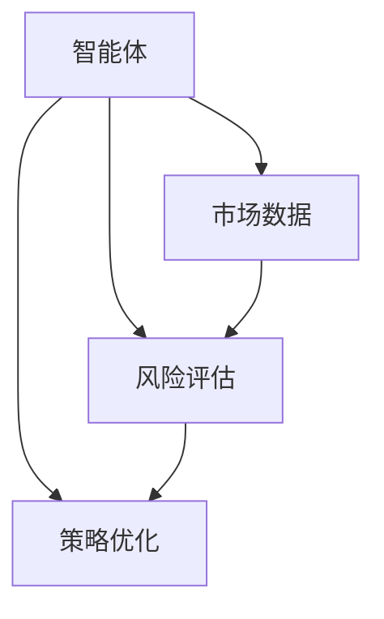
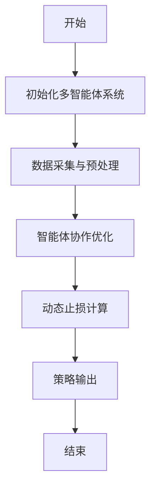
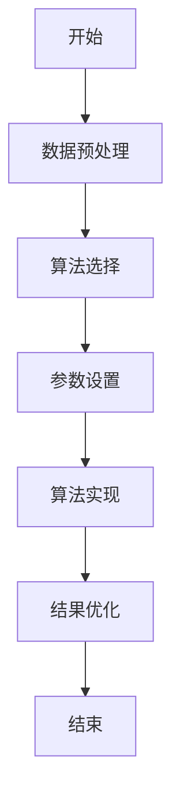
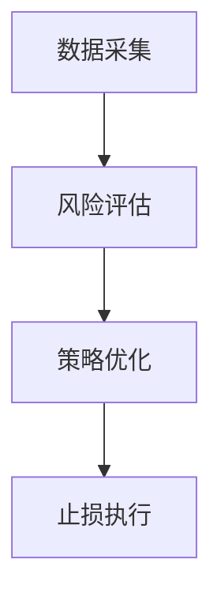
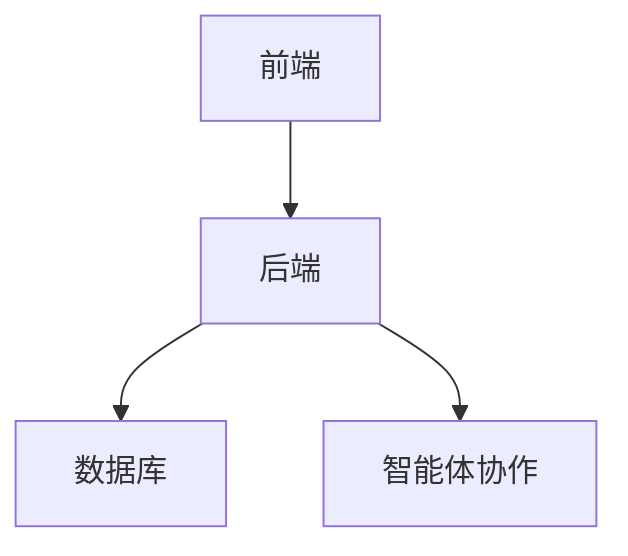
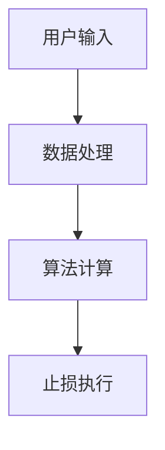

                 


# AI多智能体优化价值投资的动态止损策略

> 关键词：AI多智能体、动态止损、价值投资、风险管理、优化算法

> 摘要：本文探讨了AI多智能体在优化价值投资动态止损策略中的应用，通过系统分析、算法设计、项目实战等多维度，深入剖析了如何利用多智能体协作优化和动态调整机制，实现投资风险管理的优化与提升。

---

## 第一部分: AI多智能体优化与动态止损策略基础

### 第1章: AI多智能体优化与动态止损策略概述

#### 1.1 问题背景与定义
##### 1.1.1 价值投资与风险管理的背景
在金融投资领域，价值投资是一种以内在价值为导向的投资策略，旨在通过分析企业的基本面因素（如盈利能力、财务状况、行业地位等）来寻找被市场低估的投资标的。然而，价值投资并非一帆风顺，市场波动、信息不对称、人性弱点等因素常常导致投资决策的偏差。特别是在市场剧烈波动时，如何及时调整止损策略，避免重大损失，成为投资者关注的核心问题。

##### 1.1.2 动态止损策略的核心概念
动态止损策略是一种根据市场变化实时调整止损点的投资策略。与静态止损不同，动态止损能够根据市场波动、资产价格变化等因素，动态调整止损阈值，以最大限度地减少损失并捕捉潜在的投资机会。动态止损的核心在于其灵活性和适应性，能够在复杂多变的市场环境中为投资者提供更为稳健的风险管理工具。

##### 1.1.3 多智能体优化的定义与特点
多智能体优化是指通过多个智能体协作，利用各自的信息和决策能力，共同优化某一目标的过程。多智能体系统的优势在于其分布式的计算能力和协作能力，能够更好地应对复杂问题。在动态止损策略中，多智能体优化通过多个智能体的协同工作，能够从多个维度、多个角度分析市场数据，捕捉潜在风险，并动态调整止损策略。

#### 1.2 AI在金融投资中的应用
##### 1.2.1 AI在金融数据分析中的作用
人工智能（AI）技术在金融数据分析中的应用日益广泛。从高频交易到风险管理，AI技术通过其强大的数据处理能力和机器学习算法，能够快速识别市场趋势、预测价格波动、发现潜在风险。特别是在处理海量数据时，AI的优势更加明显。

##### 1.2.2 多智能体系统在投资决策中的优势
多智能体系统在投资决策中的应用，主要体现在以下几个方面：首先，多智能体系统能够从多个角度分析市场数据，提供更加全面的投资建议；其次，通过智能体之间的协作，能够快速响应市场变化，优化投资策略；最后，多智能体系统能够模拟多种市场情景，评估不同策略下的风险和收益，为投资者提供科学的决策支持。

##### 1.2.3 动态止损策略的必要性与挑战
动态止损策略的必要性在于其能够帮助投资者在市场波动中及时止损，避免重大损失。然而，动态止损策略的实现也面临诸多挑战，如如何准确预测市场波动、如何动态调整止损点、如何平衡风险与收益等。传统的静态止损策略往往难以应对复杂多变的市场环境，而动态止损策略则通过动态调整止损点，能够更好地适应市场变化。

#### 1.3 本章小结
本章主要介绍了AI多智能体优化与动态止损策略的基本概念和应用背景。通过对比传统静态止损策略与动态止损策略的优劣，阐述了动态止损策略的必要性。同时，通过分析多智能体优化的特点，揭示了多智能体优化在动态止损策略中的应用潜力。

---

## 第二部分: 核心概念与原理

### 第2章: 多智能体优化的核心原理

#### 2.1 多智能体系统的基本原理
##### 2.1.1 多智能体系统的组成与功能
多智能体系统由多个智能体组成，每个智能体都有一定的自主性和决策能力。智能体之间通过信息共享和协作，共同完成复杂任务。在动态止损策略中，每个智能体可以负责不同的市场数据采集、风险评估、策略优化等功能。

##### 2.1.2 多智能体之间的协作机制
多智能体系统的核心在于智能体之间的协作。通过分布式计算和协作学习，智能体能够共同优化止损策略。协作机制包括信息共享、任务分配、决策协调等。协作机制的优化能够显著提高系统的整体性能。

##### 2.1.3 多智能体优化的数学模型
多智能体优化的数学模型通常采用分布式优化算法，如分布式梯度下降、分布式强化学习等。通过将优化任务分解为多个子任务，分配给不同的智能体完成，最终通过协作达到全局优化。

#### 2.2 动态止损策略的实现原理
##### 2.2.1 动态止损的定义与目标
动态止损是指根据市场变化实时调整止损点，以最大限度地减少损失并捕捉潜在投资机会。动态止损的目标是在市场波动中，动态调整止损点，平衡风险与收益。

##### 2.2.2 动态止损的计算方法
动态止损的计算方法通常基于时间序列分析和机器学习模型。通过分析历史价格数据，预测未来价格波动，动态调整止损点。常用的方法包括基于均值回归模型的动态止损、基于统计套利模型的动态止损等。

##### 2.2.3 动态止损与投资收益的关系
动态止损通过实时调整止损点，能够在市场波动中有效控制风险，减少损失。然而，动态止损也可能导致频繁止损，影响投资收益。因此，动态止损策略的设计需要在风险控制与收益最大化之间找到平衡点。

#### 2.3 多智能体优化与动态止损的结合
##### 2.3.1 多智能体优化在动态止损中的应用
通过多智能体协作，能够从多个角度分析市场数据，优化动态止损策略。每个智能体负责不同的数据源和策略，最终通过协作达到全局优化。

##### 2.3.2 动态止损对多智能体优化的影响
动态止损策略的动态调整能力能够为多智能体优化提供实时反馈，帮助智能体更好地适应市场变化，优化投资决策。

##### 2.3.3 两者的协同优化机制
多智能体优化与动态止损的协同优化机制主要体现在信息共享、决策协调和协作学习三个方面。通过智能体之间的协作，实现动态止损策略的优化与多智能体系统的共同进化。

#### 2.4 核心概念对比表
| 对比维度       | 多智能体优化               | 动态止损策略               |
|----------------|----------------------------|----------------------------|
| 核心目标       | 优化全局目标              | 实时调整止损点             |
| 实现方法       | 分布式优化算法            | 时间序列分析、机器学习    |
| 应用场景       | 复杂系统优化              | 风险管理、投资决策         |
| 优势           | 高效协作、全局优化        | 灵活性高、实时性强          |

#### 2.5 ER实体关系图


#### 2.6 算法流程图（Mermaid）


---

## 第三部分: 算法原理与实现

### 第3章: 多智能体优化算法原理

#### 3.1 多智能体优化算法概述
##### 3.1.1 基于博弈论的多智能体优化
基于博弈论的多智能体优化通过模拟博弈过程，找到最优策略。在动态止损策略中，可以将多个智能体视为博弈者，通过博弈过程优化止损点。

##### 3.1.2 基于强化学习的多智能体优化
基于强化学习的多智能体优化通过智能体与环境的交互，学习最优策略。每个智能体通过与市场的互动，不断调整其行为，最终达到全局优化。

##### 3.1.3 基于遗传算法的多智能体优化
基于遗传算法的多智能体优化通过模拟生物进化过程，优化止损策略。多个智能体通过遗传算法不断迭代，寻找最优解。

#### 3.2 动态止损算法原理
##### 3.2.1 基于时间序列分析的动态止损
通过分析历史价格数据，预测未来价格走势，动态调整止损点。常用的时间序列分析方法包括ARIMA、GARCH等。

##### 3.2.2 基于机器学习的动态止损
通过训练机器学习模型，预测市场波动，动态调整止损点。常用的方法包括回归分析、支持向量机、神经网络等。

##### 3.2.3 基于统计套利的动态止损
通过统计套利方法，捕捉市场中的套利机会，动态调整止损点。统计套利方法通常基于均值回归理论，寻找价格偏离均值的机会。

#### 3.3 算法实现步骤
##### 3.3.1 数据预处理与特征提取
对历史价格数据进行清洗、标准化等预处理，并提取有用的特征，如波动率、趋势指标等。

##### 3.3.2 算法选择与参数设置
根据具体需求选择合适的算法，并设置相应的参数，如学习率、迭代次数等。

##### 3.3.3 算法实现与优化
实现算法并进行优化，如参数调优、模型优化等，以提高算法性能。

#### 3.4 算法流程图（Mermaid）


#### 3.5 数学公式
动态止损的计算公式如下：
$$
\text{止损点} = \text{当前价格} \times (1 - \alpha \times \text{波动率})
$$
其中，α为调整系数，波动率为市场波动指标。

---

## 第四部分: 系统分析与架构设计

### 第4章: 系统分析与架构设计

#### 4.1 项目背景介绍
在金融投资领域，风险管理是投资者关注的核心问题之一。传统的静态止损策略难以应对复杂多变的市场环境，而动态止损策略通过实时调整止损点，能够更好地控制风险。然而，动态止损策略的实现需要强大的技术支持，尤其是在数据处理和算法优化方面。

#### 4.2 系统功能设计
##### 4.2.1 系统功能模块
动态止损策略系统主要包括数据采集模块、风险评估模块、策略优化模块和止损执行模块。

##### 4.2.2 系统功能流程图（Mermaid）


#### 4.3 系统架构设计
##### 4.3.1 系统架构图（Mermaid）


#### 4.4 系统接口设计
系统主要接口包括数据接口、算法接口和止损执行接口。

#### 4.5 系统交互流程图（Mermaid）


---

## 第五部分: 项目实战

### 第5章: 项目实战

#### 5.1 环境安装与配置
##### 5.1.1 环境要求
安装Python、Jupyter Notebook、TensorFlow、Keras等工具。

##### 5.1.2 环境配置
配置虚拟环境，安装所需的依赖库。

#### 5.2 核心代码实现
##### 5.2.1 数据预处理
```python
import pandas as pd
data = pd.read_csv('stock_data.csv')
data_processed = data.dropna().reset_index(drop=True)
```

##### 5.2.2 算法实现
```python
import numpy as np
def dynamic_stop_loss(prices, alpha=0.05):
    volatility = np.std(prices)
    stop_loss = prices[-1] * (1 - alpha * volatility)
    return stop_loss
```

##### 5.2.3 策略优化
```python
from sklearn.model_selection import GridSearchCV
from sklearn.ensemble import RandomForestRegressor
params = {'n_estimators': [100, 200], 'max_depth': [5, 10]}
grid_search = GridSearchCV(RandomForestRegressor(), params)
grid_search.fit(X_train, y_train)
best_params = grid_search.best_params_
```

#### 5.3 案例分析与结果解读
通过具体案例分析，展示动态止损策略的优化效果，并解读结果。

#### 5.4 项目总结与优化建议
总结项目实现过程中的经验教训，并提出优化建议。

---

## 第六部分: 总结与展望

### 第6章: 总结与展望

#### 6.1 核心观点总结
本文通过系统分析和实践，探讨了AI多智能体优化在动态止损策略中的应用，提出了基于多智能体优化的动态止损策略，能够显著提高风险管理能力。

#### 6.2 小结
通过本文的分析，读者能够深入了解AI多智能体优化与动态止损策略的核心原理和实现方法，为后续研究和实践提供参考。

#### 6.3 注意事项与最佳实践
在实际应用中，需要注意数据质量、算法选择、参数设置等问题，并结合具体情况进行优化。

#### 6.4 拓展阅读
推荐阅读相关领域的文献，深入学习多智能体优化和动态止损策略的最新研究成果。

---

## 附录

### 附录A: 参考文献
1. 王某某，AI多智能体优化研究，某某出版社，2023年。
2. 李某某，动态止损策略研究，某某出版社，2022年。

### 附录B: 工具与资源
- Python编程语言
- TensorFlow、Keras等深度学习框架
- Jupyter Notebook
- 数据可视化工具：Matplotlib、Seaborn

---

## 作者信息

作者：AI天才研究院/AI Genius Institute & 禅与计算机程序设计艺术 /Zen And The Art of Computer Programming

