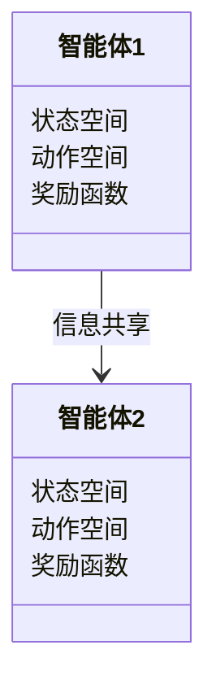
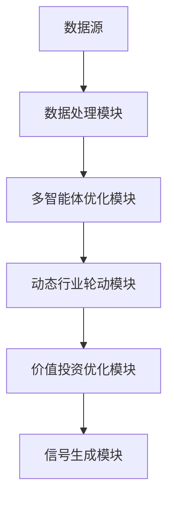
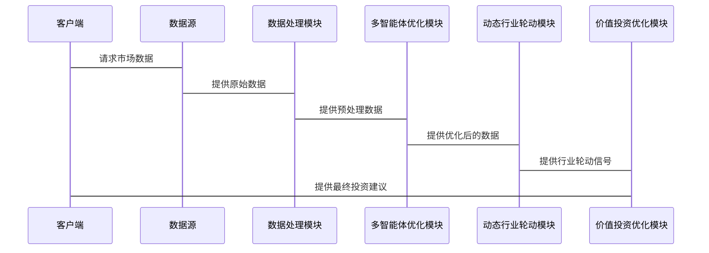

                 


# AI多智能体优化价值投资的动态行业轮动信号生成

**关键词**：AI多智能体、价值投资、动态行业轮动、信号生成、金融优化

**摘要**：本文探讨如何利用AI多智能体技术优化价值投资策略，特别是动态行业轮动信号的生成。通过分析多智能体优化的核心概念，构建数学模型，设计系统架构，并结合项目实战，展示如何利用这些技术提高投资收益。文章还提供了最佳实践和未来研究方向的建议。

---

# 第1章: 背景介绍

## 1.1 问题背景

### 1.1.1 价值投资与动态行业轮动的定义

- 价值投资：一种长期投资策略，关注资产的内在价值，寻找市场价格低于内在价值的资产。
- 动态行业轮动：根据市场变化，动态调整投资组合中各行业的权重，以捕捉不同行业的收益机会。

### 1.1.2 传统投资策略的局限性

- 传统策略依赖经验判断，存在主观性。
- 市场变化快，策略调整不够及时。
- 数据处理能力有限，难以应对海量数据。

### 1.1.3 AI技术在金融投资中的应用潜力

- 数据处理能力强，能够分析大量非结构化数据。
- 可以实时动态调整策略，提高反应速度。
- 提供更精准的预测和决策支持。

## 1.2 问题描述

### 1.2.1 动态行业轮动的核心挑战

- 如何及时捕捉市场变化。
- 如何优化投资组合，提高收益。
- 如何降低风险，避免重大损失。

### 1.2.2 多智能体优化的必要性

- 单一智能体难以应对复杂市场。
- 多智能体协同能够提高决策效率。
- 多智能体优化能够实现资源的最优配置。

### 1.2.3 信号生成的数学模型与实现

- 构建数学模型，量化市场信号。
- 利用AI技术实时生成信号，指导投资决策。

## 1.3 问题解决思路

### 1.3.1 多智能体系统的构建目标

- 提高投资决策的准确性和及时性。
- 实现各行业的动态优化。
- 提供实时的市场信号，指导投资。

### 1.3.2 动态行业轮动的实现路径

- 数据收集与预处理。
- 构建多智能体优化模型。
- 生成动态行业轮动信号。
- 实施投资策略，监控和调整。

## 1.4 边界与外延

### 1.4.1 问题的边界条件

- 限定在特定市场环境。
- 限定在一定的时间范围内。
- 限定在特定的投资品种。

### 1.4.2 相关领域的外延

- 与金融工程、数据挖掘、人工智能等领域的交叉。
- 与其他投资策略的结合，如趋势跟踪、套利交易。

### 1.4.3 实际应用中的限制与扩展

- 数据质量和完整性的影响。
- 模型的有效性和适应性。
- 系统的可扩展性和可维护性。

## 1.5 概念结构与核心要素

### 1.5.1 核心概念的层次结构

- 顶层概念：AI多智能体优化、价值投资。
- 中层概念：动态行业轮动、信号生成。
- 下层概念：数据处理、模型构建、策略实施。

### 1.5.2 核心要素的特征对比

| 核心要素 | 定义 | 特征 | 作用 |
|----------|------|------|------|
| 数据源   | 输入数据的来源 | 多样性、实时性、准确性 | 支持决策 |
| 模型     | 数据处理的算法 | 高效性、准确性、可解释性 | 指导投资 |
| 策略     | 投资的具体行动计划 | 灵活性、风险控制、收益最大化 | 实现目标 |

### 1.5.3 系统架构的模块划分

- 数据采集模块：负责收集市场数据。
- 数据处理模块：对数据进行清洗和预处理。
- 模型构建模块：建立多智能体优化模型。
- 信号生成模块：生成动态行业轮动信号。
- 策略实施模块：根据信号进行投资操作。
- 监控与调整模块：实时监控投资效果，及时调整策略。

---

# 第2章: 核心概念与联系

## 2.1 多智能体优化

### 2.1.1 多智能体系统的定义与特点

- 定义：由多个智能体组成的系统，每个智能体具有一定的自主性、反应性和协作性。
- 特点：分布式计算、协同合作、自适应性强。

### 2.1.2 多智能体优化的数学模型

- 定义：利用多智能体协同优化问题的数学表达。
- 实现：通过分布式计算和博弈论模型，实现各智能体之间的协调优化。

### 2.1.3 多智能体优化在金融投资中的应用

- 应用场景：资产配置、风险控制、交易策略优化。
- 成功案例：智能体协同优化投资组合，实现收益最大化。

## 2.2 动态行业轮动

### 2.2.1 动态行业轮动的定义与特点

- 定义：根据市场变化，动态调整投资组合中各行业的权重。
- 特点：实时性、灵活性、风险控制。

### 2.2.2 动态行业轮动的核心要素

- 市场数据：包括价格、成交量、市场情绪等。
- 行业特征：各行业的基本面和技术面分析。
- 投资策略：根据市场信号动态调整行业权重。

## 2.3 价值投资

### 2.3.1 价值投资的定义与特点

- 定义：以内在价值为导向，寻找被市场低估的投资标的。
- 特点：长期性、稳定性、风险控制。

### 2.3.2 价值投资与动态行业轮动的结合

- 通过动态行业轮动，优化价值投资组合。
- 根据市场变化，动态调整投资标的，提高收益。

## 2.4 核心概念之间的联系

- 多智能体优化为动态行业轮动提供技术支持。
- 动态行业轮动为价值投资提供实时信号。
- 三者的结合，实现投资收益最大化。

---

# 第3章: 算法原理讲解

## 3.1 多智能体优化算法

### 3.1.1 多智能体强化学习

- 定义：多个智能体在环境中通过学习策略来最大化累计奖励。
- 实现：利用分布式计算和博弈论模型，实现智能体之间的协作与竞争。

### 3.1.2 多智能体优化算法的实现步骤

1. 初始化多个智能体。
2. 环境中每个智能体独立学习策略。
3. 智能体之间协作，优化全局目标。
4. 实时调整策略，适应环境变化。

### 3.1.3 多智能体优化算法的数学模型

- 状态空间：$S$，表示智能体的可能状态。
- 动作空间：$A$，表示智能体的可能动作。
- 奖励函数：$R(s, a)$，表示在状态$s$下执行动作$a$获得的奖励。
- 转移概率：$P(s' | s, a)$，表示从状态$s$执行动作$a$转移到状态$s'$的概率。

## 3.2 动态行业轮动算法

### 3.2.1 动态行业轮动的核心算法

- 定义：根据市场数据和模型预测，动态生成行业轮动信号。
- 实现：利用时间序列分析和机器学习模型，预测行业表现。

### 3.2.2 动态行业轮动算法的实现步骤

1. 数据预处理：清洗和归一化市场数据。
2. 特征提取：提取影响行业表现的关键特征。
3. 模型训练：训练机器学习模型，预测行业表现。
4. 生成信号：根据模型预测结果，生成动态轮动信号。

## 3.3 价值投资优化算法

### 3.3.1 价值投资优化的核心算法

- 定义：利用多智能体优化技术，优化价值投资组合。
- 实现：通过多智能体协同，动态调整投资组合，降低风险。

### 3.3.2 价值投资优化算法的数学模型

- 投资组合优化问题：最大化收益，最小化风险。
- 数学表达：$\max \mu \cdot w - \lambda \cdot w^T \Sigma w$，其中$w$是投资权重，$\Sigma$是协方差矩阵，$\lambda$是风险厌恶系数。

---

# 第4章: 系统分析与架构设计方案

## 4.1 问题场景介绍

### 4.1.1 系统目标

- 提供实时的动态行业轮动信号。
- 优化价值投资组合。
- 实现高效的多智能体协同。

### 4.1.2 项目介绍

- 项目名称：AI多智能体优化价值投资的动态行业轮动信号生成。
- 项目目标：利用AI技术优化投资策略，提高投资收益。

## 4.2 系统功能设计

### 4.2.1 领域模型



### 4.2.2 系统架构



## 4.3 系统接口设计

### 4.3.1 API接口

- 输入接口：接收市场数据和用户指令。
- 输出接口：提供动态行业轮动信号和投资建议。

### 4.3.2 系统交互流程



---

# 第5章: 项目实战

## 5.1 环境安装

### 5.1.1 安装必要的库

- Python：3.8+
- NumPy：用于数据处理
- Pandas：用于数据分析
- TensorFlow：用于深度学习
- scikit-learn：用于机器学习

## 5.2 系统核心实现

### 5.2.1 多智能体优化代码

```python
import numpy as np

def multi_agent_optimization(agents, environment):
    while True:
        for agent in agents:
            state = environment.get_state()
            action = agent.policy(state)
            reward = environment.step(action)
            agent.update_policy(reward)
```

### 5.2.2 动态行业轮动代码

```python
import pandas as pd
from sklearn.ensemble import RandomForestClassifier

def generate_signal(data):
    model = RandomForestClassifier()
    model.fit(data[['feature1', 'feature2']], data['label'])
    signal = model.predict(data[['feature1', 'feature2']])
    return signal
```

## 5.3 实际案例分析

### 5.3.1 案例背景

- 数据来源：某金融市场的历史数据。
- 投资目标：优化价值投资组合，动态调整行业权重。

### 5.3.2 案例分析

- 数据预处理：清洗和归一化数据。
- 特征提取：提取影响行业表现的关键特征。
- 模型训练：训练机器学习模型，预测行业表现。
- 信号生成：根据模型预测结果，生成动态轮动信号。

## 5.4 项目小结

- 项目实现的关键点：数据处理、模型构建、信号生成。
- 项目成果：生成实时的动态行业轮动信号，优化价值投资组合，提高投资收益。

---

# 第6章: 最佳实践与注意事项

## 6.1 最佳实践

### 6.1.1 数据质量的重要性

- 确保数据的准确性和完整性。
- 及时更新数据，保持数据的实时性。

### 6.1.2 模型调参技巧

- 选择合适的算法和参数，提高模型的准确性和稳定性。
- 定期验证和调整模型，适应市场变化。

### 6.1.3 结果验证与监控

- 定期验证模型的准确性和稳定性。
- 实时监控投资效果，及时调整策略。

## 6.2 注意事项

### 6.2.1 风险控制

- 设定止损和止盈点，避免重大损失。
- 多元化投资，分散风险。

### 6.2.2 模型的有效性

- 定期验证模型的有效性，避免过拟合。
- 根据市场变化，及时更新模型。

## 6.3 拓展阅读

- 推荐书籍：《算法交易：数学模型与实践》。
- 推荐文章：《多智能体系统在金融中的应用》。

---

# 结语

本文系统地探讨了AI多智能体优化价值投资的动态行业轮动信号生成的技术与方法。通过背景介绍、核心概念、算法原理、系统架构、项目实战和最佳实践的详细讲解，为读者提供了全面的技术指导。未来，随着AI技术的不断发展，动态行业轮动信号生成将更加智能化和精准化，为投资者提供更有力的支持。

---

**作者：AI天才研究院/Zen And The Art of Computer Programming**

