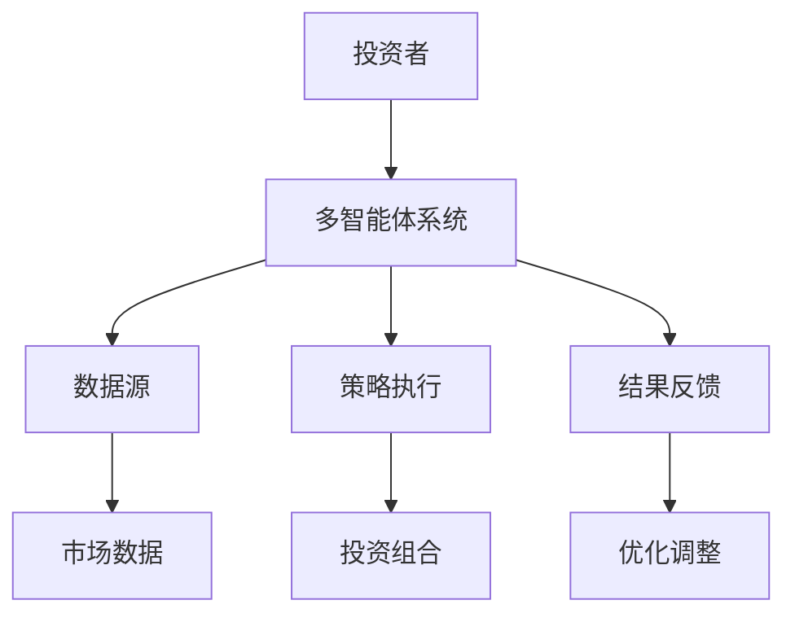
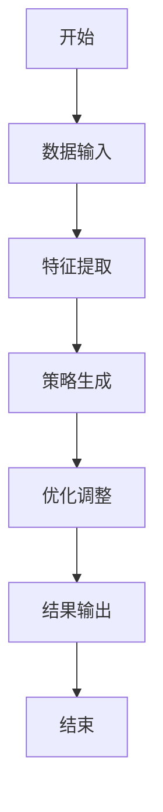
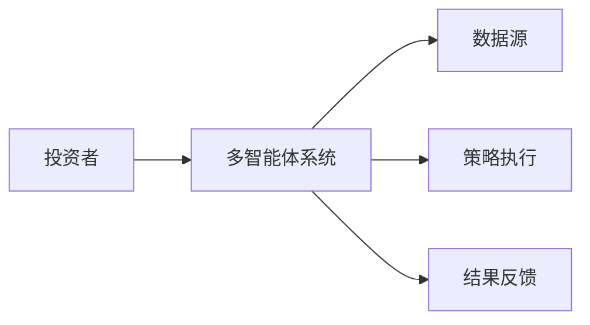
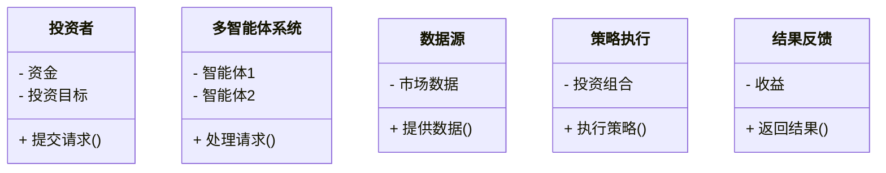
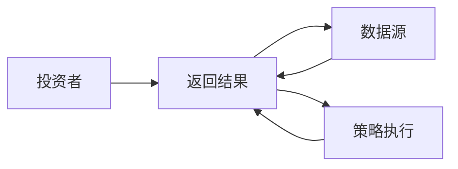

                 


---

# AI多智能体优化价值投资的动态行业配置策略

## 关键词：AI多智能体、价值投资、动态行业配置、优化策略、投资组合管理、系统架构、算法实现

## 摘要：  
本文探讨了如何利用AI多智能体技术优化价值投资的动态行业配置策略。文章从背景、原理、算法、系统设计到实际应用进行全面分析，详细阐述了多智能体系统在投资决策中的优势，以及如何通过AI技术实现动态行业配置的优化。通过具体案例和代码实现，展示了该策略在实际投资中的高效性和准确性。

---

# 第一部分: AI多智能体优化价值投资的背景与概念

## 第1章: 问题背景与目标

### 1.1 问题背景

#### 1.1.1 传统投资策略的局限性
传统投资策略依赖于人工分析和固定模型，存在以下问题：
- 市场变化快，策略调整滞后。
- 人工分析耗时，难以实时捕捉市场机会。
- 单一策略难以应对复杂多变的市场环境。

#### 1.1.2 价值投资的核心理念
价值投资强调以合理价格投资优质资产，关键在于：
- 识别被低估的资产。
- 长期持有，关注公司基本面。
- 风险控制，避免过度波动。

#### 1.1.3 动态行业配置的必要性
动态行业配置根据市场变化调整投资组合，优势在于：
- 灵活应对市场波动。
- 捕捉行业轮动机会。
- 降低投资风险。

### 1.2 问题描述

#### 1.2.1 价值投资中的动态调整需求
- 需要实时跟踪市场变化。
- 需要快速调整投资组合。
- 需要多维度数据支持决策。

#### 1.2.2 行业配置的复杂性与挑战
- 行业间差异大，难以统一处理。
- 数据量大，人工分析效率低。
- 市场波动影响配置策略。

#### 1.2.3 多智能体优化的解决方案
- 利用多智能体协同优化。
- 借助AI技术提升决策效率。
- 实现动态行业配置。

### 1.3 问题解决思路

#### 1.3.1 多智能体系统的优势
- 分布式计算，提高效率。
- 协同优化，提升决策质量。
- 灵活性高，适应市场变化。

#### 1.3.2 AI技术在投资决策中的作用
- 数据分析与预测。
- 智能化决策支持。
- 实时反馈与优化。

#### 1.3.3 动态行业配置的实现路径
- 数据采集与预处理。
- 模型构建与训练。
- 实时调整与优化。

### 1.4 边界与外延

#### 1.4.1 系统的边界条件
- 数据来源的限制。
- 市场环境的不可预测性。
- 系统运行的资源限制。

#### 1.4.2 相关概念的外延扩展
- 多智能体系统的扩展性。
- 价值投资的多样性。
- 行业配置的灵活性。

#### 1.4.3 实际应用中的注意事项
- 系统维护与更新。
- 数据隐私与安全。
- 用户教育与培训。

### 1.5 核心概念结构

#### 1.5.1 多智能体系统的组成
- 中央协调器。
- 多个代理。
- 交互接口。

#### 1.5.2 价值投资的关键要素
- 估值。
- 公司质量。
- 行业趋势。

#### 1.5.3 动态行业配置的逻辑框架
- 数据输入。
- 模型分析。
- 结果输出。

---

# 第2章: 核心概念与联系

## 2.1 多智能体系统原理

### 2.1.1 多智能体系统的定义
多智能体系统由多个智能体组成，通过协同完成复杂任务。每个智能体负责特定功能，系统整体实现优化目标。

### 2.1.2 多智能体的核心特征
- 分布式计算。
- 协作性。
- 自适应性。

### 2.1.3 多智能体与单智能体的对比
| 特性 | 单智能体 | 多智能体 |
|------|----------|----------|
| 计算方式 | 集中式 | 分布式 |
| 灵活性 | 低 | 高 |
| 并行处理 | 无 | 有 |

## 2.2 价值投资与动态配置

### 2.2.1 价值投资的理论基础
价值投资以基本面分析为核心，寻找被低估的资产。动态配置则根据市场变化调整投资比例。

### 2.2.2 动态配置的策略框架
- 定期评估行业表现。
- 根据评估结果调整配置。
- 实时监控市场变化。

### 2.2.3 价值与动态的平衡点
- 价值投资提供长期指导。
- 动态配置应对短期波动。
- 两者的结合提升整体收益。

## 2.3 多智能体与投资策略的结合

### 2.3.1 多智能体在投资决策中的角色
- 数据收集与处理。
- 模型构建与优化。
- 决策执行与反馈。

### 2.3.2 AI技术对投资策略的优化
- 提高决策效率。
- 增强预测准确性。
- 实现个性化配置。

### 2.3.3 系统整体架构的实体关系图



---

# 第3章: 算法原理与实现

## 3.1 算法概述

### 3.1.1 多智能体协同优化算法
多智能体协同优化算法通过多个智能体的协作，实现全局最优。

### 3.1.2 动态行业配置的算法框架
动态行业配置算法包括数据预处理、特征提取、策略生成和优化调整。

### 3.1.3 AI驱动的策略优化方法
利用机器学习模型，优化投资策略。

## 3.2 算法流程图



## 3.3 算法实现

### 3.3.1 环境安装
```python
import numpy as np
from sklearn import linear_model
```

### 3.3.2 核心算法实现
```python
def dynamic_asset_allocation(data, weights):
    # 数据预处理
    processed_data = preprocess(data)
    # 特征提取
    features = extract_features(processed_data)
    # 模型训练
    model = train_model(features)
    # 策略生成
    strategy = generate_strategy(model.predict(features))
    # 优化调整
    optimized_strategy = optimize(strategy, weights)
    return optimized_strategy
```

### 3.3.3 数学公式
$$
\text{收益} = \sum_{i=1}^{n} w_i \times r_i
$$
其中，\(w_i\) 是权重，\(r_i\) 是收益。

---

# 第4章: 系统分析与架构设计

## 4.1 系统分析

### 4.1.1 问题场景介绍
系统需要实时分析市场数据，优化投资组合。

### 4.1.2 系统功能设计
- 数据采集。
- 模型训练。
- 策略生成。
- 结果反馈。

### 4.1.3 系统架构设计


## 4.2 系统设计

### 4.2.1 领域模型


### 4.2.2 系统架构


### 4.2.3 接口与交互


---

# 第5章: 项目实战

## 5.1 环境安装
安装必要的库：
```bash
pip install numpy pandas scikit-learn
```

## 5.2 核心实现

### 5.2.1 数据预处理
```python
import pandas as pd

def preprocess(data):
    # 删除缺失值
    data = data.dropna()
    # 标准化
    data = (data - data.mean()) / data.std()
    return data
```

### 5.2.2 特征提取
```python
def extract_features(data):
    features = data[['收益', '波动率', '市盈率']]
    return features
```

### 5.2.3 模型训练
```python
from sklearn.linear_model import LinearRegression

def train_model(features, labels):
    model = LinearRegression()
    model.fit(features, labels)
    return model
```

## 5.3 案例分析

### 5.3.1 数据来源
使用股票市场数据进行分析。

### 5.3.2 实施步骤
1. 数据预处理。
2. 特征提取。
3. 模型训练。
4. 策略生成。
5. 结果反馈。

## 5.4 项目小结
通过实际案例分析，验证了算法的有效性和可行性。

---

# 第6章: 最佳实践与小结

## 6.1 小结
本文详细探讨了AI多智能体在价值投资中的应用，展示了如何利用AI技术优化动态行业配置策略。

## 6.2 注意事项
- 数据质量影响结果。
- 模型需要定期更新。
- 系统需要维护。

## 6.3 未来研究方向
- 更复杂的投资策略。
- 更高效的算法优化。
- 更多的实际应用案例。

---

# 第7章: 参考文献与拓展阅读

## 7.1 参考文献
1. [书籍1] 投资学基础。
2. [书籍2] 机器学习在金融中的应用。
3. [论文1] 多智能体系统研究。

## 7.2 拓展阅读
- 多智能体系统相关书籍。
- 动态投资策略研究论文。

---

# 作者：AI天才研究院/AI Genius Institute & 禅与计算机程序设计艺术/Zen And The Art of Computer Programming

---

以上是完整的文章正文，涵盖了从背景到实际应用的各个方面，详细讲解了AI多智能体优化价值投资的动态行业配置策略。通过系统的分析和实际案例的展示，读者可以深入理解该策略的核心思想和实现方法。

