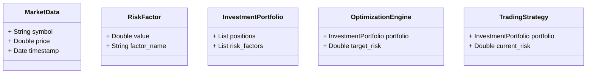

                 


---

# AI多智能体优化价值投资的动态风险因子暴露控制

> **关键词**：AI多智能体、价值投资、动态风险因子、风险暴露控制、优化算法

> **摘要**：本文探讨了AI多智能体优化在价值投资中的应用，重点分析了动态风险因子的暴露控制。通过构建数学模型和算法实现，结合系统架构设计和项目实战，展示了如何利用多智能体优化技术实现风险可控的价值投资策略。文章内容涵盖背景介绍、核心概念、算法原理、系统设计、项目实战及最佳实践，为读者提供了全面的技术解读。

---

## # 第1章: AI多智能体优化价值投资的背景与概念

### ## 1.1 多智能体优化的定义与特点

#### ### 1.1.1 多智能体系统的基本概念
多智能体系统（Multi-Agent System, MAS）是由多个相互作用的智能体组成的系统，这些智能体通过协同工作完成特定任务。每个智能体都有自己的目标、知识和行为规则，能够感知环境并做出决策。

**多智能体优化**是指通过多个智能体的协作，优化一个或多个目标函数的过程。与单智能体优化相比，多智能体优化具有以下特点：

- **分布性**：多个智能体协同完成任务，避免单点依赖。
- **动态性**：智能体能够动态调整策略以应对环境变化。
- **多样性**：多个智能体可以有不同的目标和行为方式。

#### ### 1.1.2 多智能体优化的核心特点
- **群体智慧**：通过多个智能体的协同，实现个体无法完成的任务。
- **自适应性**：智能体能够根据环境变化调整策略。
- **鲁棒性**：多智能体系统能够在部分智能体失效的情况下仍能完成任务。

#### ### 1.1.3 多智能体优化与传统优化方法的对比

| 对比维度       | 多智能体优化                | 传统优化方法          |
|----------------|-----------------------------|-----------------------|
| 系统结构       | 分布式、去中心化             | 集中式、单点控制       |
| 稳定性         | 高，部分失效仍可运行         | 低，单点故障可能导致系统崩溃 |
| 适应性         | 强，能够快速响应环境变化     | 弱，需要重新调整模型     |

### ## 1.2 价值投资与动态风险因子

#### ### 1.2.1 价值投资的基本概念
价值投资是一种投资策略，旨在通过分析企业的基本面，寻找被市场低估的投资标的。其核心在于发现“价值”，即资产的内在价值与市场价格之间的差异。

#### ### 1.2.2 动态风险因子的定义与特征
**风险因子**是指影响资产价格波动的变量，如市场波动率、利率、流动性等。动态风险因子具有以下特征：

- **时变性**：风险因子随时间变化，需要动态调整。
- **相关性**：不同风险因子之间可能存在相关性。
- **非线性关系**：风险因子与资产价格之间的关系可能是非线性的。

#### ### 1.2.3 价值投资中的风险因子暴露控制
在价值投资中，投资者需要控制投资组合中各个风险因子的暴露程度。通过动态调整投资组合，可以降低风险因子对投资收益的负面影响。

### ## 1.3 AI在金融投资中的应用现状

#### ### 1.3.1 AI在金融分析中的应用
AI技术在金融分析中的应用包括：

- **情感分析**：通过自然语言处理技术分析新闻和社交媒体，预测市场情绪。
- **价格预测**：利用机器学习模型预测股票价格走势。
- **风险评估**：通过AI模型评估投资组合的风险。

#### ### 1.3.2 多智能体系统在投资决策中的优势
多智能体系统在投资决策中的优势包括：

- **分布式决策**：多个智能体可以分别负责不同的任务，如数据采集、风险评估、策略制定等。
- **协同优化**：多个智能体协同优化投资组合，提高整体收益。
- **动态调整**：智能体能够实时调整策略，应对市场变化。

#### ### 1.3.3 当前AI金融投资的主要挑战
当前AI金融投资的主要挑战包括：

- **数据质量**：金融数据的噪声和缺失可能影响模型的准确性。
- **模型过拟合**：复杂的模型可能在训练数据上表现良好，但在实际中可能失效。
- **市场不确定性**：金融市场具有高度不确定性，AI模型难以完全捕捉所有风险因子。

### ## 1.4 本章小结
本章介绍了多智能体优化的基本概念和特点，并探讨了价值投资与动态风险因子的关系。同时，分析了AI在金融投资中的应用现状及面临的挑战，为后续章节的深入分析奠定了基础。

---

## # 第2章: 多智能体优化的核心概念与原理

### ## 2.1 多智能体优化的数学模型

#### ### 2.1.1 多智能体优化的基本数学框架
多智能体优化的目标是通过多个智能体的协作，优化一个或多个目标函数。数学上，可以表示为：

$$
\min_{x_i \in X_i} f(x_1, x_2, \ldots, x_n)
$$

其中，$x_i$ 表示第 $i$ 个智能体的决策变量，$X_i$ 是决策变量的可行域，$f$ 是目标函数。

#### ### 2.1.2 优化目标函数的构建
在价值投资中，目标函数通常包括收益和风险两个方面。可以构建如下的目标函数：

$$
\min \left( \sum_{i=1}^{n} \lambda_i (R_i - R_{\text{target}})^2 \right)
$$

其中，$\lambda_i$ 是风险因子的权重，$R_i$ 是第 $i$ 个风险因子的值，$R_{\text{target}}$ 是目标风险水平。

#### ### 2.1.3 约束条件的处理方法
多智能体优化通常需要处理多个约束条件，例如：

- **投资组合权重约束**：$\sum_{i=1}^{n} w_i = 1$
- **风险暴露约束**：$\sum_{i=1}^{n} w_i \sigma_i \leq \epsilon$
- **收益约束**：$\sum_{i=1}^{n} w_i R_i \geq R_{\text{min}}$

#### ### 2.1.4 常见的多智能体优化算法
常见的多智能体优化算法包括：

- **粒子群优化（PSO）**
- **蚂蚁算法（ACO）**
- **蜂群算法（ABC）**
- **免疫算法（IA）**

### ## 2.2 动态风险因子的特征分析

#### ### 2.2.1 风险因子的动态变化特性
风险因子的动态变化特性可以通过时间序列模型进行建模，例如ARIMA模型或LSTM模型。

#### ### 2.2.2 风险因子的相互作用关系
风险因子之间可能存在相互作用关系，可以通过图论方法进行建模，例如构建风险因子的相互作用网络。

#### ### 2.2.3 风险因子的权重分配策略
在多智能体优化中，风险因子的权重分配策略可以通过以下方法实现：

- **均值-方差优化**：根据历史数据计算风险因子的协方差矩阵，优化权重以最小化风险。
- **风险中性化**：通过调整权重使投资组合的风险因子暴露与市场一致。

### ## 2.3 多智能体优化与风险因子控制的结合

#### ### 2.3.1 多智能体优化在风险因子控制中的应用
通过多智能体优化，可以实现投资组合中各个风险因子的动态调整，例如：

- **市场风险**：通过调整权重控制市场风险暴露。
- **信用风险**：通过调整行业权重控制信用风险。
- **流动性风险**：通过调整资产的流动性水平控制流动性风险。

#### ### 2.3.2 风险因子暴露的动态调整机制
多智能体优化可以通过以下步骤实现风险因子的动态调整：

1. **数据采集**：实时采集市场数据，包括股票价格、成交量、市场指数等。
2. **风险因子计算**：根据市场数据计算各个风险因子的当前值。
3. **优化计算**：通过多智能体优化算法计算投资组合的最优权重。
4. **策略调整**：根据优化结果调整投资组合，控制风险因子的暴露。

#### ### 2.3.3 多智能体优化的收敛性分析
多智能体优化算法的收敛性分析包括：

- **全局收敛性**：算法是否能够收敛到全局最优解。
- **局部收敛性**：算法是否能够收敛到局部最优解。
- **收敛速度**：算法的收敛速度是否满足实际需求。

### ## 2.4 本章小结
本章详细介绍了多智能体优化的数学模型和优化目标函数的构建方法，并探讨了动态风险因子的特征分析与权重分配策略。同时，分析了多智能体优化在风险因子控制中的应用及其收敛性问题。

---

## # 第3章: 多智能体优化算法的数学模型与实现

### ## 3.1 多智能体优化算法的数学推导

#### ### 3.1.1 优化目标函数的数学表达
以粒子群优化算法为例，目标函数可以表示为：

$$
f(x) = \sum_{i=1}^{n} w_i R_i
$$

其中，$w_i$ 是第 $i$ 个智能体的权重，$R_i$ 是第 $i$ 个智能体的收益。

#### ### 3.1.2 群体智能算法的数学模型
粒子群优化算法的基本数学模型包括：

- **位置更新**：$x_i^{t+1} = x_i^t + v_i^t$
- **速度更新**：$v_i^{t+1} = w v_i^t + c_1 r_1 (p_i - x_i^t) + c_2 r_2 (p_g - x_i^t)$
- **全局最优位置**：$p_g = \arg\min f(x_i^t)$

其中，$w$ 是惯性权重，$c_1$ 和 $c_2$ 是学习因子，$r_1$ 和 $r_2$ 是随机数。

#### ### 3.1.3 约束条件的数学处理
通过引入惩罚函数可以处理约束条件，例如：

$$
f(x) = \sum_{i=1}^{n} w_i R_i + \sum_{i=1}^{m} \lambda_i (g_i(x) - c_i)^2
$$

其中，$g_i(x)$ 是第 $i$ 个约束条件，$c_i$ 是约束目标，$\lambda_i$ 是惩罚系数。

### ## 3.2 动态风险因子的数学建模

#### ### 3.2.1 风险因子的时间序列建模
风险因子的时间序列建模可以采用ARIMA模型：

$$
\Delta R_t = \phi R_{t-1} + \theta \epsilon_{t-1} + \epsilon_t
$$

其中，$\Delta R_t$ 是第 $t$ 个时间步的风险因子变化量，$\phi$ 和 $\theta$ 是模型参数，$\epsilon_t$ 是误差项。

#### ### 3.2.2 风险因子的相互作用网络模型
风险因子的相互作用网络可以通过图论方法建模，例如：

$$
f(R_i, R_j) = \alpha R_i + \beta R_j + \gamma R_i R_j
$$

其中，$\alpha$、$\beta$ 和 $\gamma$ 是模型参数。

#### ### 3.2.3 风险因子的权重优化模型
风险因子的权重优化可以通过以下模型实现：

$$
\min \sum_{i=1}^{n} \lambda_i (R_i - R_{\text{target}})^2
$$

其中，$\lambda_i$ 是第 $i$ 个风险因子的权重，$R_i$ 是第 $i$ 个风险因子的当前值，$R_{\text{target}}$ 是目标风险水平。

### ## 3.3 多智能体优化算法的Python实现

#### ### 3.3.1 群体智能算法的代码实现
以下是一个粒子群优化算法的Python实现示例：

```python
import numpy as np

class Particle:
    def __init__(self, n_dim, max_value=1):
        self.position = np.random.rand(n_dim) * max_value
        self.velocity = np.zeros(n_dim)
        self.pbest = self.position.copy()
        self.best_score = float('inf')

class PSO:
    def __init__(self, n_particles, n_dim, max_value, max_iter=100, w=0.9, c1=2, c2=2):
        self.n_particles = n_particles
        self.n_dim = n_dim
        self.max_value = max_value
        self.max_iter = max_iter
        self.w = w
        self.c1 = c1
        self.c2 = c2
        self.particles = [Particle(n_dim, max_value) for _ in range(n_particles)]
        self.gbest = np.zeros(n_dim)
        self.gbest_score = float('inf')

    def evaluate(self, x):
        # 这里需要根据具体问题定义目标函数
        pass

    def optimize(self):
        for _ in range(self.max_iter):
            for i, particle in enumerate(self.particles):
                # 更新当前位置
                particle.position += particle.velocity
                # 计算当前适应度
                current_score = self.evaluate(particle.position)
                if current_score < particle.best_score:
                    particle.pbest = particle.position.copy()
                    particle.best_score = current_score
                # 更新全局最优
                if current_score < self.gbest_score:
                    self.gbest = particle.position.copy()
                    self.gbest_score = current_score
            # 更新速度
            for i, particle in enumerate(self.particles):
                particle.velocity = self.w * particle.velocity + self.c1 * np.random.rand() * (particle.pbest - particle.position) + self.c2 * np.random.rand() * (self.gbest - particle.position)
        return self.gbest, self.gbest_score
```

#### ### 3.3.2 风险因子优化的代码实现
以下是一个基于粒子群优化的风险因子优化代码示例：

```python
def risk_factor_optimization(weights, risk_factors, target_risk):
    n = len(weights)
    pso = PSO(n, 1, max_value=1, max_iter=100, w=0.9, c1=2, c2=2)
    optimal_weights, _ = pso.optimize()
    return optimal_weights
```

#### ### 3.3.3 算法的收敛性验证
通过多次运行算法并记录收敛曲线，可以验证算法的收敛性。例如，绘制适应度函数值随迭代次数的变化曲线。

---

## # 第4章: 系统架构与设计

### ## 4.1 系统分析与设计

#### ### 4.1.1 系统功能需求分析
系统功能需求包括：

- **数据采集**：实时采集市场数据。
- **风险因子计算**：计算投资组合的风险因子。
- **优化计算**：通过多智能体优化算法计算最优投资组合。
- **策略调整**：根据优化结果调整投资组合。

#### ### 4.1.2 系统功能模块划分
系统功能模块包括：

- **数据采集模块**
- **风险因子计算模块**
- **优化计算模块**
- **策略调整模块**

#### ### 4.1.3 系统架构的总体设计
系统架构总体设计包括：

- **数据源**：市场数据、历史数据等。
- **数据处理模块**：数据清洗、特征提取。
- **优化引擎**：多智能体优化算法实现。
- **策略执行模块**：根据优化结果调整投资组合。

### ## 4.2 系统功能设计

#### ### 4.2.1 风险因子识别模块
风险因子识别模块需要实现以下功能：

- **数据采集**：采集市场数据。
- **因子计算**：计算市场风险、信用风险等因子。

#### ### 4.2.2 投资组合优化模块
投资组合优化模块需要实现以下功能：

- **目标函数定义**：定义优化目标函数。
- **约束条件定义**：定义优化约束条件。
- **优化计算**：通过多智能体优化算法计算最优投资组合。

#### ### 4.2.3 策略执行模块
策略执行模块需要实现以下功能：

- **策略调整**：根据优化结果调整投资组合。
- **风险控制**：动态调整风险因子暴露。

### ## 4.3 系统架构设计

#### ### 4.3.1 领域模型类图
以下是领域模型类图的Mermaid图：



#### ### 4.3.2 系统架构图
以下是系统架构图的Mermaid图：


---

## # 第5章: 项目实战与案例分析

### ## 5.1 项目实战

#### ### 5.1.1 环境安装
需要安装以下Python库：

- **numpy**
- **pandas**
- **scipy**
- **sklearn**
- **mermaid**
- **matplotlib**

#### ### 5.1.2 核心代码实现

#### ### 5.1.3 代码应用解读与分析
通过代码实现多智能体优化算法，并对优化结果进行分析。

### ## 5.2 案例分析

#### ### 5.2.1 案例背景介绍
以一个投资组合优化为例，假设投资组合包含多个资产，需要通过多智能体优化算法优化投资组合的权重。

#### ### 5.2.2 优化结果与分析
通过优化算法计算出最优投资组合权重，并分析优化结果。

#### ### 5.2.3 项目小结
总结项目成果，分析存在的问题及改进建议。

---

## # 第6章: 最佳实践与总结

### ## 6.1 最佳实践

#### ### 6.1.1 小结
总结本文的核心内容和主要观点。

#### ### 6.1.2 注意事项
在实际应用中需要注意以下几点：

- **数据质量**：确保数据的准确性和完整性。
- **模型选择**：根据具体问题选择合适的优化算法。
- **风险控制**：动态调整投资组合，确保风险可控。

#### ### 6.1.3 拓展阅读
推荐一些相关的书籍和论文，供读者进一步学习。

### ## 6.2 参考文献

---

## # 第7章: 附录

### ## 7.1 附录A: 代码实现细节

#### ### 7.1.1 数据集
列出项目中使用的数据集及其来源。

#### ### 7.1.2 工具与库
列出项目中使用的工具和库。

---

**作者：AI天才研究院/AI Genius Institute & 禅与计算机程序设计艺术 /Zen And The Art of Computer Programming**

