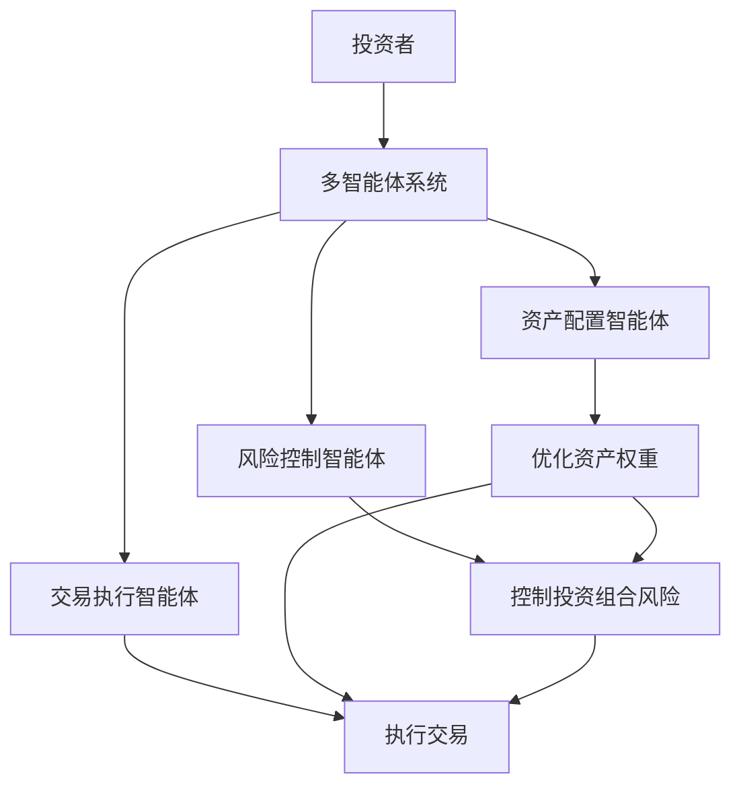

                 

# AI多智能体优化价值投资的动态风险平价策略

> **关键词**：AI多智能体、价值投资、动态风险平价、优化策略、金融系统、投资组合  
> **摘要**：本文结合人工智能技术与多智能体优化方法，提出一种动态风险平价策略，用于优化价值投资中的风险管理和资产配置。通过分析多智能体系统的核心原理和动态风险平价的数学模型，设计并实现了一个基于多智能体优化的动态风险平价系统，展示了其在金融投资中的实际应用和优势。

---

## 第1章: 问题背景与核心概念

### 1.1 问题背景

#### 1.1.1 价值投资与风险平价的定义
价值投资是一种长期投资策略，强调通过分析企业的基本面，寻找具有持续竞争优势和良好治理结构的企业进行投资。其核心在于“买入并持有”，追求长期稳定的收益。  
风险平价是一种资产配置方法，旨在通过调整资产权重，使每种资产对投资组合风险的贡献相等。传统风险平价方法假设资产回报的协方差矩阵是恒定的，但在实际金融市场中，资产回报和风险具有动态变化的特性。

#### 1.1.2 多智能体优化的必要性
传统投资策略依赖于人工分析或单一模型，难以应对金融市场中复杂多变的环境。多智能体系统通过分布式计算和协作优化，能够更好地捕捉市场动态，提高决策的灵活性和鲁棒性。  
多智能体优化在价值投资中的应用，可以实现对多个投资目标的协同优化，例如资产配置、风险控制和收益最大化。

#### 1.1.3 动态风险平价策略的提出
传统的风险平价方法假设协方差矩阵是恒定的，但在实际金融市场中，资产之间的相关性会随时间变化。动态风险平价策略能够实时调整资产权重，适应市场环境的变化，从而提高投资组合的稳健性和收益。

### 1.2 核心概念

#### 1.2.1 多智能体系统的基本概念
多智能体系统（Multi-Agent System，MAS）是由多个智能体组成的分布式系统，每个智能体能够独立感知环境、自主决策并协同完成任务。多智能体系统具有以下特点：
- **分布式性**：智能体之间通过通信和协作完成任务，没有中心化的控制节点。
- **自主性**：每个智能体都具有自主决策的能力。
- **协作性**：智能体之间通过协作实现整体目标。
- **动态性**：系统能够适应环境的变化。

#### 1.2.2 价值投资与风险平价的联系
价值投资注重基本面分析和长期收益，而风险平价关注投资组合的风险分散。动态风险平价策略结合了两者的优势，能够在动态市场环境中实现风险可控下的收益最大化。

#### 1.2.3 动态风险平价策略的核心要素
- **动态调整**：根据市场变化实时调整资产权重。
- **风险控制**：通过优化模型控制投资组合的风险。
- **多目标优化**：在收益、风险和流动性之间找到平衡点。

### 1.3 问题描述与解决

#### 1.3.1 传统投资策略的局限性
传统投资策略依赖于固定模型，难以应对市场环境的变化。例如，传统风险平价方法假设协方差矩阵恒定，但在实际市场中，资产相关性会随市场波动加剧或减弱，导致投资组合的风险敞口增加。

#### 1.3.2 多智能体优化的优势
多智能体优化能够通过分布式计算和协作优化，实时捕捉市场动态，实现对多个投资目标的协同优化。例如，多智能体系统可以分别优化资产配置、风险控制和交易执行，从而提高整体投资效率。

#### 1.3.3 动态风险平价策略的目标
动态风险平价策略的目标是在市场环境变化的情况下，通过实时调整资产权重，实现投资组合风险的最小化和收益的最大化。

### 1.4 边界与外延

#### 1.4.1 系统边界
- **输入**：金融市场数据（如资产价格、收益率、波动率等）。
- **输出**：优化后的资产权重和投资组合建议。
- **限制**：不考虑市场以外的外部因素（如政策变化、突发事件等）。

#### 1.4.2 外延与相关领域
- **上层**：投资组合管理、风险管理。
- **下层**：资产定价模型、交易执行系统。
- **其他相关领域**：行为金融学、市场微观结构。

#### 1.4.3 应用场景的限制
- **适用场景**：适合中长期投资，不适用于短期交易。
- **不适用场景**：在极端市场条件下（如金融危机）可能失效。

### 1.5 概念结构与核心要素

#### 1.5.1 核心要素组成
- **多智能体系统**：负责协同优化。
- **动态风险平价模型**：负责实时调整资产权重。
- **投资组合管理**：负责执行优化结果。

#### 1.5.2 价值投资与风险平价的对比
| **对比维度** | **价值投资** | **风险平价** |
|--------------|---------------|---------------|
| 核心理念     | 长期价值      | 风险分散      |
| 决策依据     | 基本面分析    | 数量模型       |
| 风险控制     | 较低           | 较高           |

#### 1.5.3 多智能体优化的流程图

---

## 第2章: 多智能体优化与动态风险平价的核心概念

### 2.1 多智能体系统原理

#### 2.1.1 多智能体系统的定义
多智能体系统（MAS）是由多个智能体组成的分布式系统，每个智能体能够独立感知环境、自主决策并协同完成任务。

#### 2.1.2 多智能体系统的分类
- **基于行为的多智能体系统**：智能体通过简单的行为规则完成任务。
- **基于模型的多智能体系统**：智能体基于环境模型进行决策。
- **基于目标的多智能体系统**：智能体通过协作实现共同目标。

#### 2.1.3 多智能体系统的优缺点
| **优点** | **缺点** |
|----------|----------|
| 分布式计算能力强 | 系统复杂性高 |
| 灵活性和适应性强 | 需要较高的计算资源 |
| 协作能力强 | 通信和协调成本高 |

### 2.2 动态风险平价策略

#### 2.2.1 风险平价的定义
风险平价是一种资产配置方法，旨在通过调整资产权重，使每种资产对投资组合风险的贡献相等。

#### 2.2.2 动态风险平价的原理
动态风险平价策略通过实时调整资产权重，使投资组合的风险在不同资产之间均匀分布。其核心思想是：每种资产对整体风险的贡献相等。

#### 2.2.3 动态风险平价与传统风险平价的区别
| **传统风险平价** | **动态风险平价** |
|------------------|------------------|
| 协方差矩阵恒定   | 协方差矩阵动态变化 |
| 资产权重固定     | 资产权重动态调整 |
| 适用于稳定市场   | 适用于动态市场   |

### 2.3 核心概念的联系

#### 2.3.1 多智能体优化与动态风险平价的关系
多智能体优化通过分布式计算和协作优化，为动态风险平价提供了技术支持。

#### 2.3.2 多智能体优化在动态风险平价中的作用
- **分布式计算**：多智能体系统能够快速处理大量数据，提高计算效率。
- **协作优化**：多个智能体协同优化，实现全局最优。

#### 2.3.3 动态风险平价对多智能体优化的影响
动态风险平价需要多智能体系统实时调整资产权重，增加了系统的复杂性和计算量。

---

## 第3章: 多智能体优化与动态风险平价的数学模型

### 3.1 多智能体优化的数学模型

#### 3.1.1 多智能体优化的基本公式
$$
\text{目标函数} = \sum_{i=1}^{n} w_i r_i
$$
其中，$w_i$ 是资产 $i$ 的权重，$r_i$ 是资产 $i$ 的收益率。

#### 3.1.2 多智能体优化的约束条件
$$
\sum_{i=1}^{n} w_i = 1
$$
$$
w_i \geq 0 \quad \text{对所有 } i
$$

#### 3.1.3 多智能体优化的求解方法
使用拉格朗日乘数法优化目标函数，约束条件下的权重分配。

### 3.2 动态风险平价的数学模型

#### 3.2.1 动态风险平价的基本公式
$$
\sum_{i=1}^{n} w_i^2 \sigma_i^2 = 1
$$
其中，$w_i$ 是资产 $i$ 的权重，$\sigma_i$ 是资产 $i$ 的波动率。

#### 3.2.2 动态风险平价的权重分配
$$
w_i = \frac{1}{\sqrt{n} \sigma_i}
$$

#### 3.2.3 动态风险平价的优化目标
最小化投资组合的波动率：
$$
\min \sum_{i=1}^{n} w_i^2 \sigma_i^2
$$

### 3.3 结合多智能体优化与动态风险平价的数学模型

#### 3.3.1 结合优化目标
$$
\min \sum_{i=1}^{n} w_i^2 \sigma_i^2
$$
$$
\text{约束} \sum_{i=1}^{n} w_i = 1, \quad w_i \geq 0
$$

#### 3.3.2 实现步骤
1. 计算每种资产的波动率 $\sigma_i$。
2. 初始化权重 $w_i$。
3. 使用多智能体系统优化权重，满足约束条件。
4. 调整权重，使投资组合的波动率最小化。

---

## 总结

通过以上思考和分析，我们可以看到，AI多智能体优化价值投资的动态风险平价策略结合了多智能体系统和动态风险平价的优点，能够有效应对金融市场中的复杂性和不确定性。

