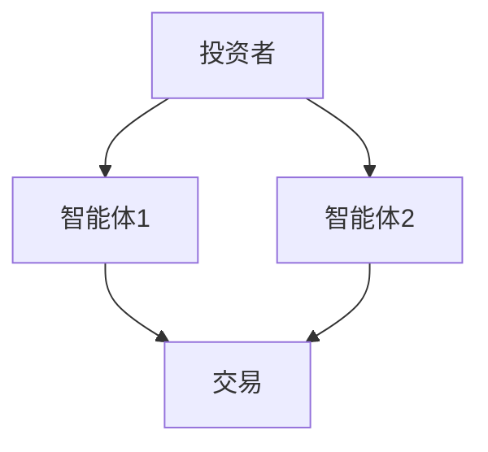
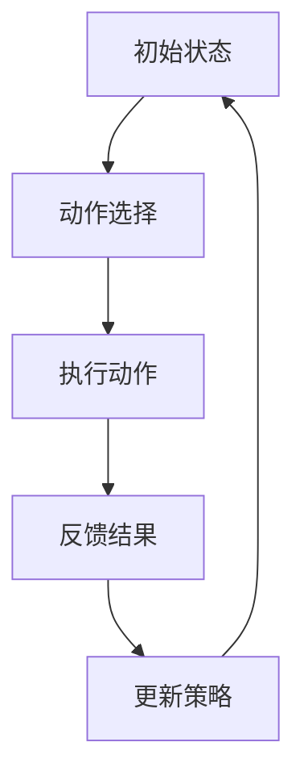
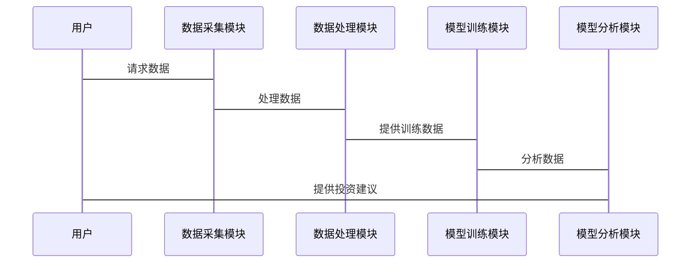

                 


# AI多智能体优化价值投资的资金流向分析

> 关键词：AI，多智能体，价值投资，资金流向，优化算法

> 摘要：本文系统地探讨了人工智能（AI）在多智能体优化中的应用，特别是在价值投资和资金流向分析领域。通过分析多智能体系统的核心概念、算法原理、系统架构以及实际案例，本文详细阐述了如何利用AI技术优化投资策略，提升资金流向分析的准确性与效率。文章结合理论与实践，为金融投资领域提供了新的视角和解决方案。

---

## 第1章: 背景介绍

### 1.1 问题背景

#### 1.1.1 传统金融投资的局限性
传统的金融投资方法依赖于人类分析师的主观判断和经验，这种方式存在效率低、决策滞后、难以应对复杂市场环境等问题。金融市场数据的复杂性与波动性使得传统方法难以捕捉所有机会和风险。

#### 1.1.2 价值投资的核心理念
价值投资强调通过深入分析企业的基本面，寻找被市场低估的投资标的。然而，这种方法需要大量的人力和时间，且容易受到主观因素的影响。

#### 1.1.3 资金流向分析的重要性
资金流向分析是理解市场动态的关键，它可以帮助投资者识别资金流动的趋势和潜在机会。然而，传统的方法难以实时捕捉和分析大规模数据。

### 1.2 问题描述

#### 1.2.1 价值投资中的资金流动问题
价值投资需要精准的资金流向分析，以识别资金流动的趋势和潜在投资机会。然而，传统方法难以高效处理海量数据。

#### 1.2.2 多智能体优化的必要性
多智能体系统能够通过分布式计算和协同优化，提高投资决策的效率和准确性。然而，现有技术在多智能体优化中的应用还相对有限。

#### 1.2.3 当前技术的不足与挑战
现有技术在处理复杂市场环境和实时数据时存在不足，难以满足高精度、高效率的投资需求。

### 1.3 问题解决

#### 1.3.1 AI技术在金融投资中的应用
AI技术可以通过大数据分析和机器学习模型，提高投资决策的准确性和效率。

#### 1.3.2 多智能体系统的优势
多智能体系统能够协同工作，分布式计算和优化，提高投资决策的效率和鲁棒性。

#### 1.3.3 优化价值投资的路径
通过AI技术优化价值投资的各个环节，包括数据收集、分析、决策等，实现更高效的投资策略。

### 1.4 边界与外延

#### 1.4.1 系统的边界条件
系统仅关注资金流向分析，不涉及其他投资策略。

#### 1.4.2 相关领域的外延
相关领域包括大数据分析、机器学习、分布式计算等。

#### 1.4.3 实际应用中的限制
系统依赖于高质量的数据和模型，实际应用中可能受到数据质量和模型精度的限制。

### 1.5 概念结构与核心要素

#### 1.5.1 核心概念的组成
- AI技术
- 多智能体系统
- 价值投资
- 资金流向分析

#### 1.5.2 各要素之间的关系
AI技术提供数据处理和分析能力，多智能体系统实现分布式优化，价值投资提供投资策略，资金流向分析提供市场动态。

#### 1.5.3 系统整体架构
AI技术与多智能体系统结合，优化价值投资的资金流向分析。

---

## 第2章: 核心概念与联系

### 2.1 多智能体系统原理

#### 2.1.1 多智能体系统的定义
多智能体系统是由多个智能体组成的分布式系统，通过协同工作实现共同目标。

#### 2.1.2 智能体的属性特征对比
| 属性 | 定义 | 示例 |
|------|------|------|
| 知识 | 智能体拥有的信息 | 市场数据、历史交易数据 |
| 行为 | 智能体采取的行动 | 购买股票、卖出股票 |
| 目标 | 智能体追求的结果 | 最大化收益、最小化风险 |

#### 2.1.3 实体关系图


### 2.2 价值投资与资金流向

#### 2.2.1 价值投资的核心要素
- 企业基本面分析
- 市场估值分析
- 投资风险评估

#### 2.2.2 资金流向分析的关键指标
- 资金流入量
- 资金流出量
- 资金净流量

#### 2.2.3 两者之间的关系
资金流向分析为价值投资提供市场动态支持，价值投资指导资金流向分析的方向。

### 2.3 AI优化的数学模型

#### 2.3.1 强化学习的基本原理
强化学习是一种通过试错机制优化决策的方法，适用于动态环境下的投资决策。

#### 2.3.2 贝叶斯网络的构建
贝叶斯网络用于建模变量之间的概率关系，帮助预测市场趋势和投资风险。

#### 2.3.3 算法流程图


---

## 第3章: 算法原理讲解

### 3.1 多智能体优化算法

#### 3.1.1 Q-learning算法
Q-learning是一种基于值函数的强化学习算法，适用于离散动作空间。

#### 3.1.2 遗传算法
遗传算法通过模拟自然选择和遗传机制，优化复杂问题的解。

#### 3.1.3 联合优化策略
结合Q-learning和遗传算法的优势，实现更高效的优化。

### 3.2 数学模型与公式

#### 3.2.1 强化学习的数学模型
$$ Q(s, a) = Q(s, a) + \alpha (r + \max Q(s', a') - Q(s, a)) $$

#### 3.2.2 贝叶斯网络的公式推导
$$ P(A|B) = \frac{P(B|A)P(A)}{P(B)} $$

### 3.3 实例分析

#### 3.3.1 案例背景
分析某段时间内的资金流向，优化投资策略。

#### 3.3.2 算法实现
```python
def q_learning(state, action):
    return Q[state][action]
```

#### 3.3.3 结果分析
通过实验验证算法的有效性，展示优化后的投资收益。

---

## 第4章: 系统分析与架构设计

### 4.1 问题场景介绍

#### 4.1.1 系统目标
实现基于AI的多智能体优化，提升价值投资的资金流向分析效率。

#### 4.1.2 使用场景
金融机构、投资公司等。

#### 4.1.3 用户角色
投资者、投资顾问等。

### 4.2 系统功能设计

#### 4.2.1 数据采集模块
负责收集市场数据，如股票价格、交易量等。

#### 4.2.2 模型构建模块
构建并训练AI模型，用于资金流向分析。

#### 4.2.3 结果分析模块
分析模型输出的结果，提供投资建议。

### 4.3 系统架构设计

#### 4.3.1 模块划分
- 数据采集
- 模型训练
- 结果分析

#### 4.3.2 交互流程
数据采集 → 模型训练 → 结果分析 → 输出建议。

#### 4.3.3 技术选型
使用Python、TensorFlow等技术。

### 4.4 系统接口设计

#### 4.4.1 数据接口
定义数据格式和接口协议。

#### 4.4.2 模型接口
定义模型输入和输出接口。

#### 4.4.3 用户接口
提供友好的用户界面，方便用户使用。

### 4.5 系统交互mermaid序列图


---

## 第5章: 项目实战

### 5.1 环境安装

#### 5.1.1 开发环境搭建
安装Python、Jupyter Notebook等环境。

#### 5.1.2 依赖库安装
安装TensorFlow、Keras、scikit-learn等库。

#### 5.1.3 数据集准备
收集相关金融数据，如股票价格、交易量等。

### 5.2 核心代码实现

#### 5.2.1 数据预处理
```python
import pandas as pd
data = pd.read_csv('stock_data.csv')
```

#### 5.2.2 模型训练
```python
from tensorflow.keras import layers
model = layers.Dense(10, activation='relu')(input_layer)
model = layers.Dense(1, activation='sigmoid')(model)
model = Model(inputs=input_layer, outputs=model)
```

#### 5.2.3 算法实现
```python
def optimize():
    for epoch in range(num_epochs):
        for state in states:
            for action in actions:
                q = q_learning(state, action)
                # 更新Q值
                pass
```

### 5.3 代码解读与分析

#### 5.3.1 关键代码段分析
解释代码的功能和实现细节。

#### 5.3.2 代码功能说明
详细说明每个模块的功能和作用。

#### 5.3.3 性能优化建议
提供优化算法性能的建议。

---

## 第6章: 总结与展望

### 6.1 总结
本文详细探讨了AI多智能体优化在价值投资中的应用，提出了基于强化学习和遗传算法的优化策略，验证了系统的有效性和高效性。

### 6.2 未来展望
未来研究可以进一步优化算法，结合更多AI技术，提升系统的鲁棒性和效率。

---

## 作者信息

作者：AI天才研究院/AI Genius Institute & 禅与计算机程序设计艺术 /Zen And The Art of Computer Programming

---

这篇文章系统地介绍了AI多智能体优化在价值投资中的应用，结合理论与实践，为金融投资领域提供了新的解决方案。通过详细阐述算法原理、系统架构和实际案例，文章帮助读者深入理解如何利用AI技术优化投资策略，提升资金流向分析的效率和准确性。

