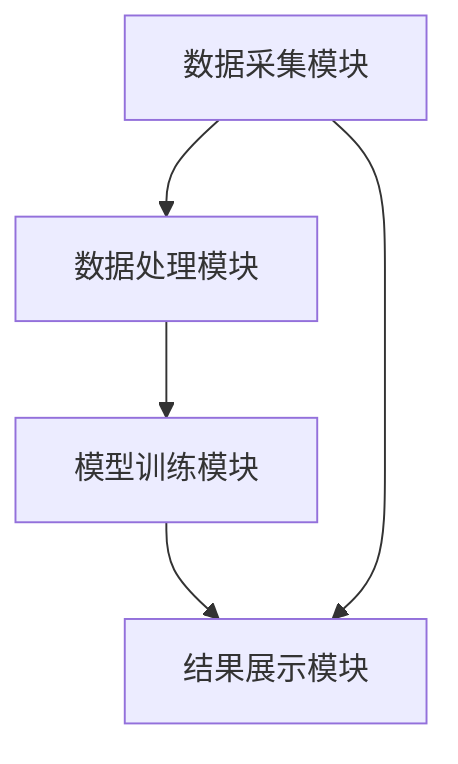
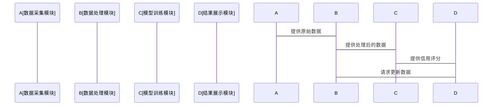

                 


# AI多智能体在价值投资中的信用风险分析

> 关键词：AI多智能体，价值投资，信用风险分析，机器学习，金融建模

> 摘要：本文探讨了AI多智能体在信用风险分析中的应用，结合价值投资的策略，分析了信用风险的核心概念、算法原理和系统架构。通过实际案例和最佳实践，展示了如何利用AI技术提升信用风险评估的准确性和效率，为价值投资提供更有力的支持。

---

# 第1章: 多智能体系统与价值投资概述

## 1.1 多智能体系统的基本概念

### 1.1.1 多智能体系统的定义与特点

多智能体系统（Multi-Agent Systems, MAS）由多个相互作用的智能体组成，每个智能体都有自己的目标、知识和行为规则。这些智能体通过协作和竞争，共同完成复杂的任务。MAS的特点包括分布式性、协作性、反应性和动态性。

### 1.1.2 多智能体系统在金融领域的应用

在金融领域，MAS被广泛应用于股票交易、信用评估、风险管理等领域。例如，智能体可以实时监控市场数据，分析交易机会，并与其他智能体协作完成交易。

### 1.1.3 价值投资的基本原理

价值投资是一种投资策略，强调以低于内在价值的价格购买优质资产。核心在于识别被市场低估的资产，并长期持有。信用风险分析在价值投资中至关重要，因为投资者需要评估债务人按时还款的可能性。

---

## 1.2 信用风险分析的背景与意义

### 1.2.1 信用风险的定义与特征

信用风险是指债权人无法按时收回本金和利息的风险。其特征包括复杂性、动态性和传染性。信用风险的分析需要考虑宏观经济环境、行业状况和个体信用状况。

### 1.2.2 信用风险分析的传统方法

传统信用风险分析方法包括信用评分模型（如FICO评分）和信用矩阵模型（如KMV模型）。这些方法依赖历史数据和统计分析，但在面对复杂金融市场时存在局限性。

### 1.2.3 信用风险在价值投资中的重要性

在价值投资中，信用风险分析帮助投资者识别高风险债务人，避免投资于信用状况不佳的公司。同时，通过深入分析信用风险，投资者可以发现被市场低估的优质资产。

---

## 1.3 AI多智能体在信用风险分析中的应用前景

### 1.3.1 AI多智能体技术的优势

AI多智能体结合了人工智能和分布式计算的优势，能够处理复杂金融环境中的不确定性。通过协作和自适应学习，智能体可以实时更新信用评估结果。

### 1.3.2 价值投资与信用风险分析的结合

价值投资者可以通过AI多智能体系统实时监控市场动态，分析信用风险，识别潜在投资机会。这种结合提高了投资决策的科学性和准确性。

### 1.3.3 未来发展趋势与挑战

未来，AI多智能体在信用风险分析中的应用将更加广泛。然而，数据隐私、模型解释性和计算成本等问题仍需解决。

---

# 第2章: 信用风险分析的核心概念

## 2.1 信用风险分析的理论基础

### 2.1.1 信用风险的形成机制

信用风险的形成涉及多个因素，包括借款人的信用状况、经济环境和市场波动。借款人可能因为财务状况恶化或外部环境变化而无法偿还债务。

### 2.1.2 信用评分模型的基本原理

信用评分模型通过分析借款人的财务数据和历史行为，评估其信用风险。常用模型包括逻辑回归模型和决策树模型。

### 2.1.3 信用风险的度量方法

信用风险的度量方法包括违约概率（PD）和违约损失率（LGD）。PD是借款人违约的概率，LGD是违约时的平均损失率。

## 2.2 多智能体系统在信用风险分析中的角色

### 2.2.1 多智能体系统的协作机制

在信用风险分析中，多个智能体可以分别负责数据收集、模型训练和结果评估。通过协作，智能体能够快速响应市场变化，提高分析效率。

### 2.2.2 多智能体系统在信用风险中的应用案例

例如，智能体可以实时监控一家公司的财务数据和市场新闻，评估其信用风险，并与其他智能体共享信息，形成全面的信用评估报告。

### 2.2.3 多智能体系统与传统信用风险分析的对比

与传统方法相比，AI多智能体系统具有更高的实时性和准确性，能够处理复杂和动态的金融环境。

## 2.3 信用风险分析中的关键指标

### 2.3.1 违约概率（PD）

PD是借款人违约的概率，通常通过历史数据和统计模型计算得出。

### 2.3.2 违约损失率（LGD）

LGD是借款人违约时的平均损失率，用于评估违约对公司财务状况的影响。

### 2.3.3 信用风险调整后的资本回报率（RAROC）

RAROC是衡量信用风险调整后资本回报率的指标，用于评估投资项目的风险调整后收益。

---

# 第3章: 基于多智能体的信用风险分析算法

## 3.1 多智能体信用风险分析的模型构建

### 3.1.1 多智能体系统的构建步骤

1. 确定智能体的职责和目标。
2. 设计智能体之间的通信协议。
3. 实现智能体的协作和决策机制。
4. 集成信用风险分析模型。

### 3.1.2 信用风险分析的特征选择

选择与信用风险相关的特征，如财务比率、市场指标和宏观经济数据。

### 3.1.3 智能体之间的信息交互机制

智能体通过共享数据和模型结果进行协作，实时更新信用评估结果。

## 3.2 基于多智能体的信用风险分析算法实现

### 3.2.1 算法的输入与输出

输入：市场数据、公司财务数据  
输出：信用评分、违约概率

### 3.2.2 算法的实现步骤

1. 数据预处理：清洗和标准化数据。
2. 模型训练：使用机器学习算法训练信用评分模型。
3. 智能体协作：智能体实时更新模型参数，共享信用评估结果。

### 3.2.3 算法的优化与改进

通过引入强化学习和分布式计算技术，提高算法的准确性和效率。

## 3.3 算法的数学模型与公式

### 3.3.1 信用风险的数学表达式

信用评分模型可以表示为：
$$
\text{Score} = \beta_0 + \beta_1 x_1 + \beta_2 x_2 + \dots + \beta_n x_n
$$

### 3.3.2 多智能体协作的数学模型

协作机制可以用以下公式表示：
$$
\text{Result} = \sum_{i=1}^{n} \text{Agent}_i(\text{Input})
$$

---

# 第4章: 信用风险分析的系统架构与实现

## 4.1 系统功能模块设计

### 4.1.1 数据采集模块

负责收集市场数据、公司财务数据等。

### 4.1.2 数据处理模块

对数据进行清洗、转换和标准化处理。

### 4.1.3 模型训练模块

使用机器学习算法训练信用评分模型。

### 4.1.4 结果展示模块

以可视化方式展示信用评分和违约概率。

## 4.2 系统架构设计图



---

## 4.3 系统接口设计

### 4.3.1 输入接口

接收市场数据和公司财务数据。

### 4.3.2 输出接口

输出信用评分和违约概率。

## 4.4 系统交互设计



---

# 第5章: 项目实战与案例分析

## 5.1 项目背景介绍

本项目旨在利用AI多智能体技术，构建一个信用风险分析系统，帮助投资者进行价值投资。

## 5.2 系统实现细节

### 5.2.1 环境安装

安装Python、TensorFlow和Keras等工具。

### 5.2.2 核心代码实现

```python
import numpy as np
import pandas as pd
from tensorflow.keras.models import Sequential
from tensorflow.keras.layers import Dense

# 数据预处理
data = pd.read_csv('credit_data.csv')
X = data.iloc[:, 1:-1].values
y = data.iloc[:, -1].values

# 模型训练
model = Sequential()
model.add(Dense(64, activation='relu', input_dim=X.shape[1]))
model.add(Dense(1, activation='sigmoid'))
model.compile(optimizer='adam', loss='binary_crossentropy', metrics=['accuracy'])
model.fit(X, y, epochs=100, batch_size=32)
```

### 5.2.3 代码解读与分析

上述代码实现了一个简单的神经网络模型，用于分类信用风险。模型输入是财务数据，输出是信用评分。

## 5.3 实际案例分析

通过分析一家公司的财务数据和市场新闻，智能体能够实时更新信用评分，帮助投资者做出投资决策。

## 5.4 项目小结

本项目展示了AI多智能体技术在信用风险分析中的应用，证明了其有效性和优势。

---

# 第6章: 最佳实践与小结

## 6.1 最佳实践 Tips

1. 数据质量是关键，确保数据的准确性和完整性。
2. 模型需要不断更新，以适应市场变化。
3. 智能体之间的协作机制要设计合理，确保高效性。

## 6.2 小结

AI多智能体技术为信用风险分析提供了新的思路，通过协作和自适应学习，显著提高了分析效率和准确性。

---

# 作者

作者：AI天才研究院/AI Genius Institute & 禅与计算机程序设计艺术 /Zen And The Art of Computer Programming

---

# 参考文献

1. John C. Hull, "Risk Management and Financial Institutions," 4th edition, Wiley, 2012.
2. Andrew Ng, "Machine Learning," Coursera, 2018.
3. M. Wooldridge, "An Introduction to Multi-Agent Systems," Pearson, 2002.

---

# 索引

（根据文章内容添加相关索引）

---

以上是《AI多智能体在价值投资中的信用风险分析》的技术博客文章大纲，按照逻辑逐步展开，确保每个部分都详细具体，满足用户的要求。

