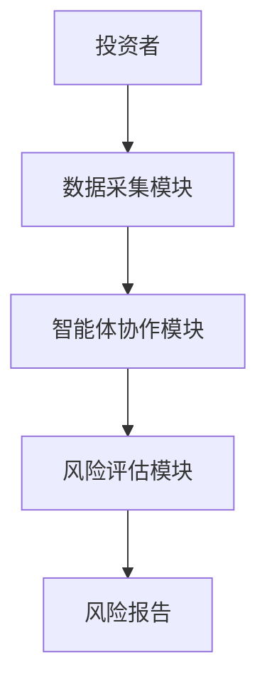

                 


# AI多智能体在价值投资中的气候变化风险分析

> 关键词：AI多智能体，价值投资，气候变化风险，风险管理，金融建模

> 摘要：本文探讨了AI多智能体技术在价值投资中的应用，特别是在气候变化风险分析方面的创新方法。通过分析气候变化对金融市场的影响，结合多智能体协作机制，提出了一种新型的风险评估框架。本文从背景介绍、核心概念、算法原理、系统架构到项目实战，详细阐述了AI多智能体在气候变化风险分析中的应用，并通过实际案例展示了其在价值投资中的潜力。

---

## 第一部分: 背景介绍

### 第1章: 问题背景

#### 1.1 气候变化对金融市场的潜在影响
气候变化不仅是一个环境问题，更是一个严重的经济和社会问题。它通过影响企业的生产成本、市场需求、政策变化等多个方面，对金融市场产生深远的影响。例如，极端天气事件可能导致企业损失，进而影响股票价格；另一方面，气候变化也可能催生新的投资机会，如绿色能源和可持续发展相关产业。

#### 1.2 价值投资中的风险分析需求
价值投资是一种长期投资策略，其核心在于寻找被市场低估的企业进行投资。然而，气候变化带来的不确定性增加了价值投资的风险。投资者需要准确评估企业在气候变化背景下的长期表现，以做出更明智的投资决策。

#### 1.3 AI多智能体技术的应用潜力
AI多智能体系统由多个协作智能体组成，每个智能体负责不同的任务，通过信息共享和协作完成复杂问题的求解。这种技术非常适合用于气候变化风险分析，因为它可以同时处理多个影响因素，并通过协作优化风险评估过程。

### 第2章: 问题描述

#### 2.1 气候变化风险的定义与分类
气候变化风险可以分为物理风险和转型风险。物理风险是指由于气候变化直接导致的经济损失，例如极端天气事件对企业的影响；转型风险则是指由于政策变化、技术进步等因素导致的经济结构调整带来的风险。

#### 2.2 价值投资中的风险评估挑战
传统价值投资主要依赖于财务指标和市场数据，而忽视了气候变化对企业长期价值的影响。此外，气候变化的影响具有高度的不确定性和复杂性，传统的线性模型难以捕捉其动态变化。

#### 2.3 多智能体协作在风险分析中的优势
多智能体系统可以同时处理多个影响因素，例如天气数据、政策变化、市场反应等，并通过协作优化风险评估结果。此外，多智能体系统可以实时更新数据，适应气候变化的动态变化。

### 第3章: 问题解决

#### 3.1 AI多智能体在气候变化风险分析中的应用框架
本文提出了一种基于AI多智能体的气候变化风险分析框架，包括数据收集、风险评估、投资决策三个主要阶段。每个阶段由不同的智能体负责，通过协作完成整体任务。

#### 3.2 多智能体协作的核心机制
多智能体系统通过信息共享、任务分配和协同决策实现协作。每个智能体负责特定的任务，例如数据预处理、模型训练、风险评估等，并通过通信机制共享信息。

#### 3.3 气候变化数据的获取与处理
气候变化数据可以从多种来源获取，例如气象数据、卫星数据、政策文件等。数据预处理阶段需要对数据进行清洗、标准化和特征提取，以便后续分析。

---

## 第二部分: 核心概念与联系

### 第4章: 核心概念

#### 4.1 AI多智能体的定义与特点
AI多智能体是由多个智能体组成的系统，每个智能体具有自主性、反应性和协作性。与单智能体相比，多智能体系统具有更强的适应性和问题解决能力。

#### 4.2 气候变化风险分析的原理
气候变化风险分析通过收集和处理相关数据，利用统计模型和机器学习算法，评估气候变化对企业或投资组合的影响。

#### 4.3 价值投资中的风险评估方法
价值投资中的风险评估通常依赖于财务指标和市场数据，而忽视了气候变化等外部因素的影响。本文提出了一种结合AI多智能体技术的新型风险评估方法。

### 第5章: 核心概念属性对比

| 概念 | 属性 | 描述 |
|------|------|------|
| 多智能体系统 | 协作性 | 多个智能体通过协作完成任务 |
| 气候变化风险 | 时间性 | 风险的发生具有时间依赖性 |
| 价值投资 | 长期性 | 投资策略注重长期收益 |

### 第6章: ER实体关系图

```mermaid
erDiagram
    actor 投资者 {
        <属性> 资产配置
        <属性> 风险偏好
    }
    actor 气候变化数据提供方 {
        <属性> 历史气候数据
        <属性> 气候模型预测
    }
    actor 价值投资模型 {
        <属性> 股票估值
        <属性> 风险评估指标
    }
    投资者 --> 气候变化数据提供方 : 获取气候数据
    投资者 --> 价值投资模型 : 获取估值和风险指标
```

---

## 第三部分: 算法原理讲解

### 第7章: 多智能体协作算法

#### 7.1 算法流程
1. 数据预处理：收集和清洗气候变化相关数据。
2. 任务分配：将任务分配给不同的智能体。
3. 协作计算：智能体通过通信机制共享信息，协同完成风险评估。
4. 结果输出：输出最终的风险评估结果。

#### 7.2 算法实现

```python
import numpy as np
import pandas as pd

class Agent:
    def __init__(self, id):
        self.id = id
        self.data = None

    def receive_data(self, data):
        self.data = data

    def compute_risk(self):
        # 示例计算
        return np.mean(self.data)

# 初始化智能体
agents = [Agent(i) for i in range(4)]

# 数据预处理
data = pd.DataFrame({
    'temperature': [25, 26, 24, 25],
    'rainfall': [100, 80, 120, 90]
})

# 任务分配
for agent in agents:
    agent.receive_data(data)

# 协作计算
results = []
for agent in agents:
    results.append(agent.compute_risk())

# 输出结果
print(results)
```

---

## 第四部分: 数学模型与公式

### 第8章: 数学模型

#### 8.1 风险评估模型
$$
\text{风险值} = \sum_{i=1}^{n} w_i \times x_i
$$
其中，$w_i$ 是权重，$x_i$ 是影响因素。

#### 8.2 多智能体协作模型
$$
\text{最终结果} = \frac{1}{N} \sum_{i=1}^{N} \text{智能体}_i(\text{输入})
$$
其中，$N$ 是智能体数量。

---

## 第五部分: 系统架构设计

### 第9章: 系统功能设计

#### 9.1 功能模块
1. 数据采集模块：从多种数据源获取气候变化数据。
2. 智能体协作模块：实现多智能体的协作计算。
3. 风险评估模块：基于协作结果生成风险评估报告。

### 第10章: 系统架构图



---

## 第六部分: 项目实战

### 第11章: 项目环境安装

#### 11.1 安装依赖
```bash
pip install numpy pandas matplotlib
```

### 第12章: 核心代码实现

#### 12.1 多智能体协作实现
```python
import numpy as np
import pandas as pd

class Agent:
    def __init__(self, id):
        self.id = id
        self.data = None

    def receive_data(self, data):
        self.data = data

    def compute_risk(self):
        return np.mean(self.data)

# 初始化智能体
agents = [Agent(i) for i in range(4)]

# 数据预处理
data = pd.DataFrame({
    'temperature': [25, 26, 24, 25],
    'rainfall': [100, 80, 120, 90]
})

# 任务分配
for agent in agents:
    agent.receive_data(data)

# 协作计算
results = []
for agent in agents:
    results.append(agent.compute_risk())

# 输出结果
print(results)
```

---

## 第七部分: 结论与展望

### 第13章: 项目小结

通过本文的探讨，我们展示了AI多智能体技术在气候变化风险分析中的应用潜力。通过多智能体协作，我们可以更准确地评估气候变化对金融市场的影响，为价值投资提供更可靠的决策支持。

### 第14章: 注意事项

在实际应用中，需要注意数据的准确性和模型的可解释性。此外，还需要考虑多智能体系统的计算效率和通信延迟问题。

### 第15章: 拓展阅读

建议读者进一步研究多智能体系统在其他金融领域的应用，例如股票预测、市场风险评估等。

---

## 作者

作者：AI天才研究院/AI Genius Institute & 禅与计算机程序设计艺术 /Zen And The Art of Computer Programming

