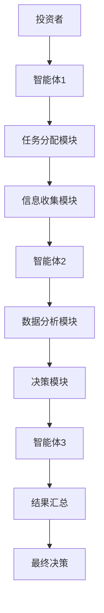
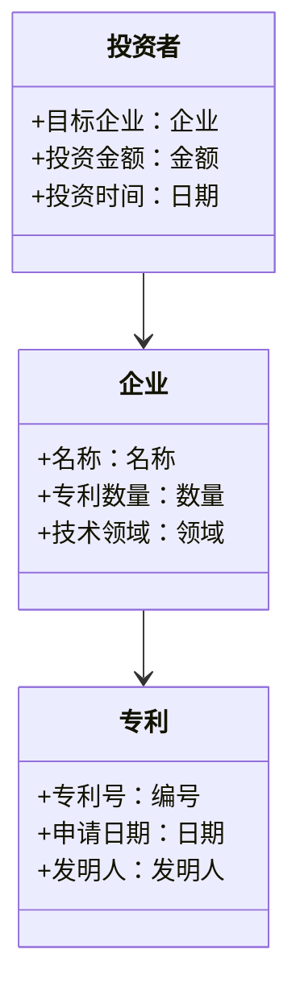

                 


# AI多智能体在价值投资中的知识产权分析

> 关键词：AI多智能体，价值投资，知识产权分析，多智能体系统，投资决策，知识产权数据

> 摘要：本文探讨了AI多智能体在价值投资中的应用，特别是知识产权分析的创新方法。通过分析知识产权数据，AI多智能体帮助投资者评估企业的技术优势和市场竞争力。文章详细介绍了多智能体系统的背景、核心概念、算法原理、系统架构、项目实战和总结展望，提供了从理论到实践的全面指导。

---

## 第一章：背景介绍

### 1.1 问题背景

传统价值投资依赖于分析师的主观判断，存在信息不对称和数据复杂性问题。AI多智能体通过协作分析知识产权数据，提供客观的投资决策支持。

### 1.2 问题描述

价值投资中的信息不对称和数据复杂性使得传统方法难以准确评估企业价值。知识产权分析涉及大量数据，传统方法效率低下。

### 1.3 问题解决

AI多智能体通过协作分析知识产权数据，优化投资决策过程，提高分析效率和准确性。

### 1.4 边界与外延

多智能体系统应用于特定场景，如专利分析，边界为系统设计、数据来源和目标企业。外延包括其他投资策略和市场分析工具。

### 1.5 概念结构与核心要素

多智能体系统由智能体、通信机制和任务分配模块组成，知识产权分析涉及专利、引用数据和技术领域。

---

## 第二章：核心概念与联系

### 2.1 多智能体系统的基本原理

多智能体系统由多个智能体组成，通过通信协作完成任务，应用于复杂决策问题。

### 2.2 知识产权分析的核心要素

包括专利数量、技术领域、引用次数和专利权人信息，影响企业市场竞争力。

### 2.3 多智能体与知识产权分析的联系

多智能体系统利用协作机制优化分析过程，提升效率和准确性，降低人工分析成本。

### 2.4 ER图：知识产权分析的实体关系

```mermaid
er
  actor 投资者
  actor 分析师
  entity 专利
  entity 技术领域
  entity 企业
  entity 专利权人
  entity 引用关系
  entity 专利申请日期
  relationship {投资者} --> {专利}
  relationship {投资者} --> {企业}
  relationship {专利} --> {技术领域}
  relationship {引用关系} --> {专利}
  relationship {专利权人} --> {专利}
  relationship {分析师} --> {专利}
```

---

## 第三章：算法原理

### 3.1 多智能体系统的协作机制

通过任务分配、信息共享和决策协商完成知识产权分析。

### 3.2 算法流程图



### 3.3 Python代码实现

```python
import requests
from bs4 import BeautifulSoup
import json

def fetch_patent_data(search_term):
    # 示例代码，用于从专利数据库获取数据
    url = f'https://api.patents.com/search?q={search_term}'
    response = requests.get(url)
    data = json.loads(response.text)
    return data

def analyze_patents(patents):
    # 示例代码，分析专利数据并生成报告
    report = {}
    for patent in patents:
        if 'assignee' in patent:
            assignee = patent['assignee']
            if assignee in report:
                report[assignee]['count'] += 1
            else:
                report[assignee] = {'count': 1, 'tech_area': patent['tech_area']}
    return report

# 示例使用
search_term = 'AI多智能体'
patents = fetch_patent_data(search_term)
analysis = analyze_patents(patents)
print(analysis)
```

### 3.4 数学模型与公式

- **概率分布模型**：计算某技术领域专利分布的概率。
  $$ P(T) = \frac{\text{技术领域T的专利数}}{\text{总专利数}} $$
  
- **协同过滤模型**：识别相关技术领域。
  $$ \text{相似度}(A, B) = \frac{\sum_{i} A[i] \cdot B[i]}{\sqrt{\sum A[i]^2} \cdot \sqrt{\sum B[i]^2}} $$

---

## 第四章：系统分析与架构设计

### 4.1 系统架构设计


### 4.2 领域模型



---

## 第五章：项目实战

### 5.1 环境安装

- Python 3.8+
- requests库
- BeautifulSoup库
- Mermaid工具

### 5.2 核心代码实现

```python
import requests
from bs4 import BeautifulSoup

def fetch_patents(term):
    url = f'https://patents.google.com/search?q={term}'
    response = requests.get(url)
    soup = BeautifulSoup(response.text, 'html.parser')
    patents = []
    for result in soup.find_all('div', class_='patent-result'):
        title = result.find('h3').get_text()
        number = result.find('span', class_='patent-number').get_text()
        patents.append({'title': title, 'number': number})
    return patents

def analyze_investment(patents, company):
    # 示例代码，分析某公司在特定领域的专利情况
    count = 0
    for p in patents:
        if p['title'].lower().startswith(company.lower()):
            count += 1
    return count

# 示例使用
term = 'AI多智能体'
company = '谷歌'
patents = fetch_patents(term)
investment_analysis = analyze_investment(patents, company)
print(f'{company} 在 {term} 方面有 {investment_analysis} 项专利。')
```

---

## 第六章：总结与展望

### 6.1 总结

AI多智能体在知识产权分析中的应用提高了投资决策的准确性和效率，为企业评估提供有力支持。

### 6.2 展望

未来，AI多智能体将更广泛地应用于复杂决策问题，推动价值投资的智能化发展。

---

## 作者信息

作者：AI天才研究院（AI Genius Institute） & 禅与计算机程序设计艺术（Zen And The Art of Computer Programming）

---

通过以上结构，文章详细探讨了AI多智能体在价值投资中的知识产权分析，从背景到系统架构，再到实战案例，为读者提供了全面的指导和深入的分析。

