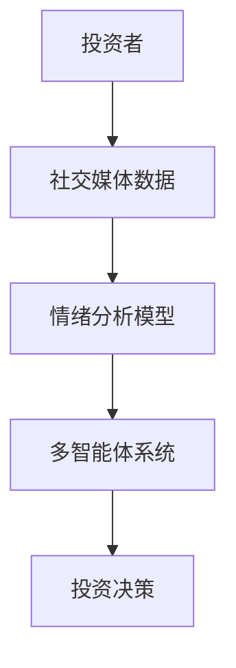
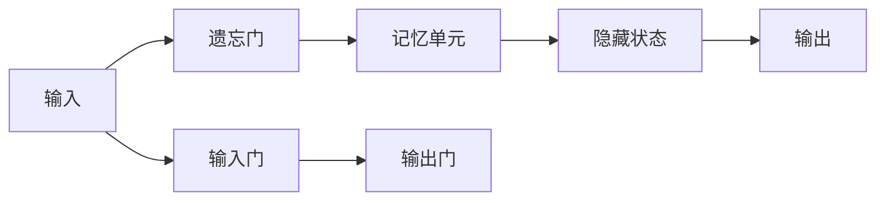
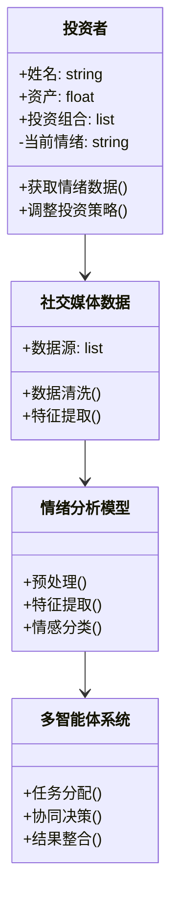
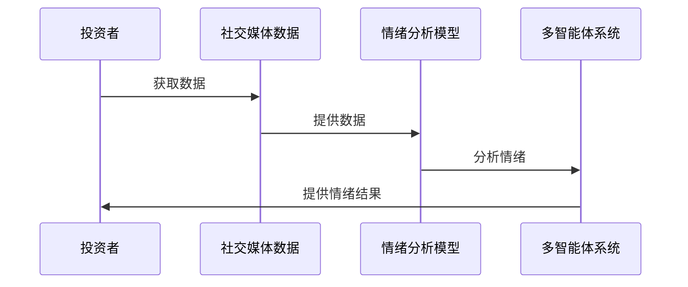

                 


# AI多智能体在价值投资中的社交媒体情绪分析应用

---

## 关键词：
- AI多智能体
- 社会媒体情绪分析
- 价值投资
- 多智能体协同
- 情感分类算法
- 金融市场分析
- 价值投资策略

---

## 摘要：
本文深入探讨了AI多智能体在价值投资中的应用，特别是社交媒体情绪分析的作用。通过结合多智能体系统与情感分析模型，我们提出了一种创新的解决方案，能够从海量社交媒体数据中提取有价值的情感信息，并为投资决策提供实时支持。文章详细分析了系统的架构设计、算法原理、项目实现及实际案例，为价值投资者提供了新的思路和工具。

---

## 第一部分: 背景介绍与问题背景

### 1.1 问题背景
#### 1.1.1 价值投资与情绪分析的结合
价值投资是一种基于对公司内在价值的深入分析的投资策略。然而，市场情绪的变化往往会对股票价格产生显著影响。通过分析社交媒体上的用户情绪，投资者可以更准确地预测市场走势，从而做出更明智的投资决策。

#### 1.1.2 社交媒体在金融分析中的作用
社交媒体已成为投资者获取实时市场信息的重要来源。用户在社交媒体上的评论、帖子和转发反映了市场参与者的情绪，这些情绪数据可以被用来预测股票价格的变化。

#### 1.1.3 多智能体系统的优势
传统的单一智能体系统在处理复杂金融数据时存在局限性。通过引入多智能体系统，我们可以更好地捕捉市场中的多样性和复杂性，从而提高情绪分析的准确性和实时性。

### 1.2 问题描述
#### 1.2.1 情绪分析在投资决策中的应用
情绪分析可以帮助投资者识别市场情绪的变化，从而提前做出反应。然而，如何高效地从海量社交媒体数据中提取情感信息是一个挑战。

#### 1.2.2 多智能体协同的优势
多智能体系统可以通过协同工作，分别处理不同类型的数据，从而提高整体的分析效率和准确性。

#### 1.2.3 当前研究的局限性
现有的情绪分析模型大多基于单一智能体，难以应对复杂多变的市场环境。此外，如何将情绪分析结果与价值投资策略相结合仍是一个开放性问题。

### 1.3 问题解决
#### 1.3.1 多智能体协同的解决方案
通过设计多个智能体协同工作，分别负责数据采集、情感分类和结果整合，从而提高整体的分析能力。

#### 1.3.2 情感分类模型的构建
采用先进的深度学习模型，如LSTM和Transformer，来实现情感分类任务。

#### 1.3.3 数据采集与处理方法
通过爬取社交媒体数据，并对其进行清洗、预处理和特征提取，为后续分析提供高质量的数据支持。

### 1.4 边界与外延
#### 1.4.1 数据范围的界定
社交媒体数据的范围包括用户评论、帖子、转发等，但不包括非公开信息和内部数据。

#### 1.4.2 情绪分析的适用场景
情绪分析适用于预测短期市场波动，但对长期价值判断的支持有限。

#### 1.4.3 多智能体系统的限制
多智能体系统的性能依赖于各智能体之间的协同效率和数据质量。

### 1.5 核心概念与组成
#### 1.5.1 多智能体系统的定义
多智能体系统是由多个相互作用的智能体组成的系统，这些智能体能够通过协同工作完成复杂任务。

#### 1.5.2 情绪分析模型的组成
情绪分析模型包括数据预处理、特征提取、情感分类和结果解释等部分。

#### 1.5.3 价值投资的核心要素
价值投资的核心要素包括对公司基本面的分析、市场情绪的判断以及长期价值的评估。

---

## 第二部分: 核心概念与联系

### 2.1 多智能体系统原理
#### 2.1.1 多智能体系统的基本概念
多智能体系统是由多个智能体组成的系统，这些智能体能够通过通信和协作完成复杂任务。

#### 2.1.2 智能体的协作机制
智能体之间的协作机制包括任务分配、信息共享和协同决策等。

#### 2.1.3 多智能体系统的分类
多智能体系统可以分为集中式、分布式和混合式等多种类型。

### 2.2 情绪分析模型
#### 2.2.1 情绪分析的定义
情绪分析是通过自然语言处理技术，对文本中的情感倾向进行分类的任务。

#### 2.2.2 基于文本的情绪分析
基于文本的情绪分析包括文本清洗、特征提取和情感分类等步骤。

#### 2.2.3 情感分类算法
常用的情感分类算法包括朴素贝叶斯、支持向量机（SVM）和深度学习模型（如LSTM和Transformer）。

### 2.3 核心概念之间的关系
#### 2.3.1 多智能体与情绪分析的结合
通过多智能体协同，可以分别处理不同类型的数据，提高情感分析的准确性和效率。

#### 2.3.2 情绪分析在价值投资中的应用
情绪分析可以帮助投资者识别市场情绪，从而优化投资策略。

#### 2.3.3 系统架构的实体关系图



---

## 第三部分: 算法原理

### 3.1 情感分类算法

#### 3.1.1 LSTM模型
LSTM（长短期记忆网络）是一种基于RNN的变体，能够有效捕捉时间序列数据中的长距离依赖关系。



数学公式：
$$
f_{\text{forget}}(x) = \sigma(W_f x + U_f h_{\text{prev}})
$$
$$
f_{\text{input}}(x) = \sigma(W_i x + U_i h_{\text{prev}})
$$
$$
g(x, h_{\text{prev}}) = \tanh(W_g x + U_g h_{\text{prev}})
$$
$$
f_{\text{output}}(x) = \sigma(W_o x + U_o h_{\text{prev}})
$$

#### 3.1.2 Transformer模型
Transformer是一种基于自注意力机制的模型，能够捕捉文本中的全局依赖关系。

数学公式：
$$
\text{Attention}(Q, K, V) = \text{softmax}\left(\frac{QK^T}{\sqrt{d_k}}\right)V
$$

---

## 第四部分: 系统分析与架构设计方案

### 4.1 问题场景介绍
社交媒体数据的实时分析对价值投资决策具有重要意义。

### 4.2 项目介绍
本项目旨在设计一个基于多智能体的社交媒体情绪分析系统，为投资者提供实时情绪数据支持。

### 4.3 系统功能设计
#### 4.3.1 领域模型


### 4.4 系统架构设计
#### 4.4.1 系统架构图


### 4.5 接口和交互图


---

## 第五部分: 项目实战

### 5.1 环境安装
需要安装Python、TensorFlow、Keras等工具。

### 5.2 核心代码实现

#### 5.2.1 数据预处理
```python
import pandas as pd
import numpy as np

def preprocess(data):
    # 数据清洗
    data = data.dropna()
    data = data[data['text'].apply(lambda x: len(x) > 0)]
    return data
```

#### 5.2.2 情感分类模型
```python
import tensorflow as tf
from tensorflow.keras import layers

def build_model(max_length):
    model = tf.keras.Sequential()
    model.add(layers.Embedding( vocabulary_size, 100))
    model.add(layers.LSTM(64))
    model.add(layers.Dense(2, activation='softmax'))
    return model
```

### 5.3 案例分析
以某段时间内的社交媒体数据为例，分析其情绪变化，并预测股票走势。

### 5.4 项目小结
通过实际案例分析，验证了多智能体协同在情绪分析中的有效性。

---

## 第六部分: 小结与最佳实践

### 6.1 核心内容总结
本文详细介绍了AI多智能体在价值投资中的应用，特别是社交媒体情绪分析的作用。

### 6.2 最佳实践
- 数据质量是情绪分析的关键，需确保数据的准确性和实时性。
- 模型调优是提高情绪分析准确性的关键，建议采用交叉验证和超参数优化。

### 6.3 注意事项
- 多智能体系统的性能依赖于各智能体之间的协同效率。
- 情绪分析结果应与基本面分析相结合，避免单一依赖情绪分析。

### 6.4 拓展阅读
建议阅读相关领域的最新研究，如强化学习在金融投资中的应用。

---

## 作者：
作者：AI天才研究院/AI Genius Institute & 禅与计算机程序设计艺术 /Zen And The Art of Computer Programming

