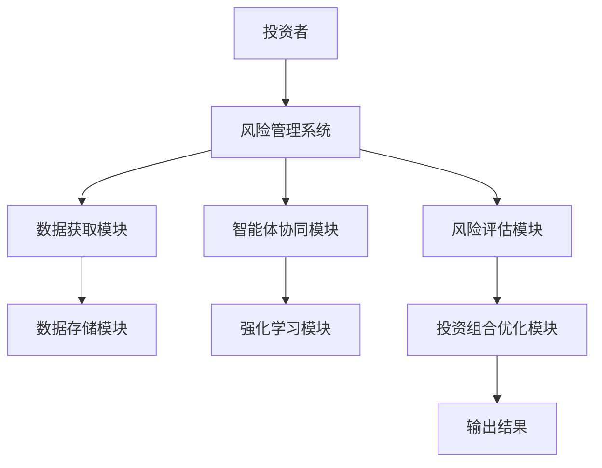

                 


# AI多智能体在价值投资中的风险管理和控制

> 关键词：AI多智能体，价值投资，风险管理，投资组合优化，金融数据分析，强化学习

> 摘要：本文探讨AI多智能体在价值投资中的应用，重点分析如何通过多智能体协同机制和强化学习算法进行风险管理，优化投资组合，并通过实际案例展示其在金融市场的优势和挑战。本文还提供了系统架构设计和代码实现，帮助读者理解如何在实际投资中应用AI多智能体进行风险控制。

---

# 第一部分: 背景介绍

## 第1章: AI多智能体与价值投资概述

### 1.1 AI多智能体的基本概念

AI多智能体系统是由多个具有自主决策能力的智能体组成的分布式系统，这些智能体能够通过协同工作完成复杂任务。与传统AI系统相比，多智能体系统具有以下特点：

- **分布式性**：多个智能体协同工作，而非单一中心化决策。
- **自主性**：每个智能体都能独立感知环境并做出决策。
- **协作性**：智能体之间通过通信和协作完成共同目标。
- **动态性**：系统能够适应动态变化的环境。

### 1.2 价值投资的核心原则

价值投资是一种投资策略，强调以低于内在价值的价格买入优质资产。其核心原则包括：

- **基本面分析**：通过分析公司的财务状况、行业地位和竞争优势来评估其内在价值。
- **长期视角**：关注长期收益而非短期波动。
- **安全边际**：买入价格应显著低于内在价值，以降低风险。

### 1.3 风险管理在价值投资中的重要性

在价值投资中，风险管理是确保投资组合稳定增长的关键。有效的风险管理可以帮助投资者：

- **降低损失**：避免因市场波动或公司基本面变化导致的重大损失。
- **优化收益**：通过合理配置资产，在控制风险的前提下实现最大收益。
- **应对不确定性**：金融市场充满不确定性，良好的风险管理能够帮助投资者在复杂环境中做出更明智的决策。

---

## 第2章: 风险管理的理论基础

### 2.1 风险管理的核心概念

- **风险**：指在投资活动中，由于不确定性因素导致的收益偏离预期的可能性。
- **风险评估**：通过分析和量化各种风险因素，确定其对投资组合的影响程度。
- **风险控制**：采取措施降低风险发生的概率或减少风险发生后的损失。

### 2.2 现代投资组合理论

现代投资组合理论（MPT）由Harry Markowitz提出，认为通过合理配置资产可以实现收益与风险的最佳平衡。以下是MPT的核心内容：

- **有效前沿**：在给定风险水平下，能够提供最高预期收益的资产组合构成的曲线。
- **风险与收益的权衡**：高收益通常伴随着高风险，投资组合的设计需要在两者之间找到最佳平衡点。

### 2.3 风险价值（VaR）与条件风险价值（CVaR）

- **VaR**：在一定置信水平下，投资组合可能遭受的最大损失。例如，95%置信水平下，VaR表示在95%的概率下，投资组合的最大损失。
- **CVaR**：在VaR的基础上，考虑超过VaR部分的平均损失，能够更全面地衡量尾部风险。

---

## 第3章: AI多智能体的风险管理算法

### 3.1 多智能体协同机制

多智能体系统通过以下机制实现协同：

1. **通信与协调**：智能体之间通过共享信息和协调行动来完成共同目标。
2. **任务分配**：根据环境变化和任务需求，动态分配智能体的角色和任务。
3. **协作决策**：多个智能体共同参与决策过程，通过投票或协商形成最终决策。

### 3.2 强化学习在风险管理中的应用

强化学习是一种通过试错过程优化决策策略的机器学习方法。在风险管理中，强化学习可以用于：

- **市场预测**：通过历史数据训练智能体预测未来市场走势。
- **投资组合优化**：智能体通过不断调整资产配置，找到风险与收益的最佳平衡点。

---

## 第4章: 系统架构与实现

### 4.1 系统架构设计

以下是AI多智能体风险管理系统的架构设计：



### 4.2 系统功能设计

- **数据获取模块**：从金融市场获取实时数据，包括股票价格、成交量等。
- **强化学习模块**：通过强化学习算法训练智能体，实现市场预测和投资决策。
- **风险评估模块**：基于VaR和CVaR模型，评估投资组合的风险。
- **投资组合优化模块**：根据风险评估结果，优化资产配置。

---

## 第5章: 项目实战

### 5.1 环境安装

- **Python 3.8以上版本**
- **TensorFlow或Keras**
- **NumPy和Pandas**
- **Matplotlib或Seaborn**

### 5.2 核心代码实现

以下是基于强化学习的多智能体风险管理系统的代码示例：

```python
import numpy as np
import tensorflow as tf
from tensorflow.keras import layers

# 定义智能体类
class Agent:
    def __init__(self, state_dim, action_dim):
        self.state_dim = state_dim
        self.action_dim = action_dim
        self.model = self.build_model()
    
    def build_model(self):
        model = tf.keras.Sequential()
        model.add(layers.Dense(64, activation='relu', input_dim=self.state_dim))
        model.add(layers.Dense(self.action_dim, activation='softmax'))
        model.compile(optimizer='adam', loss='sparse_categorical_crossentropy')
        return model
    
    def act(self, state):
        state = np.array([state])
        prediction = self.model.predict(state)
        return np.argmax(prediction[0])

# 定义环境类
class Environment:
    def __init__(self, data):
        self.data = data
        self.current_step = 0
    
    def get_state(self):
        # 返回当前状态，例如最近N天的股票价格
        return self.data[self.current_step: self.current_step + N]
    
    def step(self, action):
        # 执行动作，更新状态和奖励
        self.current_step += 1
        return self.get_state(), reward, done

# 训练过程
def train():
    env = Environment(data)
    agent = Agent(state_dim, action_dim)
    for episode in range(num_episodes):
        state = env.get_state()
        while not done:
            action = agent.act(state)
            next_state, reward, done = env.step(action)
            agent.model.fit(np.array([state]), np.array([action]), epochs=1, verbose=0)
            state = next_state

if __name__ == "__main__":
    train()
```

### 5.3 实际案例分析

以股票投资组合优化为例，假设我们有三只股票，分别训练三个智能体，每个智能体负责一只股票的风险评估和投资决策。通过协同工作，智能体能够综合考虑市场整体风险和个股风险，优化投资组合。

---

## 第6章: 总结与展望

### 6.1 总结

本文详细介绍了AI多智能体在价值投资中的应用，重点分析了风险管理的理论基础、算法实现和系统架构设计。通过实际案例展示了AI多智能体在金融市场的优势，帮助投资者在复杂环境中做出更明智的决策。

### 6.2 展望

未来，随着AI技术的不断发展，AI多智能体在价值投资中的应用将更加广泛。以下是一些可能的发展方向：

- **更复杂的协同机制**：通过改进多智能体协同算法，进一步提高风险管理的精度。
- **深度学习与强化学习的结合**：利用深度学习的强大特征提取能力，增强强化学习的效果。
- **实时风险管理**：开发更高效的算法，实现对金融市场实时风险的监控和应对。

---

## 作者：AI天才研究院 & 禅与计算机程序设计艺术

---

**感谢您的阅读！** 如果您对AI多智能体在价值投资中的应用感兴趣，或者有任何问题和建议，欢迎留言讨论！

