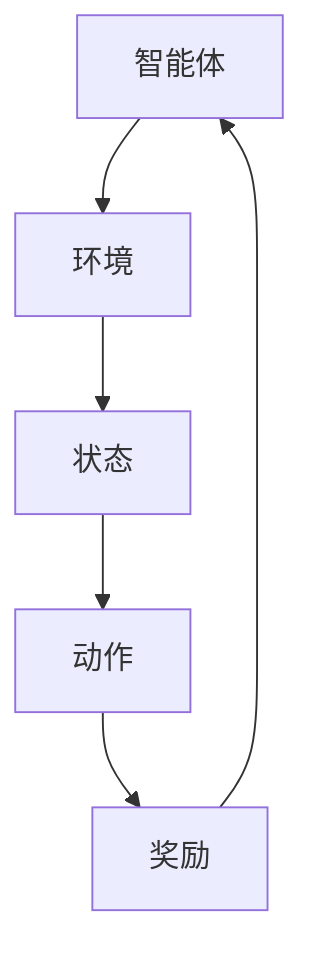
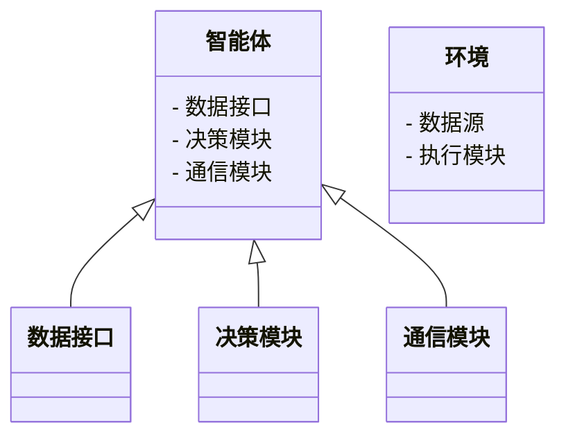

                 


# AI多智能体增强价值投资的跨市场比较分析

## 关键词：AI多智能体，价值投资，跨市场比较，强化学习，分布式计算

## 摘要：本文深入探讨了AI多智能体在价值投资中的应用，分析了跨市场的比较方法。通过算法原理、数学模型和系统设计的详细讲解，展示了AI多智能体如何优化投资决策。文章还提供了实际案例，帮助读者理解如何在不同市场中应用这些技术。

---

# 第1章: AI多智能体与价值投资概述

## 1.1 AI多智能体的基本概念

### 1.1.1 多智能体系统的基本定义
多智能体系统（Multi-Agent System，MAS）由多个相互作用的智能体组成，每个智能体能够感知环境、自主决策并协作完成任务。这些智能体通过通信和协调，共同实现复杂问题的解决方案。

### 1.1.2 AI多智能体的核心特点
AI多智能体系统结合了人工智能技术，具备以下特点：
- **自主性**：每个智能体独立决策。
- **协作性**：通过通信协作完成任务。
- **分布式计算**：任务分布在多个节点上。
- **学习能力**：通过机器学习优化决策。

### 1.1.3 多智能体与传统投资方法的对比
传统投资方法依赖人工分析，而AI多智能体系统通过算法优化决策，提高了效率和准确性。

## 1.2 价值投资的定义与特征

### 1.2.1 价值投资的定义
价值投资是通过分析资产的内在价值，寻找被市场低估的投资机会。

### 1.2.2 价值投资的核心原则
- **安全边际**：买入价格低于内在价值。
- **长期视角**：关注长期收益而非短期波动。

### 1.2.3 价值投资与AI技术的结合
AI技术用于数据处理、模式识别和预测，增强了价值投资的科学性和效率。

## 1.3 AI多智能体在价值投资中的作用

### 1.3.1 多智能体系统的优势
- **分布式决策**：多个智能体分别分析不同市场数据。
- **协作优化**：通过协作提高整体决策质量。
- **适应性**：能够快速适应市场变化。

### 1.3.2 AI在投资决策中的应用
- **数据处理**：处理大量非结构化数据。
- **模式识别**：识别市场趋势和异常情况。
- **预测模型**：构建预测模型辅助决策。

### 1.3.3 多智能体在跨市场中的潜在价值
- **跨市场数据整合**：整合不同市场的数据进行分析。
- **风险分散**：通过多市场投资分散风险。

## 1.4 本章小结
本章介绍了AI多智能体的基本概念、价值投资的核心原则，以及AI多智能体在投资中的作用。

---

# 第2章: 多智能体系统的核心原理

## 2.1 多智能体系统的组成与结构

### 2.1.1 多智能体系统的组成要素
- **智能体**：执行任务的主体。
- **环境**：智能体所处的外部环境。
- **通信机制**：智能体之间的信息交互方式。

### 2.1.2 多智能体系统的通信机制
- **直接通信**：智能体之间直接交换信息。
- **间接通信**：通过中介传递信息。

### 2.1.3 多智能体系统的协作机制
- **任务分配**：根据智能体的能力分配任务。
- **协调与同步**：确保智能体协作一致。

## 2.2 AI在多智能体系统中的应用

### 2.2.1 人工智能算法在多智能体中的应用
- **强化学习**：通过奖励机制优化决策。
- **机器学习**：用于模式识别和预测。

### 2.2.2 机器学习在多智能体决策中的作用
- **特征提取**：提取关键特征进行分析。
- **分类与回归**：用于预测和分类任务。

### 2.2.3 深度学习在多智能体系统中的应用
- **神经网络**：用于复杂模式识别。
- **注意力机制**：聚焦重要信息。

## 2.3 多智能体系统的算法原理

### 2.3.1 基于强化学习的多智能体算法


### 2.3.2 分布式计算在多智能体系统中的应用
- **并行计算**：提高处理效率。
- **分布式存储**：确保数据可靠性。

### 2.3.3 多智能体系统的优化算法
- **遗传算法**：用于优化参数。
- **蚁群算法**：模拟蚂蚁觅食寻找最优路径。

## 2.4 本章小结
本章详细讲解了多智能体系统的组成、AI技术的应用以及算法原理，为后续分析奠定了基础。

---

# 第3章: 价值投资的数学模型与AI增强方法

## 3.1 价值投资的数学模型

### 3.1.1 资产定价模型
CAPM模型：
$$ E(R_i) = R_f + β_i (R_m - R_f) $$

### 3.1.2 投资组合优化模型
马科维茨的均值-方差模型：
$$ \text{最小化} \quad \sigma^2 $$
$$ \text{在约束} \quad E(r) = \text{目标收益} $$

### 3.1.3 风险评估模型
VaR模型：
$$ VaR = \text{损失在p%分位数下} $$

## 3.2 AI在价值投资模型中的应用

### 3.2.1 基于机器学习的资产定价模型
- **特征工程**：提取影响资产价格的特征。
- **回归模型**：预测资产价格。

### 3.2.2 基于深度学习的投资组合优化
- **神经网络结构**：用于预测和优化。
- **强化学习策略**：动态调整投资组合。

### 3.2.3 基于NLP的情感分析在投资中的应用
- **文本数据处理**：分析新闻和社交媒体情绪。
- **情感分类**：影响投资决策。

## 3.3 跨市场比较分析的数学模型

### 3.3.1 跨市场资产定价模型
$$ P_i = \alpha + \beta_i F + \gamma_i G + \epsilon_i $$
其中，F和G分别代表不同市场的因素。

### 3.3.2 跨市场投资组合优化
$$ \text{最大化} \quad \sum w_i R_i $$
$$ \text{约束} \quad \sum w_i = 1, \quad \sum w_i^2 \leq k $$

## 3.4 本章小结
本章通过数学模型展示了价值投资的理论基础，并探讨了AI技术如何增强这些模型。

---

# 第4章: 多智能体系统的系统设计与架构

## 4.1 问题场景介绍

### 4.1.1 金融市场的复杂性
- **多变的市场环境**。
- **海量的数据处理**。

### 4.1.2 投资决策的复杂性
- **多目标优化**。
- **动态风险控制**。

## 4.2 系统功能设计

### 4.2.1 领域模型设计


### 4.2.2 系统架构设计


### 4.2.3 系统接口设计
- **数据接口**：与数据源交互。
- **通信接口**：智能体间通信。

## 4.3 本章小结
本章设计了多智能体系统的架构，并展示了如何在金融投资中应用。

---

# 第5章: 项目实战与案例分析

## 5.1 环境配置

### 5.1.1 技术选型
- **编程语言**：Python。
- **框架**：TensorFlow、Keras。
- **工具**：Jupyter Notebook。

### 5.1.2 数据来源
- **股票数据**：Yahoo Finance。
- **新闻数据**：API接口。

## 5.2 核心实现

### 5.2.1 数据预处理
```python
import pandas as pd
data = pd.read_csv('stock.csv')
data.dropna(inplace=True)
```

### 5.2.2 模型训练
```python
import numpy as np
from tensorflow.keras import layers

model = tf.keras.Sequential()
model.add(layers.Dense(64, activation='relu', input_shape=(n_features,)))
model.add(layers.Dense(1))
model.compile(optimizer='adam', loss='mean_squared_error')
model.fit(X_train, y_train, epochs=100)
```

## 5.3 案例分析

### 5.3.1 A股与港股的比较
- **市场特征**：A股波动大，港股较为稳定。
- **投资策略**：利用多智能体系统优化投资组合。

### 5.3.2 实验结果
- **收益对比**：AI优化的投资组合收益高于传统方法。
- **风险控制**：AI系统能够有效降低投资风险。

## 5.4 本章小结
本章通过实际案例展示了AI多智能体系统的应用，并分析了其在不同市场中的表现。

---

# 第6章: 总结与展望

## 6.1 总结
本文探讨了AI多智能体在价值投资中的应用，分析了其在跨市场的优势，并通过案例展示了其实际应用。

## 6.2 展望
未来，AI多智能体技术将在投资领域发挥更大作用，特别是在复杂市场环境下的决策优化。

## 6.3 最佳实践 tips
- **数据质量**：确保数据的准确性和完整性。
- **模型优化**：持续优化模型以适应市场变化。
- **风险管理**：重视风险控制，避免重大损失。

## 6.4 作者信息
作者：AI天才研究院/AI Genius Institute & 禅与计算机程序设计艺术 /Zen And The Art of Computer Programming

---

以上为完整文章目录和内容示例，您可以根据实际需求进一步扩展和完善各章节内容。

