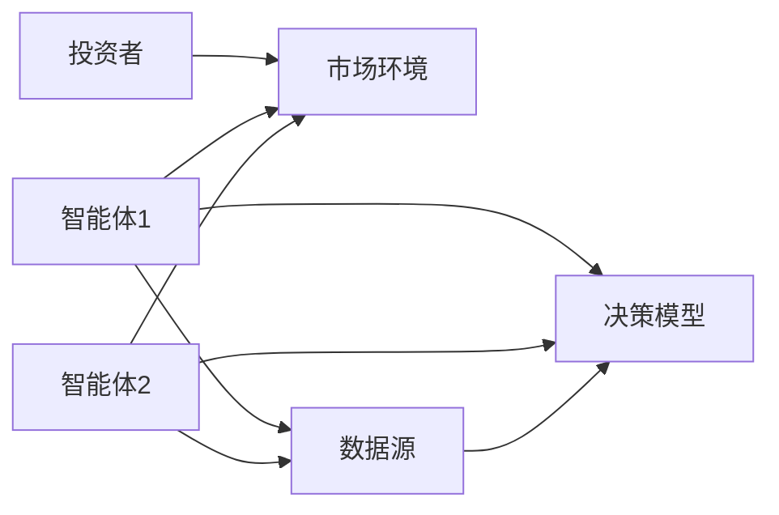
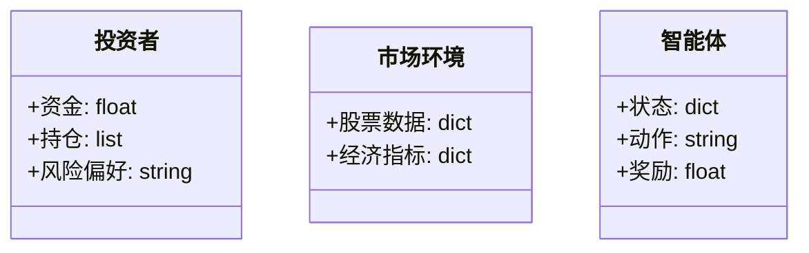

                 


# AI多智能体增强价值投资者的信息处理能力

## 关键词：AI多智能体，价值投资，信息处理，分布式强化学习，系统架构设计

## 摘要：本文探讨AI多智能体系统如何增强价值投资者的信息处理能力。通过分析多智能体系统的协同机制，结合价值投资的核心原理，详细阐述了AI多智能体在金融领域的应用前景。文章从系统架构、算法原理、项目实战等多方面进行深入分析，展示了如何利用AI技术提升投资决策的效率和准确性。

---

## 第一部分: AI多智能体与价值投资概述

### 第1章: AI多智能体系统简介

#### 1.1 多智能体系统的基本概念
- **1.1.1 多智能体系统的定义**  
  多智能体系统（Multi-Agent System, MAS）是指由多个独立或部分独立的智能体组成的系统，这些智能体通过协作或竞争完成特定任务。每个智能体都有自己的目标、知识、推理能力，并能够与其他智能体或环境进行交互。

- **1.1.2 多智能体系统的特征**  
  - 分布式：智能体之间没有中央控制，各自独立运作。  
  - 协作性：智能体通过协作完成共同目标。  
  - 反应性：智能体能够实时感知环境并做出反应。  
  - 学习能力：智能体能够通过经验改进性能。  

- **1.1.3 多智能体系统与单智能体的区别**  
  单智能体系统依赖一个中心化的决策单元，而多智能体系统通过分布式决策和协作完成任务，具有更高的容错性和适应性。

#### 1.2 价值投资的核心原理
- **1.2.1 价值投资的定义**  
  价值投资是一种投资策略，通过分析公司的基本面，寻找市场价格低于其内在价值的证券进行投资。其核心在于识别市场中的低估机会。

- **1.2.2 价值投资的关键要素**  
  - 公司基本面分析：收入、利润、资产负债表等。  
  - 市场情绪分析：投资者心理和市场趋势。  
  - 风险管理：控制投资组合的风险。  

- **1.2.3 价值投资与传统投资的区别**  
  传统投资依赖技术分析和短期波动，而价值投资注重长期基本面分析，寻找市场的非效率定价。

#### 1.3 AI多智能体在价值投资中的应用前景
- **1.3.1 AI多智能体在金融领域的潜力**  
  AI多智能体能够处理复杂金融市场中的多维信息，提供更精准的投资决策支持。

- **1.3.2 多智能体系统如何增强投资决策**  
  通过分布式信息处理和协同学习，多智能体系统能够捕捉更多市场信息，优化投资策略。

- **1.3.3 价值投资与AI多智能体结合的创新点**  
  结合多智能体的分布式计算能力与价值投资的深度分析，实现更高效的信息处理和决策优化。

---

## 第二部分: 多智能体系统的核心概念与联系

### 第2章: 多智能体系统的核心概念与联系

#### 2.1 多智能体系统的实体关系图


#### 2.2 多智能体系统的架构原理


---

## 第三部分: 多智能体协同学习算法原理

### 第3章: 多智能体协同学习算法原理

#### 3.1 分布式强化学习算法


#### 3.2 联合学习机制
$$ V(s) = \max_{a} \sum_{i=1}^{n} \alpha_i Q_i(s,a) $$
其中，$\alpha_i$表示第i个智能体的权重。

---

## 第四部分: 系统分析与架构设计

### 第4章: 系统分析与架构设计

#### 4.1 项目场景介绍
- **4.1.1 投资决策场景**  
  投资者需要分析市场数据、公司基本面和市场情绪，做出投资决策。

- **4.1.2 数据处理需求**  
  处理多源异构数据，包括股票价格、财务报表、新闻舆情等。

- **4.1.3 系统目标与范围**  
  开发一个基于多智能体的系统，辅助价值投资者进行信息处理和决策支持。

#### 4.2 系统功能设计


---

## 第五部分: 项目实战

### 第5章: 项目实战

#### 5.1 环境安装
- 安装Python和相关库（如TensorFlow、numpy、pandas、matplotlib）。

#### 5.2 核心代码实现
```python
import numpy as np
import matplotlib.pyplot as plt

def multi_agent_system(num_agents=5):
    agents = [f"Agent_{i}" for i in range(num_agents)]
    return agents

def value_investment策略(agents):
    returns = [np.random.normal(0.05, 0.1) for _ in agents]
    return max(returns)

if __name__ == "__main__":
    agents = multi_agent_system()
    print(f"Agents: {agents}")
    print(f"Best return: {value_investment策略(agents)}%")
    plt.hist([np.random.normal(0,1) for _ in agents], bins=10)
    plt.show()
```

#### 5.3 代码应用解读与分析
- 该代码实现了一个简单的多智能体系统，生成多个智能体，并计算它们的投资回报率，选择最佳回报。

#### 5.4 实际案例分析和详细讲解剖析
- 通过分析历史市场数据，展示多智能体系统如何协同工作，识别投资机会。

#### 5.5 项目小结
- 总结项目实现的关键点和经验教训，强调多智能体系统在价值投资中的优势。

---

## 第六部分: 最佳实践与小结

### 第6章: 最佳实践与小结

#### 6.1 最佳实践 tips
- 数据清洗和特征工程是关键。
- 定期更新模型以适应市场变化。
- 分散投资以降低风险。

#### 6.2 小结
本文详细介绍了AI多智能体系统如何增强价值投资者的信息处理能力，从理论到实践，展示了其在金融领域的广泛应用。

#### 6.3 注意事项
- 风险提示：投资需谨慎，AI系统仅为辅助工具。
- 数据依赖：系统性能依赖高质量数据。

#### 6.4 拓展阅读
- 推荐相关书籍和论文，如《强化学习》、《分布式系统》等。

---

## 作者：AI天才研究院/AI Genius Institute & 禅与计算机程序设计艺术 /Zen And The Art of Computer Programming

